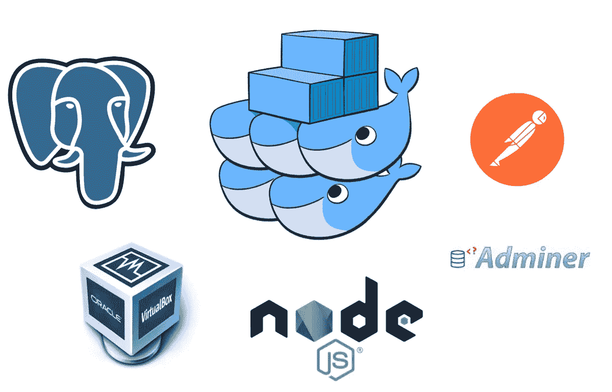
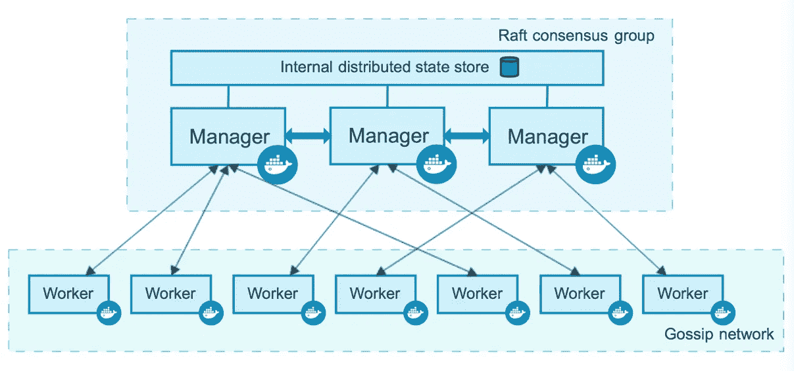
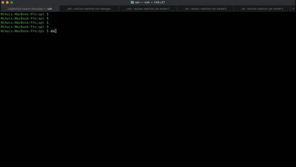
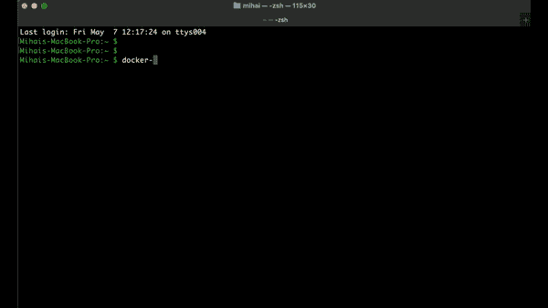
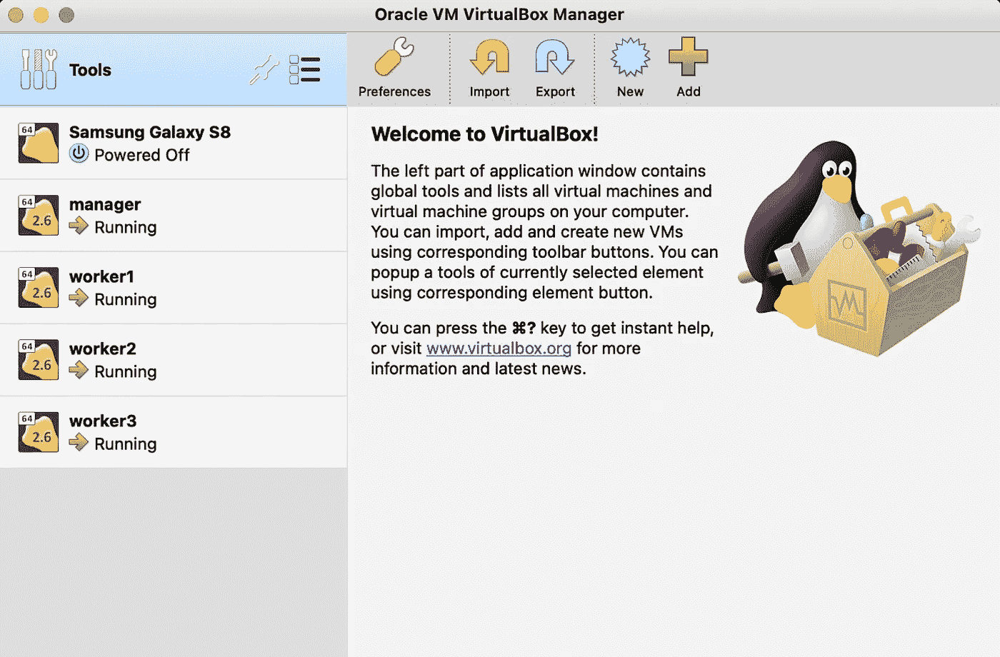
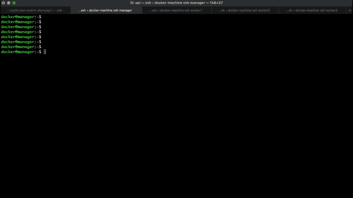
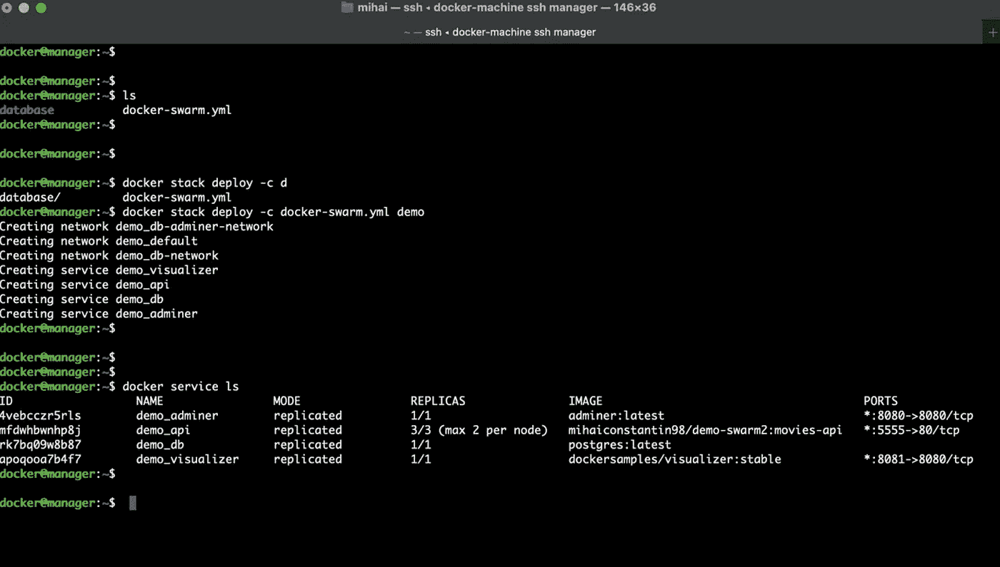
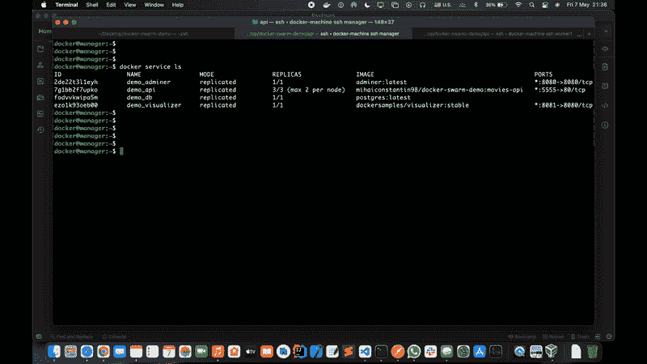
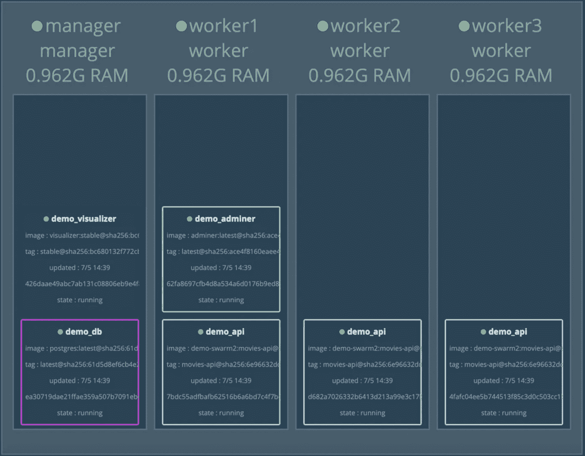

# 如何使用 Docker Swarm 部署应用程序

> 原文：<https://levelup.gitconnected.com/how-to-deploy-your-application-using-docker-swarm-598478446c03>

## 了解如何使用 Docker Swarm 将您的应用程序部署到集群中。

在这个分步教程中，我将向您展示如何在集群中部署一个简单的应用程序。



作者拍摄的照片:本教程中使用的所有工具

∘ [简介](#92d6)∘[先决条件](#d274)t5】∘[构建映像并将其推送到 Docker Hub](#e23a)
∘ [创建虚拟主机](#5613)
∘ [配置 Docker Swarm 集群](#c406)
∘ [Docker Swarm YAML 文件](#ba25)
∘ [在集群内部署应用](#64f3)
∘ [测试应用](#bccd)
∑

## 介绍

Docker Swarm 是基于 [Raft](https://raft.github.io/) 算法的领导-工人模型。集群中的节点可以具有管理者或工作者角色。经理有管理和职能责任。他们负责启动服务，而工人必须执行这些服务。我们必须在集群中始终有一个领导节点。由于一致性问题，建议经理和工人人数为奇数。



Docker Swarm 架构。来源: [Docker Docs](https://docs.docker.com/engine/swarm/how-swarm-mode-works/nodes/)

在本教程中，我将使用 [docker-machine](https://docs.docker.com/machine/) 创建一个经理和三个工人。这是一个用于创建安装了 Docker 引擎的本地虚拟主机的工具。

## **先决条件**

为了能够完成本教程，您需要以下先决条件:

*   [码头工人](https://docs.docker.com/get-docker/)
*   [对接机](https://docs.docker.com/machine/install-machine/)
*   [VirtualBox](https://www.virtualbox.org)
*   一个[码头中心](https://hub.docker.com)账户

我们的目标是开发一个应用程序来管理图书馆中的电影。一部电影的特征在于以下属性:id(主键)、标题、流派、预算、上映日期和 imdb 评分。

我们将使用 [postgres](https://hub.docker.com/_/postgres) 作为数据库，因此我们需要一个 init 配置文件用于我们的 movies 表。

我们将有两条路线，一条用于从数据库中获取所有电影，另一条用于添加新电影。

对于我们的服务器，我们将使用众所周知的[快递包](https://www.npmjs.com/package/express)。

为了使我们的工作更容易，我们将使用 [pg 包](https://www.npmjs.com/package/pg)来解析我们的 SQL 查询。

## 构建映像并将其推送到 Docker Hub

Docker Swarm 使用服务，因此我们需要首先构建我们的 API 映像并将其推送到 [Docker Hub](https://docs.docker.com/docker-hub/) 。

为了能够做到这一点，我们需要一个 order 文件来构建图像。

从存储 Dockerfile 的文件夹中，我们必须运行以下命令:

```
$ /api: docker build -t movies-api .
$ /api: docker tag movies-api <docker-hub-id>/docker-swarm-demo:movies-api
$ /api: docker push <docker-hub-id>/docker-swarm-demo:movies-api
```



作者拍摄的截屏。我被迫将视频转换成 GIF 格式以便播放，所以请忍受这种怪异的质量。

现在，图像被推送到您的 Docker Hub 存储库！

## 创建虚拟主机

现在，我们需要创建我们的经理节点和我们的工人。为此，我们将使用 VirtualBox。从本地配置中，运行以下命令:

```
$ docker-machine create --driver virtualbox <machine-name>
```



作者拍摄的截屏。我被迫将视频转换成 GIF 格式以便播放，所以请忍受这种怪异的质量。

现在，您可以看到在 VirtualBox Manager 中创建了四个虚拟主机实例:一个管理器和三个工作器。



作者拍摄的照片:VirtualBox Manager

## 配置 Docker 群集群

为了将我们的虚拟机设置为集群，我们需要从 manager 节点运行以下命令:

```
docker@manager:~$ docker swarm init --advertise-addr <eth1-interface-addr>
```

执行该命令后，manager 节点被设置为 leader。要向集群添加一个工作者，我们必须从每个工作者运行以下命令:

```
docker@worker: docker swarm join --token <token> <eth1-interface-addr>:<port>
```



作者拍摄的截屏。我被迫将视频转换成 GIF 格式以便播放，所以请忍受这种怪异的质量。

## 码头工人群集 YAML 文件

在我们的 docker swarm YAML 文件中，我们有四个服务:

*   **api** (图像从 [Docker Hub](https://hub.docker.com/) 存储库中提取)
*   **db** ，基于官方 [postgres](https://hub.docker.com/_/postgres) :最新图片
*   **管理员**，基于官方[管理员](https://hub.docker.com/_/adminer)图片
*   **visualizer** ，基于官方 [dockersamples/visualizer](https://hub.docker.com/r/dockersamples/visualizer) :稳定图像

## 在集群中部署应用程序

首先，我们需要将 *docker-swarm.yml* 文件和数据库初始化配置文件发送到我们的管理器机器。从本地环境中，执行以下命令:

```
$ docker-machine scp -r database manager:.
$ docker-machine scp docker-swarm.yml manager:.
```

现在，我们已经准备好部署应用程序了。从管理器节点，执行下一个命令:

```
docker@manager:~$ docker stack deploy -c docker-swarm.yml demo
```

要检查所有服务是否都已启动并运行，我们可以运行:

```
docker@manager:~$ docker service ls
```

如您所见，在“副本”列中，所有服务都已启动并运行。



作者拍摄的照片:我们应用程序的所有服务都已启动并运行

## 测试应用程序

为了测试我们的应用程序，我们可以使用 [Postman](https://www.postman.com) 。

要从数据库中获取所有电影，我们需要向*docker-machine-IP:5555/API/movies 发送一个 get 请求。为了在数据库中添加电影，我们向同一个端点发送一个 POST 请求。*

我们可以在浏览器中检查数据库是否包含我们期望的所有数据。



作者拍摄的截屏。我被迫将视频转换成 GIF 格式以便播放，所以请忍受这种怪异的质量。

## 可视化集群中的服务

如果我们在浏览器中转到 *docker-machine-ip:8081* ，我们可以检查服务在集群中是如何分布的。



作者拍摄的照片:集群内的服务分布

## 结论

教程到此结束。如您所见，在集群中部署应用程序不需要很多资源。例如，这可以在本地使用 [docker-machine](https://docs.docker.com/machine/) 来完成，也可以在云中使用 [Play with Docker](https://labs.play-with-docker.com/) 来完成。下面，如果你想了解更多关于 Docker Swarm 的知识以及如何在其他环境中使用它，你可以查看其他资源。

## 资源

如果你有兴趣了解更多关于 Docker Swarm 的信息，你可以查看以下资源。

*   [关于 Raft 算法的更多信息](https://raft.github.io/)
*   [码头工人群概述](https://docs.docker.com/engine/swarm/)
*   [撰写文档的最佳实践](https://docs.docker.com/develop/develop-images/dockerfile_best-practices/)
*   如果您的本地环境没有很多资源，您可以使用这个工具来创建您的虚拟主机:[与 Docker 一起玩](https://labs.play-with-docker.com/)
*   另一个可视化集群工具是 [Portainer](https://www.portainer.io/) 。它有很多管理容器化应用程序的特性。请随意查看！

在 [GitHub](https://github.com/mihai-constantin/docker-swarm-demo) 上查看项目。