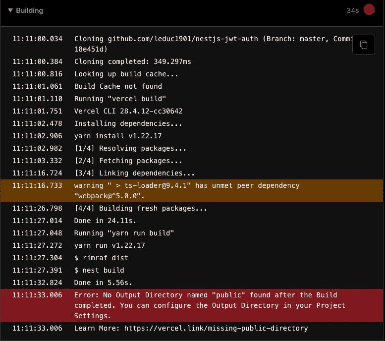
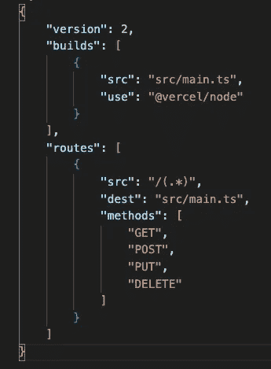
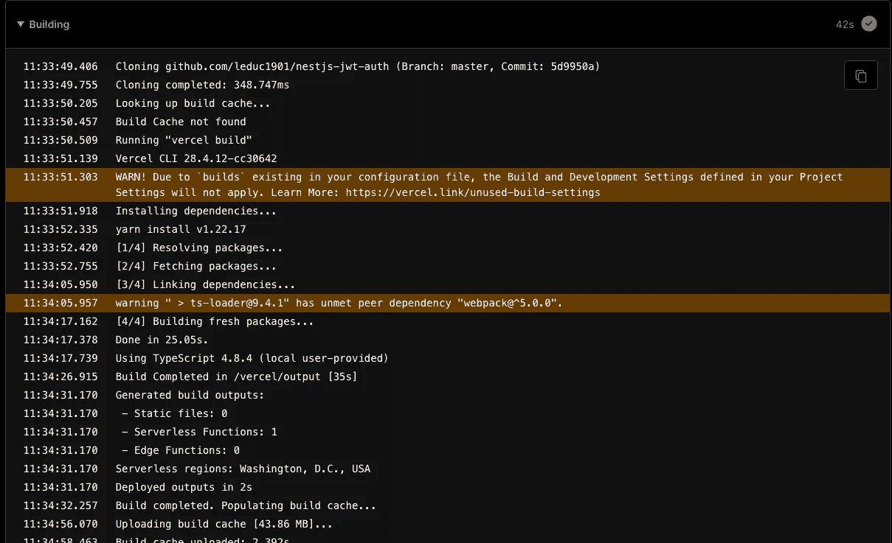
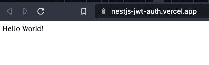

# 如何在 Vercel 上部署 NestJS 应用程序

> 原文：<https://levelup.gitconnected.com/how-to-deploy-your-nestjs-apps-on-vercel-3431b9f2b4c6>

据我所知，Vercel 不是一个后端服务平台，公司通常不会选择 Vercel 进行部署。根据 Vercel 的说法，他们声称 **Vercel** 是前端开发者的平台。

但是，即使是前端开发人员也有自己的愿望，创建自己的 API 来服务于他们的实验(像我一样)。我经常选择 NestJS 来编写 API，因为它开发和构建速度快，容易学习(但是很难掌握)

如果您之前在 Vercel 上部署了 React for NextJS 应用程序，您会发现部署起来非常方便，因为 Vercel 为库和框架提供了预置。但是对于 NestJS 应用程序，Vercel 会识别带有 **Others** 预设的存储库，当你试图用默认设置部署它时，就会发生这种情况:

要解决这个问题相当简单，你要做的就是在根文件夹中创建`vercel.json`文件，并编写如下内容

`vercel.json`配置文件允许您在项目中配置和覆盖 Vercel 的默认行为，更多细节请点击

构建对象定义:

*   `src` ( `String`):一个全局表达式或路径名。如果解析了多个文件，将为每个匹配的文件创建一个版本。可以包括`*`和`**`。
*   `use` ( `String`):构建过程要安装的 npm 模块。

路由对象定义:

*   `src`:一个 [PCRE 兼容的正则表达式](https://www.pcre.org/original/doc/html/pcrepattern.html)，匹配每个传入的路径名(不包括查询字符串)。
*   `methods`:一组 HTTP 方法类型。如果没有提供方法，使用任何 HTTP 方法的请求都将是路由的候选。
*   `dest`:目标路径名或完整 URL，包括查询字符串，能够嵌入捕获组，如$1、$2…

再次运行 Vercel deploy，您可以看到 Vercel 成功部署了我们的应用程序，构建输出如下:

## ***注意:我的** `**vercel.json**` **只是一个关于它如何工作的基本例子，你应该找到最适合你和你的应用的配置**

你可以在这里查看我的源代码

# 遗言

虽然我的内容对每个人都是免费的，但是如果你觉得这篇文章有帮助，[你可以在这里给我买一杯咖啡](https://www.buymeacoffee.com/kylele19)