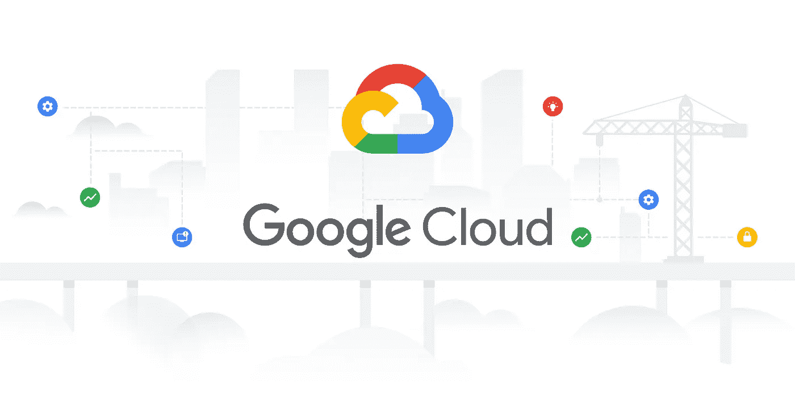
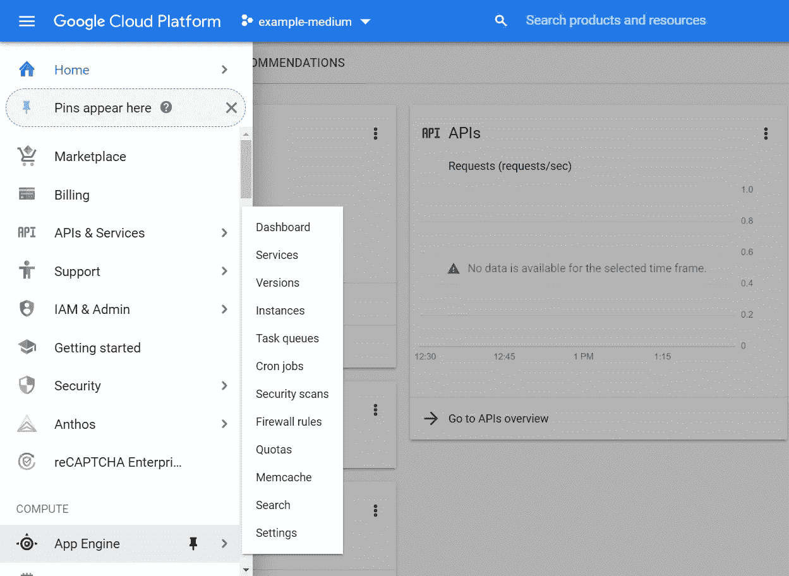
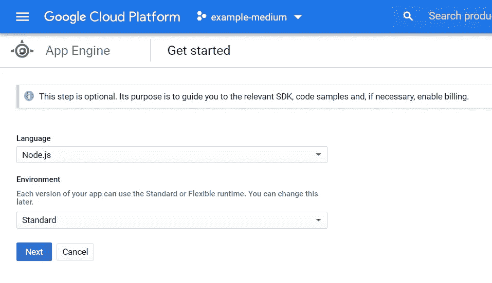

# 如何使用 Google 部署 Node.js 应用程序

> 原文：<https://levelup.gitconnected.com/how-to-deploy-your-node-js-app-with-google-2cd3771d5b21>

## 谷歌云平台和应用引擎入门

Google Cloud 作为开发人员的部署平台越来越受欢迎，然而，他们的文档晦涩难懂，选项丰富，这使得这个过程非常具有挑战性。在这篇文章中，我将向您介绍在 Google Cloud 上建立项目并通过 App Engine 部署 Node.js 应用程序的步骤。这些说明是为在前端和任何 Node.js 服务器框架上使用 React 或 Vue 的全栈应用程序量身定制的，但许多原则将适用于各种语言和框架。

如果你是谷歌云平台(GCP)的新手，你可以免费开始，从 2020 年 7 月起，在 12 个月内享受 300 美元的免费积分。注册您的 Gmail 帐户。你将需要使用信用卡或借记卡来注册，但谷歌不会在 12 个月后自动收费。

## 创建项目

一旦你登录到谷歌云，前往“控制台”这是 GCP 提供的所有服务的主仪表板。在导航条的左侧，会有一个选项来开始一个新的项目(或者选择一个项目，如果你已经有任何与 GCP 现有的项目)。如果你使用过 Google APIs，比如 YouTube API，你可能已经有了 GCP 的项目而没有意识到。在“选择一个项目”视图中，单击右上角的“新建项目”。在这里，您可以命名您的项目并单击“创建”当您返回到 GCP 仪表板时，请确保您的新项目是从导航栏的下拉列表中选择的，然后再继续。

## 在应用程序引擎中创建应用程序

接下来，通过左侧栏导航至 App Engine:

从这里，点击“应用引擎”，进入本部分的主页。这里，将提示您创建一个应用程序。点按此按钮，选取离您或您的用户最近的地区，然后选择“创建应用程序”在这里您可以选择您的语言和环境类型。对于这个例子，我将在 Node.js 中部署一个应用程序。

您是选择标准环境还是灵活环境将取决于您的应用程序的需求。一般来说，如果您只是通过 App Engine 进行部署，而不使用计算引擎(虚拟机)或 Docker 容器，那么您可以使用标准环境。好消息是，如果您遇到问题或应用程序发生变化，您可以在以后进行更改。[阅读更多关于 App Engine 环境的信息](https://cloud.google.com/appengine/docs/the-appengine-environments)。点击“下一步”创建您的 App Engine 应用程序。

## 使用云外壳或云 SDK

创建您的应用程序后，您将收到下载 Cloud SDK 的说明。这将设置您通过计算机上的终端访问您的 GCP 项目和应用程序。或者，您可以使用浏览器中提供的云外壳。两者都使用相同的命令来部署应用程序。我不会深入讨论安装 Cloud SDK 的说明，但是[你可以在这里找到它的快速入门文档](https://cloud.google.com/sdk/docs/quickstarts)。

点击导航栏右侧的终端图标`>_`打开云壳。这是您访问 GCP 帐户的终端。确保您的当前项目设置为您想要部署的项目——在终端中，您的 GCP 名称`userxyz@cloudshell`后面应该有一个带有您的项目名称的黄色粗体文本。如果这不是正确的项目或者您在这里没有看到项目名称，使用下面的命令来更改它(用您的项目名称替换`example-medium`):

`gcloud config set project example-medium`

除了一些特定于 GCP 的命令，您还可以在云 Shell 中使用常见的 bash 命令。你在这里的主目录就像你在 Ubuntu 或者任何你通过终端访问的机器上的主目录一样。

## 部署您的应用

现在，您已经成功设置了您的 GCP 帐户并创建了您的 App Engine 应用程序，您可以开始部署流程了。对于这些说明，您需要一个在 GitHub 上存储了资源库的应用程序。

1.  将你的库克隆到你的主目录:
    `git clone [https://github.com/username/reponame.git](https://github.com/HearTogether/upclose.git)`
2.  进入你的回购目录:`cd reponame`
3.  安装依赖项:`npm install`
4.  用 app.yaml 文件设置环境变量:`touch app.yaml`
5.  运行构建(如果需要):`npm run <build script name>`
6.  确保您的 package.json 有一个有效的启动脚本
7.  预览您的应用
8.  部署:`gcloud app deploy`

## 设置环境变量

当您在 Google 上部署时，应用程序引擎将通过 app.yaml 文件而不是标准文件来设置您的环境变量。环境文件。该文件还将告诉 App Engine 有关您的应用环境的其他信息。该文件的语法与. env 稍有不同:

要在 App Engine 上部署 app.yaml，最起码需要将运行时设置为环境语言的任何版本。在这里，我将其设置为 Node.js 版本 10。如果你的应用程序中没有任何其他环境变量，你就可以运行了。

如果您正在使用 Cloud Shell，您实际上可以打开云编辑器来编辑这个文件。在 shell 窗口的右上角区域单击“打开编辑器”。确保您在正确的目录中。您可以使用`touch`命令在您的终端中创建 app.yaml，也可以通过这个 GUI 创建它。

[点击此处了解更多关于 app.yaml 和 GCP 的信息。](https://cloud.google.com/appengine/docs/standard/nodejs/config/appref)

## 运行构建

对于 React、Vue、TypeScript 和其他需要编译和精简部分或全部代码的应用程序，您需要在部署之前在 shell 中手动运行构建。通常这是一个类似于`npm run build:client`的脚本。如果您不确定，请检查您的 package.json。

注意:如果您的环境变量未定义，一些构建可能会失败。这可能是因为 App Engine 在您部署之前不会开始查找您的 app.yaml。如果您的构建失败并且您的任何环境变量受到牵连，您可能需要复制您的。env 文件，然后重新运行构建。

## 设置启动脚本

当您在 package.json 中时，请确保您有一个工作启动脚本来启动服务器。App Engine 在部署时会默认使用`npm run start`来启动你的应用服务器，所以如果你已经用另一种方式定制了你的环境，你只需要确保这个脚本会启动你的服务器。

## 预览您的应用

您可以在 shell 中手动运行您的启动脚本，并通过 shell 窗口右上角的“Web 预览”图标预览您的应用程序。请注意，如果您的应用程序使用 Google 的云 SQL 作为远程数据库，它可能无法在预览中工作，除非您通过代理连接到数据库。我发现只需部署应用程序来查看它是否通过日志成功连接到云 SQL 实例，或者作为我的应用程序按照我的意图工作的结果，会更容易。

## 部署您的应用

一旦您安装了依赖项，设置您的 app.yaml 和启动脚本，运行您的构建，您就可以部署了！在 shell 中选择`gcloud app deploy`并选择`y`继续。部署可能需要几分钟时间。

## 检查日志

如果您需要调试或查看您部署的服务器控制台中发生了什么，您可以检查日志。部署后，您会看到一个命令来检查 shell 中的日志:`gcloud app logs tail`。你也可以通过 GCP 控制台的应用引擎>版本部分找到它们。

## 结论

使用谷歌云平台有一点学习曲线和文档超载。在本文中，我希望揭开通过 App Engine 部署 Node.js 应用程序的神秘面纱。一旦你设置好了，就像从你的应用程序的原始主程序中提取一样简单，检查任何新的依赖项，重新运行你的构建，然后你可以在整个开发过程中根据需要一次又一次地轻松重新部署。