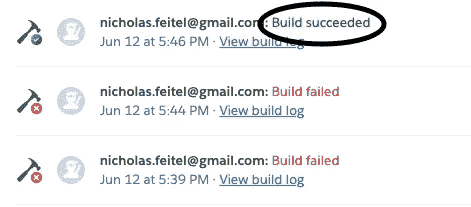
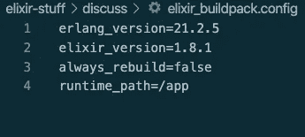

# 如何将你的凤凰 1.5 App 部署到 Heroku！

> 原文：<https://levelup.gitconnected.com/how-to-deploy-your-phoenix-1-5-app-to-heroku-28b77ca11694>

## 照我说的做，不要照我做的做！



成功！

因此，如果你们中的一些人一直在关注我以前的文章，那么你们已经看到，我一直在使用 [Elixir](https://elixir-lang.org/) 和 [Phoenix](http://hexdocs.pm/phoenix) ，它们分别是一种快速、容错、功能性的编程语言，具有类似 Ruby 的语法，并且是这种语言的快速、容错、功能性的 web 框架，类似于 [Rails](https://rubyonrails.org/) ，但是更快！

在过去的一周里，我终于完成了[我正在进行的关于 Elixir/Phoenix](https://click.linksynergy.com/deeplink?id=q15T/SfRF14&mid=39197&murl=https%3A%2F%2Fwww.udemy.com%2Fcourse%2Fthe-complete-elixir-and-phoenix-bootcamp-and-tutorial%2F) 的课程，这个课程很棒，是由[$ brew install heroku# on linux$ sudo apt-get install heroku# on windows$ print "why are you coding on windows bra"](https://medium.com/u/d058882d8cd2# on a mac</span><span id=)

[一旦安装完毕，你会想要使用我们上面的版本，它利用了一个 **buildpack** ，这是一套关于 Heroku 如何与特定项目和语言集一起工作的指令和工具。](https://medium.com/u/d058882d8cd2# on a mac</span><span id=)

[因此，您将从项目的命令行运行:](https://medium.com/u/d058882d8cd2# on a mac</span><span id=)

```
$ heroku create <your-project-name> --buildpack hashnuke/elixir
```

[这将创建您的项目并正确使用 buildpack，甚至为您的站点提供一个漂亮的**二级域名**或非随机名称。](https://medium.com/u/d058882d8cd2# on a mac</span><span id=)

[Phoenix 还有一个 buildpack 可以帮助我们直接编译我们的 web 项目，所以让我们把它添加到这里。](https://medium.com/u/d058882d8cd2# on a mac</span><span id=)

```
$ heroku buildpacks:add https://github.com/gjaldon/heroku-buildpack-phoenix-static.git
```

[最后，对于这一部分，让我们添加一个**插件**，它就像一个构建包，但不仅仅是特定于特定的语言或框架。这将假设您使用 **PostgreSQL** 作为您的数据库，因为它很容易添加并且对项目来说也是免费的。所以要添加的只是类型:](https://medium.com/u/d058882d8cd2# on a mac</span><span id=)

```
$ heroku addons:create heroku-postgresql:hobby-dev
```

[这将创建生产所需的`DATABASE_URL` ENV 变量，并为您进行设置。整洁！](https://medium.com/u/d058882d8cd2# on a mac</span><span id=)

## [**第三步——创建三个文件，修改三个！**](https://medium.com/u/d058882d8cd2# on a mac</span><span id=)

[](https://medium.com/u/d058882d8cd2# on a mac</span><span id=)

[制造他们！](https://medium.com/u/d058882d8cd2# on a mac</span><span id=)

[现在我已经习惯了在 Netlify 上部署和在 Heroku 上部署 Ruby on Rails 应用，这让我变得相当懒惰和自满，因为这些过程基本上不需要做任何工作。](https://medium.com/u/d058882d8cd2# on a mac</span><span id=)

[但是由于 Elixir/Phoenix 是快速开发中的一个较新的框架，我们需要创建三个非常小的文件。首先，让我们在项目目录的根目录下创建我们的`elixir_buildpack.config`文件。这让我们根据我们添加的第一个构建包来选择我们的 Elxir 版本。如果您使用截至 2020 年 6 月的最新版本的 Elixir，它将包含以下代码行。](https://medium.com/u/d058882d8cd2# on a mac</span><span id=)

```
# elixir_buildpack.configerlang_version=21.2.5elixir_version=1.8.1always_rebuild=falseruntime_path=/app
```

[太好了。现在让我们用一个`phoenix_static_buildpack.config`文件来配置我们添加的 Phoenix buildpack。](https://medium.com/u/d058882d8cd2# on a mac</span><span id=)

```
# phoenix_static_buildpack.confignode_version=10.20.1
```

[现在，我们为什么要配置我们的节点版本呢？这是因为 Phoenix 使用](https://medium.com/u/d058882d8cd2# on a mac</span><span id=) [Webpack](https://webpack.js.org/) 来“捆绑”我们拥有的用于 WebSockets 和 Webpack 使用 [Node.js](http://nodejs.org) 的小 JavaScript 资产！所以我们需要确保我们使用的是 Node 的最新版本！

我们需要制作的最后一个文件是一个`Procfile`，也在我们的根目录下，这个文件只是让 Heroku 知道一些命令来启动我们的服务器。这个文件只需要一行！

```
# Procfileweb: MIX_ENV=prod mix phx.server
```

这只是给出了启动我们的服务器和生产环境的基本命令！

说到这我们还得修改三个文件！

第一个在`config/prod.exs`，这不是巧合，因为我们刚刚提到过。找到以`url`开头的行，替换为:

```
http: [
  port: {:system, "PORT"}], 
  url: [scheme: "https", host: "yourappname.herokuapp.com", 
  port: 443
 ], force_ssl: [rewrite_on: [:x_forwarded_proto]],
```

将“yourappname”替换为你的应用的名称，我们就可以了！这只会让制作方知道你的 Heroku 网站的地址，同时也能很好地使用它的标准。

接下来在`prod.secret.exs`中，让我们找到`Repo`部分并改变它！

```
config :yourapp, YourApp.Repo,   
 ssl: true,   
 url: database_url,   
 pool_size: String.to_integer(System.get_env("POOL_SIZE") || "10")
```

同样，请用你的应用程序替换你的应用程序。这将告诉你的数据库从我们之前添加的 Postgres 插件中提取数据。

最后，如果你像我之前提到的那样使用 WebSockets，Heroku 为它们制定了特定的规则，所以我们必须在`lib/yourapp_web/endpoint.ex`文件中设置它们。它应该是这样的:

```
defmodule YourAppWeb.Endpoint do   

 use Phoenix.Endpoint, otp_app: :your_app    

 socket "/socket", YourAppWeb.UserSocket,     
 websocket: 
  [timeout: 45_000],     
  longpoll: false # whatever other contents of your file can stay here!end
```

就这样吧！

## 第四步:设置你的变量，包括外部变量！


哦，是的，配置变量。

还记得我在第一步中谈到的隐藏 ENV 变量吗？现在是时候设置它们了！

在 Heroku 站点的设置中，你可以进入仪表盘，点击你的应用，点击“设置”，然后点击“显示配置变量”。这将允许你设置像`SECRET_KEY_BASE`，你可能有的任何 API 键和[# if this process ends with "deployed successfully" then there's one more line to set up our database$ heroku run "POOL_SIZE=2 mix ecto.migrate"](/how-to-do-oauth-with-github-in-elixir-phoenix-1-5-c2bd5dc05cb1# a lot of things will happen here including maybe bugs! I believe in you! You can solve them!</span><span id=)

[就是这样！您应该能够导航到您的网站，并看到它在那里辉煌的色彩！如果没有，这里是我在这个过程中经常使用的](/how-to-do-oauth-with-github-in-elixir-phoenix-1-5-c2bd5dc05cb1# a lot of things will happen here including maybe bugs! I believe in you! You can solve them!</span><span id=)[灵药](https://join.slack.com/t/elixir-lang/shared_invite/zt-eivteker-k_nArD59XHjjN_r8qeH6dw)的剩余部分，我会提醒你不要像我一样[检查那些文件](https://hexdocs.pm/phoenix/heroku.html)，然后向世界展示你的网站！

汪汪。太多了。

你知道还有什么是“汪汪”和“很多”吗？熊猫。


熊猫！

熊猫昨天在我的鞋子上撒尿，我仍然爱他，因为他是一个毛绒绒的傻瓜。它是布鲁克林肖恩·卡西动物救助中心准备收养的狗之一，我今天晚些时候要去那里。散步收容所男孩是一个伟大的方式来社交距离，得到一些爱，从一天辛苦的代码中放松下来，并在动物的生活和你的生活中产生影响。

我的鞋子有味道，熊猫。但是我仍然爱你。

再见了，

网络信息中心(Network Information Center)ˌ网路界面卡(Network Interface Card)ˌ全国工业理事会(National Industrial Council)ˌ航行情报中心(Navigation Information Center)