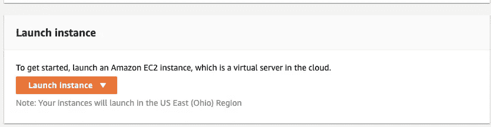
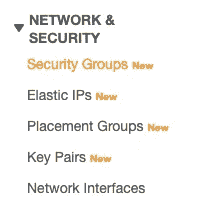
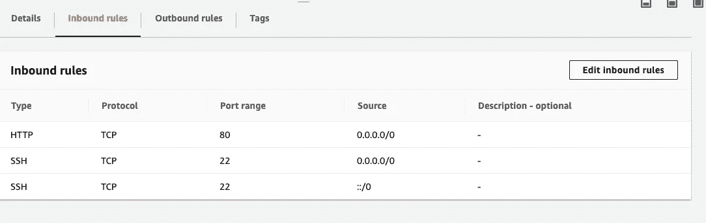

# 如何用 Amazon 部署你的站点，快速而肮脏的方法！

> 原文：<https://levelup.gitconnected.com/how-to-deploy-your-site-with-amazon-the-quick-and-dirty-way-29104281a65>

## 不用花钱就能学会一些 AWS，把你的网站放到网上！



准备发射！

作为初级开发人员，有很多很好的选择来部署早期的 web 项目。现在，虽然我对我在学校创建的项目感到有些尴尬，但作为一个在学习上稍有进步的人，我已经在我的简历中列出了其中的许多项目，因为无论项目看起来如何:

*   改进和调整一个人过去的项目永远不会太晚，这本身就是一项有价值的技能。
*   对于那些愿意雇佣你的人来说，项目是能够使用技术的有力象征。

尽管我可能不会对我用手动重载表单和自定义 CSS 构建的 Rails 项目感到太骄傲(“唉，Bootstrap 太恶心了。”我天真地告诉我项目中可怜的合作伙伴)能够说我知道如何生成一个 Rails 站点并创建嵌入式 Ruby 模板/视图、模型和控制器是一项很有价值的技能，即使是在学生阶段。

因此，对于这些项目或您可能做的任何很酷的新项目，有一些很好的部署选项。

*   Heroku 是一款出色的部署应用，适用于任何服务器端框架，如 Ruby/Rails、Node/Express 或 Python/Django。Heroku 并不局限于这些选项，但以我的经验来看，它们的效果最好。
*   [Netlify](https://www.netlify.com/) 是一个非常令人兴奋的选择，也是我对 React、Gatsby 和 Angular 等前端应用框架的选择。Netlify 使部署变得非常容易，特别是在 Gatsby/React 的路由方面“玩得很好”。
*   还有 [Github Pages](https://pages.github.com/) ，这是一个很好的选择，几乎可以肯定，它可以从 Github 本地运行，你的应用程序已经托管在那里了！Github Pages 是新的，所以它可能有一些怪癖(比如 React 路由器问题)，但它仍然是一个很好的简单选择。

不过最近，我想了解亚马逊网络服务(AWS ),这是一种托管大部分互联网的服务器，顺便提一下，这是一种公司非常需要的技能。

与 Heroku、Netfify 或 Github Pages 不同，AWS 广受欢迎的免费启动 EC2 选项不是为您“做一切”的自动化部署，而是一个“虚拟机”，是一个更大的盒子的一部分，您必须完成大部分工作。

你要做的第一件事是[创建一个 AWS 账户](https://aws.amazon.com/premiumsupport/knowledge-center/create-and-activate-aws-account/)。这确实涉及到信用卡，但不涉及向你收费，因为有一个免费层。我已经注册了一个名为brew install tldr# on Linux
sudo apt-get install tldr

TLDR 会给你一个超级简单的简写，告诉你在`tldr`之后输入的任何命令会做什么。如此简单，我要让它为我解释 CHMOD！

```
chmodChange the access permissions of a file or directory.- Give the [u]ser who owns a file the right to e[x]ecute it:
    chmod u+x file- Give the [u]ser rights to [r]ead and [w]rite to a file/directory:
    chmod u+rw file_or_directory- Remove e[x]ecutable rights from the [g]roup:
    chmod g-x file- Give [a]ll users rights to [r]ead and e[x]ecute:
    chmod a+rx file- Give [o]thers (not in the file owner's group) the same rights as the [g]roup:
    chmod o=g file- Remove all rights from [o]thers:
    chmod o= file- Change permissions recursively giving [g]roup and [o]thers the ability to [w]rite:
    chmod -R g+w,o+w directory
```

基本上，您需要通过删除组权限来修改 PEM 文件，直到它看起来像上面的一样。我知道这可能很难，我有一个善良的人指导我，所以如果你不想玩，这应该是可行的:

```
chmod 400 <your-pem-file>
```

太好了！现在您已经准备好使用 SSH 进入您的实例了！SSH 是使您的命令行成为 EC2 实例的命令行的一种方式(用 dummy 的术语来说)。一旦您的 PEM 文件可用，您就可以使用:

```
ssh -i /path/my-key-pair.pem my-instance-user-name@my-instance-public-dns-name
```

我将代表我节省你许多浪费的时间，并且说如果你选择一个 Ubuntu 图像，你的`my-instance-user-name`是`ubuntu`。不客气。

您应该能够在仪表板上找到您实例的 DNS，它只是您实例的公共地址。

一旦你加入，你就有了选择！一台干净的机器，上面只有像`git`这样的东西。您在这里不能轻松使用图形界面，所以您将使用命令行。如果您想在您的机器上安装一些东西，您可以按下`CTRL+D`，这是一个命令，可以让您退出 shell 或您的实例的命令行，而是键入:

```
sftp -i /path/my-key-pair.pem my-instance-user-name@my-instance-public-dns-name
```

提示:要了解 SFTP 和如何使用，请尝试前面 TLDR 命令！

但是还有一个更简单的方法！可以用 GitHub！只需转到您拥有的 web 服务器项目的 repo，`git clone`将它键入您的终端，然后键入`ls`，瞧！你的项目在那里！您仍然需要使用`sudo apt-get install`命令安装 Rails/Ruby 或 Node 或 Elixir 之类的东西，以及 PostgreSQL 之类的数据库，但是您将拥有您需要工作的任何东西。

最后，查看本地生产服务器命令使用的端口。对于 Rails/React 这可能是 3000，或者对于 Gatsby 8000，只需检查并查看它在哪个端口上运行。

现在，我要给出的这个解决方案非常懒惰，最好研究一下[NGINX](https://www.nginx.com/)或 [Apache](https://httpd.apache.org/) 之类的东西，但这是一个简短的指南。

但是，一旦您知道您的端口是什么，进入您的 EC2 仪表板，转到您的安全组，然后单击“入站规则”。



安全组然后…



入站规则…

只需更改或添加一个允许的端口到`4000` 或任何你的应用运行的端口，然后返回到你的 SSH 类型`rails s`或`npm start`或任何你的项目需要的端口。

最后，导航到 EC2 实例的地址，就是您 SSH 进入的那个地址，瞧！


我当时在学 Nginx！

我们看到我们的网站显示！

我知道这不是最容易的教程，但当我在 FAANG 公司面试时，我被要求知道的一件事是 Linux 命令行界面，我发现自己在努力。我发现最实用的学习方法是做一些别有用心的有趣的事情，比如为朋友做一个项目或一个低压任务。

我还要特别感谢我的朋友迈克尔，没有他我根本不知道自己在做什么。

说到好朋友:


奥利奥！

奥利奥是非常好的朋友。他喜欢嗅、尿和舔，但我们真正喜欢的是大热天在凉爽的人行道上闲逛。

他是一只可爱的饼干狗。

白现在来说，

网络信息中心(Network Information Center)ˌ网路界面卡(Network Interface Card)ˌ全国工业理事会(National Industrial Council)ˌ航行情报中心(Navigation Information Center)