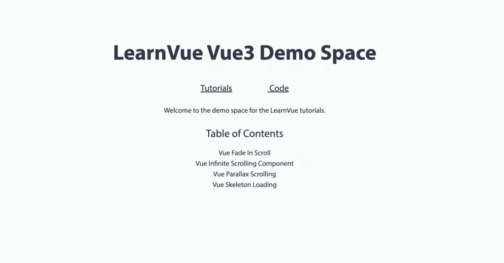

# 如何将您的 Vue 应用程序部署到 Github 页面

> 原文：<https://levelup.gitconnected.com/how-to-deploy-your-vue-app-to-github-pages-897136799e19>


照片由[多梅尼科·洛亚](https://unsplash.com/@domenicoloia?utm_source=medium&utm_medium=referral)在 [Unsplash](https://unsplash.com?utm_source=medium&utm_medium=referral) 拍摄

GitHub Pages 是部署您的 Vue 应用程序的一个很好的免费选项。这是一个静态网站托管服务，直接从 GitHub 上的存储库中获取文件。

Github Pages 的一大优点是，一旦你知道它是如何工作的，它就很容易设置。这就是我们今天要做的！

在本教程中，我们将涵盖:

*   Github 页面的基础知识
*   设置 Vue 项目以使用 Github 页面
*   部署 Vue 项目
*   在此部署环境中配置 Vue 路由器

这些步骤很多都是基于 Roland 的[这篇伟大的文章](https://medium.com/@Roli_Dori/deploy-vue-cli-3-project-to-github-pages-ebeda0705fbd)，结合了我在部署一个 [Vue3 演示空间](https://matthewmaribojoc.github.io/learnvue-tutorials/)时发现的一些技巧。

好吧，让我们开始吧。

## Github 页面是如何工作的

[Github Pages](https://pages.github.com/) 允许您从 Github 存储库中提供静态 HTML、CSS 和 Javascript 文件。就 Vue 而言，这意味着一旦我们构建了我们的项目，我们就可以提供这些文件，只要我们将它们推送到一个 repo。

最简单的方法之一是在您的存储库上创建一个单独的 gh-pages 分支。我们的最终目标是让这个分支只包含我们的构建文件夹——对于很多项目来说，这个文件夹是 dist。

我们可以通过使用 gh-pages 分支作为主分支的[子树](https://gist.github.com/SKempin/b7857a6ff6bddb05717cc17a44091202)来做到这一点。

当我们这样做的时候会更有意义，所以我们走吧。

## 设置您的项目

好的，首先我们必须了解我们的 gh-pages 分支将部署在哪里。大多数时候，已部署站点的 URL 会是`*GITHUB_USERNAME*` .github.io/ `*REPO_NAME*`。

这意味着我们 gh-pages 分支上的所有文件都可以在类似于[https://matthewmaribojoc . github . io/learn vue-tutorials/main . CSS](https://matthewmaribojoc.github.io/learnvue-tutorials/main.css)的地方访问，例如。

好了——足够的背景信息。让我们把我们的项目放到网上。

**步骤 1。将 vue.config.js 中的** `**publicPath**` **设置为我们的库名**

在主分支上，我们想要在我们项目的根目录中创建一个`vue.config.js`文件。这里，我们想要配置`publicPath`(它也编辑 webpack publicPath)来将所有静态资产路由到正确的路径。

如果我们没有这个配置，我们部署的站点将不能正确地加载资产，比如图像。

我们希望将它路由到我们部署的 Github Pages 站点的 URL 路径，这可以在我们的存储库设置中找到。


我们希望采用在那个红框中找到的路径 github.io 之后的任何路径——并像这样在我们的`vue.config.js` 中使用它。

```
module.exports = {
  publicPath: process.env.NODE_ENV === 'production'
    ? '/REPO_NAME/'
    : '/'
}
```

现在，当我们部署站点时，所有静态资产都应该从正确的路径加载。

## 部署您的 Vue 项目

配置好 Vue `publicPath`之后，我们现在可以开始部署我们的项目了。

**第二步。使用** `**npm build**`构建你的项目

这一步非常简单，我们实际上需要一个 dist 文件夹来部署。

**第三步。运行** `**git add dist**` **和** `**git commit -m 'adding dist subtree'**`

这将我们的更改提交到主分支，以便我们可以在下一步创建一个`dist`子树。确保`dist`不包含在您的`.gitignore` 文件中！

**第四步。运行** `**git subtree push --prefix dist origin gh-pages**`

这一步使 gh-pages 成为主分支的子树。[前缀选项](https://gist.github.com/SKempin/b7857a6ff6bddb05717cc17a44091202)为我们的子树指定我们想要的文件夹。如果我们看一下 gh-pages 分支，我们会发现它相当于 dist 文件夹的根。


**第五步。搞定了。**

几分钟后，Github 页面应该会刷新，显示最新的库更改，您应该可以在线看到您的 Vue 项目。激动人心！



## 提示—使用自定义 404 页面处理 Vue 路由器

我在尝试建立我的 Github Pages 网站时发现，使用 [Vue Router](https://learnvue.co/2020/04/a-first-look-at-vue-router-in-vue3/) 有点棘手。

如果你在 Vue 路由器中使用历史模式，你会注意到如果你试图直接进入/以外的页面，你会得到一个 404 错误。这是因为 Github Pages 不会自动重定向所有请求以服务于 index.html。

幸运的是，有一个简单的小变通办法。

你所要做的就是复制你的`index.html`文件，并将副本命名为`404.html`。

这样做的目的是让你的 404 页面提供与你的 index.html 相同的内容，这意味着你的 Vue 路由器将能够显示正确的页面。

一旦你这样做了，你将不得不重新运行之前的第 2 到第 5 步，并且你将不得不等待几分钟来更新你的站点。

## 就这样？

没错。在 Github 页面中启动和运行就是这么简单。有几种方法可以优化这个过程，比如编写 shell 脚本来简化这个过程，或者通过[配置 Vue 文档](https://cli.vuejs.org/guide/deployment.html#gitlab-pages)检查的 CI。

但是这是一个开始的好地方，所以你可以向你的家人和朋友炫耀你的 Vue 项目！

我很乐意看到你的 Github 页面的链接！如果您有任何问题或意见，请回复。

祝你好运！

[如果你有兴趣了解更多关于 Vue 3 的知识，下载我的免费的 Vue 3 备忘单，里面有基本的知识，比如组合 API、Vue 3 模板语法和事件处理。](https://learnvue.co/vue-3-essentials-cheatsheet/)