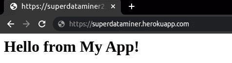
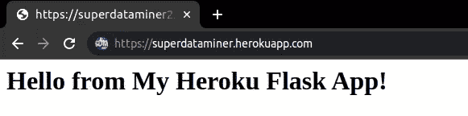

# 如何将您的 Web 应用程序部署到 Heroku 并添加自定义域

> 原文：<https://levelup.gitconnected.com/how-to-deploy-your-web-application-to-heroku-and-add-custom-domains-6bc5d9e9ebd4>

## 学习托管 web 应用程序的经济方法


图片由[穆罕默德·哈桑](https://pixabay.com/illustrations/payment-global-bank-online-4254220/)在皮克斯拜拍摄

在之前的文章中，我们介绍了[如何将 Flask 应用程序部署到 GCP 云运行](https://betterprogramming.pub/how-to-deploy-a-web-application-to-cloud-run-automatically-6967d7c7d42a)，以及[如何使用云负载平衡器](https://towardsdatascience.com/how-to-set-up-a-custom-domain-for-different-gcp-applications-using-a-load-balancer-bbcad40fed)为其设置自定义域。这种 GCP 解决方案的优点是便于与 GCP 系统集成。缺点是成本。用云运行和云负载平衡器在 GCP 上托管你的 web 应用程序实际上是非常昂贵的。如果你想最大限度地减少延迟，你需要为云运行的[专用 CPU](https://cloud.google.com/run/pricing) 付费，还需要为定制域的[云负载平衡](https://cloud.google.com/vpc/network-pricing)付费。你可以使用 [GCP 价格计算器](https://cloud.google.com/products/calculator)来计算你的应用程序的成本，你可能会对它们感到惊讶。

作为一个经济的替代方案，我们可以使用 Heroku 来托管一个简单的 web 应用程序，这个程序不太依赖外部服务。Heroku 是首批支持多种编程语言的云平台即服务(PaaS)之一。如果你没有很大的流量并且不想建立一个自定义域，你可以在 Heroku 上免费托管你的 web 应用。如果你有这些要求，你可以将你的免费计划升级为付费计划，这比 GCP 的解决方案要便宜得多。

在这篇文章中，我们将介绍如何将一个简单的 Flask 应用程序部署到 Heroku 并为其添加自定义域。我们还将介绍如何创建一个包含阶段化和生产应用程序的管道，这是软件开发的常见实践。

## 准备

如果你想跟着做，你需要首先在你的电脑上安装 Git。然后克隆[这个 repo](https://github.com/lynnkwong/flask-heroku) 并导航到`my_app`文件夹，其内容如下:

```
$ **tree -I __pycache__**
.
├── app.py
├── Procfile
├── README.md
└── requirements.txt
```

*   `app.py`是唯一包含烧瓶代码的文件。你在实际应用中肯定会有比这更多的。
*   `Procfile`(注意第一个字母是大写的)包含我们的应用程序中的流程类型列表。对于我们的简单应用程序，它只包含一行代码，用于使用 [gunicorn](https://flask.palletsprojects.com/en/2.1.x/deploying/wsgi-standalone/#gunicorn) 托管我们的 Flask 应用程序:
    `web: gunicorn app:app` 这里的`web`表示我们应用程序的进程类型。它是一个 web 应用程序，将通过 [HTTP 路由](https://devcenter.heroku.com/articles/http-routing)接收 web 流量。
*   `requirements.txt`包含该应用程序所需的库。

对于本地开发，建议在虚拟环境[中安装这些库，这样它们就不会影响系统上运行的其他应用程序。在本教程中，我们将使用 Python 的原生](https://lynn-kwong.medium.com/how-to-create-virtual-environments-with-venv-and-conda-in-python-31814c0a8ec2)`[venv](https://lynn-kwong.medium.com/how-to-create-virtual-environments-with-venv-and-conda-in-python-31814c0a8ec2)`工具来创建一个虚拟环境。

您可以运行以下命令为本教程做准备:

对于我们的 Flask 应用程序，我们需要在启动之前设置一个环境变量:

```
$ export APP_NAME='My local Flask App'
$ gunicorn app:app
```

注意，我们不需要为 gunicorn 指定端口，它将由 Heroku 自动处理。然后我们可以访问 [http://127.0.0.1:8000/](http://127.0.0.1:8000/) 并查看来自我们 Flask 应用程序的问候:


作者图片

我们的 Flask 应用程序已经在本地设置好了，可以部署到 Heroku。

此外，如果您想在应用程序中添加自定义域，您需要提前获得一个域。本教程中显示的([superdataminer.com](https://www.superdataminer.com))仅用于演示目的，因为最好使用真实的域名进行演示，而不是假的。但是，如果您想继续，您需要用自己的代码替换它。请查看[这篇文章](https://towardsdatascience.com/how-to-set-up-a-custom-domain-for-different-gcp-applications-using-a-load-balancer-bbcad40fed)了解如何获得自定义域名的快速介绍。

## 将应用程序部署到 Heroku

您需要在 Heroku 上[注册](https://signup.heroku.com/login)，然后才能在上面部署您的应用程序。请记下用户名和密码，因为稍后会用到它们。

然后你需要在你的电脑上安装 Heroku CLI。请遵循针对您的特定操作系统的[说明](https://devcenter.heroku.com/articles/heroku-cli)。对于 Ubuntu，只需运行以下命令来安装它:

```
$ sudo snap install heroku --classic
```

我们需要首先使用 Heroku CLI 登录:

```
$ heroku login
```

登录页面将在您的浏览器中自动打开。按照浏览器中的说明登录。然后您可以创建您的应用程序并将其部署到 Heroku。

让我们用 Heroku CLI 创建第一个应用程序:

```
$ heroku apps:create superdataminer
```

应用程序的名称(superdataminer)是可选的。如果没有给出，会给你分配一个随机的名字。通常将应用程序命名为与您的自定义域相同的名称，即[superdataminer.com](https://www.superdataminer.com/)，稍后将会展示。

然后，我们可以通过将代码推送到 Heroku 来将应用程序部署到 Heroku:

```
$ git push heroku main
```

`heroku`是为我们的应用程序创建的默认 Git remote。部署过程超级简单不是吗？😃第一次部署需要一些时间，因为需要构建和安装库。部署之后，您可以使用控制台中显示的 Web URL 访问您的应用程序。在这个例子中，网址是[https://superdataminer.herokuapp.com/](https://superdataminer.herokuapp.com/)。当您在浏览器中打开此 URL 时，您可以看到来自我们应用程序的问候:



作者图片

如果您的应用程序出现任何问题，您可以在控制台中运行`heroku logs`并在那里找到问题。

正如我们看到的，这里使用默认的`app_name`，因为我们没有为我们的应用程序设置`APP_NAME`环境。我们可以在 Heroku CLI 中使用`config`选项来设置或读取环境变量:

现在，如果刷新浏览器，您可以看到由刚刚设置的环境变量定义的新应用程序名称。



作者图片

## 设置试运行和生产环境

对于软件/web 应用程序开发来说，拥有对开发者和最终用户都有帮助的不同环境是一种常见的做法。开发工作流通常有三个阶段或环境，即开发、试运行和生产。

我们编写代码，并在您本地计算机上的开发环境中执行第一批测试。然后，当代码提交给其他开发人员审查时，您可以将它部署到模拟生产环境的阶段环境中，并确保代码为生产做好准备。最后，在代码被审查、测试和批准之后，它可以被部署到最终用户直接访问的生产环境中。

在 Heroku 中，可以通过[管道](https://devcenter.heroku.com/articles/pipelines)方便地处理登台和生产环境，这只是一组共享相同代码库的 Heroku 应用程序。管道中的每个应用程序代表连续工作流程的一个阶段。舞台名称不一定是 Staging 和 Production，但是这样命名是一种常见的做法。

为了最佳实践，我们通常不应该将代码直接推送到生产环境中。相反，一旦一切按预期运行，可以将暂存环境提升为生产环境。

让我们首先重命名当前的应用程序，使其带有`staging`后缀，以表明它是用于登台环境的。我们还需要为它添加一个 Git 遥控器，否则它仍然会使用默认的`heroku`遥控器。

让我们更新环境变量`APP_NAME`,以表明我们确实在访问暂存环境中的暂存应用程序:

我们可以使用`apps:info`选项返回的网址在浏览器中访问暂存应用程序:


作者图片

让我们创建一个管道，并将暂存应用程序添加到暂存环境中:

现在我们需要为生产环境创建一个应用程序:

如果你现在检查生产应用程序的信息，你会发现它是空的，还没有代码。如果你访问它的网址，你也会看到一个空页面。

让我们将生产应用程序添加到上面创建的管道中:

我们可以通过`info`选项查看管道的详细信息:

让我们将试运行应用程序提升到生产环境中:

生产应用程序的信息显示它现在有了一些东西:

我们看到它被分配了一个 dyno(Heroku 中的一个容器),现在 slug 的大小不为零，这意味着 Staging 应用程序已经被部署到它上面。当我们在浏览器中打开它的网址时，我们看到:


作者图片

有趣的是，这是默认的应用程序名称。升级临时应用程序时，临时环境中设置的环境变量不会迁移到生产环境中。我们还需要为生产应用程序设置一个环境变量:

现在，当我们再次访问该网址时，我们可以看到更新后的应用程序名称:


作者图片

不错！生产环境工作正常。

## 为 Heroku 应用程序设置自定义域

默认情况下，我们只能通过 Heroku 域访问 Heroku 上的 web 应用程序，如[https://superdataminer.herokuapp.com/](https://superdataminer.herokuapp.com/)。这对于私人使用是可以的，但如果我们想要更专业的东西，就不那么漂亮了。

我们可以给我们的应用程序添加自定义域，这样它就可以被更好的东西访问，比如 https://superdataminer.com 的 T2。实际上，在 Heroku 中添加自定义域比在 GCP 简单得多。所有的重活都给你处理了。然而，它不是免费的，您需要将您的计划升级到付费计划才能使用该功能。最低付费计划是[的 hobby one](https://www.heroku.com/pricing#containers) ，每个 dyno(Heroku 的一个容器)每月只需 7 美元，比 GCP 云负载平衡器便宜得多。

从技术上来说，你可以免费添加自定义域名。但是，您将无法使用 SSL 功能，这意味着您的自定义域只能通过 HTTP 协议访问，而不能通过 HTTPS 协议访问。这是不好的，因为浏览器会警告说，该领域是不安全的，人们可能只是不想打开它，由于警告。爱好计划提供的另一个好处是，运行你的应用程序的 dyno 永远不会休眠，这相当于在云中运行一个专用的 CPU，但同样便宜得多。因此，即使是第一次访问，您的应用程序也不会有任何延迟。

一旦您将您的计划升级到[爱好一](https://www.heroku.com/pricing#containers)，SSL 功能将自动为您启用。**但是，您不需要升级到爱好计划并拥有本教程的 SSL 功能。你可以用 HTTP 协议访问你的域名，如果你的浏览器发出警告，就点击“是”。**

要为您的应用程序添加自定义域，请运行带有`domains`选项的`heroku`命令。我们需要分别为根域和子域运行它。只有一个根域，即 superdataminer.com 的，它将用于生产环境。然而，可以有多个子域。我们将在 www.superdataminer.com[进行生产，在 staging.superdataminer.com](https://www.superdataminer.com/)[进行筹备。运行以下命令添加域:](https://staging.superdataminer.com/)

然后，您可以检查使用`domains`选项添加的域，如以下命令所示:

然后，您应该将这些 DNS 记录添加到您的域注册商的域中。对于 DOMAIN.COM，它就像下面显示的。其他域名注册商也应该类似:


作者图片


作者图片


作者图片

您需要等待十几分钟甚至几个小时来传播 DNS 记录。您可以使用`dig`命令来检查传播是否已经完成。当您看到如下所示的内容时，这意味着 DNS 记录已经传播:

现在，您将能够使用自定义域访问您的应用程序。

如果您访问暂存环境的子域 URL([http://staging.superdataminer.com](http://staging.superdataminer.com))，您将看到:


作者图片

如果您通过根域([http://superdataminer.com](http://superdataminer.com))或 www 子域([http://www.superdataminer.com](http://www.superdataminer.com))访问生产应用程序，您会看到:


作者图片

注意，它被浏览器警告为不安全的站点，因为我们是通过 HTTP 协议访问的。如果您想摆脱这个警告，并使用 SSL 证书的 HTTPS 协议，您可以升级您的计划到爱好之一。

干杯！您已经为临时应用程序和生产应用程序添加了自定义域。

相关文章:

*   [如何将 Web 应用部署到云上自动运行](https://betterprogramming.pub/how-to-deploy-a-web-application-to-cloud-run-automatically-6967d7c7d42a?source=your_stories_page-------------------------------------)
*   [如何使用负载平衡器为不同的 GCP 应用程序设置自定义域](https://towardsdatascience.com/how-to-set-up-a-custom-domain-for-different-gcp-applications-using-a-load-balancer-bbcad40fed?source=your_stories_page-------------------------------------)