# 如何使用 Vercel 部署您的网站

> 原文：<https://levelup.gitconnected.com/how-to-deploy-your-website-using-vercel-831c4fac2d41>

Vercel 将最佳开发人员体验与对最终用户性能的专注结合起来。我们的平台使前端团队能够做到最好。

# 1.首先，如果您没有帐户，请创建一个。但是如果你这样做了，那么转到第 4 步:

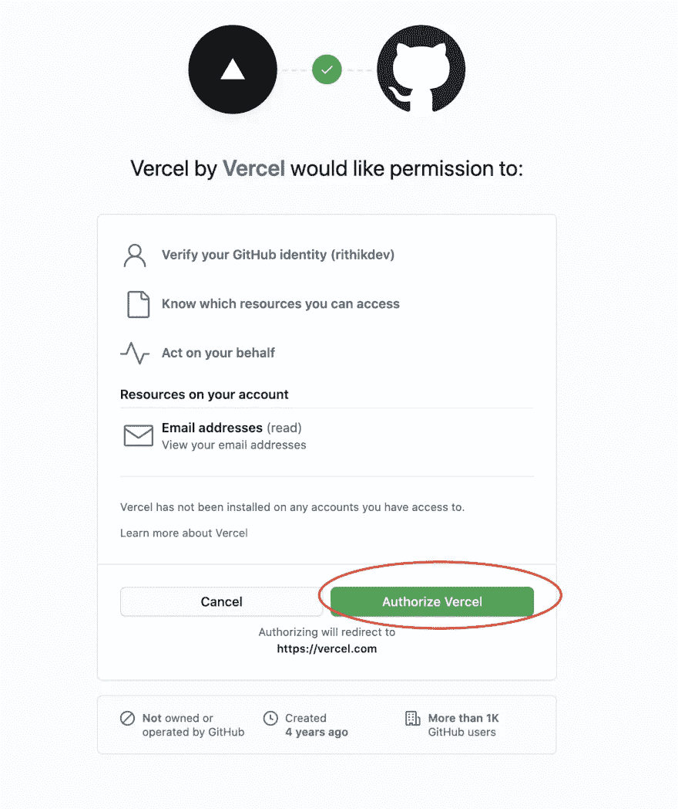

# 2.您将被重定向到仪表板。然后，点击下拉菜单并选择“添加 GitHub 组织或帐户”:

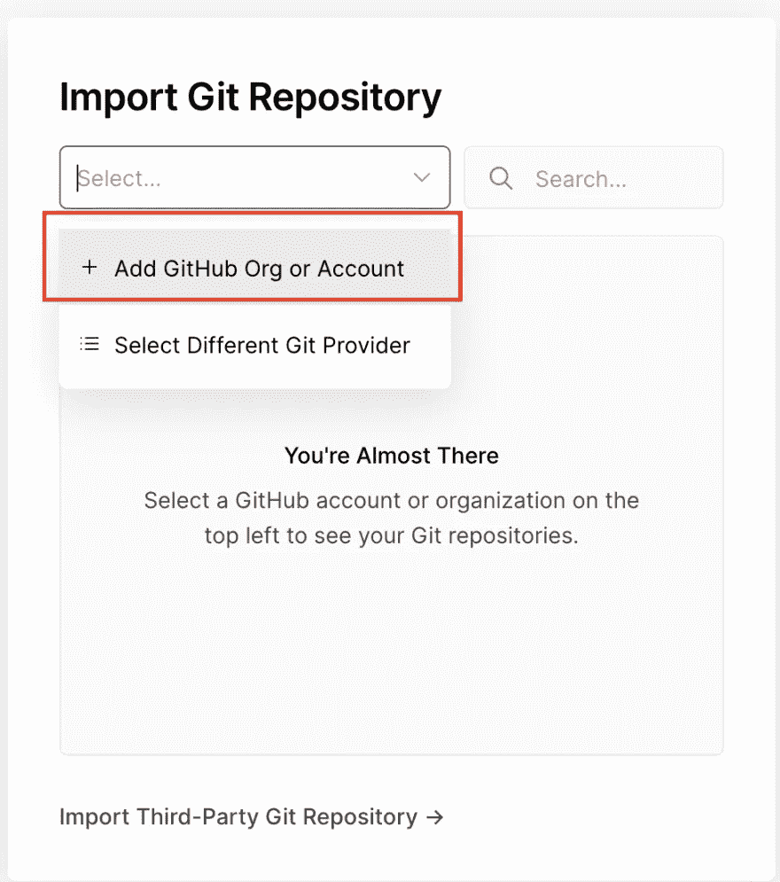

# 3.然后，你会看到一个弹出的窗口。选择“安装”选项。不过，这不会在您的设备上安装任何应用程序:

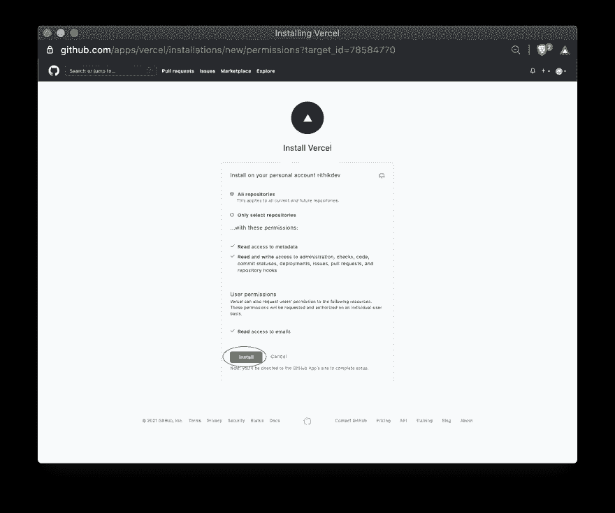

如果它成功了，那么你会得到一个这样的窗口:

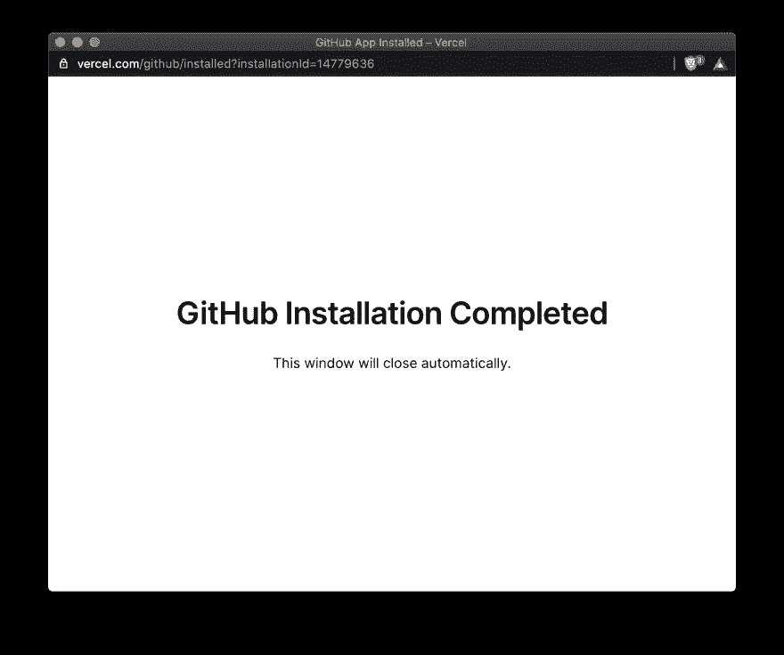

# 4.现在，回到你的仪表板，点击“新项目”:

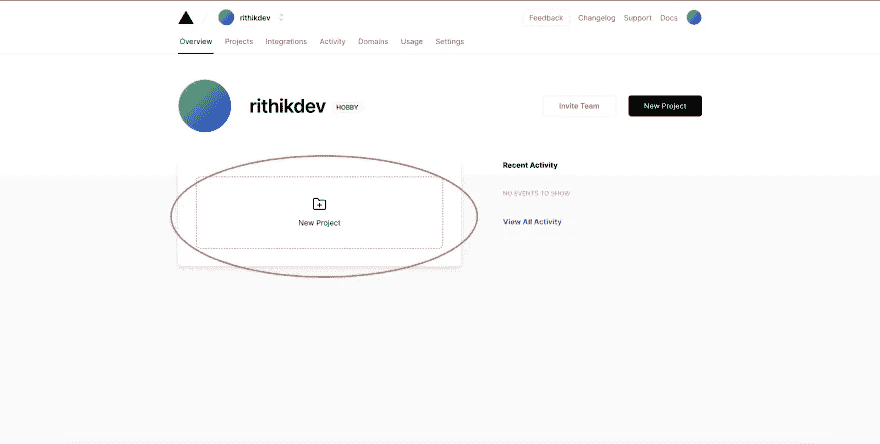

# 5.现在，在下拉列表中选择您的 GitHub 用户名:

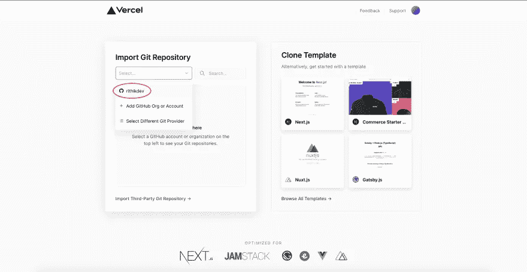

# 6.现在选择您想要托管的 GitHub 存储库:

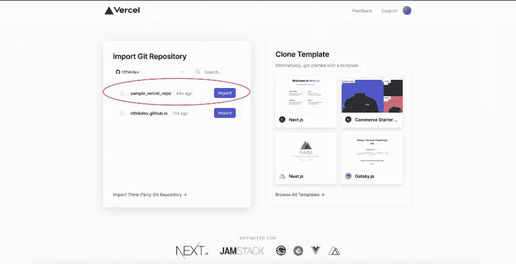

# 7.现在，选择您的帐户

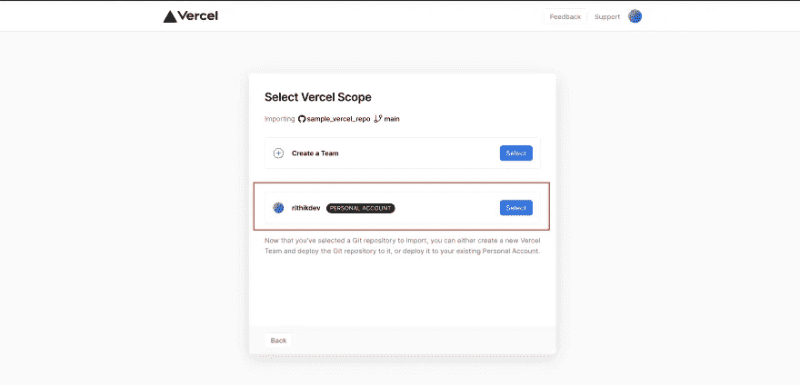

# 8.然后，点击下一步继续:

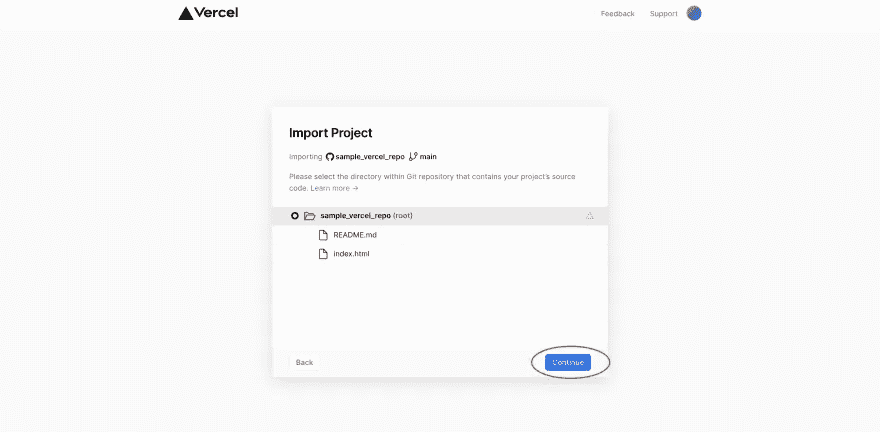

# 9.接下来，输入详细信息并单击部署:

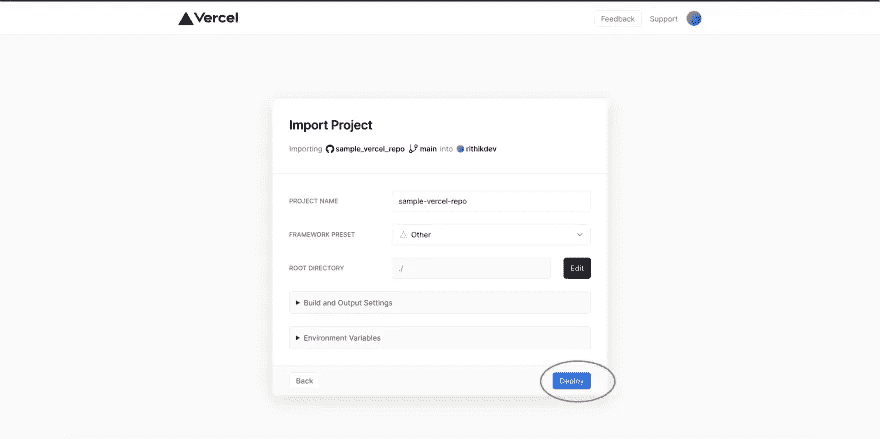

# 10.然后，需要一些时间来处理:

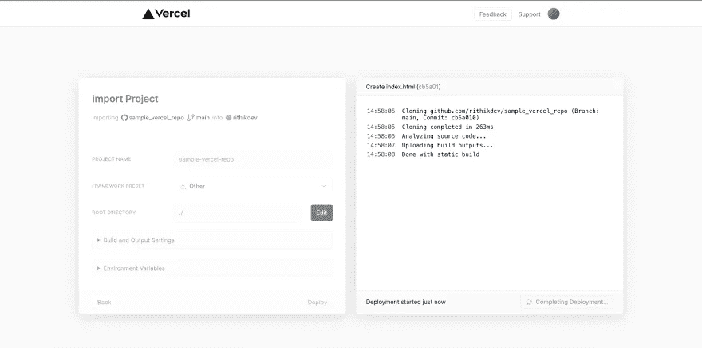

# 11.过一会儿，您将能够看到一个祝贺屏幕:

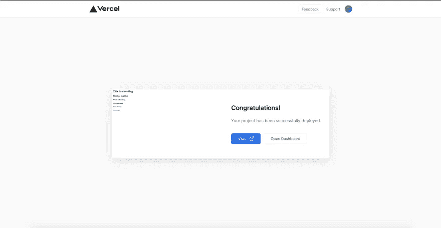

# 12.如果您想访问您的网站，请单击“访问”,它会将您带到以下网站:

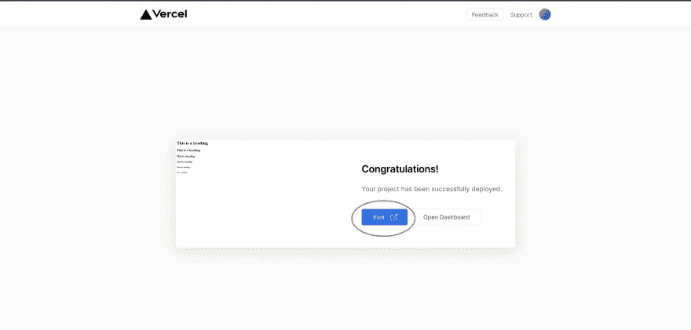

希望你喜欢这个教程，如果你点击了喜欢按钮，并在下面评论寻求帮助。

如果您不是会员，请考虑通过以下链接注册帮助支持作者:

 [## 用我的推荐链接加入媒体

### 作为一个媒体会员，你的会员费的一部分会给你阅读的作家，你可以完全接触到每一个故事…

crunchyknuckles.medium.com](https://crunchyknuckles.medium.com/membership) 

我写的其他一些关于编程的文章:

 [## JavaScript 不和谐机器人教程——编写一个不和谐机器人并免费托管它

### 本教程将向您展示如何使用 JavaScript 和 Node.js 完全在云中构建自己的 Discord bot。

medium.com](https://medium.com/codex/javascript-discord-bot-tutorial-code-a-discord-bot-and-host-it-for-free-25ea5314fd77)  [## JavaScript 中的 4 种内存泄漏类型以及如何消除它们

### 了解 JavaScript 中的内存泄漏以及如何解决它们！

levelup.gitconnected.com](/4-types-of-memory-leaks-in-javascript-and-how-to-get-rid-of-them-25137bed51cf)  [## 作为初学者开发的前 5 个游戏

### 新手游戏开发者必须尝试的 5 款游戏

enlear .学院](https://enlear.academy/top-5-games-to-develop-as-a-beginner-ce81802826d3)