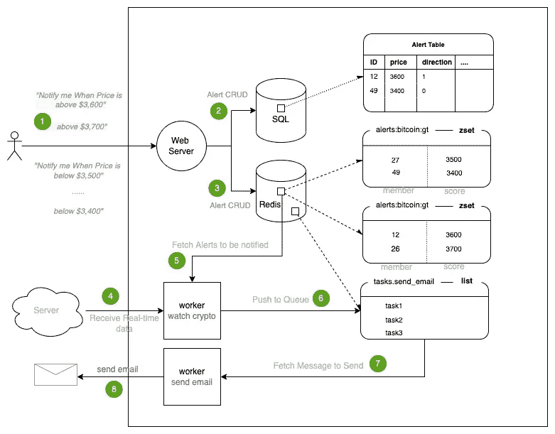
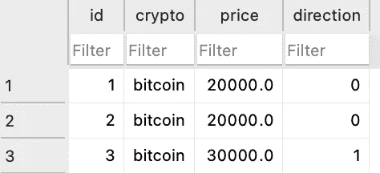
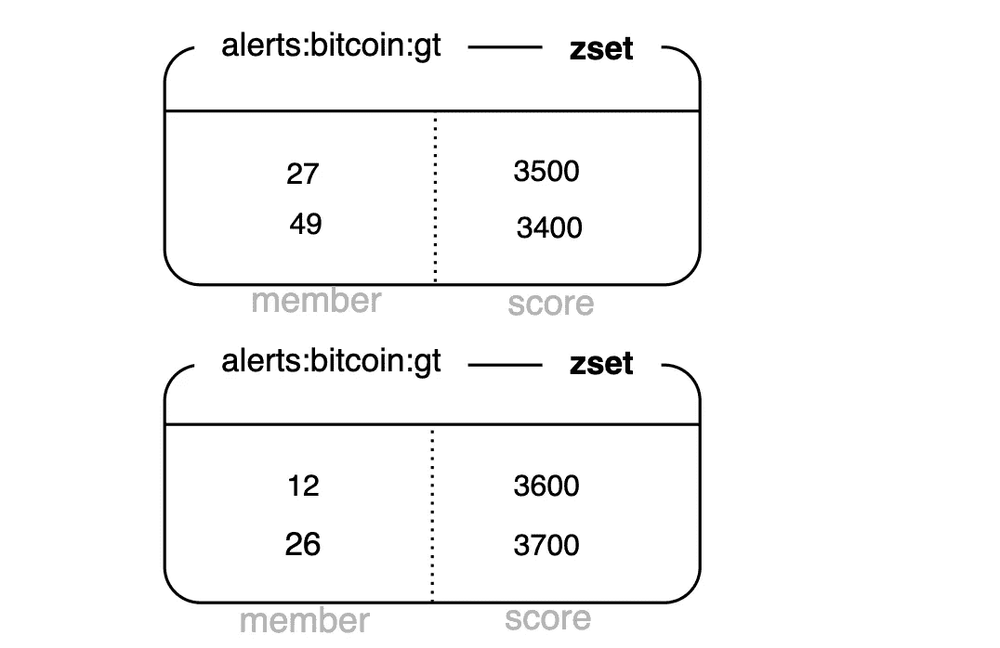

# 如何设计实时加密货币价格预警后端

> 原文：<https://levelup.gitconnected.com/how-to-design-a-real-time-cryptocurrency-price-alert-backend-470f6245a7cd>

作为加密货币投资者，我们希望快速准确地跟踪加密货币价格的波动。

实时价格警报是投资者的一个重要工具。它们可以发送到您的电子邮件地址，显示在您的屏幕上，甚至发送到您的手机上。

在本帖中，我们将带你设计一个实时加密货币价格提醒后端。



加密货币价格警报后端框架

# 成分

## 网络服务器

web 服务器负责处理来自前端用户的请求。这些请求包括添加、删除、更新和获取价格提醒。

## SQL 数据库

关系数据库永久存储警报记录。

## Redis 数据库

Redis 数据库以特定的结构存储临时警报，使得复杂的查询更快。

## 工人

worker `watch crypto`从外部来源接收实时数据，并将价格警报消息推入 Redis 进行进一步处理

这个 worker `send email`不断地观察 Redis 队列，一旦有消息添加到队列中，就发送一封电子邮件。

# 数据流


用户向 Web 服务器添加一些价格提醒。

例如，一个用户可能希望在比特币价格高于 36，000 美元时得到通知，而另一个用户可能在价格低于 34，000 美元时有一些兴趣。

这里是一个`add-alert`端点的请求体的例子。

```
{
 "price":40000.0,
 "crypto":"bitcoin",
 "direction": false
}
```

*   **价格**:预警的价格阈值
*   **crypto** :加密货币名称(如比特币)
*   **方向** *:* 上为真，下为假


web 服务器接收价格警报请求，并将它们存储到 SQL 数据库表中。



表预警记录


web 服务器还使用 *zset* 数据结构将价格警报保存到 Redis 数据库中。

*zset* 是 *Redis 有序集*的简称，这里记载了一种 Redis 数据类型[。排序集合中的每个键内部都有多个值，与一个浮动值分数相关联。](http://redis.io/topics/data-types-intro)

在我们的情况下，我们使用加密货币名称和 lt/gt 作为密钥的一部分(`alert:bitcoin:gt`和`alert:bitcoin:lt`)，价格将是项目的分数，SQL 记录的警报 id 将是项目的成员数据。



使用这种数据结构，我们可以快速回答这个问题:当价格为 X 时，应该发送哪些警报？我们将在第 5 部分给出一个例子。


我们构建一个 WebSocket 通信通道，从第三方来源获取实时加密货币价格。这里有一个关于如何制作的帖子。

[](/building-a-websocket-channel-in-golang-to-stream-real-time-cryptocurrency-data-117841ef7806) [## 在 Golang 中构建 Websocket 通道以传输实时加密货币数据

### with WebSocket 入门

levelup.gitconnected.com](/building-a-websocket-channel-in-golang-to-stream-real-time-cryptocurrency-data-117841ef7806) 

当从 WebSocket 接收价格数据时，我们需要决定应该快速发送哪些警报。

我们使用命令`ZRANGEBYSCORE`来实现它。该命令返回排序后集合中得分介于最小值和最大值之间的所有元素。

例如:

```
redis > **ZRANGEBYSCORE** alert:bitcoin:gt3500+inf
```

当比特币价格高于 3500 美元时，该命令会回答应该发送哪些警报。


我们将上一步中的警报消息推入 Redis 列表。


worker `send email`将负责监控 Redis 队列中的电子邮件消息，并将邮件发送到收件人的邮箱。


用户收到电子邮件，并做出一些购买和销售决定。

# 密码

这里是完整的[代码库](https://github.com/jerryan999/CryptoAlert)。如果你有兴趣，请试一试。

我希望你喜欢读这篇文章。如果你愿意支持我成为一名作家，可以考虑注册[成为一名媒体成员](https://jerryan.medium.com/membership)。你还可以无限制地访问媒体上的每个故事。