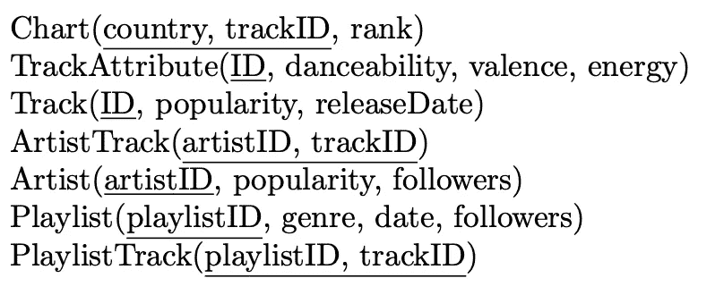
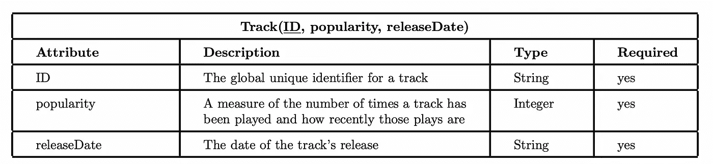
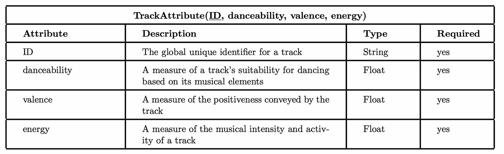
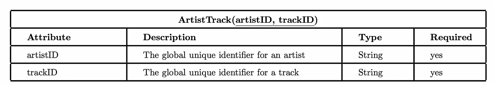
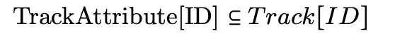
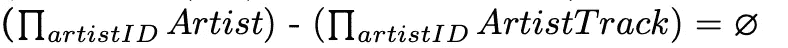
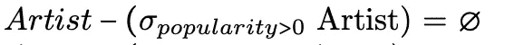

# 如何设计关系数据库模式

> 原文：<https://levelup.gitconnected.com/how-to-design-a-relational-database-schema-1f0ee48d4567>

## 使用 Spotify 数据设计数据库

图片由 [@tofi](https://unsplash.com/@tofi) 来自 [Unsplash](https://unsplash.com/photos/PkbZahEG2Ng)

在处理项目的数据库时，设计关系模式是最重要的。这是为数据库创建规则和管理不同表之间关系的一种方式。一个好的关系模式将产生一个灵活的、易于维护的数据库，使您在项目中操作的数据更容易处理。

# 检查数据

设计关系模式的第一步是查看可用的数据。在本教程中，我将使用 Spotify 数据来获取他们的歌曲、音频属性、播放列表和图表。以下是与我们的目的最相关的数据:

*   **曲目(歌曲)**:人气、发行日期、音频属性
*   **音频属性**:可跳性、效价和能量
*   **播放列表**:流派、日期、关注者和曲目
*   **热门曲目排行榜**:热门曲目所在国家，曲目及其在排行榜上的排名

# 设计模式

当设计一个模式时，有一些主要的事情要记住:每个表必须包含一个唯一的键，最小化冗余和空值。键是唯一的一组数据，不能在同一个表中重复。在我们的设计中，我们希望有一种方法将一个表中的数据与其他表连接起来，或者直接连接，或者通过一系列的表连接。使用公共属性将一个表连接到另一个表是外键概念的基础。记住所有这些，下面是根据数据设计的关系模式:

Spotify 数据的关系模式

下划线表示该表的键。例如，曲目表有 ID 键，这意味着该表中没有两个曲目可以有相同的 ID，但它们可以有相同的流行度。PlaylistTrack 有一个组合键，这意味着 PlaylistTrack 可能有多个项目具有相同的 trackID(意味着同一首曲目可以重复播放)，但 trackID 不能与同一个 playlistID 同时存在多次。

# 数据字典

数据字典本质上是对表中包含的数据的描述，此外还有数据的类型，如果需要的话(可能不为空)。每个数据字典都应该是合理的，以显示底层的决策过程。

下面是我们的关系模式中几个表的数据字典:

## 轨道数据字典

轨道数据字典

每个轨道都有一些通过其 ID 与之相关的一般信息。我们调查需要的两条主要信息是流行度和发行日期。流行度是衡量一首曲目被听了多少的必要条件，我们可以通过曲目 ID 将流行度与曲目属性联系起来，以得出关于收听习惯的结论。发行日期对于理解随时间发行的音乐类型的趋势是重要的。将发行日期与音频属性和流派联系起来可以揭示关于在一年中的特定时间发行的曲目类型的信息，以及根据音乐的属性这些年来的演变。由于曲目 ID 是唯一的，而流行度和发行日期不是唯一的(几首曲目可能有相同的流行度或发行日期)，我们选择曲目 ID 作为该表的关键字。

## 轨道属性数据字典

轨道属性数据字典

每个音轨都被分析，其主要的音频特征被编辑，包括它的可跳舞性、效价和能量。每个轨道具有以字符串 ID 的形式分配给它的全局唯一标识符，通过该标识符可以检索关于轨道的任何信息。因为一个音轨的 ID 是唯一的，但是它的名字不是，我们选择使用 ID 作为键来确保没有冗余。轨道具有以下音频质量:

*   声音
*   活力
*   工具性
*   活性
*   音量
*   语音
*   拍子
*   效价

我选择关注可舞性、效价和能量，因为它们包含了其他音频质量，也是音轨如何影响听众的预测因素。例如，一首效价、能量和可舞性高的曲目可能会引发积极的情绪反应。然而，我们不能根据音轨的语音、乐器和声音来判断一个响应。

## 艺术家音轨数据字典

艺术家音轨数据字典

一个艺术家可能有许多曲目，并且需要知道哪些曲目属于哪些艺术家，以将曲目音频属性和流行度与艺术家流行度和追随者相关联。曲目 ID 允许我们查询曲目属性表，而艺术家 ID 允许我们查询艺术家表。这是为减少冗余而创建的中间表；在该表中放置任何其他艺术家信息将会添加信息，该信息将针对该艺术家所拥有的曲目数量而重复。此外，向该表添加任何其他轨道信息都是多余的，因为该信息存在于轨道和轨道属性表中。我们选择了艺术家 ID 和音轨 ID 作为该表的联合关键字，因为艺术家 ID 可以重复，因为一个艺术家可以有几个音轨，并且音轨可以重复，因为在多个艺术家合作的情况下，多个艺术家可以有相同的音轨，但是不可能出现艺术家和音轨 ID 都重复的情况。

# 完整性约束

定义关系模式的最后一步是定义完整性约束，这些约束应用于表中的数据，以便我们可以轻松地查询数据库和逻辑地添加值。阅读完整性约束需要关系代数知识，所以我强烈推荐查找下面出现的一些符号。

几个很好的例子是:

追踪属性表中的每个 ID 也必须是追踪表中的 ID。

艺术家曲目表中不应有不在艺术家表中的任何艺术家 ID。本质上，这意味着不应该存在艺术家表中不存在艺术家的轨道。

不应该存在人气小于等于零的艺人。

# 结论

设计关系模式可能是一项艰巨的任务，但是如果您一步一步地进行，从您希望收集的数据开始，然后进入您希望如何使用它，任务就会变得简单得多。对于数据库来说，基础要走很长的路，所以设计一个简单的模式是理想的；模式越复杂，就越难使用和更改。

感谢阅读，如果你喜欢，请跟我来！我定期发布这样的内容。