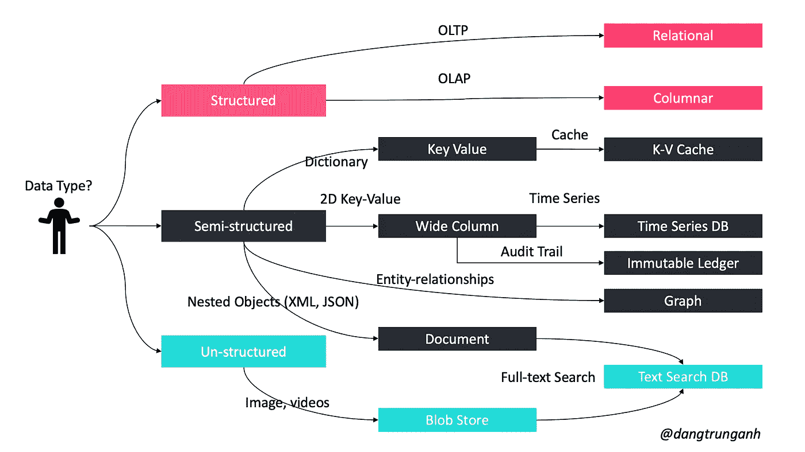

# 如何设计一个系统来扩展到你的第一个 1 亿用户

> 原文：<https://levelup.gitconnected.com/how-to-design-a-system-to-scale-to-your-first-100-million-users-4450a2f9703d>

## 高性能系列

## 想**大**，做小，学快

```
*In order to keep up with emerging techniques, I would like to update you on this story throughout the year.**Last updated on 2021 Dec 23*
```


照片由[基里尔施](https://unsplash.com/@kirill2020?utm_source=medium&utm_medium=referral)在 [Unsplash](https://unsplash.com?utm_source=medium&utm_medium=referral) 拍摄

设计一个支持数亿用户的系统并不容易。对于软件架构师来说，这总是一个巨大的挑战(但是在阅读了我的文章之后，从今天开始，这将变得很容易🤣)

以下是我在这篇文章中涉及的一些话题。

*   先说最简单的:*全合一*。
*   可伸缩性的艺术:*横向扩展，纵向扩展*。
*   扩展关系数据库:*主-从复制、主-主复制、联合、分片、反规范化和 SQL 调优。*
*   使用哪个数据库: *NoSQL 还是 SQL* ？
*   高级概念:*缓存、CDN、geoDNS。等。*

```
Today I don’t want to discuss general terms in high-performance computing such as fault tolerance, reliability, high availability., etc.
```

保持冷静，我们现在开始吧！

# 从头开始

在下图中，我想和一些用户一起设计一个基本的应用程序。*最简单的方法是在一台服务器上部署整个应用*。这可能是我们大多数人开始的方式。

*   一个网站(包括 API)运行在 Apache(或 Tomcat)这样 web 服务器上。
*   像甲骨文(或 MySQL⁴).)这样的数据库


我们在同一个物理机器上有 web 服务器和数据库服务器

但是当前的体系结构有以下缺点。

*   如果数据库失败，系统也会失败。
*   如果 web 服务器失败，整个系统都会失败。

在这种情况下，我们没有故障转移和冗余。如果一台服务器宕机，所有服务器都会宕机。

## 使用 DNS 服务器解析主机名和 IP 地址

在上图中，用户(或客户端)连接到 DNS⁵系统，以获取托管我们系统的服务器的互联网协议(IP)地址。一旦获得 IP 地址，请求就被直接发送到我们的系统。

> 每次访问网站时，您的电脑都会执行 DNS 查找。

通常情况下，域名系统(DNS)服务器是作为托管公司提供的付费服务，并不运行在你自己的服务器上。

# 可伸缩性的艺术

我们的系统可能必须进行扩展，原因有很多，比如数据量的增加、工作量的增加(例如，事务的数量)以及用户的增长。

```
Scalability usually means an ability to handle more users, clients, data, transactions, or requests without affecting the user experience by adding more resources.
```

我们必须决定如何扩展这个系统。在这种情况下，有以下两种缩放类型:`scale-up`和`scale-out`。


纵向扩展与横向扩展

## 纵向扩展:向现有服务器添加更多内存和 CPU

这也称为“`vertical scaling`”，它指的是系统的资源最大化，以扩展其处理不断增加的负载的能力——例如，我们通过添加 RAM 和 CPU 来增加我们服务器的功率。

```
If we are running the server with 8GB of memory, it is easy to upgrade to 32GB or even 128GB by just replacing or adding the hardware.
```

垂直缩放有多种方式，如下所示。

*   通过在 RAID 阵列中添加更多硬盘来增加更多 I/O 容量。
*   通过切换到固态驱动器(SSD)来缩短 I/O 访问时间。
*   切换到具有更多处理器的服务器。
*   通过升级网络接口或安装额外的接口来提高网络吞吐量。
*   通过增加 RAM 来减少 I/O 操作。

垂直扩展对于小型系统来说是一个很好的选择，可以负担得起硬件升级，但是它也有严重的局限性，如下所示。

*   *不可能给单个服务器增加无限的能力*。这主要取决于操作系统和服务器的内存总线宽度。
*   当我们为系统升级 RAM 时，我们必须关闭服务器，因此，*如果系统只有一台服务器，停机是不可避免的*。
*   功能强大的机器通常比流行的硬件贵得多。

纵向扩展不仅适用于硬件，也适用于软件，例如，它包括优化查询和应用程序代码。

> 相比之下，缩减指的是从现有服务器中移除现有资源，如 CPU、内存和磁盘。

## 你需要一台以上的服务器吗？

随着用户数量的增长，一台服务器永远不够用。我们需要考虑将一台服务器分离成多台服务器。


随着用户数量的增长，一台服务器是远远不够的

使用这种架构，有如下一些优点。

*   web 服务器的调优方式可以不同于数据库服务器。
*   web 服务器需要更好的 CPU，而数据库服务器需要更多的 RAM。
*   对 web 层和数据层使用单独的服务器允许它们彼此独立地伸缩。

## 横向扩展:添加任意数量的硬件和软件实体

它也被描述为“T1”，我们向我们的资源池中添加更多的实体(机器、服务)。实现水平扩展比垂直扩展更难，因为我们需要在构建系统之前考虑它。

水平扩展通常最初成本更高，因为我们需要更多的服务器来满足最基本的需求，但在后期会有回报。我们需要做权衡。

*   增加服务器数量意味着需要维护更多的资源。
*   系统的代码也需要修改，以允许并行性和在多个服务器之间分配工作。

> 相反，扩展指的是移除现有服务器的过程。

## 使用负载平衡器来平衡所有节点的流量

负载平衡器是一种专门的硬件或软件组件，*帮助将流量分散到服务器集群中，以提高系统的响应能力和可用性*(包括但不限于应用程序、网站或数据库)。


使用负载平衡器来平衡所有节点的流量

通常，负载平衡器位于`client`和`server`之间，接受传入的网络和应用流量，并使用各种算法在多个后端服务器之间分配流量。所以，它也可以用在各种地方，比如说；Web 服务器和数据库服务器之间以及客户端和 Web 服务器之间。

```
HAProxy and NGINX are two popular open-source load balancing software.
```

负载平衡器技术是一种容错保证方法，可通过以下方式提高可用性。

*   如果服务器 1 脱机，所有流量都将被路由到服务器 2 和服务器 3。网站不会下线。您还需要向服务器池中添加一个新的健康服务器来平衡负载。
*   当流量快速增长时，您只需向 web 服务器池中添加更多服务器，负载平衡器就会为您路由流量。

负载平衡器采用各种策略和工作分配算法来优化负载分配，如下所示。

*   ***循环调度*** :在这种情况下，每个服务器按照类似于先进先出(FIFO)的顺序接收请求。
*   ***最少连接数*** :连接数最少的服务器将被定向到请求。
*   ***最快响应时间*** :响应时间最快(最近或经常)的服务器将被定向到该请求。
*   ***加权*** :较强大的服务器会比较弱的服务器收到更多的请求，采用非加权策略。
*   ***IP Hash:*** 在这种情况下，计算客户端 IP 地址的 Hash，将请求重定向到服务器。

在多个服务器之间平衡请求的最直接的方法是使用硬件设备。

*   从共享的 IP 地址中添加和删除真实的服务器是即时发生的。
*   可以根据需要进行负载平衡。

软件负载平衡是硬件负载平衡器的廉价替代品。它在第 4 层(`network layer`)和第 7 层(`application layer`)运行。

*   ***第四层:*** 负载均衡器在网络层使用 TCP 提供的信息。在这一层，它通常不看请求的内容就选择服务器。
*   ***第 7 层:*** 请求可以基于查询字符串、cookies 或我们选择的任何报头中的信息以及包括源地址和目的地址在内的常规层信息来平衡。

# 扩展关系数据库

通过一个简单的系统，我们可以使用 Oracle 或 MySQL 这样的 RDBMS 来保存数据项。但是关系数据库系统带来了挑战，尤其是当我们需要扩展它们的时候。

有许多技术可以扩展关系数据库:`master-slave replication`、`master-master replication`、`federation`、`sharding`、`denormalization`和`SQL tuning`。

*   ***复制*** 通常指的是一种技术，它允许我们在不同的机器上存储相同数据的多个副本。
*   ***联邦*** (或功能分区)按功能拆分数据库。
*   ***分片*** 是一种与分区相关的数据库架构模式，通过将数据的不同部分放在不同的服务器上，不同的用户将访问数据集的不同部分
*   **..**
*   **SQL 调优 。**

## **主从复制**

主从复制技术允许将一个数据库服务器(主服务器)中的数据复制到一个或多个其他数据库服务器(从服务器)，如下图所示。


对主服务器进行的所有更新

*   客户端将连接到主服务器并更新数据。
*   然后，数据将在从服务器中传播，直到所有数据在服务器中保持一致。

实际上，这里仍然有一点瓶颈。

*   如果主服务器由于某种原因关闭，数据仍然可以通过从服务器获得，但是不可能进行新的写入。
*   我们需要一个额外的算法来将从设备提升为主设备。

以下是实现只有一台服务器可以处理更新请求的一些解决方案。

*   ***同步解决方案*** :数据修改事务直到被所有服务器接受后才提交(分布式事务)，因此在故障转移时不会丢失数据。
*   ***异步解决方案*** *:* 提交- >延迟- >传播到集群中的其他服务器，因此一些数据更新可能会在故障转移时丢失。

请记住，如果同步解决方案太慢，请改用异步解决方案。

## **主-主复制**

每个数据库服务器都可以充当主服务器，同时其他服务器也被视为主服务器。在某个时间点，所有主服务器同步，以确保它们都有正确的最新数据。


所有节点读取和写入所有数据

以下是主-主复制的一些优点。

*   如果一个主服务器出现故障，其他数据库服务器可以正常运行，并接替备用服务器。当数据库服务器重新联机时，它将使用复制赶上进度。
*   主设备可以位于几个物理站点，并且可以分布在网络中。
*   受限于主服务器处理更新的能力。

## **联合会**

联邦(或功能分区)按功能分割数据库。例如，您可以有三个数据库，而不是一个单一的整体数据库:论坛、用户和产品，这样可以减少每个数据库的读写流量，从而减少复制延迟。


联邦按功能分割数据库

较小的数据库会产生更多可以放入内存的数据，这反过来又会由于缓存局部性的提高而导致更多的缓存命中。由于没有单个中央主机序列化写入，您可以并行写入，从而提高吞吐量。

## **分片**

分片(也称为*数据分区*)是一种将大型数据库分割成许多较小部分的技术，这样每个数据库只能管理数据的一个子集。

在理想情况下，我们有不同的用户与不同的数据库节点对话。它有助于提高系统的可管理性、性能、可用性和负载平衡。

*   每个用户只需与一台服务器通话，就能从该服务器获得快速响应。
*   负载在服务器之间平衡得很好——例如，如果我们有五台服务器，每台服务器只需处理 20%的负载。

实际上，有许多不同的技术可以将一个数据库分成多个更小的部分。

**水平分区**

在这种技术中，我们将不同的行放入不同的表中。例如，如果我们在一个表中存储用户的配置文件，我们可以决定将 id 小于 1000 的用户存储在一个表中，而将 id 大于 1001 且小于 2000 的用户存储在另一个表中


我们将不同的行放入不同的表中

**垂直分区**

在这种情况下，我们将数据进行划分，将与特定特性相关的表存储在各自的服务器中。例如，如果我们正在构建一个类似 Instagram 的系统，我们需要在其中存储与用户、他们上传的照片和他们关注的人相关的数据，我们可以决定将用户资料信息放在一个 DB 服务器上，将朋友列表放在另一个服务器上，将照片放在第三个服务器上。


我们对数据进行划分，将与特定功能相关的表存储在各自的服务器中

**基于目录的分区**

解决这个问题的一个松散耦合的方法是创建一个查找服务，它知道您当前的分区模式，并保存每个实体的映射以及它存储在哪个数据库片上。

当数据存储可能需要扩展到单个存储节点可用的资源之外，或者需要通过减少数据存储中的争用来提高性能时，我们可以使用这种方法。但是请记住，分片技术存在如下一些常见问题。

*   数据库`joins`变得更加昂贵，在某些情况下不可行。
*   分片会损害数据库引用`integrity`。
*   数据库`schema`的改变会变得极其昂贵。
*   数据`distribution`不统一，碎片上有很多负载。

## **反规格化**

反规范化试图以牺牲一些写性能为代价来提高读性能。数据的冗余副本被写入多个表中，以避免代价高昂的连接。

```
Once data becomes distributed with techniques such as federation and sharding, managing joins across data centers further increases complexity. Denormalization might circumvent the need for such complex joins.
```

在大多数系统中，读取远远超过写入，比例为 100:1，甚至 1000:1。导致复杂数据库连接的读取可能非常昂贵，在磁盘操作上花费大量时间。

一些 RDBMS 如 PostgreSQL 和 Oracle 支持物化视图，物化视图处理存储冗余信息和保持冗余副本一致的工作。

Facebook 的 Ryan Mack 在他的优秀文章中分享了相当多的 Timeline 自己的实现故事:*构建 Timeline:通过使用反规范化的力量扩大规模以把握你的生活 story⁶* 。

# 使用哪个数据库？

在数据库领域，有两种主要的解决方案:SQL 和 NoSQL。两者的不同之处在于它们的构建方式、存储的信息种类以及使用的存储方法。

**SQL**

关系数据库以行和列的形式存储数据。每行包含一个实体的所有信息，每列包含所有单独的数据点。

一些最流行的关系数据库是 MySQL、Oracle、MS SQL Server、SQLite、Postgres 和 MariaDB。

## NoSQL

它也被称为非关系数据库。这些数据库通常分为五大类:键值、图形、列、文档和 Blob 存储。

**键值存储**

数据存储在一个键值对数组中。“`key`”是一个链接到“`value`”的属性名。

著名的键值存储包括 Redis、伏地魔和迪纳摩。

**文档数据库**

在这些数据库中，数据存储在文档中(而不是表中的行和列),这些文档在集合中组合在一起。每个文档可以有完全不同的结构。

文档数据库包括 CouchDB 和 MongoDB。

**宽列数据库**

在列式数据库中，我们用列族代替“表”，列族是行的容器。与关系数据库不同，我们不需要预先知道所有的列，每行也不需要有相同数量的列。

列数据库最适合分析大型数据集，大牌包括 Cassandra 和 HBase。

**图形数据库**

这些数据库用于存储数据，这些数据的关系最好用图形来表示。数据保存在具有节点(实体)、属性(关于实体的信息)和线(实体之间的连接)的图形结构中。

图形数据库的例子包括 Neo4J 和 InfiniteGraph。

**斑点数据库**

Blob 更像是文件的键/值存储，通过亚马逊 S3、Windows Azure Blob Storage、谷歌云存储、Rackspace Cloud Files 或 OpenStack Swift 等 API 进行访问。

## 如何选择使用哪个数据库？

```
When it comes to database technology, there’s no one-size-fits-all solution. That’s why many businesses rely on both SQL and NosQL databases for different needs. 
```

看我下面指导！



使用哪个数据库？

## 水平扩展 web 层

我们已经扩展了数据层，现在我们还需要扩展 web 层。为此，我们需要通过将用户会话(状态)数据存储在关系数据库或 NoSQL 等数据库中，将它们移出 web 层。它也被称为无状态架构。


无状态系统很简单

```
Don't use stateful architecture. 
We must choose stateless architecture whenever possible because the implementation of state limits scalability, decreases availability, and increase the cost.
```

在上面的场景中，负载均衡器可以实现最高的效率，因为它可以选择任何服务器来实现最佳的请求处理。

# 高级概念

## 贮藏

负载平衡有助于您在数量不断增加的服务器之间进行水平扩展，但是缓存将使您能够更好地利用现有资源，以便在后续请求中更快地提供数据。


如果数据不在缓存中，从数据库中获取，然后保存到缓存中并从中读取

通过在服务器上添加缓存，我们可以避免直接从服务器上读取网页或数据，从而减少响应时间和服务器上的负载。这有助于使我们的应用程序更具伸缩性。

缓存可以应用于许多层，如数据库层、web 服务器层和网络层。

## 内容交付网络(CDN)

CDN 服务器保存内容(例如图像、网页等)的缓存副本。)并从最近的位置为他们服务。

CDN 的使用缩短了用户的页面加载时间，因为数据是在离它最近的位置检索的。这也有助于提高内容的可用性，因为内容存储在多个位置。


CDN 的使用缩短了用户的页面加载时间，因为数据是在离它最近的位置检索的

CDN 服务器向我们的 Web 服务器发出请求，以验证缓存的内容，并在需要时进行更新。缓存的内容通常是静态的，如 HTML 页面、图像、JavaScript 文件、CSS 文件等。

## 走向全球

当你的应用程序走向全球时，你将拥有并运营世界各地的数据中心，以保持你的产品每周 7 天、每天 24 小时运行。基于 GeoDNS，传入的请求被路由到“最佳”数据中心。


当你的应用走向全球

GeoDNS 是一种 DNS 服务，允许根据客户的位置将域名解析为 IP 地址。从亚洲连接的客户端可能会获得与从欧洲连接的客户端不同的 IP 地址。

# 把所有的放在一起

反复应用所有这些技术，我们可以轻松地将系统扩展到超过 1 亿用户，如无状态架构、应用负载平衡器、尽可能多地使用缓存数据、支持多个数据中心、在 CDN 上托管静态资产、通过分片扩展您的数据层。等。


缩放是一个迭代过程

# 后面会讨论哪些话题？

有许多方法可以提高可伸缩性和高性能，如下所示。

*   结合分片和复制技术。
*   长轮询 vs Websockets vs 服务器发送事件。
*   索引和代理。
*   SQL 优化。
*   弹性计算。

很简单，对吧？

在 Medium 上关注我，了解我的最新文章，如下所示。

[](/top-10-github-repos-every-developer-must-know-9da14292e284) [## 每个开发者都必须知道的前 20+ Github Repos

### 加速你成为程序员的道路

levelup.gitconnected.com](/top-10-github-repos-every-developer-must-know-9da14292e284) [](/software-architecture-the-important-architectural-patterns-you-need-to-know-a1f5ea7e4e3d) [## 软件架构:你需要知道的最重要的架构模式

### 解释常见的不同架构模式

levelup.gitconnected.com](/software-architecture-the-important-architectural-patterns-you-need-to-know-a1f5ea7e4e3d) [](https://towardsdatascience.com/how-did-i-classify-50-chart-types-by-purpose-a6b0aa5b812d) [## 我是如何根据目的对 50 种图表类型进行分类的？

### 可视化的目的是洞察力，而不是图片

towardsdatascience.com](https://towardsdatascience.com/how-did-i-classify-50-chart-types-by-purpose-a6b0aa5b812d) [](https://medium.com/geekculture/how-do-tech-giants-design-and-implement-a-distributed-id-generator-bd618803035f) [## 科技巨头是如何设计和实现分布式 ID 生成器的

### 由于现在太多的系统从小型到大型都需要唯一的全局标识符，这是一项重要的任务…

medium.com](https://medium.com/geekculture/how-do-tech-giants-design-and-implement-a-distributed-id-generator-bd618803035f) 

# 参考

[1]https://httpd.apache.org

[2]http://tomcat.apache.org

[3][https://www.oracle.com/database/](https://www.oracle.com/database/)

[https://www.mysql.com](https://www.mysql.com)

[https://en.wikipedia.org/wiki/Domain_Name_System](https://en.wikipedia.org/wiki/Domain_Name_System)

[6][https://www.facebook.com/note.php?note_id=10150468255628920](https://www.facebook.com/note.php?note_id=10150468255628920)

# 分级编码

感谢您成为我们社区的一员！升级正在改变技术招聘。 [**在最好的公司找到你的完美工作**](https://jobs.levelup.dev/talent)**。**

**[](https://jobs.levelup.dev/talent) [## 提升——改变招聘流程

### 🔥让软件工程师找到他们热爱的完美角色🧠寻找人才是最痛苦的部分…

作业. levelup.dev](https://jobs.levelup.dev/talent)**