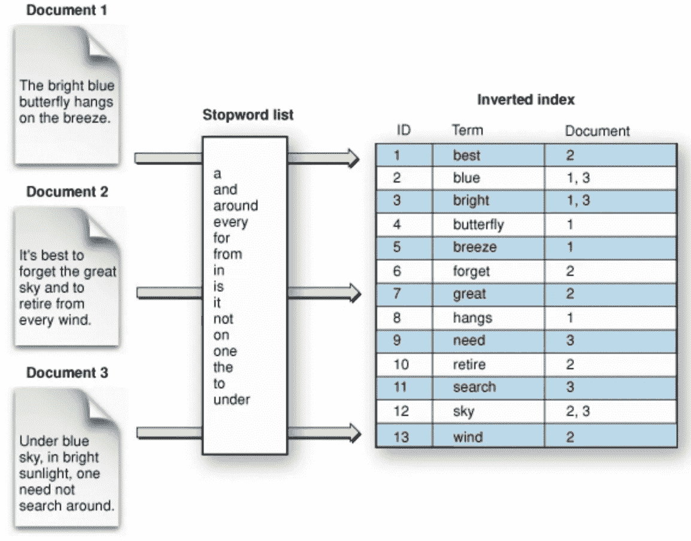
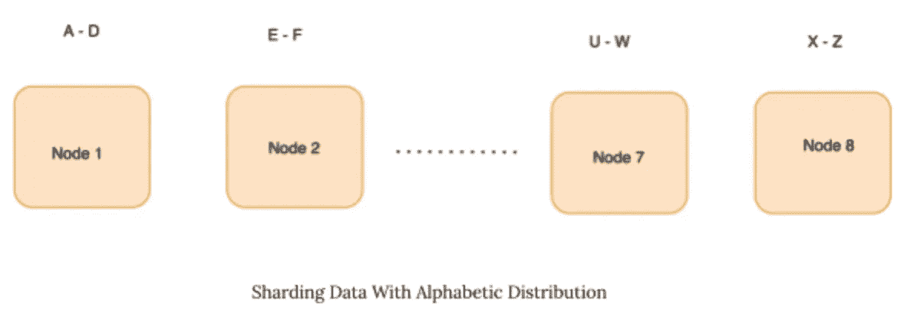
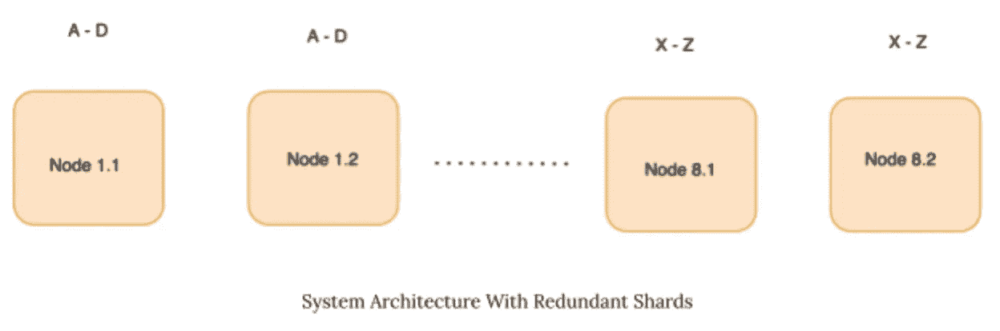
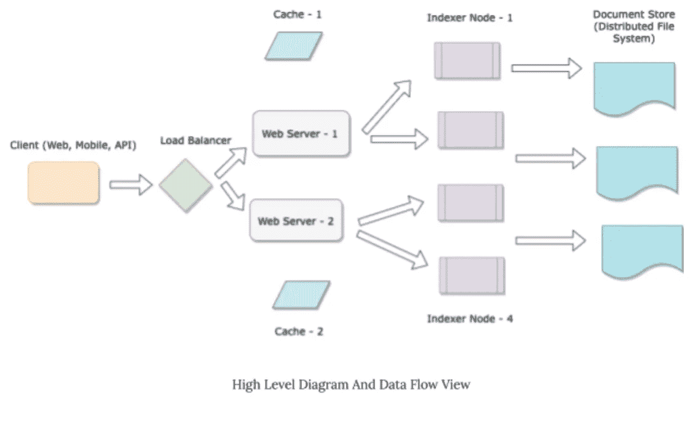

# 如何从头开始设计一个自动完成的引擎

> 原文：<https://levelup.gitconnected.com/how-to-design-an-auto-complete-engine-from-scratch-9ff2d0bad06a>

## 方公司的系统设计问题。

你有兴趣了解搜索引擎的设计如何在亚马逊、Medium 和维基百科等热门网站上工作吗？这篇博文从头开始讨论了自动完成搜索引擎的设计和实现。


来源:[像素](https://www.pexels.com/photo/coffee-apple-iphone-smartphone-38547/)

# 功能需求

系统应能满足以下功能要求:

1.  从预定义的字符串集合中搜索字符串。
2.  从索引的字符串集合中提供完成。我们需要的匹配类型只是前缀匹配。

为了理解这个需求，让我们假设您有一组所有列出的城市。让我们假设您正在构建一个旅游应用程序，因此您需要返回最常去的城市。下面是一个列表:

*   英国伦敦。
*   法国巴黎。
*   美国纽约市。
*   俄罗斯莫斯科。
*   阿拉伯联合酋长国迪拜。
*   日本东京。
*   新加坡。
*   美国洛杉矶。
*   西班牙巴塞罗那。
*   西班牙马德里。

现在，让我们假设用户键入字母 d。引擎应该给出以下建议:

1.  迪拜，
2.  德里，
3.  大马士革
4.  …..

**注**:这份榜单是按照人气排名的。

如果用户在迪拜输入，引擎应该识别出这是迪拜的城市。

# 非功能性需求

1.  **延迟**:引擎应该在 *10 ms* 内返回结果。
2.  **可伸缩性**:引擎应该能够索引*100 亿个字符串*。
3.  **吞吐量**:引擎应该支持每小时 1000 个请求的 *QPS。*
4.  **可用性**:发动机应经历零停机时间。
5.  **可定制性**:引擎应该是可定制的。
6.  内存+磁盘可用性:我们可以假设有无限多的内存和磁盘可用。

# 每个工程师都应该知道的系统度量

在我们开始解决问题之前，有必要了解最常见的系统指标。这些措施如下:

1.  L1 高速缓存参考:0.5 ns
2.  访问主存储器的延迟:100 ns
3.  访问固态硬盘的延迟:100 us
4.  访问硬盘的延迟:10 毫秒
5.  同一数据中心内的往返:500 美元
6.  1 台 web 服务器的最大内存:256 GB

# 数据结构设计

让我们首先从搜索索引的数据结构设计开始。通常，人们可以使用以下两种不同的数据结构来搜索信息:

**倒排索引**:倒排索引，也称为发布列表或倒排文件，是一种将内容(如文字或数字)映射到其在表格中的位置的索引存储方案。让我们举下面的例子。在下图中，我们可以看到一个单词列表，这些单词都是从各自的文档中派生出来的。每个单词(也称为术语)都有一个相关的 ID 和文档号。

虽然倒排索引有利于搜索完整的术语，但它们不适用于前缀、后缀匹配等。



**二叉查找树:** [一个二叉查找树是很好理解的数据结构](https://www.geeksforgeeks.org/binary-search-tree-data-structure/)。它具有以下属性:

1.  每个节点有两个子节点。
2.  节点的左子树只包含键小于该节点键的节点。
3.  节点右边的子树只包含键比节点的键更重要的节点。
4.  可以使用字符串的字典序比较来定义比较。
    在平衡良好的二叉查找树中的搜索复杂度将是 *M * log N* ，其中 M 是最长字符串的长度，N 是树中的键的数量。

**Trie**:[Trie 是一种高效的信息检索数据结构](https://www.geeksforgeeks.org/trie-insert-and-search/)。尝试建立在与树相同的思想之上，但是为存储信息进行了优化，以便更快地检索。搜索复杂度可以降低到最佳限度(即密钥大小)。trie 在时间复杂度上进行折衷(即，降低时间复杂度)，但是需要更大的空间量(增加空间复杂度)。

当比较数据结构时，树状数据结构比散列表更好地支持前缀和精确搜索语义。当我们使用 trie 树时，trie 树在时间复杂度方面变得高效。

因此，我们将采用树状数据结构。

# 内存与磁盘结构

关于系统设计，下一个问题是我们是否应该将这个数据结构全部保存在内存中，还是保存在磁盘上，还是保存在内存中。

让我们通过以下计算来更好地理解这一点:

**内存需求**

假设每个节点代表一个城市。一个城市会有一些与之相关联的元数据。它可能是城市的名称、同义词、国家、地理位置、人口、受欢迎程度等。假设我们有 100 个*字节*的数据。考虑到 100 亿个字符串，这将是 1 TB 的数据。我们可以有把握地假设，我们无法将它保存在一个现成的 web 服务器中。我们假设一个典型的现成 web 服务器有 *256 GB* 的内存容量。

**数据布局**

1.  **所有数据都在磁盘上:**在这个设计中，我们将假设所有数据都在磁盘上(为了便于论证)。让我们假设一个典型的访问模式看起来像至少两次不同的磁盘寻道。我假设我们正在检索十个结果。乐观地说，它们分布在两个独立的页面上。如果页面不在内存缓冲区中并且不连续，这通常需要 20 ms。如果磁盘试图遵循非常随机的模式，尾部延迟将会很高。考虑到我们 10 ms 的查找延迟要求，这似乎是不可行的。
2.  **混合存储中的数据**:这种设计假设 20%的数据保存在内存中，80%驻留在磁盘上。考虑到大多数热数据(即频繁访问的数据)可以缓存在内存中，这种技术可能更具成本效益。尾部延迟仍将涉及对磁盘的访问，这可能会导致 10 毫秒以上的访问延迟。

**所有数据都在内存中**:在这个设计中，我们假设所有数据都在内存中。访问成本很低，即每个存储器引用需要 10–100 ns。因此，瓶颈从数据访问转移到了计算(< 10ms)。假设我们有无限量的可用内存(我们将讨论如何实现这一点)，我们应该将所有数据保存在内存中。

# 数据结构设计

现在让我们设计如下的核心数据结构:

```
struct NonLeafNode  {
    vector<Node *> children;
    String value;
};struct LeafNode  {
    vector<Node *> children;
    String value;
    // Metadata
    double popularity;
    String country;
    double population; 
    ..........
};
```

# 系统结构

## 可量测性

接下来让我们讨论系统应该如何扩展。对于要扩展到 1 TB 内存的应用程序，我们需要支持可伸缩性。我们将采用水平缩放而非垂直缩放([点击](https://docs.google.com/document/d/1XZv-Dlz8Tzi_fxbI-tY7yRKVcmhlXqQ7haWIab7GIHg/edit#heading=h.20ydeno1hf73)了解更多缩放信息)。

**垂直缩放:**

**优点**:

*   易于实施。

**缺点**:

*   规模上的限制。
*   随着尺寸的增加，硬件变得复杂和昂贵。

**水平缩放:**

**优点**:

*   提供无限的伸缩性(通过弹性)。
*   提供更多容错能力(通过冗余)。
*   更便宜(可以用现成的硬件实现)。
*   无需依赖复杂的专用硬件。

**缺点**:

*   介绍实现的复杂性。

通过水平扩展，我们将数据划分到多个服务器中。假设我们需要存储 1 TB 的数据，每台服务器有 256 GB 的内存。假设 trie 的开销是 50%。我们需要将近 2 TB 的内存。这相当于 8 台网络服务器。

## 分片

为了在八个节点之间划分数据，我们将使用分片([在这里阅读更多关于分片的内容](https://docs.google.com/document/d/1XZv-Dlz8Tzi_fxbI-tY7yRKVcmhlXqQ7haWIab7GIHg/edit#heading=h.xrt06eedfkqb))。有几种方法可以分割数据。我们将在下一节讨论每种方法的优缺点:

**按字母顺序分割数据:**我们可以使用的最基本的方案是按字母顺序分割数据。下图显示了数据在节点间的分布情况。这种方案的优点是实现简单。这种方案的缺点是会对特定节点造成过大的压力。保存带有 A、R 或 S 的数据的节点将有许多被索引的字符串。这是由于英语中数据分布的偏斜。



**随机分割数据**:在这种方法中，我们对每个节点进行统一采样，并使用类似随机树的方法存储数据。主要思想是随机分布数据(使用预定义的哈希函数)并确保负载均匀分布。即使负载保持均匀分布，这种方法也有某些缺点。如果服务器出现故障，所有数据都需要重新分发，这可能会导致上游中断。

**使用一致散列法对数据进行分片:**一致散列法([博客](https://medium.com/system-design-blog/consistent-hashing-b9134c8a9062)，[论文](https://dl.acm.org/doi/abs/10.1145/258533.258660))是一种使用随机树进行分布的技术，但在数据分布方面采用了稍微不同的方法。像其他哈希方案一样，一致哈希将一组项目分配给桶，以便每个桶接收大致相同数量的项目。但是，与标准哈希方案不同，桶中的小变化只会对桶的项目分配产生微小的变化。一致散列通过构建“*范围散列函数来实现这一点*一个范围散列函数确保*平滑分布*，一个*键的低分布*，以及一个*每个桶的低负载*。(*注:我们将在另一篇博客*中讨论一致散列背后的直觉)。

在这里提到的方案中，一致散列是最健壮和性能最好的方案，并且被普遍使用。

## 有效性

保留所有内存的一个问题是，如果服务器停机，一部分数据可能会在很长一段时间内不可用。这是因为从数据源(从磁盘)读取数据并在内存中构建索引是一个缓慢的过程。用户将不会访问当前不在内存中的数据部分。

*在设计中引入冗余度*

为了确保高可用性，我们在系统中引入了冗余。每个碎片现在出现在两个不同的节点上，而不是一个节点上。



让我们看看上面的图像。我们可以看到，每个碎片(例如，A-D，X- Z)现在出现在两个节点上，而不是一个。

***优点*** :

*   这种设计确保了即使其中一个碎片不可用，另一个碎片也可以满足请求。
*   在一个节点压力很大的情况下，请求可以被重定向到同一个 shard。

***弊*** :

*   这增加了系统的存储器需求。
*   这引入了额外的实现复杂性(分片路由、分片数据的同步等。).

# 高级图表和数据流

这里我们讨论搜索引擎的高级视图和数据流图。



该系统的主要组件如下:

1.  **客户端:**客户端由 Web 应用、移动应用或访问后端服务的 API 端点组成。
2.  **负载平衡器**:负载平衡器用于将请求路由到 web 服务器，并平衡两个服务之间的负载。
3.  **Web 服务器**:Web 服务器编码业务逻辑。在自动完成引擎中，web 服务器将执行以下操作:

—验证请求。

—检查缓存是否已经缓存了请求的结果。如果没有，点击索引器节点。

—查找应该在其上路由请求的索引器节点。

—向正确的节点集发送请求(使用一致的哈希方案)。

—如果请求精确匹配，只需查找一个节点。

—如果请求前缀匹配，可以查找一个或两个节点。

—聚合来自索引器节点的结果，通过向用户个性化这些结果来对它们进行排序，并将结果发送回客户端。

1.  **缓存**:缓存间歇存储来自索引器节点的中间结果。我们可能有内存缓存(比如 *Memcached* )或者支持持久化的磁盘缓存( *Redis* )。
2.  **索引器节点**:索引器节点存储分布式 trie 数据结构。我们的设计有 16 个节点，可容纳 1 TB 的数据(冗余系数为 2)。索引器节点使用分布式文件存储进行备份。如果一个索引器节点关闭，集群管理器(图中未显示)将重启该节点。然后，节点将在重新启动时重新索引分布式文件存储中的所有数据。
3.  **分布式文件存储**:存储实际数据(即 100 亿个字符串)。这可能是使用亚马逊的 S3 构建的。

对于面试的范围来说，这是一个足够好的与面试官讨论的话题。需要涵盖一些主题来完成访谈的范围。这些措施如下:

I .客户端和网络服务器、网络服务器和索引器节点之间的 API 接口。

二。解决挑战，例如获得前 10 个匹配、空字符串的自动完成、处理节点间的故障转移等。

# 参考

1.  [每个程序员都应该知道的延迟数字 GitHub](https://gist.github.com/jboner/2841832)
2.  [Trie |(插入并搜索)](https://www.geeksforgeeks.org/trie-insert-and-search/)
3.  [二叉查找树](https://www.geeksforgeeks.org/binary-search-tree-data-structure/)
4.  [数据库分片。数据库分片是…的过程|作者 Vivek Kumar Singh |系统设计博客](https://medium.com/system-design-blog/database-sharding-69f3f4bd96db)
5.  [系统设计:分布式系统的挑战(可用性)](https://ravisystemdesign.substack.com/p/system-design-challenges-in-distributed)
6.  [系统设计:基础](https://ravisystemdesign.substack.com/p/system-design-fundamentals)