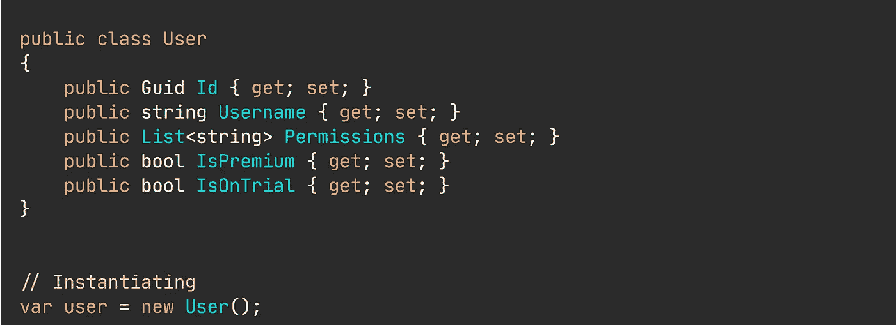
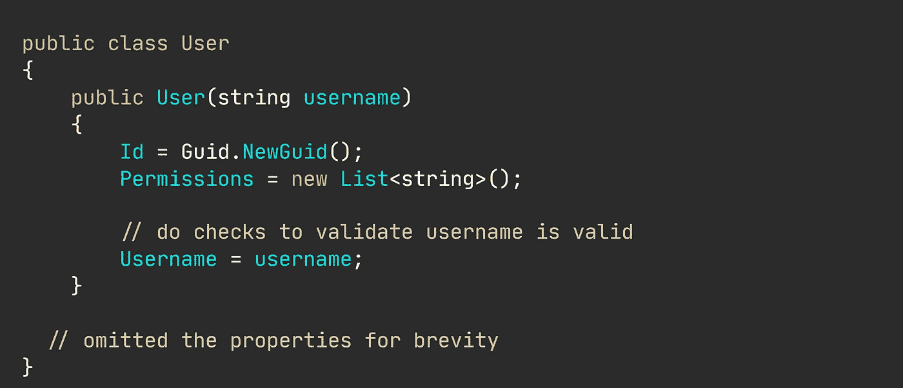

# 如何设计令人愉快的课堂(举例)

> 原文：<https://levelup.gitconnected.com/how-to-design-classes-that-are-pleasant-to-work-with-with-examples-8e156f7fbbe9>

## 实用开发技巧

## 良好的开发者体验很大程度上取决于软件开发中良好设计的特征。

让我们超越一般的、典型的特征，例如“高内聚”、“低耦合”和“改变的单一原因”。

当然，这些都是优秀班级的三个特征。

但是，这可能不是你读到的第一篇关于这个话题的文章。与所有其他科技作家一起哼唱，创作同样的普通文章是令人厌倦和缺乏灵感的。所以，让我来介绍一下好类的其他优点。

我收集了一些自己的创建优质课堂的指导方针。即将到来的指南是基于我自己做 20 多个客户端软件项目的经验——当然也是从比我好得多的开发人员那里学到的。

这些项目的复杂性变化很大，从处理敏感的公民健康和个人数据的简单 web 应用程序到开发需要国家警察安全许可的后端应用程序，再到开发银行和公共房地产管理中的微服务架构。

🔔[想要更多这样的文章吗？在这里签名。](https://nmillard.medium.com/subscribe)

# 我创建更好班级的指导原则。

每一条指导原则都可以自成一篇完整的文章，因此，不用说，我可能不会涵盖每个方面，而是旨在简明扼要地展示该原则。

## 不能在无效状态下实例化好的类。

我反复发现允许在完全无效的状态下构造的类，这就让我来决定以后应该设置什么属性才能让对象工作。

设计糟糕的用户类。

这是一个糟糕的设计。除了“我想快速编码*狗屎*”之外，真的没有别的解释了或者你正在做一个抛弃式的概念验证，我们都知道一旦可行性-生存力-合意性(FVD)分析完成，它就会被推广到生产中。

如果您希望开发人员正确使用您的类，那么就不要在实例化时允许无效状态。

如示例所示，拥有一个默认的构造函数允许使用`Id`、`Username`等。为空，这显然不是我们想要的状态。此外，尝试添加新的权限会导致空指针异常，因为列表尚未初始化。

修复问题如下所示。

更好的用户类设计。

## 它没有公共设置器。

一个伟大的类隐藏了它的内部。它不允许别人轻易改变它的状态。优秀的类公开了对类上下文和它所代表的内容有意义的方法。

另一方面，坏类除了典型的 setters 之外没有其他方法，并且允许每个属性或字段发生变异。

请注意，如果您使用对象关系映射器(ORM)库，隐藏内部可能会成为一个问题，因为它需要读取声明的属性和字段。但是在我看来，你不应该仅仅为了取悦外部框架而牺牲你的设计。

## 它不声明类型识别属性。

我想，这是一个奇怪的原则。但是请耐心听我说。

我经常遇到这样的类，它们的属性告诉我一些关于其类型的信息，比如前面的`User`类例子。

该类定义了一个布尔属性`IsPremium`。

如果是真的，那么它是一个高级用户。当企业突然想要一个免费增值用户时会发生什么？那么，我们是不是又加上了另一个能说明类型的属性`IsFreemium`，要求我们传播这样的知识:要么是真的，要么是假的，但不能两者都是真的？

在这一点上，我们几乎是在试图拼凑一个仿类型的系统，而不是使用语言本身自带的系统。

我们可以把乱七八糟的`User`类变成下面这样。

当然，这意味着更多的代码、类和整个系统的复杂性，但是现在更容易理解用户及其不同的类型。

猜谜游戏的时代已经一去不复返了。

🔔想要更多这样的文章吗？在这里签名。

## 它不访问环境变量。

访问一个类中的环境变量，或者将一个字典(比如说`<string, string>`的映射)传递给构造函数，对于未来的开发人员来说是一件痛苦的事情。

花点时间分析一下这个例子的所有问题。
顺便说一下，当应用程序启动时，`IConfiguration`会被应用程序设置填充。

不透明设置。

这个类需要什么来运行现在完全不清楚。你只能猜测它需要什么配置。您必须通读类代码，以了解如何正确地实例化该类。

幸运的是，解决方案非常简单。创建一个`EmailSender`依赖的特定设置类。

很容易推断出该类所需的设置。

## 这是愚蠢的简单。

如果你读过我的[“用命令和处理程序替换 If-Else”](https://medium.com/p/527e0abe2147)，那么你知道我是简单类的巨大支持者。

简单的意思是，这个类只有一个公共方法。这显然并不总是所希望的。但是请听我说完。

您可能已经使用过所谓的“服务”类、“管理器”、“处理程序”以及开发人员想出的任何不明确的名称。

现在，考虑这个服务类(又名逻辑垃圾站)的例子。

逻辑垃圾箱。

服务类通常是很好的重构候选者。上面的例子可能更糟糕。我曾经做过一个应用，它的用户服务有 21 个(！)构造函数参数。

所以，回到这里显示的问题。一个类，当它成长时，也需要新的依赖，展现出我所创造的“依赖地狱”。依赖地狱也可能导致[分支耦合依赖](https://medium.com/p/d55833e17e74)。

使用大量协作对象的类也有很高的扇出复杂度分数。也就是说，要使用或测试这个类，您需要构建几个其他的类。

我通常重构为命令和查询类。这是通过查看服务类提供了哪些独特的功能，哪些依赖关系在一起，然后将类分成多个更小且易于测试的类来实现的。

单一方法类。

现在对每个类进行推理要比让一个类做所有的事情容易得多。

## 它遵守显式约束。

没有什么比没有约束更令人沮丧的了。最好的情况是，你会花太多时间去实现错误的事情。

如果您曾经遇到过允许您做出假设的用户故事，那么您需要直接回到业务分析师或产品负责人那里，请求澄清。

假设您有一个用户故事，要求您用用户名实现一个用户类。如果没有太多的思考，你可能会以这样毫无意义的事情结束。

太可怕了。

对，所以，从这个类我们可以推断出用户可能有一个用户名，但也可能是空的。因为用户名只是一个普通的字符串，所以值可以是从点“.”开始的任何值转换为 2GB 的 JSON 字符串。想象一下在前端显示…

没有约束会让你基于错误的假设和猜测去做蠢事。

现在，让我们去另一端，那里有好事发生。也就是说，有了您的类需要实现的明确定义的约束。

用户*必须*有一个用户名，不能少于 3 个或超过 50 个字母字符。

试图传递一个不正确的值现在会左右抛出。就像我们喜欢的那样。

## 很容易测试。

不需要隐性知识——不需要仅仅为了测试它的一个方法而实例化大量的其他协作对象。

一个好的类设计允许平滑、无痛的测试。

> 好的课程努力消除尴尬的测试。

现在，回到之前的例子，`EmailSender`。该类的初始实现使得测试变得很困难。

尴尬的测试安排步骤。

拥有一个依赖于不透明值的测试，比如那些存储在环境中的值，是非常难以推理的。

下面举例说明了一种更好的方法，要求您设置值。

更好的测试安排步骤。

一切都清晰可见。

## 恰如其分的评论。

没错。评论。你需要它们，正如我在本文中已经提到的[。](/yes-your-code-need-comments-a96348bf3fb7)

我认为自我解释代码很大程度上是一个糟糕的笑话。虽然这是一个美好的愿望。

我想反对使用注释的主要理由是你需要维护代码和注释，而代码已经描述了正在发生的事情。

注释不是用来描述*代码做什么*，它们是用来提供上下文和解释*为什么*一些代码存在。

🔔想要更多这样的文章吗？在这里签名。

# 离别词。

我希望这些指导方针对你有所帮助，也许能激发你的思考，让你的班级设计游戏更上一层楼。

这里的例子显然是非常做作的，不像生产代码，但是关于*如何*和*为什么*的想法保持不变，无论是否生产。

即使你只是在做爱好项目，也要努力坚持良好的实践。常言道，训练时多流汗，战争时少流血。

# 让我们保持联系！

[点击这里](https://nmillard.medium.com/subscribe)订阅时事通讯，获取类似文章的通知，并查看 [*YouTube 频道(@Nicklas Millard)*](https://www.youtube.com/channel/UCaUy83EAkVdXsZjF3xGSvMw) *。*

在 LinkedIn 上联系。