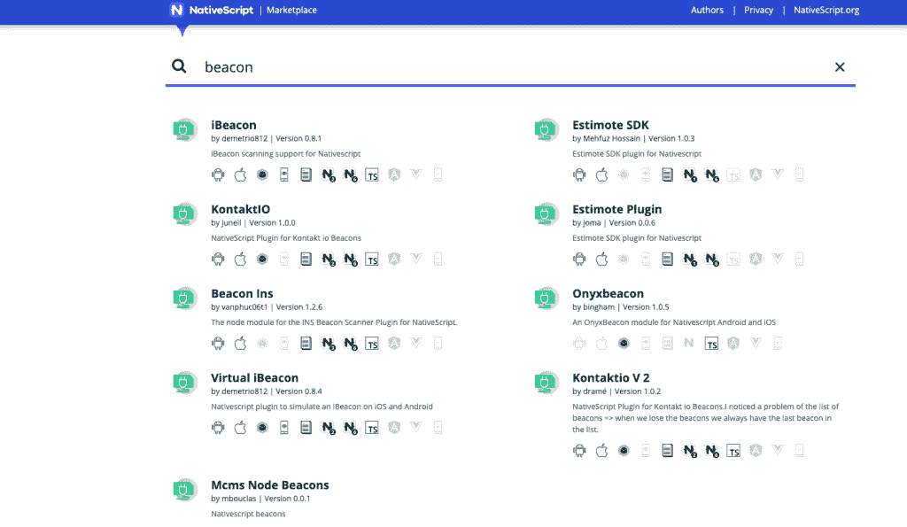

# 如何在 NativeScript-Angular 应用程序中检测 iBeacons？

> 原文：<https://levelup.gitconnected.com/how-to-detect-ibeacons-in-a-nativescript-angular-app-8d2c557b26dd>

在我的工作中，我们不断想办法改善用户体验。我正在做的事情之一是让我们的移动应用程序能够在用户靠近我们的特定房间时意识到用户的存在，并自动为用户办理入住手续。对于这个签到功能，我找到了一个 NativeScript 插件来检测使用我的 android 手机的 iBeacons。在这篇文章中，我将向您展示一个样本 NativeScript-Angular 应用程序中的一些代码，以扫描 iBeacons。


图片来自[皮克斯拜](https://pixabay.com/?utm_source=link-attribution&utm_medium=referral&utm_campaign=image&utm_content=2611199)

# 什么是蓝牙低能量(BLE)信标？

在蓝牙 4.0 之前，通过蓝牙的通信一直是双向的，这意味着设备可以发射和接收蓝牙信号。例如，在我们的日常生活中，当我们将音乐从智能手机无线传输到蓝牙耳机，或将手机连接到汽车的立体声系统时，我们会使用蓝牙。2010 年，蓝牙 4.0 问世，使用低能耗的单向通信成为可能，并开辟了创新的使用案例，如邻近检测、资产跟踪和室内寻路。

BLE 信标是一种利用蓝牙低能量不断发射信号的小装置(BLE)。您可能会在各种外形规格、大型零售店以及嵌入在 WIFI 接入点和智能手机等其他设备中发现它们。电池供电的信标可能持续几年，这取决于不同的因素，如配置、电池类型和制造。例如，两年前我从 Estimote 获得了一个信标开发包，到今天为止，这些信标中的每一个仍然有 70%的剩余电量。广告间隔越频繁和/或信号强度越强，信标消耗的能量就越多。

# 什么是 iBeacon？

如果我们不理解数据的含义，来自 BLE 信标的数据包是没有帮助的。然而，如果制造商想出自己的方法将数据编码到 BLE 信标中，开发者将很难做到这一点。苹果公司想出了一种标准的方法，通过给信标分配 uuid、major、mior 和 tx power 等层次 id，允许信标提供上下文信息，这是有道理的。

**UUID** : 16 字节字符串，用于标识属于一个大组的一组信标。

**Major** : 2 字节字符串，用于标识属于可由 UUID 识别的大组内的信标子集的一组信标。

**Minor** : 2 字节字符串，用于标识可由 major id 识别的组内的单个信标信标。

**Tx 功率**:距离其位置 1 米远的信标发出的信号强度。

iBeacon 已经成为 Android 和 iOS 都支持的协议。顺便提一下，Eddystone 是 Google 开发的另一个使用 BLE 进行通信的协议。Eddystone 兼容信标传输数据的格式与 iBeacon 不同。然而，在这篇文章中，我们不打算讨论 Eddystone。

# 在带角度的 NativeScript 应用程序中检测 iBeacon。

iOS 和 Android SDKs 都原生支持对 iBeacons 的扫描。对于 NativeScript，您可以使用插件或自己编写插件。幸运的是，我找到了一个现有的插件，demetrio812 的 [iBeacon 插件，它可以工作，这就是我正在使用的。](https://market.nativescript.org/plugins/nativescript-ibeacon)



NativeScript iBeacon 插件

如果您转到插件的网页，您可以看到在您的 NativeScript 应用程序中安装和使用它的说明。在很大程度上，该文档提供了足够好的信息来开始。我能够快速原型化一个简单的 NativeScript-Angular 项目，并使用该插件扫描 iBeacons。下面我展示了我的 app.component 中的示例代码:

```
import { Component, OnInit, OnDestroy } from "@angular/core";
import { NativescriptIbeacon } from 'nativescript-ibeacon';
import { BeaconLocationOptions, BeaconLocationOptionsIOSAuthType,
    BeaconLocationOptionsAndroidAuthType, BeaconRegion, Beacon } from 'nativescript-ibeacon/nativescript-ibeacon.common';

@Component({
    selector: "ns-app",
    templateUrl: "./app.component.html"
})
export class AppComponent implements OnInit, OnDestroy {

    private _nativescriptIbeacon;
    private _region;

    constructor () {
        var myIbeacon = {
            id: "My iBeacon in conference room of Office A ",
            proximityUUID: "B9407F30-F5F8-466E-AFF9-25556B57FE6D",
            major: 17744,
            minor: 28116
        }
        this._region = new BeaconRegion(myIbeacon.id, myIbeacon.proximityUUID, myIbeacon.major, myIbeacon.minor);

        let options: BeaconLocationOptions = {
            iOSAuthorisationType: BeaconLocationOptionsIOSAuthType.Always,
            androidAuthorisationType: BeaconLocationOptionsAndroidAuthType.Fine,
            androidAuthorisationDescription: "Location permission needed"
        };

        this._nativescriptIbeacon = new NativescriptIbeacon(this.beaconCallback(), options);

        if (!this._nativescriptIbeacon.isAuthorised()) {
            console.log("NOT Authorised");
            this._nativescriptIbeacon.requestAuthorization()
                .then(() => {
                    console.log("Authorised by the user");
                    this._nativescriptIbeacon.bind();

                }, (e) => {
                    console.log("Authorisation denied by the user");
                })
        } else {
            console.log("Already authorised");
            this._nativescriptIbeacon.bind();
        }
    }

    ngOnDestroy(): void {
        if (this._nativescriptIbeacon) {
            this._nativescriptIbeacon.unbind();
        }
    }

    beaconCallback() {
        var self = this;
        return {
            onBeaconManagerReady(): void {
                // start ranging and/or monitoring only when the beacon manager is ready

                self._nativescriptIbeacon.startRanging(self._region);
                self._nativescriptIbeacon.startMonitoring(self._region);
            },
            didRangeBeaconsInRegion: function(region: BeaconRegion, beacons: Beacon[]) {
                console.log(JSON.stringify(beacons));
            },
            didFailRangingBeaconsInRegion: function(region: BeaconRegion, errorCode: number, errorDescription: string) {
                console.error(`Failed to find beacons with errorCode: ${errorCode} and description:
                ${errorDescription}`);
            },
            didEnterRegion: function(region: BeaconRegion) {
                console.log("Did enter region called");
            },
            didExitRegion: function(region: BeaconRegion) {
                console.log("Did exit region called.");
            }
        }
    }

    ngOnInit(): void {

    }
}
```

在很大程度上，代码很简单，并且基于插件的文档。但是，您可能需要注意一些事情:

*   `BeaconRegion`封装您为扫描信标定义的元数据。您可以扫描具有相同 uuid 的所有信标。还可以通过提供主要 id 将扫描范围缩小到特定的组，通过提供次要 id 将扫描范围进一步缩小到特定的信标。
*   在 android 设备上，确保您的应用程序能够访问位置。您可以通过进入设置->应用-> {您的应用}-->权限并启用**位置**来实现。
*   在 `beaconCallback()`方法中，我使用闭包来捕获对我的 app 组件的引用。这是因为该方法是一个回调，这意味着稍后调用它的对象不是我的应用程序组件，而是插件中的一些对象。因此，如果我使用 **this** 关键字来访问我的应用程序组件中定义的对象，我会因为访问未定义对象的属性而出错。这只是 JavaScript。

这是我在控制台中得到的内容，它让我知道当我在 android 设备上运行该应用程序时，事情是可行的:

```
onBeaconServiceConnect JS: startRanging JS: startRangingBeaconsInRegion JS: startMonitoring JS: didDetermineStateForRegion JS: 1 JS: id1: b9407f30-f5f8-466e-aff9-25556b57fe6d id2: 17744 id3: 28116 JS: [{"proximityUUID":"b9407f30-f5f8-466e-aff9-25556b57fe6d","major":17744,"minor":28116,"distance_proximity":0.13055123127828835,"rssi":-60,"txPower_accuracy":-76}]
```

就是这样。感谢阅读和快乐编码。

# 参考

[蓝牙低能耗信标](https://en.wikipedia.org/wiki/Bluetooth_low_energy_beacon)

[确定与 ibeacon 设备的接近度](https://developer.apple.com/documentation/corelocation/determining_the_proximity_to_an_ibeacon_device) [nativescript-ibeacon 插件](https://github.com/demetrio812/nativescript-ibeacon)

*原载于 2020 年 5 月 4 日 https://www.taithienbo.com*[](https://www.taithienbo.com/how-to-detect-ibeacons-in-a-nativescript-angular-app/)**。**