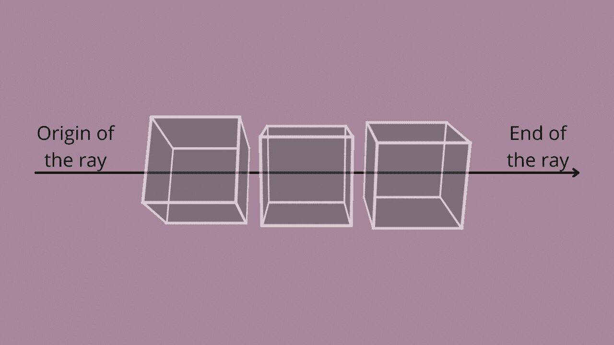
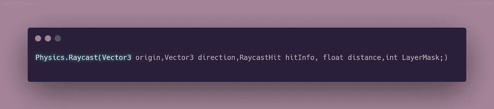
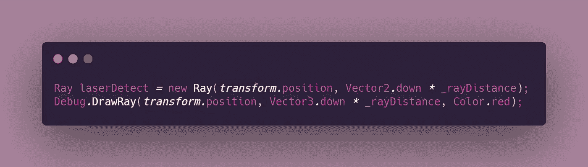
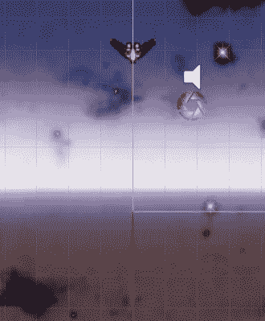

# Unity2D 中光线投射的介绍

> 原文：<https://levelup.gitconnected.com/how-to-detect-object-positions-using-raycast-in-unity-77d6cbd50006>

## 太空射手—第二阶段:核心编程挑战

**目标**:学习 Raycast 的基本概念和语法，以及如何调试。

# 什么是光线投射？

[**光线投射**](https://docs.unity3d.com/ScriptReference/Physics.Raycast.html) 广泛应用于视频游戏开发中，用于各种目的，包括计算玩家或 AI 的视线，确定投射物的轨迹，以及创建激光。光线投射是从 3D 或 2D 空间中的某一点沿某一方向传播的光线。

# 语法:

*   **原点**:世界空间中的一个现存点。例如，如果你的玩家有一个武器物体，比如一把枪，原点可以放在枪管上。
*   **方向**:决定光线投射的方向。
*   **碰撞信息:**该信息存储了碰撞器的信息，这样代码就能够检测出哪些物体被射线击中了。

## 以下变量是可选的，尽管非常有用。

*   **距离**:光线的长度。如果没有指定长度，代码将默认其值为 infinite，因此，射线将在检测到任何可及的事物时延伸。
*   **图层蒙版**:Unity 图层系统中的特定图层。通过使用层遮罩，可以将对象指定给该层，以便光线投射忽略它们。这在使用旨在影响特定物体的系统时非常有用，例如玩家的攻击只能攻击敌人。

> **注**:我之前在 [**如何检测玩家**](https://medium.com/geekculture/how-to-detect-colliders-surrounding-the-player-ebdcadf3ba61) **周围的对撞机中讨论过如何分配图层蒙版。**

# 调试光线投射

一条射线可以通过 [Draw 轻松调试。光线](https://docs.unity3d.com/ScriptReference/Debug.DrawRay.html)——它允许我们绘制光线，并使其在场景视图中可见，如果游戏视图中启用了 gizmo 绘制，则在游戏中也可见。

## 语法:

在本例中，DrawRay 使用与 laserDetect 射线相同的方向和距离变量。这允许 gizmo 明显地绘制相同的光线，以便我们测试光线结构的适当性，并相应地修改它。此外，您可以为光线添加颜色，使其在游戏环境中更加突出。

在下图中，你可以看到在场景视图中绘制的光线。

本文是 GameDevHQ 的一系列核心编程挑战的一部分。在接下来的文章中，我将会看看如何使用光线投射来创造一个可以侦测玩家攻击并躲避它们的敌人！