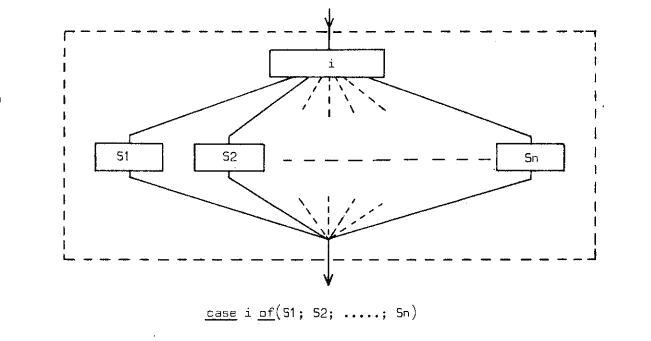

# 如何更好地掌握程序结构

> 原文：<https://levelup.gitconnected.com/how-to-develop-better-program-structure-3a57f48bf971>

## 改善程序结构的几个简单技巧

里卡多·戈麦斯·安吉尔在 [Unsplash](https://unsplash.com?utm_source=medium&utm_medium=referral) 上的照片

解决计算问题需要编写程序。程序的布局取决于程序员。程序的执行依赖于计算机，我们无法控制执行。

没有人喜欢纠结的代码，和加班加点弄清楚它是做什么的。您应该编写结构化代码，对代码有清晰的理解。

结构化程序可以理解代码，这导致了结构化编程。我们能做什么来组织我们的程序？让我们继续展开这个话题。

## 分解

> 我们能做什么来缩短静态程序文本和相应的时间计算之间的概念差距？埃德格·w·迪杰斯特拉

学习计算机科学，我们知道程序是无用的，如果不执行。代码是*‘程序文本’。*该计划实现的目标是我们所关心的。

我们如何近距离观察这个程序的功能？我们可以把它分解成子状态。然后我们可以比较子状态，看看结果。

> 怎样才能分解程序？

有三类顺序分解:

*   *串联*

[第 22 页。—子状态的连接—结构化编程注释](https://www.cs.utexas.edu/users/EWD/ewd02xx/EWD249.PDF)

*   *选择*

[第 23 页。—结构化编程的选择注释](https://www.cs.utexas.edu/users/EWD/ewd02xx/EWD249.PDF)

*   *重复*

[第 25 页。——重复——结构化编程笔记](https://www.cs.utexas.edu/users/EWD/ewd02xx/EWD249.PDF)

把它分解成一系列的动作，我们可以对每一个动作进行推理。

## 枚举子状态

列举子状态来推理 if-else 和 switch-case 块。拥有两个或多个状态让我们更容易分解程序。将程序分解成子状态创造了一种万无一失的测试方法。

[第 24 页。——结构化编程注释](https://www.cs.utexas.edu/users/EWD/ewd02xx/EWD249.PDF)

## 归纳思维

数学归纳法有助于解决重复问题。取几个案例并浏览程序可以揭示子状态。然后，我们可以将子状态推理为前一个子状态的继承者。子状态( *S1* )由子状态( *S0* )上完成的子动作( *S* )生成。

## 单一入口—单一出口点

这些程序块按顺序构建结构化程序。我们可以将程序块连接在一起，创建结构化的程序。

可以注意到，虚线框中有一个入口和一个出口。有了这些，我们就可以构建一个结构化的块拓扑。避免单入口和单出口块会导致非结构化代码。

## 结论

我将在最后留下参考资料，这样您可以更深入地了解此事。

对任何代码进行逐步分解都会有所帮助。这将创建您可以测试、推理和维护的结构化程序。为结构化程序创建测试更加容易。

许多难以测试的入口点是没有结构的程序的特征。我们都使用过这种代码。测试是不存在的，因为测试并不是一件小事。

在这个问题上，我将引用伟大的计算机科学家埃德格的话来结束我的发言:

> 这个故事的寓意是，当我们承认我们有责任控制计算(理智上！)通过程序文本唤起它们，然后我们应该谦卑地将自己限制在最系统的排序机制，确保“通过计算的进展”以最直接的方式映射到“通过文本的进展”。埃德格·w·迪杰斯特拉

## 资源:

埃德加·w·迪杰斯特拉的笔记。

[关于换垛的问题](https://softwareengineering.stackexchange.com/questions/118703/where-did-the-notion-of-one-return-only-come-from)