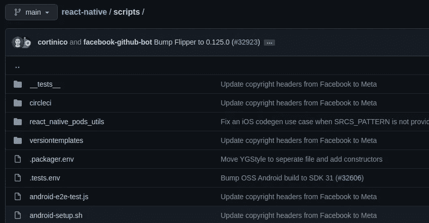

# 如何用 DevOps 更快的开发软件

> 原文：<https://levelup.gitconnected.com/how-to-develop-software-10x-faster-with-devops-ee43ca6d20af>

## 如果你不执行 DevOps 原则，软件开发会变得太慢


由[沙敏·哈基](https://unsplash.com/@haky?utm_source=unsplash&utm_medium=referral&utm_content=creditCopyText)在 [Unsplash](https://unsplash.com/s/photos/programming?utm_source=unsplash&utm_medium=referral&utm_content=creditCopyText) 上拍摄，由 Canva 编辑

程序员总是努力通过各种活动来提高他们的生产力，例如学习 Unix 终端命令、设置自定义键盘快捷键和自动化手动任务。这些生产力助推器帮助他们节省日常编程时间。同时，DevOps 原则通过自动化软件开发过程帮助我们提高整个软件开发团队的生产力。

DevOps 不仅仅是通过持续集成(CI)和持续交付(CD)实现自动化部署，它还为您提供了一套适用于整个软件开发生命周期(SDLC)的生产力实践。换句话说，您可以使用 DevOps-first 架构高效地规划、设计、构建、测试、部署和维护软件。

我们确实不能立即将 DevOps 框架引入并插入到我们的软件系统中——我们必须遵循一步一步的方法来实现 DevOps 框架。在这个故事中，我将解释如何实现一个实用的 DevOps 框架，以 10 倍的速度开发高质量的软件！

# 首先自动化开发人员的活动

任何软件开发团队都可以集成 DevOps 概念，但是我们从哪里开始呢？没有代码库就没有软件系统，所以本地开发环境是放置 DevOps 框架基础的最佳位置。识别重复、耗时的手动任务，然后开始使用 Shell 脚本实现自动化。

例如，您可以为项目配置、文件操作、定制构建和各种手动活动创建 Shell 脚本。确保选择正确的脚本语言来编写 Shell 脚本。Bash 非常适合用较少的代码生成 Unix 进程，但是如果您正在编写有点复杂的跨平台自动化脚本，请使用 [Python 或 JavaScript](https://betterprogramming.pub/bash-vs-python-vs-javascript-which-is-better-for-automation-92a277ef49e) 。

许多开源项目保留了`./scripts`目录，用于存储开发人员和 CI/CD 服务器可以执行的自动化脚本。例如，请参见下面 React 原生项目如何维护自动化脚本。



React 原生存储库中的自动化[脚本](https://github.com/facebook/react-native/tree/main/scripts)目录，作者截图

# 为 CI 服务器编写开发人员友好的测试套件

单元测试和自动化测试帮助我们在发布新版本之前识别错误。DevOps 概念激励开发人员自动化测试，因此他们可以在每次代码更改时调用测试套件来验证代码库的稳定性和正确性。为开发人员和自动化服务器实现友好灵活的软件测试策略。

我们为一个开源项目构建了一个灵活的集成测试套件(你可以从[这里](https://github.com/neutralinojs/neutralinojs/tree/main/spec)看到测试套件的源代码)。我们通常使用以下命令在自动化服务器上运行所有测试用例。

```
npm run test
```

整个测试套件大约需要五分钟才能完成，因此我们为开发人员提供了一种方法，使用下面的命令模式高效地调用测试套件的特定部分。

```
npm run test <module>
```

实现自动化测试，但是为开发人员提供一个快速的本地测试环境。

# 让计算机处理发布/部署过程

基于软件开发项目的类型，每一次代码更改都在两个地方结束:在发布包中或在运行的云服务器中。如果您正在构建软件库、框架或独立应用程序，您的代码库通常会生成一个发布包，您可以将它存储在云包注册表中。例如，如果您正在开发一个节点模块，您可能最终会将它发布到 npm registry 或 GitHub 包中。另一方面，如果您正在使用像 web 应用程序这样的云服务，您必须将您的更改部署到云计算机中。

DevOps 原则激励我们通过让服务器处理来最小化发布过程中的人工工作量。过去，web 开发人员使用 FileZilla FTP 应用程序手动上传每个代码更改。此外，开发人员编译他们的工具/库，并手动将它们作为 ZIP 文件上传到他们的网站。

现在，DevOps 运动支持开发人员只需点击一下鼠标就可以发布几乎任何软件组件。创建自动化发布工作流来发布独立的应用程序、库、框架、web 应用程序、移动应用程序和几乎任何东西，以节省您的宝贵时间。接下来，选择一种舒适的方式来触发您的发布渠道。例如，电子框架团队通过一个名为 [Sudowoodo](https://github.com/electron/governance/blob/main/wg-releases/sudowoodo.md) 的 Slack 机器人触发他们的发布工作流。我通常从 GitHub UI 发布，如下所示。


从 GitHub 触发发布工作流，作者截图

# 超越持续交付，创建 DevOps 循环

持续交付不是 DevOps 驱动的开发工作流的最后阶段——您甚至可以对发布后的活动应用自动化。如果您正在处理一个开源项目，您可能需要用发布消息通知用户。GitHub Actions marketplace 已经有免费的包来调用 Discord Webhooks 和 Slack APIs，所以你甚至可以让你的开发者社区知道每一个版本，而不是手动发布一个消息。

看看我们如何让我们的开发者社区了解一个新版本。


一个不和谐机器人显示了一个新版本的细节，由作者截图。

一个成熟的 DevOps 系统的最后一个阶段是持续改进，在这个阶段你和最终用户共同改进软件系统。由于这个原因，大多数软件产品询问用户反馈并请求用户同意收集崩溃日志。此外，许多基于云的软件系统通过设置云监控工具来保持良好的客户满意度。如今，许多平台甚至通过状态页面公开显示基础设施的正常运行时间。

想象一下，如果最终用户的错误报告变成了一个没有人参与的真正的 sprint 任务，或者如果一个监控工具警报最终作为具有相关优先级的错误报告被分配给开发人员，那么维护软件系统是多么容易。思考超越持续交付阶段。通过自动化加快发布后活动和软件维护相关活动。通过创建 DevOps 循环，将最终用户与规划流程联系起来。

# 自动化，但不要过度自动化

程序员经常重构代码库以获得更好的代码结构。如果我们过度改进代码结构怎么办？然后代码库就变成了每个开发者都不敢碰的过度工程化的组件。类似地，自动化使每个人都有生产力，但是过度自动化会降低开发人员的生产力，并使您的开发工作流变得复杂。

现在，开发人员经常试图从提交消息中生成发布说明，但是这些全自动的发布说明实际上不是自解释的和良好概括的。因此，您可能需要从当前自动生成的变更日志中手动准备一个可读的摘要。维护一个手动的变更日志和半自动化的发布说明比收集 Git 提交消息要好。像[保留变更日志](https://github.com/olivierlacan/keep-a-changelog)和[发布这样的项目支持了这个想法。](https://github.com/codezri/releasezri)

此外，现在，开发人员集成了许多长期运行的工具来自动分析他们的代码更改。一些开发人员增加了大量的自动化测试，减缓了他们持续的集成过程。然后，您可以比持续集成服务器更快地手动检查和合并拉请求。因此，在不过度自动化的情况下实现您的 DevOps 工作流，以确保每个人的生产力。

# 结论

DevOps 运动帮助每个软件开发团队更快地构建高质量的软件，以在现代软件开发市场中保持竞争力。通过仔细研究您的系统，为您的软件系统实现独特且高效的 DevOps 工作流。自动化开发人员任务、编写测试、构建 CI/CD 工作流，并超越 CD 思考，将软件开发速度提高 10 倍。

从下面的故事中了解 DevOps 如何提高您的编程技能。

[](/how-to-improve-your-programming-skills-by-learning-devops-73071b9ea507) [## 如何通过学习 DevOps 来提高自己的编程技能

### 成为程序员不需要 DevOps 技能，但成为程序员需要 DevOps 技能。

levelup.gitconnected.com](/how-to-improve-your-programming-skills-by-learning-devops-73071b9ea507) 

感谢阅读。