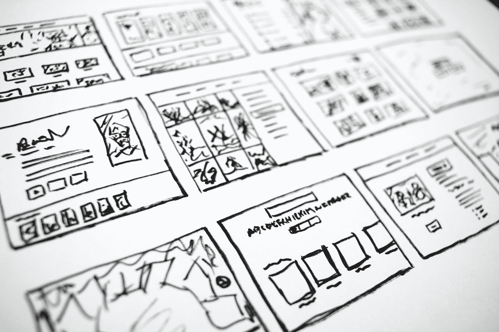

# 如何为初创企业开发软件

> 原文：<https://levelup.gitconnected.com/how-to-develop-software-578be98da21e>

## 开发软件不仅仅是写代码

凯利·西克玛在 [Unsplash](https://unsplash.com?utm_source=medium&utm_medium=referral) 上的照片

编码本身花费的时间远不到一个软件项目的一半。当我学会如何编码时，我真的不能相信，但我今天可以证实这个论点。那时候我问自己，你的余生都是和什么一起度过的，也许今天你依然是这种感觉。

软件项目是关于实际编程的准备工作。是关于规划项目的。它是关于展示从想法到成品的方法，以及如何在不浪费大量时间、金钱和资源的情况下到达那里。

# 理念和愿景

每一个软件的开始，都有一个基本的想法和愿景。在软件编程中，更多的是说一个需要解决的技术问题，想为谁解决这个问题，也就是软件的目标群体是谁，不是谁。

这听起来琐碎而明显，因为你应该如何开始？然而，在实践中，这通常不像人们最初所想的那样被明确定义，这很快导致开发中的问题，例如，因为没有明确的特性定义，或者仅仅因为技术问题没有被充分描述而难以评估其他特性。

因此，软件开发的第一步是思考这个愿景，并尽可能清晰地制定它。这可以被认为是一个文档，一方面，它应该相对紧凑，因为它只是一个愿景，而不是最终版本，但虽然紧凑，但它应该是完整的。在这一点上，“完整”并不意味着必须描述每一个可以想到的细节，这甚至不可能提前完成，但完整意味着该文档应该是结论性的和简明的。

同时，思考商业模式也是必不可少的。评估市场形势同样重要。如果你尽可能早地这样做将会有所帮助，因为到目前为止软件开发只花费了很少的时间和金钱。

在这一点上，你找到足够的理由放弃这个想法并不罕见，而且越早越好，因为这样你浪费的时间和金钱就越少。

照片由[哈尔·盖特伍德](https://unsplash.com/es/@halacious?utm_source=medium&utm_medium=referral)在 [Unsplash](https://unsplash.com?utm_source=medium&utm_medium=referral) 上拍摄

# 需求的定义

一旦基本想法被评估和记录，并且你确定你想要实现这个想法，那么精化和计划就开始了。例如，它是关于如何定义技术需求的。在这种情况下，需求就是所谓的软件特性。

此外，还必须考虑有多少用户可以同时使用该软件，该软件将在哪个硬件上运行，是否有法律要求和限制，等等。

这取决于您是自己定义主题知识还是映射现有的主题知识。在这个阶段，您应该与领域专家进行多次讨论，以获得对主题的良好感觉。

构思软件和能够自由设计软件以及绘制专家已经定义了所有需求的给定结构之间有很大的区别。

关键点是对这些需求进行优先排序。最低可行产品(MVP)的基本要求是什么？哪些是第一个完整版本的关键？还有哪些需求是可以后期添加的？

**初创企业往往会犯这样的错误:一开始就想得太多**，不必要地膨胀 MVP，从而拖延开发时间。这就是为什么一个合理的软件需求优先级是非常重要的。否则，问题会很快出现，因为软件开发最初需要太多时间。

# 技术决策

现在，您已经对业务有了很好的了解，并且已经起草了战略计划，下一步就是选择正确的技术，例如编程语言、框架、部署方式等。

这一点在许多初创企业中被忽视，或者只是被草草解决。开发人员所知道的东西经常被盲目地、不假思索地使用。这乍一看是可以理解的。开发人员总是必须熟悉所选择的技术，但是这些技术不一定是您想要开发的软件的正确技术。

根据应用的不同，使用特定的技术是有意义的。如果你想开发一个流量可控的普通网站，情况就不一样了。那么技术的问题就几乎无关紧要了。尽管如此，在许多情况下，技术的明智选择可以带来决定性的优势。

许多初创公司将这一技术决策外包给自由职业者或软件代理，他们通常后来会被内部开发人员取代。然后，很快就变得很明显，技术迟早会被取代，因为所做决策的缺点大于优点。

这意味着您应该准确地评估技术需求是什么，检查哪些技术是可用的，然后就应该使用哪些技术来实现这些需求做出明智的决策。

然而，选择众所周知的技术也是可以的，因为，当然，它也起到了一定的作用，因为开发人员不会遇到完全未知的技术。重要的是，这个决定是有意识地做出的，而不仅仅是为了方便。因此，在知识和要求之间找到一个良好的平衡是至关重要的。

这是一个好主意，从市场上的各种专家那里收集信息，在这里做出一个好的决定。也许可以先对使用的技术做出粗略的决定，然后雇用合适的开发人员。

# 建筑设计

选择技术还包括考虑架构或者软件应该如何构建。这里也没有通用的答案。

对于某些应用来说，单片架构是有意义的。然后有些应用要用微服务来实现。两条路都不能是终点。看个人要求了。一个命令行应用程序很难像微服务架构那样合理地实现，但是如果你开发一个像网飞这样的平台，这可能不适合作为一个整体架构。

这意味着，就像技术一样，架构的选择也取决于需求，在这里，这对于您自己来说太容易了，因为您在没有首先质疑和评估更好的替代方案的情况下就采用了您已经知道的东西。

从长远来看，这是非常危险的，因为技术和架构上的错误决策只能在事后通过大量的努力来纠正，这将是乏味且昂贵的。这两个决定是必不可少的，你应该慢慢来，想清楚。

Nubelson Fernandes 在 [Unsplash](https://unsplash.com?utm_source=medium&utm_medium=referral) 上的照片

# 代码实现

到目前为止，除非你已经开发了一两个概念证明，否则你还不需要编写一行代码，但是实际软件的编程还没有开始，因为这只是现在才开始。

在需求被公式化并且诸如架构之类的技术被决定之后，编程开发开始了。但即使这样也不仅仅是写代码。在这一阶段，制定许多领域细节也是必不可少的，在最好的情况下，这些细节是基于用户故事制定的，并与那些了解领域需求的人再次讨论。

作为一名开发人员，您更了解技术需求而不是领域需求。软件的用户想要什么？市场期待什么？竞争中有哪些有效的方法？这些问题通常是开发人员在软件开发之初无法回答的，这就是为什么即使在开发期间也需要大量咨询的原因。

因此，不同的团队必须紧密合作，包括系统管理员、设计师、营销人员和领域专家。要做到这一点，需要大量的组织工作。

# 确保质量

除了纯编程，保证开发质量也是必不可少的。这适用于技术开发和领域开发。

技术方面的质量控制措施是，例如，静态代码分析、自动测试、度量、依赖性分析等。在领域方面，它是关于审查、QA 测试、专门的批准等。

这一般不应该发生在开发之后，应该发生在开发期间。您在开发过程中不断得到反馈，并可以将开发引向正确的方向。

因为，尽管到目前为止已经很好地计划了许多需求，但是在开发过程中，您不能避免地意识到，您总是必须对计划进行一点点调整，因为您只知道软件实际开发中的某些事情，这些发现会影响以后的软件计划。

# 显色法

当然，你也需要一个明智的开发过程。这个开发过程必须映射和支持上面描述的所有步骤，但是不要指定太多和限制灵活性。

敏捷方法(比如看板或者 Scrum)在最近几年已经建立起来了，但是你也必须小心不要过多地遵循教科书。这些过程必须始终符合要求。这意味着，在这里，有必要评估哪些敏捷方法可用的现有可能性，然后做出合适的决定。

# 摘要

很明显，软件开发中的编程所花费的时间比你最初想的要少得多。开发过程中不仅需要程序员，还需要许多其他角色，其中一些我在这里只简单介绍过，或者根本没有提到。

感谢您阅读我关于如何在初创企业中开发软件的文章。我希望你能带走一些东西。

干杯

# 接下来阅读

 [## 为什么我从打字稿转向 Go

### 以及为什么我不会放弃使用 TypeScript

levelup.gitconnected.com](/why-did-i-move-from-typescript-to-go-1d9f92ef882a)  [## CQRS 微服务和 NestJS 类型脚本中的事件源

### 基于领域驱动设计、CQRS 和事件源的简单银行 API

levelup.gitconnected.com](/microservices-with-cqrs-in-typescript-and-nestjs-5a8af0a56c3a)  [## 如何领导技术团队的 5 个技巧

### 从软件开发人员的角度来看

javascript.plainenglish.io](https://javascript.plainenglish.io/5-tips-on-how-to-lead-a-tech-team-dffa080c0183)