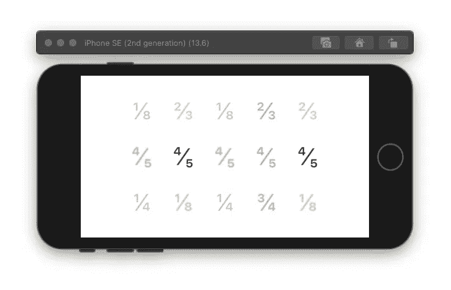

# 如何在 Swift 和 SwiftUI 中显示分数和特殊字符

> 原文：<https://levelup.gitconnected.com/how-to-display-fractions-and-special-characters-in-swift-and-swiftui-9041791b0eca>

## 使用 NSLocalizedString 将双精度值转换为字符串

# **NSLocalizedString**

NSLocalizedString 接受一个键和一个注释，并返回字符串的本地化值。您可以将 Unicode 字符传递给 NSLocalizedString，并在您的应用程序中显示您的特殊字符。

## 例子

要显示分数，可以使用分子 Unicode、分数斜杠 Unicode 和分母 Unicode。

分子的 Unicode 编码是 207 **x** 。 **x** 是这组{0，4，5，6，7，8，9}中的一个数。分数斜线是{2044}。最后，分母的 Unicode 是 208 **x** }。与分子不同， **x** 是一个介于 1 和 9 之间的数字。您可以使用以下代码在 SwiftUI 中创建一个保存分数 4/5 的字符串变量:

对于常见的分数，存在现有的 Unicode 字符，例如 1/2 的\ 0bd。您可以使用下面的函数返回常用分数。向函数传递一个 double 值，它将返回等价的 Unicode 字符。

您可以使用 SwiftUI 作为下面的代码，在文本视图中使用上面的分数到字符串函数:

感谢您的阅读。