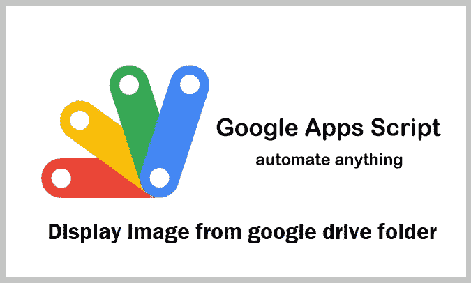
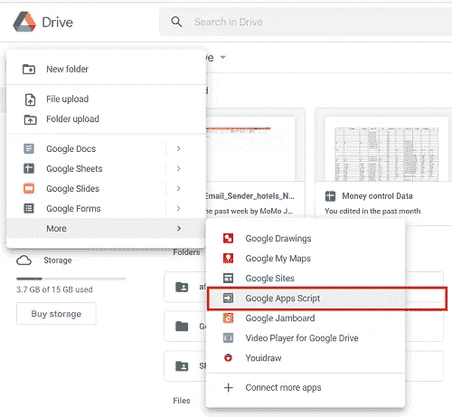

# 如何使用 Google Apps 脚本将 Google drive 文件夹中的图像显示到您的网页上

> 原文：<https://levelup.gitconnected.com/how-to-display-images-from-google-drive-folder-to-your-webpage-using-google-apps-script-33a6fabfad16>



图片来源:Dev Genius 博客

图片总是通过上传到你的主机服务器并使用 HTML 代码中的路径显示在你的网站上，对吗？

但是，我有一个方法可以使用 Google Apps 脚本来自动化这个过程。下面是对该过程的详细解释。

## 从 Google drive 文件夹获取图像的过程

1.  创建函数来获取 Google Drive 图像的 URL
2.  将脚本发布为 Web 应用程序
3.  解析网页上的 JSON 数组

## 步骤 1:创建函数来获取 Google Drive 图像的 URL

我们需要从 Google drive 创建 Google 脚本文件，并编写如下脚本:



创建 Google 应用程序脚本文件

创建 Google Apps 脚本文件后，我们编写了如下代码块所示的脚本。

```
var filelinks = [];
var mimetypes = ["image/png","image/jpeg","image/gif","image/bmp"];

function doGet(e) {

  var fid;
  //var data = travseFolderGetId(e.parameters.folderId[0]);
  if(e.parameters.fid==undefined){
  fid='YOUR_FOLDER_ID';  // you can get it from folder URL, after folder/YOUR_FOLDER_ID 
  }  
  var data = imageItems(fid);
  return   buildSuccessResponse(data, 1); 
}
```

上面写的 **doGet()** 函数会将响应返回给你的 Web API，这里我们只是在 **fid** 变量中定义了文件夹 Id，并将其传递给 **imageItems()** 函数。

现在让我们详细看看 **imageItems()** 函数的脚本。

```
function imageItems(folderid){
 var folder = DriveApp.getFolderById(folderid);
 var files=folder.getFiles();  
  var x=0;

  while(files.hasNext()){

    var file = files.next();
    if( mimetypes.indexOf(file.getMimeType()) != -1){   
      var filelink ={};
      filelink['img_id']=file.getId();

      console.log(filelink['img_id']+"---folder:"+filelink['folder_id']+"\n\n");
      filelinks.push(filelink);
    }
  return filelinks;
  }
```

在上面编写的函数中，我们使用文件夹 id 从文件夹中获取文件，并使用 ***img_id*** 键值将它们存储在 **filelink** 数组中。通过这样做，我们最终得到了包含所有文件 URL 的 **filelink** 数组，这些 URL 是文件夹中图像的链接，在函数的末尾，我们将数组返回给 **doGet()** 函数。

## 步骤 2:将脚本发布为 Web 应用程序

现在，我们在过程的末尾，我们只需要创建函数，它用于生成构建响应，包括我们从函数中获得的所有返回类型。同样的请见剧本。

```
function buildSuccessResponse(posts, pages) {
  var output = JSON.stringify({
    status: 'success',
    data: posts,
    pages: pages
  });

  return ContentService.createTextOutput(output).setMimeType(ContentService.MimeType.JSON);
}
```

如图所示，我们在数据键中发送响应，其他键仅用于信息标签，它通知响应已成功发送。

现在，我们需要通过脚本编辑器**部署**菜单选项将脚本发布为 Web App，如屏幕截图所示。点击**部署**，发布为 **Web app** 。


现在在单个框架中查看整个代码。

```
 var filelinks = [];
var mimetypes = ["image/png","image/jpeg","image/gif","image/bmp"];

function doGet(e) {

  var fid;
  if(e.parameters.fid==undefined){
  fid='YOU_FOLDER_ID';
  }  else {
    fid=e.parameters.fid[0];
  }
  var data = travseItems(fid);
  return   buildSuccessResponse(data, 1);

}

function travseItems(folderid){
 var folder = DriveApp.getFolderById(folderid);
 var files=folder.getFiles();  
  var x=0;

  while(files.hasNext()){

    var file = files.next();
    if( mimetypes.indexOf(file.getMimeType()) != -1){   
      var filelink ={};
      filelink['img_id']=file.getId();
      filelink['name']='';
      filelink['folder_id']='';

      console.log(filelink['img_id']+"---folder:"+filelink['folder_id']+"\n\n");
      filelinks.push(filelink);
    }

  }  //is file

  return filelinks;
}

function buildSuccessResponse(posts, pages) {
  var output = JSON.stringify({
    status: 'success',
    data: posts,
    pages: pages
  });

  return ContentService.createTextOutput(output).setMimeType(ContentService.MimeType.JSON);
}
```

**第三步:解析网页上的 JSON 数组**

在编程语言中有很多不同的方法来解析网页上的 JSON 数组。我们将在 PHP 编程语言中看到它，如下所示。

发布 Web 应用程序后，您将获得如下 URL:

[***https://script . Google . com/macros/s/akuskiehfbx 9 wvmmnkieaxffuxkfun-spgn 31 knt 7 c 8 qfowdspcj w5 srvi 0/exec***](https://script.google.com/macros/s/AKuskiehfbx9wvmmnkIEAXfFUXKfuN-spGN31kNT7c8qfOwdsPCJW5SrVi0/exec)

现在在 PHP 代码中使用这个 URL，如下所示:

```
<?php 

      $json = file_get_contents('YOUR_WEB_APP_URL');
      $obj = json_decode($json);
      $list = $obj->data;

      for($i=0;$i<count($list); $i++){
          $url_split[$i] = explode('/d/',$list[$i]->book_url);
          $image_id[$i] = explode('/view', $url_split[$i][1]);
          print_r($image_id[$i][0]);
       }                       
   ?>
```

从上面的代码中，您将获得这个

变量=> **$image_id[$i]**

你需要在你的 HTML 标签中使用这个图片 id，如下所示:

```
" > 
```

使用 PHP 中的 for 循环，你在 Google drive 文件夹中所有可用的图片都会显示在这个 **< img >** 标签中。

我希望这篇文章对你有所帮助。更多此类文章请 ***向上投票，关注并与朋友分享*** 此文。

如果你有兴趣学习 Google Apps 脚本和自动化你的 Google Workspace？一定要在“ [**Google Apps 脚本:初学者指南**](https://www.amazon.com/dp/B0BTJC9X5R) ”上试试这本**电子书**

快乐学习…😁✌️

关于本文的任何疑问或任何其他技术建议，您可以发送电子邮件至—**dilipkashyap.sd@gmail.com**

# 分级编码

感谢您成为我们社区的一员！在你离开之前:

*   👏为故事鼓掌，跟着作者走👉
*   📰查看[升级编码出版物](https://levelup.gitconnected.com/?utm_source=pub&utm_medium=post)中的更多内容
*   🔔关注我们:[Twitter](https://twitter.com/gitconnected)|[LinkedIn](https://www.linkedin.com/company/gitconnected)|[时事通讯](https://newsletter.levelup.dev)

🚀👉 [**加入升级人才集体，找到一份惊艳的工作**](https://jobs.levelup.dev/talent/welcome?referral=true)