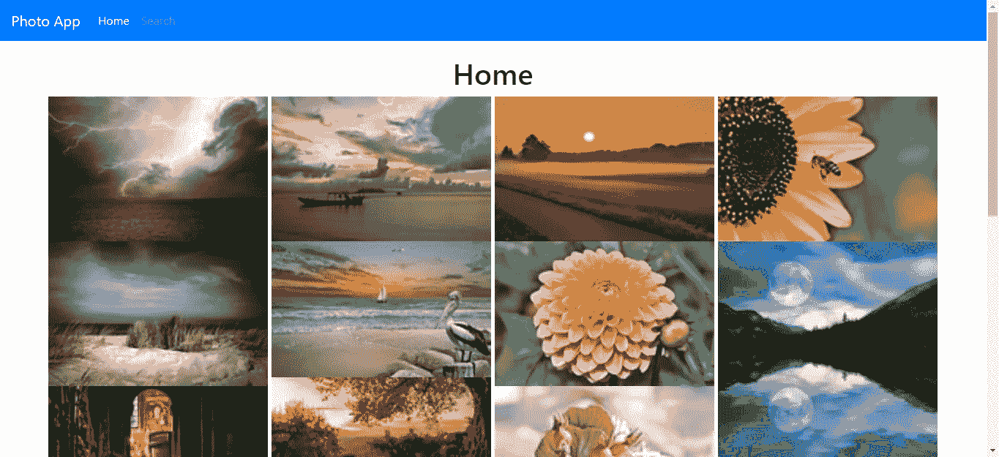
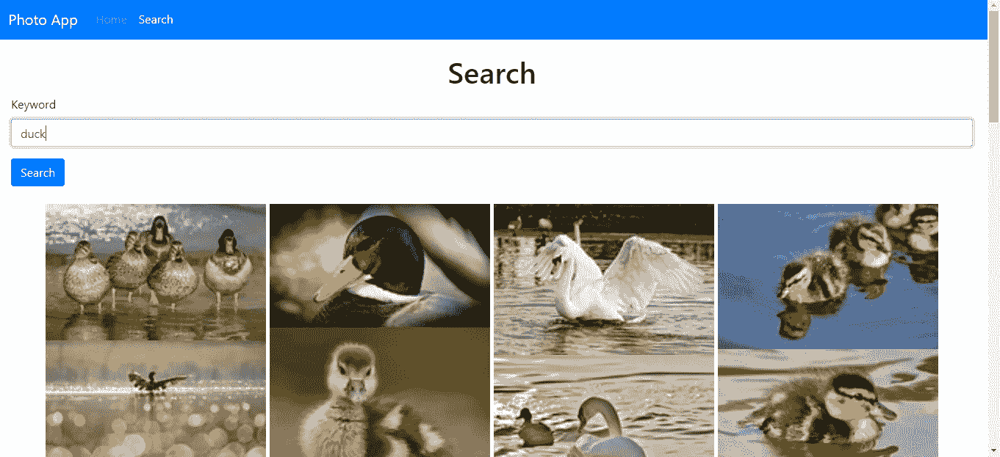

# 使用 React 在类似 Google 和 Flickr 的网格中显示图像

> 原文：<https://levelup.gitconnected.com/how-to-display-images-in-a-grid-like-google-and-flickr-c9c38a923884>

如果你使用像谷歌图片搜索或 Flickr 这样的图片搜索网站，你会注意到它们的图片显示在一个看起来像砖墙的网格中。这些图像高度不均匀，但宽度相等。这被称为砖石效应，因为它看起来像一堵砖墙。

为了实现砖石效果，我们必须将图像的宽度设置为与屏幕宽度成比例，并将图像的高度设置为与图像的纵横比成比例。

如果在没有任何库的情况下完成，这是一件痛苦的事情，所以人们制作了库来创造这种效果。

在本文中，我们将构建一个照片应用程序，允许用户搜索图像并在砖石网格中显示图像。图像网格将无限滚动，以获得更多的图像。我们将使用 React 和 React 砖石组件库来构建它。对于无限滚动，我们将使用 React 无限滚动库。我们将把 React Infinite Scroller 包装在 React 砖石组件之外，以便在显示图像时获得砖石效果的无限滚动。

我们的应用程序将显示来自 Pixabay API 的图像。你可以在[https://pixabay.com/api/docs/](https://pixabay.com/api/docs/)查看 API 文档并注册一个密钥

首先，我们运行 Create React App 来创建应用程序。运行`npx create-react-app photo-app`为应用程序创建初始代码。

然后我们安装自己的库。我们需要 React Infinite Scroller、React Masonry 组件、用于样式化的 Bootstrap、用于发出 HTTP 请求的 Axios、用于表单值数据绑定和表单验证的 Formik 和 Yup，以及用于将 URL 路由到页面的 React Router。

要安装所有软件包，请运行:

```
npm i axios bootstrap formik react-bootstrap react-infinite-scroller react-masonry-component react-router-dom yup
```

安装所有的软件包。

安装好所有的包后，我们就可以开始构建应用程序了。首先将`App.js`中的代码替换为:

```
import React from "react";
import { Router, Route } from "react-router-dom";
import HomePage from "./HomePage";
import { createBrowserHistory as createHistory } from "history";
import TopBar from "./TopBar";
import ImageSearchPage from "./ImageSearchPage";
import "./App.css";
const history = createHistory();function App() {
  return (
    <div className="App">
      <Router history={history}>
        <TopBar />
        <Route path="/" exact component={HomePage} />
        <Route path="/imagesearch" exact component={ImageSearchPage} />
      </Router>
    </div>
  );
}export default App;
```

将应用程序的顶部栏和路线添加到应用程序的入口点。

接下来删除`App.css`中的所有代码，并添加:

```
.page {
  padding: 20px;
}
```

给我们的页面添加填充。

然后，我们通过在`src`文件夹中创建一个`exports.js`来设置 React 砖石组件选项，并添加:

```
export const masonryOptions = {
  fitWidth: true,
  columnWidth: 300,
  gutter: 5
};
```

**这些选项非常重要。**我们需要将`fitWidth`设置为`true`来居中网格。`columnWidth`必须是一个数字才能获得恒定宽度。它将根据屏幕大小缩放，但宽度不变。`gutter`值是项目之间的边距。

选项的完整列表在[https://masonry.desandro.com/options.html](https://masonry.desandro.com/options.html)

接下来，我们通过在`src`文件夹中创建`HomePage.js`来创建应用程序的主页，并添加:

```
import React from "react";
import { getImages } from "./request";
import InfiniteScroll from "react-infinite-scroller";
import Masonry from "react-masonry-component";
import "./HomePage.css";
import { masonryOptions } from "./exports";function HomePage() {
  const [images, setImages] = React.useState([]);
  const [page, setPage] = React.useState(1);
  const [total, setTotal] = React.useState(0);
  const [initialized, setInitialized] = React.useState(false); const getAllImages = async (pg = 1) => {
    const response = await getImages(page);
    let imgs = images.concat(response.data.hits);
    setImages(imgs);
    setTotal(response.data.total);
    pg++;
    setPage(pg);
  }; React.useEffect(() => {
    if (!initialized) {
      getAllImages();
      setInitialized(true);
    }
  }); return (
    <div className="page">
      <h1 className="text-center">Home</h1>
      <InfiniteScroll
        pageStart={1}
        loadMore={getAllImages}
        hasMore={total > images.length}
      >
        <Masonry
          className={"grid"}
          elementType={"div"}
          options={masonryOptions}
          disableImagesLoaded={false}
          updateOnEachImageLoad={false}
        >
          {images.map((img, i) => {
            return (
              <div key={i}>
                
              </div>
            );
          })}
        </Masonry>
      </InfiniteScroll>
    </div>
  );
}
export default HomePage;
```

在主页中，我们只是在页面加载时获取图像。当用户向下滚动时，我们通过在当前的`page`值上加 1 来加载更多的图像，并获取带有页码的图像。

通过将 React Infinite Scroll 提供的`InfiniteScroll`组件包装在 React Masonry 组件提供的`Masonry`组件之外，我们在一个网格中显示我们的图像，并且当用户向下滚动直到`images`数组的`length`大于或等于来自 Pixabay API 结果给出的`total`字段的`total`时，还会显示更多。

当页面加载时，我们通过检查`initialized`标志是否为`true`来加载图像，只有当`initialized`为`false`时，我们才在页面加载时加载图像，并且当请求第一次被发送到 API 并成功时，我们将`initialized`标志设置为`true`以停止每次渲染时的请求。

接下来，我们通过创建`ImageSearchPage.js`文件并添加以下内容来创建图像搜索页面:

```
import React from "react";
import { Formik } from "formik";
import Form from "react-bootstrap/Form";
import Col from "react-bootstrap/Col";
import Button from "react-bootstrap/Button";
import * as yup from "yup";
import InfiniteScroll from "react-infinite-scroller";
import Masonry from "react-masonry-component";
import { masonryOptions } from "./exports";
import { searchImages } from "./request";const schema = yup.object({
  keyword: yup.string().required("Keyword is required")
});function ImageSearchPage() {
  const [images, setImages] = React.useState([]);
  const [keyword, setKeyword] = React.useState([]);
  const [page, setPage] = React.useState(1);
  const [total, setTotal] = React.useState(0);
  const [searching, setSearching] = React.useState(false); const handleSubmit = async evt => {
    const isValid = await schema.validate(evt);
    if (!isValid) {
      return;
    }
    setKeyword(evt.keyword);
    searchAllImages(evt.keyword, 1);
  }; const searchAllImages = async (keyword, pg = 1) => {
    setSearching(true); const response = await searchImages(keyword, page);
    let imgs = response.data.hits;
    setImages(imgs);
    setTotal(response.data.total);
    setPage(pg);
  }; const getMoreImages = async () => {
    let pg = page;
    pg++;
    const response = await searchImages(keyword, pg);
    const imgs = images.concat(response.data.hits);
    setImages(imgs);
    setTotal(response.data.total);
    setPage(pg);
  }; React.useEffect(() => {}); return (
    <div className="page">
      <h1 className="text-center">Search</h1>
      <Formik validationSchema={schema} onSubmit={handleSubmit}>
        {({
          handleSubmit,
          handleChange,
          handleBlur,
          values,
          touched,
          isInvalid,
          errors
        }) => (
          <Form noValidate onSubmit={handleSubmit}>
            <Form.Row>
              <Form.Group as={Col} md="12" controlId="keyword">
                <Form.Label>Keyword</Form.Label>
                <Form.Control
                  type="text"
                  name="keyword"
                  placeholder="Keyword"
                  value={values.keyword || ""}
                  onChange={handleChange}
                  isInvalid={touched.keyword && errors.keyword}
                />
                <Form.Control.Feedback type="invalid">
                  {errors.keyword}
                </Form.Control.Feedback>
              </Form.Group>
            </Form.Row>
            <Button type="submit" style={{ marginRight: "10px" }}>
              Search
            </Button>
          </Form>
        )}
      </Formik>
      <br />
      <InfiniteScroll
        pageStart={1}
        loadMore={getMoreImages}
        hasMore={searching && total > images.length}
      >
        <Masonry
          className={"grid"}
          elementType={"div"}
          options={masonryOptions}
          disableImagesLoaded={false}
          updateOnEachImageLoad={false}
        >
          {images.map((img, i) => {
            return (
              <div key={i}>
                
              </div>
            );
          })}
        </Masonry>
      </InfiniteScroll>
    </div>
  );
}
export default ImageSearchPage;
```

我们不会在第一次加载时加载图像。相反，用户在表单中输入一个搜索词，当用户点击搜索按钮时，就会调用`handleSubmit`。`evt`对象具有表单值，由`Formik`组件更新。Yup 为表单验证对象提供了`schema`对象，我们只需检查`keyword`是否是必需的。

在`handlesubmit`函数中，我们得到了`evt`对象，我们通过调用返回承诺的`schema.validate`来验证这个对象。如果承诺返回真实的东西，那么我们继续用搜索关键字和页码向 Pixabay API 发出请求。

我们有相同的设置作为主页的无限滚动和砖石效果图像网格。唯一的区别是我们调用了与`getAllImages`函数逻辑相似的`searchAllImages`函数，除了页面参数之外，我们还传入了`keyword`参数。我们将`imgs`变量设置为从 Pixabay API 返回的数组，并通过调用`setImages`设置`images`。我们还通过调用`setPage`来设置页面。

当用户向下滚动足够远以至于内容用尽时，当`images.length`小于`total`时，调用`getMoreImages`函数。通过从 API 获取`total`字段来设置`total`。

我们使用`exports.js`中的`masonryOptions`，就像在主页中一样，并以同样的方式显示图像。

接下来在`src`文件夹中创建`request.js`,添加向后端发出 HTTP 请求的代码，如下所示:

```
const axios = require("axios");
const APIURL = "[https://pixabay.com/api](https://pixabay.com/api)";export const getImages = (page = 1) =>
  axios.get(`${APIURL}/?page=${page}&key=${process.env.REACT_APP_APIKEY}`);export const searchImages = (keyword, page = 1) =>
  axios.get(
    `${APIURL}/?page=${page}&key=${process.env.REACT_APP_APIKEY}&q=${keyword}`
  );
```

我们有仅用于获取图像的`getImages`和将搜索词发送给 API 的`searchImages`。`process.env.REACT_APP_APIKEY`来自于设置项目根文件夹中`.env`文件中的`REACT_APP_APIKEY`变量。

接下来在`src`文件夹中创建`TopBar.js`，并添加:

```
import React from "react";
import Navbar from "react-bootstrap/Navbar";
import Nav from "react-bootstrap/Nav";
import { withRouter } from "react-router-dom";function TopBar({ location }) {
  React.useEffect(() => {}); return (
    <Navbar bg="primary" expand="lg" variant="dark">
      <Navbar.Brand href="#home">Photo App</Navbar.Brand>
      <Navbar.Toggle aria-controls="basic-navbar-nav" />
      <Navbar.Collapse id="basic-navbar-nav">
        <Nav className="mr-auto">
          <Nav.Link href="/" active={location.pathname == "/"}>
            Home
          </Nav.Link>
          <Nav.Link
            href="/imagesearch"
            active={location.pathname == "/imagesearch"}
          >
            Search
          </Nav.Link>
        </Nav>
      </Navbar.Collapse>
    </Navbar>
  );
}
export default withRouter(TopBar);
```

这包含 React 引导程序`Navbar`来显示一个带有主页链接和应用程序名称的顶栏。我们通过设置`active`属性来检查`location.pathname`以突出显示正确的链接，其中`location`属性由 React Router 通过将`withRouter`函数包装在`TopBar`组件之外来提供。

最后，在`index.js`中，我们将现有代码替换为:

```
<!DOCTYPE html>
<html lang="en">
  <head>
    <meta charset="utf-8" />
    <link rel="shortcut icon" href="%PUBLIC_URL%/favicon.ico" />
    <meta name="viewport" content="width=device-width, initial-scale=1" />
    <meta name="theme-color" content="#000000" />
    <meta
      name="description"
      content="Web site created using create-react-app"
    />
    <link rel="apple-touch-icon" href="logo192.png" />
    <!--
      manifest.json provides metadata used when your web app is installed on a
      user's mobile device or desktop. See [https://developers.google.com/web/fundamentals/web-app-manifest/](https://developers.google.com/web/fundamentals/web-app-manifest/)
    -->
    <link rel="manifest" href="%PUBLIC_URL%/manifest.json" />
    <!--
      Notice the use of %PUBLIC_URL% in the tags above.
      It will be replaced with the URL of the `public` folder during the build.
      Only files inside the `public` folder can be referenced from the HTML.Unlike "/favicon.ico" or "favicon.ico", "%PUBLIC_URL%/favicon.ico" will
      work correctly both with client-side routing and a non-root public URL.
      Learn how to configure a non-root public URL by running `npm run build`.
    -->
    <title>Photo App</title>
    <link
      rel="stylesheet"
      href="[https://maxcdn.bootstrapcdn.com/bootstrap/4.3.1/css/bootstrap.min.css](https://maxcdn.bootstrapcdn.com/bootstrap/4.3.1/css/bootstrap.min.css)"
      integrity="sha384-ggOyR0iXCbMQv3Xipma34MD+dH/1fQ784/j6cY/iJTQUOhcWr7x9JvoRxT2MZw1T"
      crossorigin="anonymous"
    />
  </head>
  <body>
    <noscript>You need to enable JavaScript to run this app.</noscript>
    <div id="root"></div>
    <!--
      This HTML file is a template.
      If you open it directly in the browser, you will see an empty page.You can add webfonts, meta tags, or analytics to this file.
      The build step will place the bundled scripts into the <body> tag.To begin the development, run `npm start` or `yarn start`.
      To create a production bundle, use `npm run build` or `yarn build`.
    -->
  </body>
</html>
```

添加引导 CSS 并更改标题。

现在运行`npm start`，然后你会得到:

