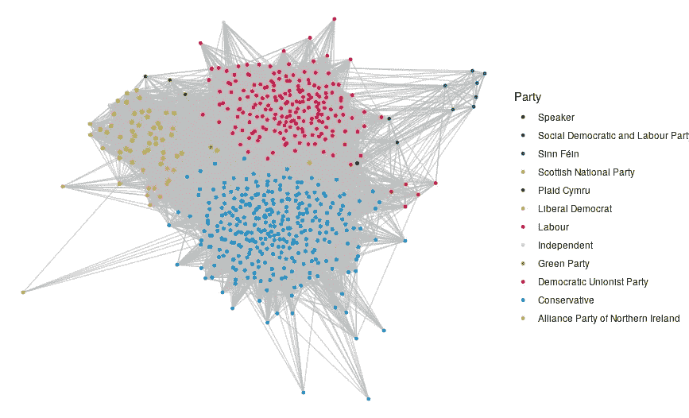

# 如何在 R 中进行 Twitter 网络分析和可视化

> 原文：<https://levelup.gitconnected.com/how-to-do-amazing-twitter-network-analysis-in-r-2c258537dd7d>

## 以英国政治家的 Twitter 网络为例，学习如何进行引人入胜的网络分析和可视化

在这篇文章中，我将向你展示如何分析 Twitter 上有趣的人群网络。感谢像`rtweet`这样伟大的 R 包，使用像`igraph`这样的经典包和像`ggraph`这样的可视化工具，这里的一切都是令人惊讶的。在文章的最后，我还将给出如何使用 Javascript 的 D3 来创建最令人惊叹的交互式可视化的指导，就像这样:


作者使用 Javascript 中的 D3 创建的交互式英国 MP Twitter 网络(此处提供[和](https://ona-book.org/mp_twitter.html)

本文中的说明是我的新书《用 R 和 Python 进行网络分析》后面章节中更全面说明的总结版本，该书现在可以在网上免费获得，也可以从 CRC 出版社获得。

在这个例子中，我将基于英国国会议员的 Twitter 互动建立一个网络。Twitter 互动被视为提及、回复、转发或引用另一名议员的推文。在我们的网络中，如果两个议员在过去的 500 条推文中至少有一次互动，他们就会被连接起来，互动的数量将决定连接的强度。

## 提取 Twitter 数据

`rtweet`包允许通过 Twitter API 轻松提取数据。在这种情况下，我们将基于英国议员之间的互动来构建我们的网络。英国议员和他们所代表的政党的推特详细信息列表可以在*政治社交*网站[这里](https://www.politics-social.com/list/party)找到。

要访问 Twitter API，你需要一个 Twitter 账户，然后你需要通过 [Twitter 开发者平台](https://developer.twitter.com/en)注册访问 API。一旦您注册并设置了一个应用程序，您将获得一组密码，您可以在`rtweet`中使用这些密码通过`create_token()`功能验证您的访问。

```
library(rtweet)token <- create_token(
  app = "YOUR_APP_NAME",
  consumer_key = "YOUR_API_KEY",
  consumer_secret = "YOUR_API_KEY_SECRET",
  access_token = "YOUR_ACCESS_TOKEN",
  access_secret = "YOUR_ACCESS_TOKEN_SECRET"
)
```

这是一次性的身份验证，您的访问凭证现在将永久地存储在 R 环境中，因此在以后的会话中不需要重新进行身份验证。

现在我们已经通过了认证，我们需要下载所有议员的时间表，以便在他们之间建立联系。首先我们从*政治社交:*下载议员名单

```
# download MP list from Politics Social
url <- "[https://www.politics-social.com/api/list/csv/party](https://www.politics-social.com/api/list/csv/party)"
mp_list <- read.csv(url)
```

`Screen.name`列为我们提供了这些议员的 Twitter 句柄，因此我们可以在`rtweet`的`get_timeline()`函数中使用这个句柄来提取每个议员的最后 500 条推文。由于 Twitter API 在 15 分钟内运行 180 条时间线的速率限制，我们将不得不把我们的 API 调用分成间隔 15 分钟的几次尝试。例如，我们的第一个电话将是:

```
# first batch
results1 <- rtweet::get_timeline(
  user = mp_list$Screen.name[1:180],
  n = rep(500, 180)
)
```

这可能需要一段时间。一旦完成，等待 15 分钟，然后逐步尝试下面的方法，最后将它们捆绑起来。

```
# second batch (at least 15 mins since first batch)
results2 <- rtweet::get_timeline(
  user = mp_list$Screen.name[181:360],
  n = rep(500, 180)
)# third batch (at least 15 mins since second batch)
results3 <- rtweet::get_timeline(
  user = mp_list$Screen.name[361:540],
  n = rep(500, 180)
)# fourth batch (at least 15 mins since third batch)
results4 <- rtweet::get_timeline(
  user = mp_list$Screen.name[541:length(mp_list$Screen.name)],
  n = rep(500, length(mp_list$Screen.name) - 540)
)# combine all results
results <- rbind(results1, results2, results3, results4)
```

这提供了一个非常丰富的数据集，每个议员最近 500 条推文中的每条都有 90 列数据，包括指示任何其他被提及、回复、引用或转发的 Twitter 句柄的特定字段。这是一个很好的数据集，我们可以用它来构建我们的网络图。

## 创建图边列表和顶点集

在我们从 Twitter 中提取的大型数据集中，我们感兴趣的每个 MP tweet 有四个字段:`mentions_screen_name`、`retweet_screen_name`、`reply_to_screen_name`和`quoted_screen_name`。由于所有这些都以`screen_name`结尾，我们可以使用一些好的`tidyverse`函数来创建一个网络边列表。我们希望我们的网络边缘列表包括`from`和`to` Twitter 句柄以及权重，这将是一个 MP 到另一个 MP 的交互次数的计数。注意，Twitter 是一个有向网络，所以不同方向的两个 MP 之间的交互是分开统计的。

首先，我们编写一个函数来为给定的 MP 生成网络:

```
library(tidyverse)# function to create edgelist for single MP
count_and_group <- function (df) {
  df |> 
    dplyr::select(ends_with("screen_name")) |> 
    unlist() |> 
    tibble(interacted_with = _) |> 
    tidyr::drop_na() |> 
    dplyr::group_by(interacted_with) |> 
    dplyr::summarise(weight = n()) |> 
    dplyr::filter(
      # ensures that only MP interactions are returned
      interacted_with %in% substr(mp_list$Screen.name, 2, nchar(mp_list$Screen.name))
    )
}
```

现在我们编写一个函数，将该函数应用于数据帧中的所有 MPs:

```
# function to generate edgelist across all MPs
create_edgelist <- function(tweet_df) {
  tweet_df |> 
    dplyr::nest_by(screen_name) |> 
    dplyr::summarise(count_and_group(data)) |> 
    # ignore interactions with self
    dplyr::filter(screen_name != interacted_with) |> 
    dplyr::rename(from = screen_name, to = interacted_with)
}
```

现在，我们简单地将我们的`create_edgelist()`函数应用于我们从 Twitter 中提取的大型`results`数据帧，这将为我们生成我们的 edgelist。

```
# create final edgelist
mp_edgelist <- create_edgelist(results)
```

这应该是我们的 edgelist 的前几行，有一个`from`、`to`和`weight`列。

```
 from              to weight
1 _OliviaBlake    Afzal4Gorton      2
2 _OliviaBlake alanwhiteheadmp      4
3 _OliviaBlake   Alex_Stafford      4
4 _OliviaBlake       alexsobel      4
5 _OliviaBlake  AlokSharma_RDG      1
6 _OliviaBlake  AndyMcDonaldMP      2
```

我们还可以为每个议员创建一组包含各种有趣属性的顶点，比如他们的政党、选区、Twitter 追随者的数量。我们甚至可以从我们的`results`数据框中获得他们的 Twitter 个人资料图片的 URL，我们还可以添加一些官方政党的颜色。所有这些都将有助于创造伟大的直观形象。

```
# create vertex dataframe
mp_vertices <- results %>%
  select(screen_name, profile_image_url, followers_count) %>%
  distinct() |> 
  left_join(
    mp_list |> 
      dplyr::mutate(
        screen_name = substr(Screen.name, 2, nchar(Screen.name))
      ) |> 
      dplyr::select(
        screen_name,
        constituency = Constituency,
        party = Party,
        name = Name
      )
  )# add party colours from politics social
parties <- mp_vertices$party |> unique()
party_colours <- c("#000000", "#216a4d", "#008a49",
                   "#d3c200", "#3d8028", "#f5b52e",
                   "#dd0339", "#cccccc", "#66ab21",
                   "#c2282a", "#018fda", "#eec52e")color_df <- data.frame(
  party = parties,
  colour = party_colours
)mp_vertices <- mp_vertices |> 
  left_join(color_df)
```

最后，过去的 Twitter 交互可能是与不再活跃的议员的 Twitter 帐户发生的，这将导致我们的网络图出现问题，因此我们可以快速摆脱这些:

```
mp_edgelist <- mp_edgelist |> 
  dplyr::filter(to %in% mp_vertices$screen_name)
```

## 创建和可视化我们的 MP Twitter 网络

现在我们有了边列表和顶点数据框架，我们的大量艰苦工作已经完成。由此创建网络图相当简单。为了简单起见，让我们创建一个无向图，其中我们将两个 MP 之间在任何方向上的任何交互视为一个连接。为此，我们将使用`igraph`包中的`graph_from_data_frame()`函数。

```
library(igraph)(mp_graph_undirected <- igraph::graph_from_data_frame(
  mp_edgelist, 
  vertices = mp_vertices,
  directed = FALSE
))
```

现在，我们可以快速查看一下我们的网络属性:


这表明我们有一个 585 个顶点和 26，833 条边的无向、命名和加权网络。顶点具有属性`name`、`profile_image_url`、`followers_count`、`constituency`、`party`和`colour`，而边具有属性`weight`。

如果我们愿意，我们可以对网络进行可视化，每个顶点都用政党来着色。如果我们使用力定向算法，具有较强连接的顶点将更容易相互吸引，而没有连接强度或连接强度低的顶点将被推得更远。我们可以使用`ggraph`包来创建使用`ggplot2` 语法的图表。

```
library(ggraph)# visualize ground truth political party communities
party_colours <- mp_vertices |> 
  dplyr::select(party, colour) |> 
  dplyr::distinct()set.seed(123)
ggraph(mp_graph_undirected, layout = "fr") +
  geom_edge_link(color = "grey", alpha = 0.7) + 
  geom_node_point(aes(color = factor(party)), size = 1) +
  theme_void() + 
  scale_colour_manual(limits = party_colours$party, 
                      values = party_colours$colour, name = "Party")
```



英国国会议员推特网络受政党影响的武力导向图

正如我们所看到的，政党倾向于被分组在一起，这表明同一政党的成员之间有很强的 Twitter 互动。这只是我们可以用我们的网络做什么的一个小例子，你可以发现更多可以做的可能的分析，包括社区和小团体检测，以及在我的书的第 10 章中识别网络中的重要参与者。

## 在 Javascript 中使用 D3 创建令人惊叹的可视化效果

为了保持本文的长度合理，我不会在这里深入介绍复杂的细节，但是如果你足够勇敢，敢于尝试一些 Javascript 编程，你可以将你的网络数据导出为 JSON，并使用它和 D3 的 force directed 网络功能来创建令人惊叹的 MP Twitter 网络的交互式可视化，例如[这个](https://ona-book.org/mp_twitter.html)。

在我的书的第 11 章的[中，我给出了关于如何将你的`igraph`对象导出为 JSON，以及如何在 D3 中编写一个强制导向网络的完整说明，包括如下特性:](https://ona-book.org/advanced-viz.html)

*   通过度中心性缩放节点，以显示网络中的重要参与者
*   按政党划分的彩色编码节点
*   向节点添加 Twitter 个人资料图片，以便更容易识别演员
*   添加节点搜索功能
*   添加 ego 网络
*   添加酷的滑动标度来改变网络中要连接的两个 MP 的交互阈值。

这篇文章快速介绍了对 Twitter 网络进行有趣、深刻和有趣的分析和可视化的一些可能性。要获得更深入的技术指导，请查阅我的书，其中包含了以上各章节中所有方法的完整教程。如果你决定用它来建立你自己的 Twitter 网络，请与社区分享你的成果。

*图表和网络手册为使用 R 和 Python 处理图表和执行网络分析提供了理论和技术指导。现在可以在*[*https://ona-book.org*](https://ona-book.org)*免费获得，或者从*[*CRC Press*](https://www.routledge.com/Handbook-of-Graphs-and-Networks-in-People-Analytics-With-Examples-in-R/McNulty/p/book/9781032204970)*获得印刷版/Kindle 版。我所有的印刷版/Kindle 销售收入都会捐给乌克兰红十字会。*