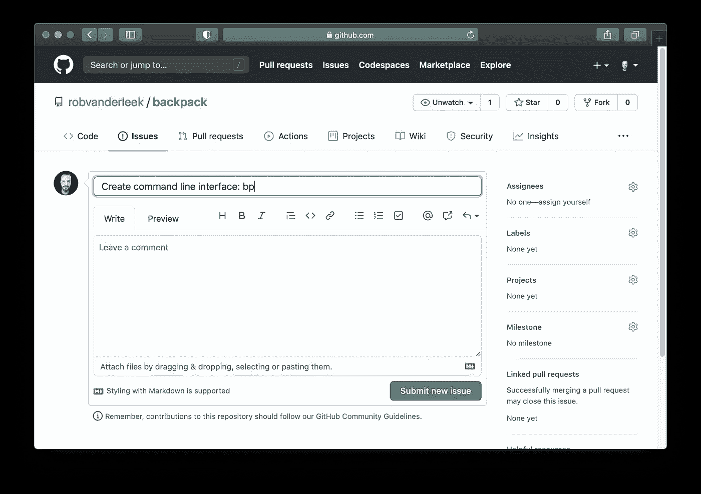

# 如何进行基于分支的开发

> 原文：<https://levelup.gitconnected.com/how-to-do-branch-based-development-3b9bcebd417b>


软件开发是一个内在的迭代过程。每次迭代都会改变代码，让软件系统做一些新的事情，改进已经做过的事情，或者删除不再需要的功能。这适用于所有类型的软件，从简短的 shell 脚本到拥有超过一百万行代码的代码库。

基于分支的开发是一种非常适合迭代开发过程的工作方式。每个分支开始一个新的迭代，每个合并结束一个迭代。这个概念在理论上听起来简单而优雅，但不幸的是，它在实践中经常过于复杂或被误用。

在这篇操作指南中，我将向您展示如何从零开始，为一个小型的真实应用程序进行基于分支的开发。

## 选择哪个分支工作流？

您可能以前听说过不同的基于分支的开发工作流。目前最流行的工作流程是:

*   [GitFlow](https://nvie.com/posts/a-successful-git-branching-model/)
*   [GitHub 流量](https://guides.github.com/introduction/flow/)
*   [基于主干的开发](https://trunkbaseddevelopment.com/)

如果你想深入了解，Martin Fowler 写了一篇非常全面的文章([管理源代码分支的模式](https://martinfowler.com/articles/branching-patterns.html))，比较和评估了这些分支工作流。

在这篇操作指南中，我将使用一个看起来非常类似于 GitHub flow 的工作流。GitHub flow 因开源开发的 GitHub fork 模型而流行起来，但它肯定不局限于开源项目。GitHub flow 是我见过的最简单、最安全的策略之一，它成功地应用于从独立项目到行业团队开发的系统的代码库。

其他工作流呢？

根据我的经验，GitFlow 是一个复杂的分支策略，除非你的项目类型绝对需要，否则你应该避免使用它。
基于主干的开发实际上完全避免了分支，但这并不是最容易开始的工作流程(尤其是在团队中)。如果您的分支规模小且寿命短，那么下面讨论的工作流比基于主干的开发更容易采用。

## 从零到发射🚀一次一个分支

我将使用的迭代开发工作流有 5 个步骤:

1.  制造一个问题
2.  创建分支
3.  做你的编码魔术✨
4.  打开拉式请求
5.  合并你的分支

伴随这一过程而来的是使这一过程真正起作用的 3 条准则:

1.  总是从主/主要分支分支，并且总是合并到主主要分支
2.  你的分行必须是短命的(不超过 2 天的工作)
3.  合并不应该破坏主/主要分支

就是这样！重复这 5 个步骤，一遍又一遍地遵循这 3 条指导方针，看着你的代码库成长壮大。

## 打招呼👋去背包

为了向您展示基于分支的开发如何适用于现实世界的应用程序，我将从头开始构建一个小型命令行实用程序:Backpack

Backpack 是一个组织文件的工具，这些文件通常放在你的电脑上。想想您桌面上的文件，或者您个人文件夹中的文件。你不想永久保存这些文件(比如在 Dropbox 或 Google drive 上),但又对删除它们犹豫不决。这就是 Backpack 拯救你的桌面和个人文件夹的地方。

## 设置您的开发环境

你可以按照这个指南中的所有步骤去做。
首先，让我们创建一个新的存储库:进入 [GitHub](https://github.com) 上的存储库页面，点击绿色的“新建”按钮。在下一个屏幕上，创建一个名为“backpack”的公共存储库，其中包含一个自述文件:


创建新的存储库

从下一个屏幕中复制存储库 URL，并在您的开发环境中进行克隆:

```
$ **git clone** [**git@github.com**](mailto:git@github.com)**:<your-github-username>/backpack.git**
```

为了完成设置，我们将安装一个 GitHub 应用程序，它会自动从一个问题创建一个分支(这是我们工作流程的第一步)。
*全披露:我是这个 GitHub App 的维护者。*

打开[https://github.com/apps/create-issue-branch](https://github.com/apps/create-issue-branch)并安装背包库(或你所有的库)的应用程序:


安装创建问题分支应用程序

好了，我们现在准备开始我们的第一次开发迭代了！

## 步骤 1:创建第一个问题

Backpack 是一个命令行工具，所以我们的第一张票是设置所有必要的代码，通过在 shell 提示符下键入`bp`来启动 backpack。转到背包 repo 的问题页面，创建一个新问题“创建命令行命令:bp”:



制造问题

点击“提交新问题”按钮，我们就完成了这一步。

## 步骤 2:创建第一个分支

在问题#1 的页面上，单击受托人后面的齿轮图标并选择您自己。此操作将触发创建问题分支应用程序创建一个名为`issue-1-Create_command_line_interface_bp`的新分支


将您自己分配给该问题，将会自动创建一个分支

更新您的本地存储库并切换到新创建的分支:

```
$ **cd backpack**
[backpack] $ **git pull**
From github.com:robvanderleek/backpack
 * [new branch]      issue-1-Create_command_line_interface_bp -> origin/issue-1-Create_command_line_interface_bp
Already up to date.
[backpack] $ **git checkout issue-1-Create_command_line_interface_bp**
Branch 'issue-1-Create_command_line_interface_bp' set up to track remote branch 'issue-1-Create_command_line_interface_bp' from 'origin'.
Switched to a new branch 'issue-1-Create_command_line_interface_bp'
```

现在我们准备做一些编码工作！

## 第三步:编写魔法代码

第一个目标是创建一个可以从命令行调用的`bp`命令。我们将使用 NodeJS，所以请确保您已经安装了它。首先，我们将初始化一个新的 NodeJS 项目:

```
[backpack] $ **npm init -y**
Wrote to /Users/rob/projects/robvanderleek/backpack/package.json:{
  "name": "backpack",
  "version": "1.0.0",
  "description": "",
  "main": "index.js",
  "scripts": {
    "test": "echo \"Error: no test specified\" && exit 1"
  },
  "repository": {
    "type": "git",
    "url": "git+[https://github.com/robvanderleek/backpack.git](https://github.com/robvanderleek/backpack.git)"
  },
  "keywords": [],
  "author": "",
  "license": "ISC",
  "bugs": {
    "url": "[https://github.com/robvanderleek/backpack/issues](https://github.com/robvanderleek/backpack/issues)"
  },
  "homepage": "[https://github.com/robvanderleek/backpack#readme](https://github.com/robvanderleek/backpack#readme)"
}
```

接下来，在存储库的根目录下创建一个名为`index.js`的新文件，包含以下内容:

```
#!/usr/bin/env node
console.log("Welcome to Backpack!");
```

最后，将下面几行添加到`package.json`配置对象中:

```
"bin": {
  "bp": "index.js"
}
```

现在，您可以全局安装该软件包。为了便于开发，NPM 将创建指向您的存储库的符号链接:

```
[backpack]$ **npm install -g**
/usr/local/bin/bp -> /usr/local/lib/node_modules/backpack/index.js
+ backpack@1.0.0
updated 1 package in 0.094s
```

此时，您应该能够从终端运行`bp`命令了:

```
$ **bp**
Welcome to Backpack!
```

将新创建的文件添加到 Git，然后将您的更改提交并推送到 GitHub:

```
[backpack] $ **git add index.js**
[backpack] $ **git add package.js** [backpack] $ **git commit -m "Basic CLI"**
[backpack] $ **git push**
```

搞定了。你已经为下一步做好了准备

## 步骤 4:打开第一个拉取请求

转到 GitHub.com 上的库，在代码选项卡上单击“分支”，这将向您显示一个类似于以下内容的屏幕:


点击该屏幕中的“新拉动请求”

单击其中一个“新拉动请求”按钮。

下一个屏幕显示您将要创建一个 Pull 请求，用于将`issue-1-Create_command_line_interface_bp`分支中的工作合并到存储库的`master`分支中:


单击绿色的“创建拉动式请求”按钮，瞧，您已经创建了此回购中的第一个 PR。

## 步骤 5:合并分支

“拉动请求”屏幕为您提供了分支机构中发生的所有工作的概览:


这个屏幕上有关于你的拉取请求的所有信息

您可以单击 Commits 选项卡来查看提交历史记录，或者单击“Files changed”选项卡来检查代码更改。

Pull Request 屏幕上有更多的功能，例如要求某人审查您的代码或检查自动化代码检查的输出(例如:CI 工具、测试结果或代码质量报告)。这超出了本指南的范围，但是我在 CI/CD 管道上的[帖子是一个很好的后续指南。](https://medium.com/@robvanderleek/how-to-build-a-modern-ci-cd-pipeline-5faa01891a5b)

现在，单击绿色的“合并拉取请求”按钮，然后单击“确认合并”按钮。合并后，您可以单击“删除分支”按钮。不要忘记删除问题(提示:创建问题分支应用程序[可以自动为您删除问题](https://github.com/robvanderleek/create-issue-branch#automatically-close-issues-after-a-pull-request-merge))。

要在 GitHub 上合并后更新您的本地存储库，请签出主分支并获取更改:

```
[backpack] $ **git checkout master** [backpack] $ **git pull**
```

*你可以在背包 GitHub 资源库*中找到这个 [*问题*](https://github.com/robvanderleek/backpack/issues/1) *和* [*拉-请求*](https://github.com/robvanderleek/backpack/pull/2)

## *去下一个分支！*

*在开发迭代中，我们希望为用户添加一种方式，让用户可以将文件放入，并从他们的“背包”中获取文件。*

*让我们为此创建一个新票证:*

**

*第二期*

*在创建问题并将其分配给自己之后，将您的本地存储库切换到新创建的`issue-3-Add_basic_put_and_get_support`分支，并将`index.js`的内容更改为:*

*索引. js*

*新代码增加了将文件放入你的背包(用`bp -i foo.txt`)并再次取回(用`bp -e foo.txt`)的功能。文件存储在您主目录的一个文件夹中，该文件夹遵循 [XDG 基本目录规范](https://specifications.freedesktop.org/basedir-spec/basedir-spec-latest.html)指南。当你输入`bp`时，还有一个友好的用法信息。*

*提交代码并推送到 GitHub。创建一个新的拉请求，检查您的更改，并将其合并到主分支中。然后，删除分支，删除问题，您就为第三次开发迭代做好了准备！*

**你可以在背包 GitHub 资源库*中找到这个 [*问题*](https://github.com/robvanderleek/backpack/issues/3) *和* [*拉-请求*](https://github.com/robvanderleek/backpack/pull/4)*

## **让我们再做一个分支**

**使用一个简单的、基于问题的分支策略，可以让您始终将主/主要分支保持在可发布的状态(在您需要快速修复错误的情况下是必不可少的),同时致力于短期(=低风险！)特色分支。**

**让我们再做一个小功能分支:允许用户列出他们背包的内容。**

**您现在对开发流程相当熟悉，首先创建票证:**

****

**每次迭代都从一个新问题开始**

**切换到分支`issue-5-Add_command_to_list_backpack_contents`，并将下面 diff 中显示的新代码行添加到`index.js`:**

**提交并推动更改，打开一个 PR，将其合并到 master/main，并通过键入以下内容来赞美您的劳动成果:**

```
**$ **bp -l** 1: foo.txt**
```

***你可以在背包 GitHub 库*中找到这个 [*发布*](https://github.com/robvanderleek/backpack/issues/5) *和* [*拉取请求*](https://github.com/robvanderleek/backpack/pull/6)**

## ***结论***

***虽然这里讨论的只是处理分支和拉请求的冰山一角，但是 5 个步骤的过程:***

1.  ***制造一个问题***
2.  ***创建分支***
3.  ***做你的编码魔术✨***
4.  ***打开拉式请求***
5.  ***合并你的分支***

***使您能够在短时间内构建高级代码库，无论是自己还是在一个小团队中。每当你陷入一个分支，或者想做别的事情，总会有一个稳定的主分支可以依靠。***

***3 项准则:***

1.  ***总是从主/主要分支分支，并且总是合并到主主要分支***
2.  ***你的分行必须是短命的(不超过 2 天的工作)***
3.  ***合并不应该破坏主/主要分支***

***保护您免受最常见的分支陷阱。指导方针不是严格的规则，你可能会不时地违反它们，但是要注意，每一次违反都会让你更接近一个陷阱，所以要认真对待这些指导方针。***

***享受实践基于分支的开发的乐趣&快乐编码！***

***[](https://github.com/robvanderleek/backpack) [## robvanderleek/背包

### 在 GitHub 上创建一个帐户，为 robvanderleek/backpack 开发做贡献。

github.com](https://github.com/robvanderleek/backpack)***