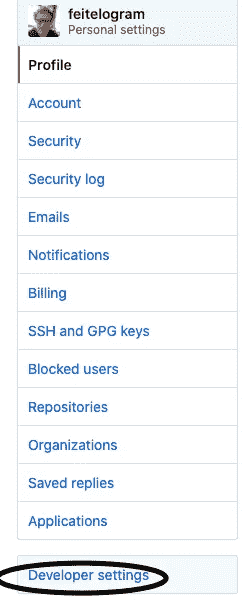
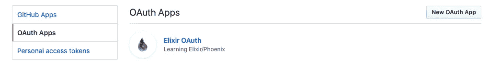

# 如何在 Elixir/Phoenix 1.5 中用 Github 做 OAuth

> 原文：<https://levelup.gitconnected.com/how-to-do-oauth-with-github-in-elixir-phoenix-1-5-c2bd5dc05cb1>


是的，OAuth 到底是什么？

在我排名第一的编码训练营/光荣的 WeWork 附属机构中，OAuth 经常被悄悄地提起。我们学习了 [JWT 认证](https://jwt.io/introduction/)，我仍然认为它很酷，这是一种界定谁能够访问应用程序中的哪些数据的方法，并确保黑客或任何寻找不法行为的人不能轻易模仿另一个用户。

尽管 JWT 需要很多步骤。人们需要使用基于浏览器的 localStorage API 来给用户提供 cookies，以确保他们是他们所说的那个人，更糟糕的是，你必须找到一种方法来加密用户的密码，处理他们是否忘记了密码或者他们是否已经在数据库中并试图注册，等等。

**旁白:**有人向我指出，从技术上讲，人们不应该将 JWT 令牌存储在 *localStorage* 中，而应该存储在一个 **httpOnly Cookie** ，[见附带的博客文章](https://blog.logrocket.com/jwt-authentication-best-practices/#:~:text=A%20JWT%20needs%20to%20be,storage%20(or%20session%20storage)。*JWT 代币的本地存储*这是我在学校学到的方法，但行业惯例各不相同，我承认在这里我可能是错的。讽刺的是，这也是 OAuth 受欢迎的原因之一！

让别人做不是更容易吗？

有人可以！OAuth 或 Open Authentication 基本上采用了处理用户身份验证的想法，并将其传递给用户很可能已经拥有帐户的更大的网站，如谷歌、脸书、亚马逊或 Github。

当然，现在 OAuth 充满了自己的问题。你必须注册这些网站中的一个，他们可能会用他们自己的指标跟踪谁会去你的网站，这也有助于公司整合世界，从独立的供应商到“太大而不能倒”的网站和公司，但是嘿，它看起来很酷，它真的很容易，涉及我们做更少的工作，加上它涉及用户记住或处理更少的密码，这可能是也可能不是一件好事。

不管怎样，我们开始吧。这个博客的灵感来自于我在一个 Elixir/Phoenix 项目中的工作，这个项目需要 OAuth 和 Udemy 课程，这个课程真的很棒，但遗憾的是，鉴于 Phoenix 的快速发展，这个课程有点过时了。

现在，我知道不是每个人都知道 Elixir(一种编译成 Erlang 的语言)或 Phoenix(Elixir 的 Rails/Express ),但可以说， **Elixir 是一种快速、功能性和容错的编程语言**。它还能很好地处理并发性，这也是它现在经常被使用的原因。

总之:

1.  **将 Ueberauth 和 Ueberauth-Github 作为依赖项添加到您的 mix 文件中**

```
defp deps do [ {:phoenix, "~> 1.5.1"}, {:phoenix_ecto, "~> 4.1"}, {:ecto_sql, "~> 3.4"}, {:postgrex, ">= 0.0.0"}, {:phoenix_html, "~> 2.11"}, {:phoenix_live_reload, "~> 1.2", only: :dev}, {:phoenix_live_dashboard, "~> 0.2.0"}, {:telemetry_metrics, "~> 0.4"}, {:telemetry_poller, "~> 0.4"}, {:gettext, "~> 0.11"}, {:jason, "~> 1.0"}, {:plug_cowboy, "~> 2.0"}, {:ueberauth, "~> 0.6"}, {:ueberauth_github, "~> 0.7"} ]end# Then in your command line run:$ mix deps.get# You also MAY have to add them to your "extra_applications"def application do [ mod: {WhateverYourAppIsNamed.Application, []}, extra_applications: [:logger, :runtime_tools, :ueberauth_github,       
   :ueberauth], ]end
```

这一步将告诉 Elixir/Phoenix 你想使用 [Ueberauth](https://github.com/ueberauth/ueberauth) ，这是一个 Elixir 包，它可以使 OAuth 相对无痛，并为你做很多设置。

2.**转到你的 config.exs 文件，添加下面的代码**

```
config :ueberauth, Ueberauth,providers: 
  [ github: {Ueberauth.Strategy.Github, [default_scope: 
   "user,public_repo"]} ]config :ueberauth, Ueberauth.Strategy.Github.OAuth,client_id: System.get_env("GITHUB_CLIENT_ID"),client_secret: System.get_env("GITHUB_CLIENT_SECRET")
```

注意最后两行是基于“ENV”的行。这意味着我已经把我用 Github 创建的 OAuth 应用程序的凭证放在某个秘密的地方了！我建议你也这样做！如果你没有上传文件到 GitHub，可以直接放在那里测试，但是要小心，因为你不希望你的 API 证书被公开！

另外，注意我有[default_scope: "user，public_repo"]。这是因为 GitHub 本质上不会通过 OAuth 向第三方应用提供大量信息。我相信默认参数只是“email ”,大多数 GitHub 成员都没有公开这个参数，所以它将返回一个`nil`值。这就是为什么我增加了一些选项的范围。

但是你问什么第三方 GitHub OAuth app？嗯…

3.**制作第三方 GitHub OAuth App！**



太私人了。

在你的 GitHub 设置下，可以去“开发者设置”。



那里已经有一个了！

在这里，您可以选择生成一个新的 OAuth 应用程序并生成凭证。这将给你你的客户 ID 和客户秘密，然后你可以把它们放在你的应用程序或 ENV 文件中。

4.**为这一切做一个控制器！**

```
# auth_controller.ex in my controllers folder, created for this code*defmodule* DiscussWeb.AuthController *do* use DiscussWeb, :controller plug Ueberauth alias Discuss.{User, Repo} *def* *callback*(%{assigns: %{ ueberauth_auth: auth}} = conn, params) *do* user_params = %{ token: auth.credentials.token, email: auth.info.email, provider: params["provider"] } changeset = User.changeset(%User{}, user_params) signin(conn, changeset) *end* *def* *signout*(conn, *_params*) *do* conn |> configure_session(drop: true) |> redirect(to: Routes.topic_path(conn, :index)) *end* *defp* *signin*(conn, changeset) *do* *case* insert_or_update_user(changeset) *do* {:ok, user} -> conn |> put_flash(:info, "You have been signed in.") |> put_session(:user_id, user.id) |> redirect(to: Routes.topic_path(conn, :index)) {:error, *_reason*} -> conn |> put_flash(:error, "Error signing in.") |> redirect(to: Routes.topic_path(conn, :index)) *end* *end* *defp* *insert_or_update_user*(changeset) *do* *case* Repo.get_by(User, email: changeset.changes.email) *do* nil -> Repo.insert(changeset) user -> {:ok, user} *end* *end**end*
```

这是我的代码，我邀请你去偷它！这里有很多需要解释的地方，假设读者了解一些 Phoenix 和像 Rails/Express 这样的 MVC 惯例，我会忽略掉。基本上，将 *plug Ueberauth* 与我们到目前为止定义的配置一起使用，会给我们一个看不见的 **request** 方法，如果我们在应用程序中创建一个到它的链接，它会将我们路由到 GitHub OAuth 应用程序。**回调**函数获取我们从成功使用 GitHub 登录的人那里得到的任何东西，并说*“用这些数据做这件事”。*

在这种情况下，我们试图将用户的数据保存在数据库中，作为对他们的简单引用，而不必以真正的 OAuth 方式处理密码。

**5。落实到某个地方！**

```
# from layout.eex since we want this on every page<nav *class*="light-blue"> <div *class*="nav-wrapper container"> <a *href*="/" *class*="brand-logo"> Discussions </a> <ul *class*="right"> <%= *if* @conn.assigns[:user] *do* %> <li> <%= link "Logout", to: Routes.auth_path(@conn, :signout) %> </li> <% *else* %> <li> <%= link "Sign in with Github", to: Routes.auth_path(@conn, :request, "github") %> </li> <% *end* %> </ul> </div></nav>
```

“auth_path”是一个路径帮助器，但是正如您所看到的，它链接到我们前面提到的不可见的 **request** 方法。然后，如果我们的 Auth 控制器中的处理工作正常，我们有一些简单的条件逻辑，允许我们显示一个登录/注销按钮。

成功！

总的来说，OAuth 是我在学校一直想学的一个话题，我很高兴我现在知道了它的一个版本。这是我可以对雇主和我的酷开发伙伴们说的又一个勾号，我知道至少一种实现它的方法。我还知道一种成为可爱狗狗的方法。它叫查理。


查理。

查理是一只可爱的约克混血狗，住在肖恩·卡西动物救助中心，这是纽约市的一个很棒的收容所。他有点害怕，因为他昨天刚刚到达，但这并没有阻止他给我亲吻，因为我走他，拥抱他在庇护所，你也可以！狗仍然需要散步，查理需要拥抱和一个人回家。

白现在来说，

网络信息中心(Network Information Center)ˌ网路界面卡(Network Interface Card)ˌ全国工业理事会(National Industrial Council)ˌ航行情报中心(Navigation Information Center)