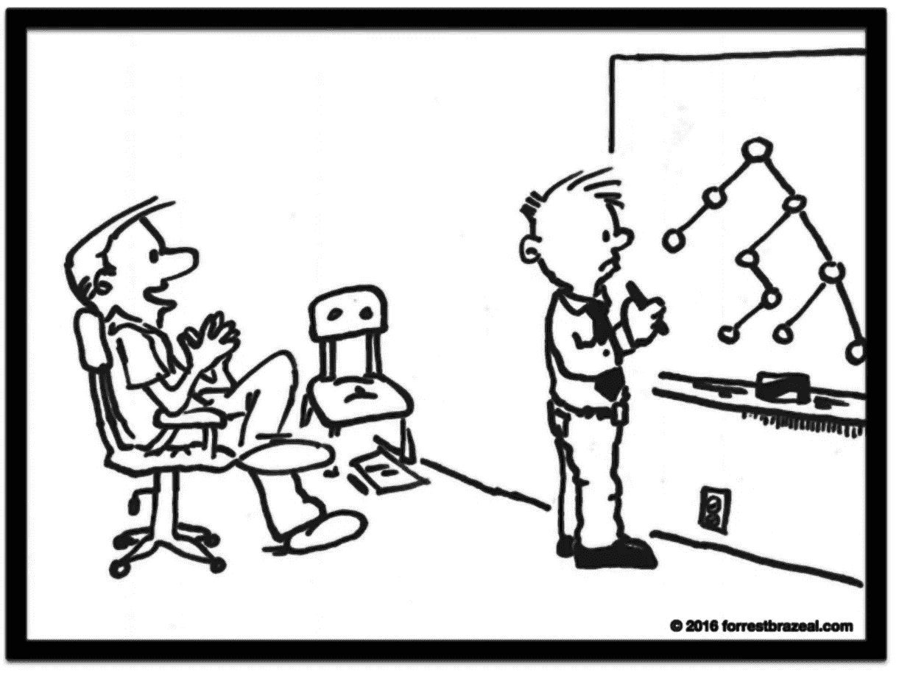
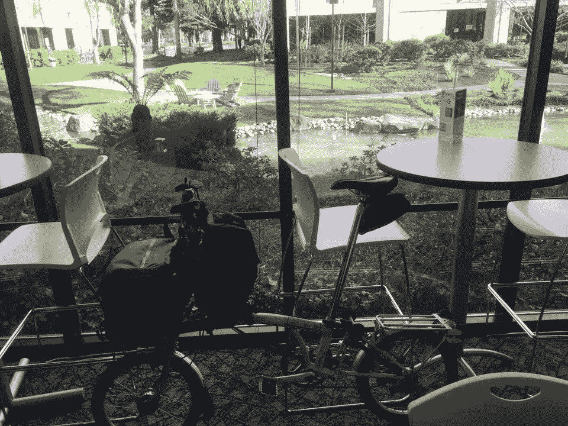
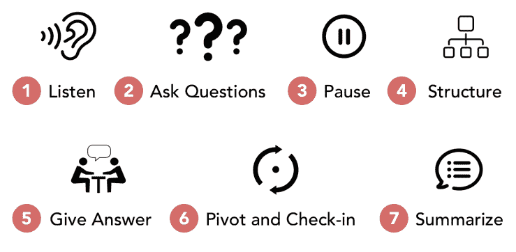

# 如何正确进行技术面试

> 原文：<https://levelup.gitconnected.com/how-to-do-technical-interviews-right-c9d0d569290>

## 这都是关于沟通

“我们希望受访者能够解决现实世界中的问题。因此，当你平衡这个二叉查找树时，我会改变要求，强加任意的截止日期，并审核你的法规遵从性。”[forrestbrazeal.com](http://forrestbrazeal.com)

一些人可能会认为技术面试是这样一件事:候选人试图推销他们的品质，面试官尽力挑战他们。相反，这是一个充满交流机会的双向讨论。

在面试过程中，候选人在推销他们的技能。但是，与此同时，他们也在从面试官那里了解他们将要共事的人，他们的行为有多专业，他们的沟通能力有多强。

一个有经验的候选人可能会面试多家公司，而一个好的候选人会从多家公司中做出选择。即使是糟糕的候选人也会在像 glassdoor.com 这样的网站上留下评论，这可能会让你的公司名声不好。

如果你善待所有候选人，并确保他们有良好的体验，你的公司将获得良好的评价，这将增加候选人的数量。

总之，面试是在测试面试官和应聘者的沟通技巧。

# **作为面试官面试**

作为一名面试官，你应该积极地把技术面试当成一次交流中的锻炼。用清晰的问题陈述和例子准备你要问的问题。使用适当的速度。说话清楚，口齿清楚。用同理心沟通。

作为一名面试官，你应该做笔记，包括时间戳，以便在汇报过程中用来证明你的决定是正确的。示例:

*   10:45 开始面试
*   11:00 开始编码
*   11:10 做了一个蛮力的方法

专注于收集*信号*，而不是在小细节上吹毛求疵。在因为一个小细节拒绝一个候选人之前，问问自己这个问题是否可以在代码审查或指导会议中轻松解决。如果是，这个细节到底有多重要？

没有足够的面试官这样做，但提前阅读候选人的简历是很重要的。它会让你了解他们经历的背景。你可以用你在简历中找到的东西来打破僵局，让候选人谈论一些他们非常熟悉的东西，至少我们希望如此。

理解面试是有压力的。作为面试官，你有能力让压力变得更大或更小。你的目标是收集信号。你在面试中不会有任何损失。所以，利用这一优势让求职者更加轻松。这样你会得到更多的信号。

你说了算，但尽量不要打断并“引导证人”。如果他们挣扎，让他们走一段时间也是可以的。鼓励他们继续使用肢体语言。

温柔点，专业点。当你介绍自己时，确保你清楚地说出自己的名字。将您的徽章放在手边，并向候选人展示它是如何书写的。你不一定要在面试中交朋友，但你最不想表现出的就是傲慢、优越感或古怪行为。

记住你需要交流。运用你拥有的所有沟通技巧。不要只是坐在那里盯着候选人。尽可能经常给他们反馈。说“好吧..”之类的话，“有意思……”，或者“说得好！”会鼓励候选人坚持下去，给你更多的信号。

# **作为候选人面试**

如何被优步、谷歌、亚马逊、LinkedIn、微软、脸书等公司录用？参见这篇[中型文章](https://medium.com/swlh/how-to-get-hired-at-uber-google-amazon-linkedin-microsoft-facebook-etc-4f5a2f159c25)，了解关于面试过程、准备工作、阅读书籍、面试过程如何运作、算法以及如何通过面试的技巧。

作为一名候选人，你应该把技术面试当作一次交流的练习。不要只关注算法、数据结构和架构设计。运用你出色的沟通技巧，确保面试结束后面试官会喜欢和你一起工作。

要自信，但不要自大。技术知识是关键，也是面试的基础。不可否认。然而，你应该接受任何要求澄清的调查。你可能认为你知道答案，但也许这个特殊的面试难题有一个转折。因此，自信地解释你的思维过程，但永远保持开放的心态。

研究你正在面试的公司和他们的面试过程。有时候，公司会给你发一份你将要会见的面试官名单。提前查一下。对他们喜欢的东西和喜欢的技术有一种感觉。这可能有助于你在面试的早期与他们建立融洽的关系。

准备典型问题的答案。不要在显而易见的问题上犹豫不决，比如“你为什么想在这家公司工作？”

交流。确保你很好地理解了这个问题。通常问题是以一种模糊或不明确的方式陈述的，其中需要做出某些假设。确保你们双方都同意这些假设。重复问题定义，写在黑板上。为问题编写测试用例。问面试官你是不是都记下了。

当你解决了一部分问题，就说出来。看看他们是否理解你的答案或解决方案。明确询问他们是否同意。当他们说什么的时候，用你自己的话重复。问他们你是否错过了什么，因为你肯定会这样做。

面试官主导面试，但你可以驾驭它。有时非常明显的是，存在一个蛮力解，然后是 O(log n)解，甚至可能是 O(1)解。如果你看到了那条路，告诉面试官，告诉他们你将如何解决问题，给自己设定时间，然后开始面试。

确保你也有问题。如果执行得好，每次面试都会以“你有什么问题要问我吗？”。你最好准备好一些…

总之，一次真正成功的面试类似于已经在一起工作的工程师之间的技术讨论，其中一个人遇到了问题，你们一起使用白板来解决它。一次成功的面试不像单向测试，一个人提问，另一个人回答。运用你的沟通技巧赢得面试。

# **理想的面试人选**

每个产品管理面试问题的完美结构——信用:【stephencognetta.com 

理想的候选人将技术面试视为一种沟通练习。他们有一个很棒的电梯演讲。他们通过提问和积极寻求反馈来参与对话。

理想的候选人会大声说话，从而解释他们隐藏的思维过程。他们通过感同身受来展示情商技能，将面试不仅仅视为一次测试。

成功的候选人使用情景-任务-行动-结果(STAR)方法。这让他们能够组织他们的答案，但也显示他们在现实生活中有条不紊地行动。他们展示了战略思维技能。

理想的候选人关注的是*为什么*和*如何*，而不是*什么*。他们不是说他们建立了一个数据库，而是解释它解决了什么问题，以及他们的行为如何改善了他们周围的世界。

哦，是的，理想的候选人实际上可以编码。