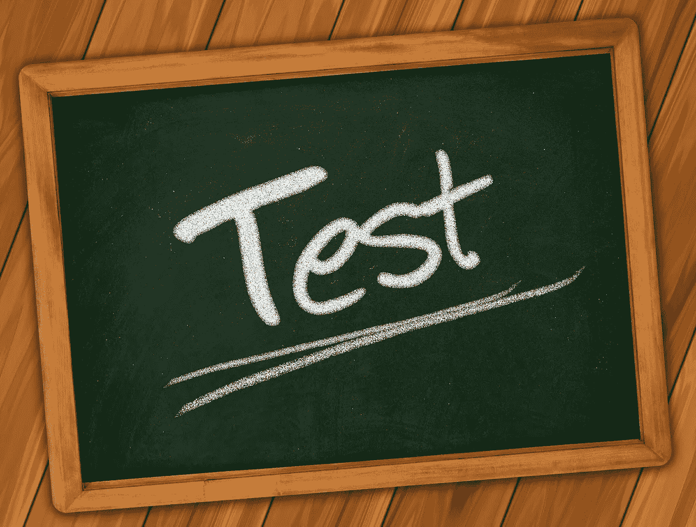
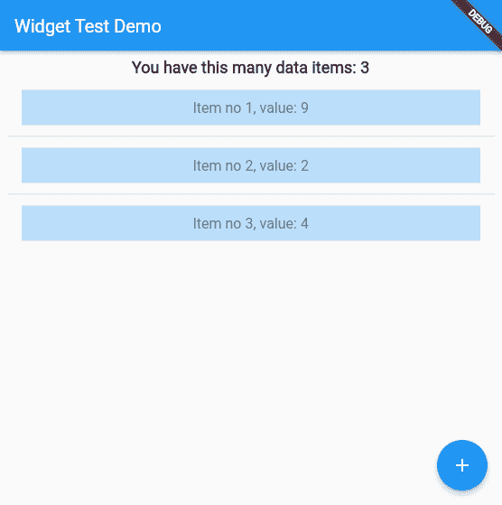
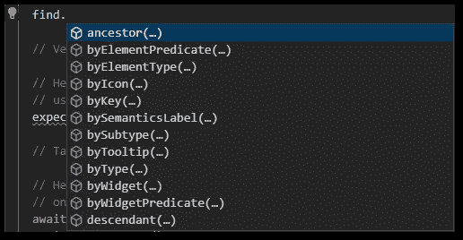

# 如何在 Flutter 应用程序中进行小部件测试

> 原文：<https://levelup.gitconnected.com/how-to-do-widget-testing-in-a-flutter-application-da2105909912>

## 让我们来看看 Flutter 应用程序中的小部件测试是如何工作的。通过本指南提高您的测试知识。

照片由 [geralt](https://pixabay.com/users/geralt-9301/) 从 [Pixabay](https://pixabay.com/illustrations/board-school-university-to-learn-361516/) 拍摄

Flutter 提供了几种类型的测试，可以用来确保正确的应用程序行为。还有[单元测试](https://docs.flutter.dev/cookbook/testing/unit/introduction)、[集成测试](https://docs.flutter.dev/testing/integration-tests)，最后是[小部件测试](https://docs.flutter.dev/cookbook/testing/widget/introduction)。在本文中，我们将关注小部件测试。这意味着应用程序的一部分在测试期间被渲染，你可以描述测试步骤来复制真实用户的行为。Flutter SDK 提供了模拟完整工作流的方法。

> 如果您想深入测试颤振应用，请查看📙[我的免费电子书](https://xeladu.gumroad.com/l/ftg)有更多细节！

## 要测试的应用程序

我创建了一个简单的应用程序，需要一些小部件测试。你可以在下面看到一个演示。

演示颤振应用程序将由作者测试

该应用包含一个带有静态[应用栏](https://api.flutter.dev/flutter/material/AppBar-class.html)的[脚手架](https://api.flutter.dev/flutter/material/Scaffold-class.html)，一个描述[文本](https://api.flutter.dev/flutter/widgets/Text-class.html)，一个[列表视图](https://api.flutter.dev/flutter/widgets/ListView-class.html)，以及一个[浮动操作按钮](https://api.flutter.dev/flutter/material/FloatingActionButton-class.html)。当您点击按钮时，一个新的行被插入到 ListView 中，并带有一个 0 到 10 之间的随机数，标题文本被更新，并显示一个 [SnackBar](https://api.flutter.dev/flutter/material/SnackBar-class.html) 。您也可以长按删除条目。一个简单的点击显示你点击了哪一行的确认。这就是我们现在要测试的。💪

## 编写测试

由于应用程序工作流程非常简单，我们将只编写一个满足所有需求的测试。当然，如果有意义的话，您可以将您的测试分成多个测试。良好的测试组织对于较大的应用程序来说是必不可少的，所以不要着急，想想什么是合理的。

我们的测试将完成以下任务: (🔹行动步骤，🔸验证步骤)

🔸验证已经存在 3 个数据项
🔹点击浮动操作按钮
🔸验证是否添加了新的数据项
🔹轻点第三项
🔸验证 SnackBar 显示的数据与列表中的数据相同
🔹长按第 2 项
🔸验证是否删除了正确的项目

小部件测试的测试框架类似于单元测试，但是有一个额外的 [WidgetTester](https://api.flutter.dev/flutter/flutter_test/WidgetTester-class.html) 参数。它总是看起来像这样

**WidgetTester**

[WidgetTester](https://api.flutter.dev/flutter/flutter_test/WidgetTester-class.html) 是测试期间执行动作的中央单元。例如，有一些方法可以

写入[TextField](https://api.flutter.dev/flutter/material/TextField-class.html)widgets→[enter text](https://api.flutter.dev/flutter/flutter_test/WidgetTester/enterText.html)
【点击 widgets】→[点击](https://api.flutter.dev/flutter/flutter_test/WidgetController/tap.html)
【触发动画和渲染】→ [pump](https://api.flutter.dev/flutter/flutter_test/WidgetTester/pump.html) 、 [pumpAndSettle](https://api.flutter.dev/flutter/flutter_test/WidgetTester/pumpAndSettle.html)

**查找小工具**

要查找小部件，可以使用[查找器](https://api.flutter.dev/flutter/flutter_test/Finder-class.html)类。它有很多方法可以找到你想要的东西。一些例子是

find.byType

VS 代码中查找器类的自动完成选项

**验证**

为了验证，您可以像在常规单元测试中一样使用 [expect 库](https://api.flutter.dev/flutter/package-test_api_expect/package-test_api_expect-library.html)。典型的 expect 语句可能如下所示:

`expect(find.byText(”test”), findsOneWidget);`

寻找一个或多个特定的小部件并断言它。

**把所有的放在一起**

小部件测试中的一般工作流程总是相同的。首先，您使用 Finder 来识别您想要与之交互的小部件。然后，将它传递给 WidgetTester，widget tester 执行一个动作并触发动画和渲染。最后，用 Expect 类验证结果。

测试示例如下所示。最后会链接整个 app 源代码。

## 结论

有了这个指南，你应该能够编写小部件测试来验证你的应用程序的正确行为。

## 源代码

你可以在 [GitHub](https://github.com/xeladu/flutter_widget_test) 上找到源代码。

[通过我的推荐链接加入成千上万的媒体会员，每月只需 5 美元就可以阅读你想阅读的文章。](https://medium.com/@xeladu/membership)

 [## 通过我的推荐链接加入 Medium-xela du

### 只需点击一下，就可以通过会员资格访问数千篇文章！您的会员资格只需 5 美元一张…

medium.com](https://medium.com/@xeladu/membership) 

点击 [**这里**](https://xeladu.medium.com/subscribe) 把我所有的新文章都发到你的邮箱里🔔如果你浏览[我的口香糖商店](https://xeladu.gumroad.com/)，你可能会找到你喜欢的东西([甚至是免费的](https://xeladu.gumroad.com/l/scratch))🏬

[赛拉杜](https://xeladu.medium.com/?source=post_page-----da2105909912--------------------------------)

## 测试你的 Flutter 应用

[View list](https://xeladu.medium.com/list/test-your-flutter-app-aabad9825b7f?source=post_page-----da2105909912--------------------------------)6 stories

xeladu

## 适合初学者的颤振文章

[View list](https://xeladu.medium.com/list/flutter-articles-for-beginners-a040ea777956?source=post_page-----da2105909912--------------------------------)24 stories

# 分级编码

感谢您成为我们社区的一员！在你离开之前:

*   👏为故事鼓掌，跟着作者走👉
*   📰查看[升级编码出版物](https://levelup.gitconnected.com/?utm_source=pub&utm_medium=post)中的更多内容
*   🔔关注我们:[Twitter](https://twitter.com/gitconnected)|[LinkedIn](https://www.linkedin.com/company/gitconnected)|[时事通讯](https://newsletter.levelup.dev)

🚀👉 [**加入升级人才集体，找到一份惊艳的工作**](https://jobs.levelup.dev/talent/welcome?referral=true)