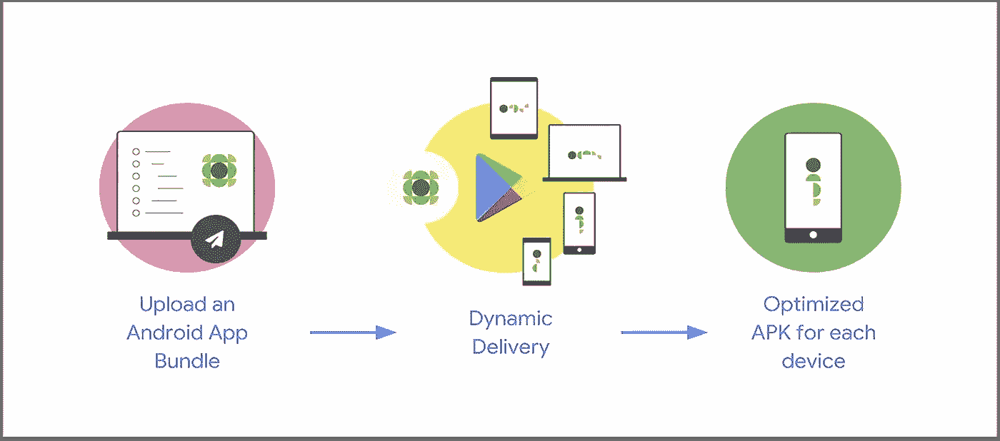

# 如何下载动态功能模块

> 原文：<https://levelup.gitconnected.com/how-to-download-dynamic-feature-modules-a6f6036e183b>

## 了解如何在下载模块时显示自定义加载屏幕



截图来自 Google IO 2018

## 从文章中删去

下载动态特征模块最简单的方法是通过动态导航器；简单有效。但是有一个问题—您不能显示自定义加载，因为它在导航组件的控制之下。

还有另一种下载动态特性模块的方法——使用`SplitInstallManager`监听器。通过这个监听器，我们可以在下载时显示我们的自定义加载。

# 介绍

`SplitInstallStateUpdatedListener`用于下载点播模块；使用这个侦听器的好处是，我们可以在状态改变时得到回调，比如开始下载时、下载完成后，或者在某些情况下下载失败时。

现在，让我们来看看`SplitInstallStateUpdatedListener`的一些回调状态，它们起着至关重要的作用，例如:

*   `DOWNLOADING` -点播模块当前正在下载。
*   `REQUIRES_USER_CONFIRMATION` -当试图下载非常大的模块时，可能会出现这种情况。
*   `INSTALLED` -请求的点播模块已经安装。
*   `INSTALLING` -按需模块已下载，正在安装
*   `FAILED` -下载或安装点播模块失败

拆分安装侦听器可以同时下载多个模块，因此开发人员有责任检查哪个模块下载完成或失败，并采取适当的措施。

通过它们的名字来玩核心库解析模块，所以确保没有错别字是至关重要的。按照我的建议，在创建模块时，首先要保持名称简单，这样就不会有问题。

# 检查模块安装状态

在请求下载之前，我们需要确保所需的模块尚未安装。为此，我们需要创建一个`SplitInstallManager`的实例，如下所示:

然后使用`SplitInstallManager` 实例，我们可以调用`installedModules` 函数，该函数返回所有已安装的模块名称。如果所需的模块在列表中，那么我们可以继续我们的功能，而不是下载它。看一看:

# 监听状态变化

现在，如果我们在已安装的模块列表中没有找到该模块，那么我们需要立即下载它。在此之前，我们需要创建一个监听器来处理状态的变化。看一看:

```
**private val** listener2 = 
    **SplitInstallStateUpdatedListener {** state **->

    }**
```

现在我们有了一个侦听器，是时候将它与您的 UI 组件绑定在一起了，这样您将只在生命周期有效时接收更新。因此，我们将在`onResume` 中注册监听器，并在`onPause` 中取消注册，如下所示:

既然我们已经注册了侦听器，那么是时候处理状态更改了。正如我已经提到的，任何时候都可以下载多个模块。因此，在处理状态之前，我们需要确定我们是在处理单次下载还是多次下载，如下所示:

```
**private val** listener2 =
    **SplitInstallStateUpdatedListener {** state **->** val **multiInstall** = state.moduleNames().size > 1
    **}**
```

一旦我们知道我们正在处理的是什么，就该适当地处理状态变化了，如下所示:

# 开始下载

到目前为止，我们验证了是否下载了所需的模块，并启动了一个监听器来观察下载模块时的状态变化。现在我们已经插入了 bullet，是时候扣动扳机了——开始下载。

首先，我们需要创建一个`SplitInstallRequest` ，并添加所有需要通过`addModule`功能下载的模块，如下图所示:

```
val request = **SplitInstallRequest**.newBuilder()
            .**addModule**(name)
            .build()
```

现在我们需要通过将`**SplitInstallRequest**` 作为参数传递来调用`SplitInstallManager` 实例上的`startInstall` ，如下所示:

```
manager.**startInstall**(request)
```

现在，我们可以用之前附加的监听器观察下载中的变化。这就是你已经成功实现的自定义模块下载。

# 奖金

要了解更多关于动态交付和模块化编程的知识，请参考本系列以前的文章:

*   [“Android 中的动态交付—第一部分”](https://medium.com/android-dev-hacks/dynamic-delivery-in-android-part-1-634c686d7170)
*   [“Android 中的动态交付—第二部分”](https://medium.com/android-dev-hacks/dynamic-delivery-in-android-part-2-b3999513bfc0)
*   [“Android 中的动态交付—第三部分”](https://medium.com/android-dev-hacks/dynamic-delivery-in-android-part-3-3e1201c4955b)

希望你学到有用的东西，感谢阅读。

你可以在 [Medium](https://medium.com/@sgkantamani) 、 [Twitter](https://twitter.com/SG5202) 、 [Quora](https://www.quora.com/profile/Siva-Ganesh-Kantamani-1) 和 [LinkedIn](https://www.linkedin.com/in/siva-kantamani-bb59309b/) 上找到我。