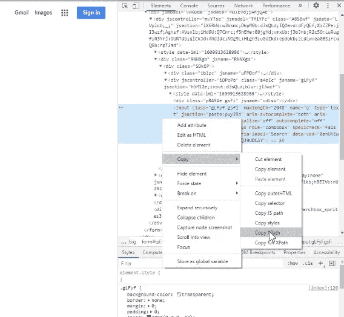

# 如何使用 Python 下载谷歌图片(2021)

> 原文：<https://levelup.gitconnected.com/how-to-download-google-images-using-python-2021-82e69c637d59>

## 我将向您展示如何使用 Python 中的几行代码在几秒钟内下载数百张 Google 图片


照片来自 Unsplash，作者: [Philippe Oursel](https://unsplash.com/photos/QvMRSTkc518)

你可能和我在同一条船上。我需要谷歌图片中的一堆图片，但我懒得手动下载每一张。因此，我在网上搜寻答案，但一无所获。

那时，我决定尝试自己做这件事，并编写一个程序，从 Google images 下载多张图片。

令人惊讶的是，我成功地用 Python 编写了一段代码，可以在几秒钟内下载数百张图片。

现在我想教你如何做同样的事，所以让我给你看…

**如何使用 Python 下载谷歌图片。**

# 步骤 1:硒

首先，我下载这些图片的方法是使用一个名为 Selenium 的库。Selenium 是一个库，允许您与网页进行交互，例如；向收件箱发送文本、点击按钮和自动滚动，所有这些都是通过代码实现的。

因此，您需要做的第一步是安装 Selenium 和一个 web 驱动程序。

没有必要担心，因为安装非常容易，我甚至制作了一个 4 分钟的短片，向你展示如何安装。

看完视频，安装了 Selenium 并下载了 web 驱动程序后，您的前几行应该导入 Selenium 并启动驱动程序，如下所示…

```
#Imports Packages
from selenium import webdriver
from selenium.webdriver.common.keys import Keys
import time #Opens up web driver and goes to Google Images
driver = webdriver.Chrome('C:/Web Scraping course/chromedriver.exe')
driver.get('https://www.google.ca/imghp?hl=en&tab=ri&authuser=0&ogbl')
```

当上面的代码行运行时，一个新的浏览器应该已经打开并转到 Google Images 网页。

# 步骤 2:与谷歌主页互动

就像我上面说的，Selenium 的伟大之处在于你可以通过下载的驱动程序与网页进行交互。因此，您将要编写的下一段代码会将文本输入到 Google Images 搜索栏中。

为此，您需要找到页面上搜索栏的位置。这是通过查找搜索栏的 Xpath 来完成的。

要找到 Xpath，您需要打开 web 页面的 HTML，方法是单击页面上的任意位置，然后按 inspect。

如果你这样做是正确的，你的网页应该看起来像下面的图片。


接下来，您必须找到对应于 Google 搜索栏的 HTML 代码。为此，单击刚刚弹出的框左上角的图标。看起来是这样的…


然后点击谷歌图片搜索框。完成后，右边的 HTML 将会更新，一段 HTML 代码会以蓝色突出显示…


要获取搜索栏的 Xpath，只需右击高亮显示的蓝色文本，然后按“复制 Xpath”。



现在你已经有了 Google Image 搜索栏的 Xpath，回到 Python，输入下面的代码，然后把你刚才复制的 Xpath 作为一个字符串粘贴到括号里。

**注意:**当你粘贴 Xpath 时，它不会在一个字符串中，你必须在 Xpath 的开头和结尾加上逗号，使它成为一个字符串。

```
box = driver.find_element_by_xpath(#Paste Xpath here)
```

它应该看起来像这样…

```
box = driver.find_element_by_xpath('//*[[@id](http://twitter.com/id)="sbtc"]/div/div[2]/input')
```

## 选择主题

现在我们有了 Google Image 搜索框的 Xpath，我们可以编写一些代码向其中输入文本。

假设我想下载长颈鹿的图片。因此，这就是我要在搜索框中输入的内容。下面的代码会把长颈鹿输入搜索框，按回车键正式搜索。

要更改主题，只需将下面代码中的 giraffe 替换为您想要搜索的内容。

```
box.send_keys('giraffe')
box.send_keys(Keys.ENTER)
```

# 步骤 3:向下滚动网页

谷歌图片是一个无限滚动的网页。这意味着当你继续向下滚动网页时，新的图像会加载进来，直到没有图像了。

因此，如果我们想下载数百张图片，我们必须首先通过向下滚动将它们加载到网页中。

很明显，你不想手动操作，我也不想手动操作。因此，我创建了一个代码块，它将一直向下滚动网页，直到不再有图像需要加载。

只需复制下面的代码，并将其粘贴到您的 Python 脚本中。

# 步骤 4:下载图像

最后一步是正式下载图片，但我们不会真的下载它们，我们会截屏。

Selenium 有一个名为 screen down 的特殊功能，可以将图像截图并保存到一个特定的文件中，就像你正在下载它们一样。

我们需要获得的唯一信息是图像的 Xpath。现在你已经知道怎么做了。

右键单击页面上的任意位置，然后按 inspect。会弹出当前网页的 HTML。然后选择我在步骤 2 中告诉你按下的图标，然后点击页面上的第一个图像。

如果操作正确，HTML 将会更新，并且会有一段 HTML 代码以蓝色突出显示。


正如您在步骤 2 中所做的，复制用蓝色突出显示的代码的 Xpath。

现在 Xpath 主要只用于第一幅图像。要获得其他图像的 Xpath，我们所要做的就是改变 1 个数字。

例如，您复制的 Xpath 应该如下所示:

*   //*[[@ id](http://twitter.com/id)= " islrg "]/div[1]/div[**1**]/a[1]/div[1]/img

要切换到第二张图片的 Xpath，您所要做的就是将上面加粗的数字改为 2，就像这样。

*   //*[[@ id](http://twitter.com/id)= " islrg "]/div[1]/div[**2**]/a[1]/div[1]/img

…您继续这样做，以获得页面上第 3、4、5、10 张图像的 Xpath。

因此，我们将创建一个 for 循环，每次将这个数字增加 1，以获得不同图像的 Xpath。

既然上面的代码遍历了所有图像的 Xpath，我们现在可以使用截图功能将它们保存在一个文件中。

我们通过添加**来做到这一点。截图()**到我们的驱动程序行的末尾，输入一个文件路径到你想要保存图像的空括号中。

给你总结一下，上面的代码会对 Google Images 上的前 100 张图片进行截图(你可以通过改变 for 循环来改变这个数字)。然后，它会将每个图像保存在我指定的文件夹中，如长颈鹿(1)，长颈鹿(2)，长颈鹿(3)，等等。

最后，当我运行这段代码时，我保存图像的文件夹看起来像这样…


有些可能并不完美，但大多数都是如此

**祝贺你！**如果你做的一切都正确，你现在应该可以使用 Python 下载谷歌图片了。

# 迷茫？想看这篇文章的视频吗

如果你在阅读这篇文章的时候有一些困惑，你应该看看我在 YouTube 频道上发布的关于**的一步一步的教程。**

# 访问此代码的干净版本

如果你想获得创建这篇文章所使用的代码的一个完全干净的评论版本，你可以加入我的群 **"Clean Code Z"** ，通过加入，你将获得我在所有文章和视频中使用的代码的干净版本。

感受感受加入这里: [**干净代码 Z**](http://wondrous-originator-2391.ck.page/christopherzita/cleancodez)