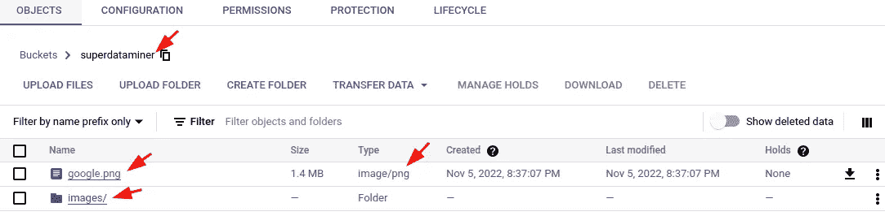
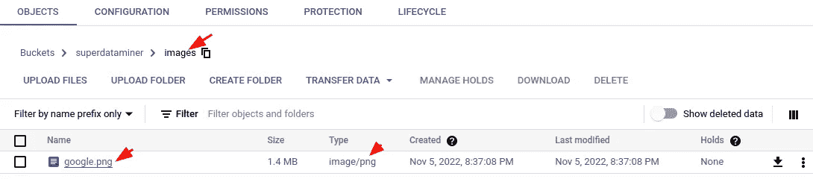
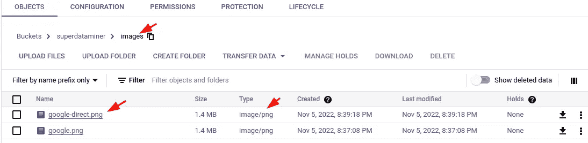

# 如何从 URL 下载图片，转换类型，并用 Python 保存到云中

> 原文：<https://levelup.gitconnected.com/how-to-download-images-from-urls-convert-the-type-and-save-them-in-the-cloud-with-python-294e11811243>

## 用 Python 学习简单的图像处理


[图片由暗月 _ 艺术在 Pixabay](https://pixabay.com/photos/fantasy-to-travel-travel-vacations-3502188/)

提供第三方映像可能不稳定，因为可能会有延迟，而且它们可能会在没有事先通知的情况下被更改或删除。因此，为了您的服务的健壮性，有时您需要下载图像并提供它们的稳定版本。

在这篇文章中，我们将介绍如何从 URL 下载图像，转换或规范化类型，并将它们保存在云中，这样它们就可以以更健壮的方式在您的应用程序中使用。

## 从 URL 下载图像

从 URL 下载图像似乎很简单，因为我们只需要获取内容并将其保存到文件中。然而，许多现代图像提供商在 URL 中没有简单的图像名称。在这种情况下，我们需要为它指定一个名称并指定扩展名。使用`mimetypes`库的`guess_extension`函数可以准确地猜出大多数常见图像类型的扩展名。但是有些比较新的图片类型比如 [*webp*](https://en.wikipedia.org/wiki/WebP) 是猜不出来的。在这种情况下，我们可以在不知道原始图像类型的情况下将图像转换为标准类型，这将在本文的下一节中介绍。

下面的代码片段演示了如何从 URL 下载图像的内容，猜测其扩展名，并将其保存在本地。

## 转换图像的类型

如上所述，有时图像类型不能被`mimetypes`库猜到。在这种情况下，我们可以使用流行且功能强大的图像处理库 [***枕***](https://pypi.org/project/Pillow/) 进行类型转换并保存为标准格式。

建议将 *Pillow* 安装在[虚拟环境](https://lynn-kwong.medium.com/how-to-create-virtual-environments-with-venv-and-conda-in-python-31814c0a8ec2)中，以免影响系统的库。注意，我们需要使用`BytesIO`类将请求内容转换成类似文件的对象，这样它就可以被 *Pillow* 读取。

我们不需要显式转换图像的类型，只需在保存时指定一种格式，类型就会自动转换:

## 在云中保存图像

现在，让我们将下载的图像保存到云中，以便我们的应用程序可以使用它们。在这篇文章中，我们将把图片保存在 Google 云存储中，但是其中的逻辑和过程应该适用于其他云提供商。

您可以使用服务帐户 JSON 文件验证您的存储客户端，如本文中的[所示。或者，你可以使用一个谷歌用户账户来认证你所有的谷歌客户端库，如本文](https://lynn-kwong.medium.com/how-to-use-gsutil-and-python-to-deal-with-files-in-google-cloud-storage-fc4f430b3b28)中的[所示。这里我们将采用第二种方法，因为它更简单。](/how-to-set-up-your-local-environment-to-work-with-gcp-4ed0a11421ef)

首先，在您的虚拟环境中安装[*Google-cloud-storage*](https://pypi.org/project/google-cloud-storage/)库。然后认证你的谷歌图书馆。基本上，您只需要运行以下命令:

```
$ gcloud auth login
$ gcloud auth application-default login
```

如果需要，请查看[这篇文章](/how-to-set-up-your-local-environment-to-work-with-gcp-4ed0a11421ef)了解如何设置您的本地环境以便与 GCP 一起工作。

当一切都设置好了，我们就可以上传图像到 GCP 存储。您需要首先创建一个 bucket，它应该有一个全局惟一的名称。如本文中的[所示，你可以在 GCP 控制台中完成，或者使用`gsutil`或 Python 中的存储库。](https://lynn-kwong.medium.com/how-to-use-gsutil-and-python-to-deal-with-files-in-google-cloud-storage-fc4f430b3b28)

在 GCP 存储中，一个文件对象被称为 [*blob*](https://googleapis.dev/python/storage/latest/blobs.html) ，它由 bucket 对象创建，包含文件的元数据。blob 用于将文件上传到 GCP 存储。

请查看下面的代码片段，了解如何将文件上传到 GCP 存储。这是不言自明的。但是，请注意，我们可以在文件名中指定路径，文件夹/子文件夹将在 bucket 中自动创建。

这段代码可以进一步改进。我们不需要将图像保存在本地，然后上传到 GCP 存储，这样效率很低。改进将在下一节中介绍，然后您将有一个可以直接用于您的工作的代码的最终版本。

运行上述代码后，您可以检查 GCP 存储中的文件夹和图像:



## 直接在云中保存图像—最终版本

在前面的示例中，图像首先保存在本地，然后上传到 GCP 存储。然而，这是低效的，因为它涉及额外的 IO 操作。此外，我们需要将它们适当地保存在本地的某个地方，并在以后清理它们。幸运的是，我们可以直接将图像上传到云中，而不用保存在本地，这避免了所有这些麻烦。

这又是通过神奇的`BytesIO`类实现的。我们可以用`BytesIO`创建一个类似文件的对象，然后用 *Pillow* 将图像保存到其中。类似文件的对象包含转换后图像的内容，可以通过 blob 的`upload_from_string`方法上传到 GCP 存储器，该方法接受二进制字符串作为输入:

当您检查 GCP 存储时，您会发现图像也可以通过这种方式成功上传。



在这篇文章中，我们介绍了如何从 URL 下载图片，转换类型并保存在云中。代码片段易于理解，涵盖了所有常见的实际用法。如果你在应用程序中遇到不稳定的图像，这篇文章可以帮助你。

## 相关文章

*   [如何使用 *gsutil* 和 Python 处理 Google 云存储中的文件](https://lynn-kwong.medium.com/how-to-use-gsutil-and-python-to-deal-with-files-in-google-cloud-storage-fc4f430b3b28)
*   [如何设置您的本地环境以便与 GCP 一起工作](/how-to-set-up-your-local-environment-to-work-with-gcp-4ed0a11421ef)

# 分级编码

感谢您成为我们社区的一员！在你离开之前:

*   👏为故事鼓掌，跟着作者走👉
*   📰查看[升级编码出版物](https://levelup.gitconnected.com/?utm_source=pub&utm_medium=post)中的更多内容
*   🔔关注我们:[Twitter](https://twitter.com/gitconnected)|[LinkedIn](https://www.linkedin.com/company/gitconnected)|[时事通讯](https://newsletter.levelup.dev)

🚀👉 [**将像你这样的开发人员安置在顶级创业公司和科技公司**](https://jobs.levelup.dev/talent/welcome?referral=true)