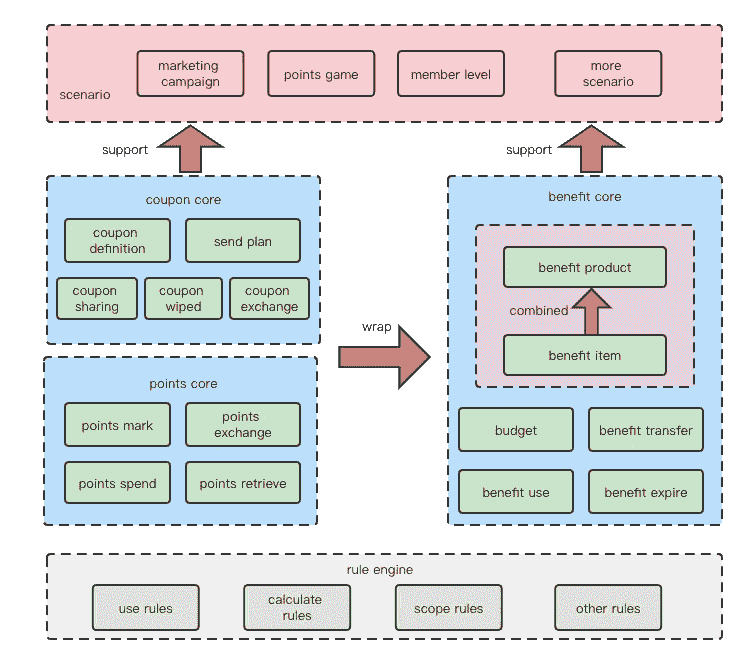
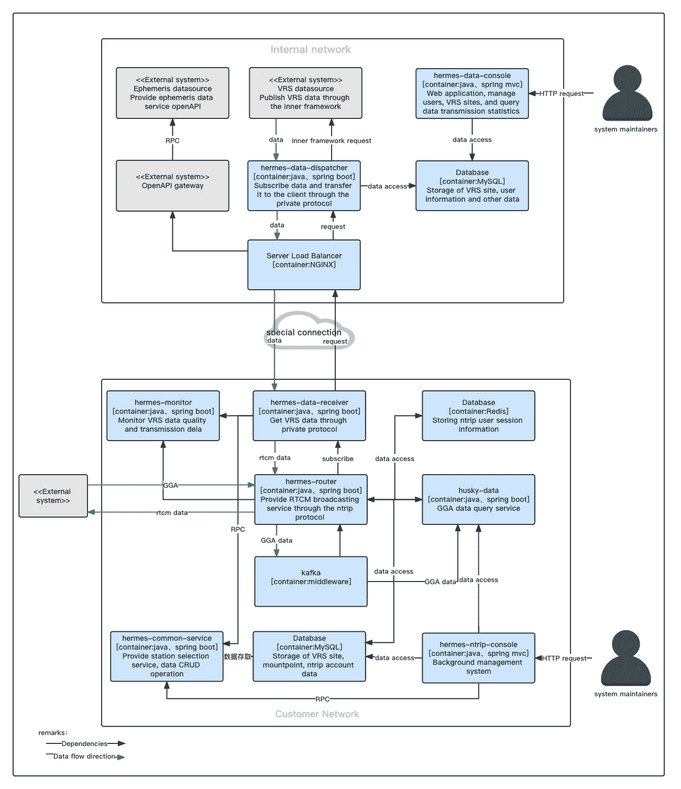

# 如何绘制技术架构图

> 原文：<https://levelup.gitconnected.com/how-to-draw-a-technical-architecture-diagram-2d2c3b4a1d07>

什么是架构图？为什么要画架构图？怎样才能画出通俗易懂的架构图？

相信很多读者都看过很多技术文档，这些文档都会附有一些架构图，帮助读者理解作者的意图。在许多情况下，这样一个描述系统的图表远比一大段文字更有效，所以当我写技术解决方案时，我喜欢用架构图来描述我设计的系统。但是我发现并不是所有人都擅长画架构图。

您在绘制架构图时是否经常遇到以下情况:

*   你擅长写代码，却不知道怎么处理画布。
*   你不知道系统里应该画什么或者省略什么。
*   布局很乱。怎么调你都不满意。

有这些困惑很正常。第一次尝试画画的时候，我也很迷茫。今天我就试着用我多年的经验和大家探讨一下如何画出一个好的技术架构图。

## 什么是架构图？

要画好架构图，首先要知道什么是架构图。架构图的简单解释就是描述系统架构。什么是建筑？要回答这个问题，其实可以从其他行业找灵感，比如一个公司的组织架构，它描述了公司是如何组建的，有多少个部门，每个部门有多少人，部门之间存在什么关系。系统架构也可以这样理解。

系统架构是描述系统是如何组成的，系统有多少模块和组件，模块和组件之间的关系。

## 建模

知道了什么是系统架构，我们就离绘制技术架构图更近了一步。但是我们的系统太复杂了，任何系统都有成千上万行代码要构建。我们真正要在图上表达的元素是什么？此时，我将对系统进行建模。建模是一种抽象客观事实来表达对事物本身的理解的方法。听起来很抽象，举个例子就好。如果要做无人机、战斗机、民航飞机、火箭的模型，应该怎么做？首先，找一个抽象的维度。例如，我们可以从功能角度将它们抽象为武器。第二，我们需要根据这个维度找到他们的共同点。比如这些东西都有飞行的属性，需要燃料驱动。接下来，我们可以自然地建立一个具有燃料、起飞、着陆、导航和其他功能的飞机模型。

回到系统架构，如果我们要画一个系统架构图，我们需要通过一些维度对我们的系统建模，然后把模型表达在画布上。以我的经验，基本有以下几个维度:业务、系统、部署。通过这些维度构建的模型可以称为业务架构图、系统架构图和部署架构图。不同的人对架构图有不同的看法。比如我们业务员更注重系统功能。当我们向销售人员解释系统时，我们应该使用业务架构图来帮助描述它。

## 业务架构图

为了画出好的业务架构图，你必须充分了解业务流程，从业务的角度分析业务之间的关系，通过你对业务的理解，识别每个流程的业务属性，然后分层抽象，最终实现产品功能的闭环。

以会员福利业务为例。首先，我们需要拆分业务。应该有积分制，优惠券制，会员权益特权制。积分、优惠券和特权都有自己的生命周期。我们需要确定它们生命周期中的每个阶段。那么这些要素就形成了权益的核心能力。我们也可以利用这些核心能力形成各种上层产品。比如我可以把几张优惠券组合成一个会员福利发给会员。那么我们的能力和产品能支持哪些业务场景。这是我的业务架构图的一个例子。

## 系统架构图

系统架构图是给软件开发人员画的，所以这个架构图和上面的业务架构图是完全不同的。我们需要通过图表告诉他们如何设计我们的系统。具体需求如下:

*   需要清晰的描述系统中有多少模块，每个模块的职责，每个模块的边界在哪里。
*   模块之间的关系以及它们如何通信。
*   如何在模块间传输数据？

我个人推荐使用 C4 模式。如果你有兴趣的话，可以参考 C4 模型官方网站([https://c4model.com](https://c4model.com/))。这是我用 C4 模型画的系统架构图。

建筑是非常抽象的东西。理解建筑需要很长时间。通过自己的理解画出系统架构是比较困难的。希望通过这篇文章，可以整理出一些方法论，可以解决你在架上构图的一些困惑。感谢您的阅读。

 [## JDK-8 中的 ConcurrentHashMap 有一些 bug

### 是的，你没看错。在 JDK-8 中，ConcurrentHashMap 中有一些 bug，可能会给你带来麻烦。

levelup.gitconnected.com](/what-there-are-some-bugs-in-concurrenthashmap-de168de084a8)  [## 每个 Java 开发人员都必须知道的七个 Intellij 调试技巧

### 你知道这些把戏吗？这些一定会提高你的开发效率。

levelup.gitconnected.com](/seven-intellij-debug-tricks-that-every-java-developer-must-know-de26aaac736a)  [## 不要使用 FileInputStream 传输文件

### 为了提高效率，请使用 FileChannel。

levelup.gitconnected.com](/dont-use-fileinputstream-to-transfer-files-5990805de28e)