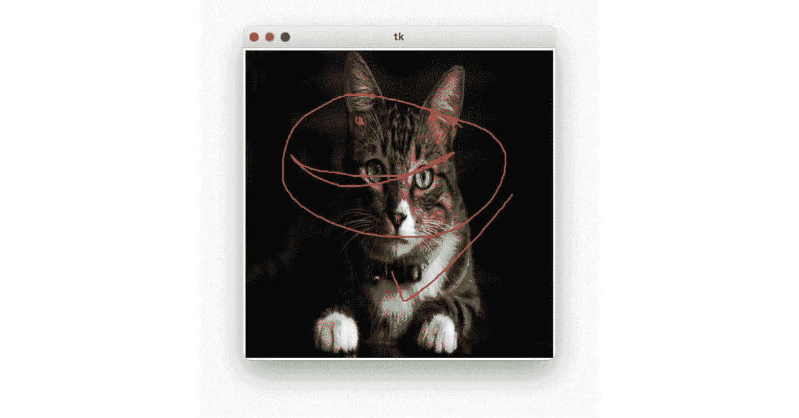
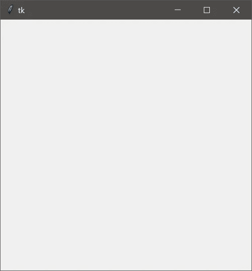
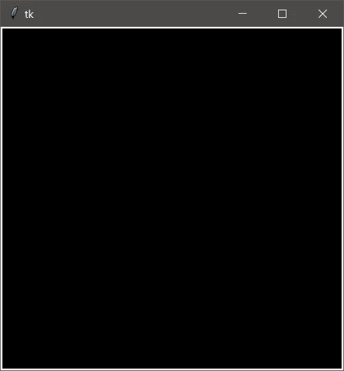
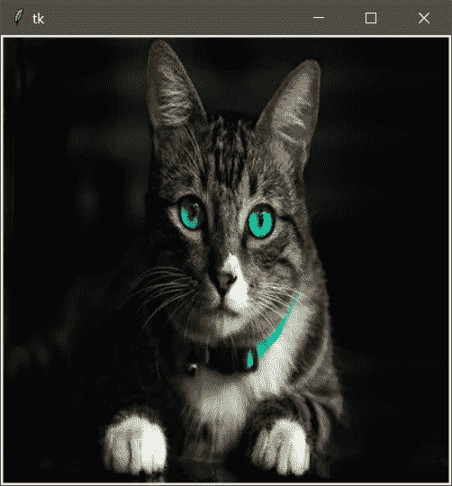

# 如何使用鼠标在 Python 中的图像或画布上绘图

> 原文：<https://levelup.gitconnected.com/how-to-draw-on-an-image-or-canvas-in-python-using-the-mouse-257f9d091f86>

## 如果你想在 Tkinter 的图像或画布上画点什么。有些步骤你应该先做。在这篇博客中一步一步地跟随我，看看你是如何轻松做到的。

> 原文在我的博客网站 [**这里**](https://pycad.co/how-to-draw-on-an-image/) 。

# 台阶

*   创建应用程序
*   创建画布
*   将图像放在画布上
*   使用鼠标在画布上画线



# 创建应用程序

为了创建应用程序，我们将只使用 4 行代码(如果你以前从未使用过 Tkinter，你可以在这个 [**链接**](https://pycad.co/how-to-create-a-desktop-application-using-python-and-tkinter/) 查看我的另一篇关于如何为初学者创建 Tkinter 应用程序的博客)。然而，我会给你 4 行代码来创建一个空的应用程序，我们需要在这个项目中。

```
from tkinter import *
app = Tk()
app.geometry("400x400")
app.mainloop()
```

第一行是包含 Tkinter 库。第二行是创建应用程序。第三步是更改应用程序的维度，最后一行是将应用程序作为主循环，这样它将保持运行。



# 在 Tkinter 中创建画布

现在，在这之后，我们已经创建了空应用程序。我们需要在上面放一块画布，这样我们就可以在上面画画了。要创建一个非常真实的画布，我们将使用 Tkinter 的 canvas 函数。您可以在这两行代码中看到如何实现。

```
canvas = Canvas(app, bg='black')
canvas.pack(anchor='nw', fill='both', expand=1)
```

在第一行，我创建了一个黑色背景的画布。然后在第二行，我将它打包在应用程序中，但你可以看到，还有一些其他参数，我现在将讨论。

还有就是**锚点**是选择画布的起点。为此，我为 nor-west 设置了**‘NW’**，这意味着画布的第一个点将位于小部件的相同起点(0，0)。

对于 **fill** 和 **expand** 参数，用于在应用程序的整个区域上拉伸画布，以便我们可以使用整个尺寸。即使我们改变了窗口的大小，画布的大小也会自动改变。



# 如何在画布中放置图像

现在到了将图像放入画布的步骤，为此我使用 pillow library 打开图像，调整其大小，并为 Tkinter 应用程序做好准备。

然后，你应该使用“create_image”函数创建一个画布图像，这样你就可以在上面画画了。

下面是实现这一点的代码行:

```
image = Image.open("image.jpg")
image = image.resize((400,400), Image.ANTIALIAS)
image = ImageTk.PhotoImage(image)
canvas.create_image(0,0, image=image, anchor='nw')
```

你可以看到我调整了图像的大小，使其适合画布(你可以查看视频[](https://www.youtube.com/watch?v=4ehHuDDH-uc&t=1s&ab_channel=pycad)**，它有更多的细节)。**

**这是应用程序上的图像:**

****

# **使用鼠标在图像上绘图**

**现在到了最后一步，将图像放到画布上后，我们需要为绘图创建两个函数。第一个函数是获取鼠标第一次点击的 x 和 y 坐标，然后第二个函数用新的点击获取前一次点击的坐标并画一条线。因为画一条线只需要两点，起点和终点。对于这一点，如果我们一直点击按钮，然后拖动进行绘制，这意味着我们正在创建许多点，这些点之间的距离非常小。用这些点我们画线，这样它会是连续的…**

**[***阅读更多***](https://pycad.co/how-to-draw-on-an-image/)**

****

**[链接此处](https://pycad.co/how-to-draw-on-an-image/)**

> **订阅[我的简讯](https://astounding-teacher-3608.ck.page/136bdb1fbe)获取我工作的所有更新:)。**