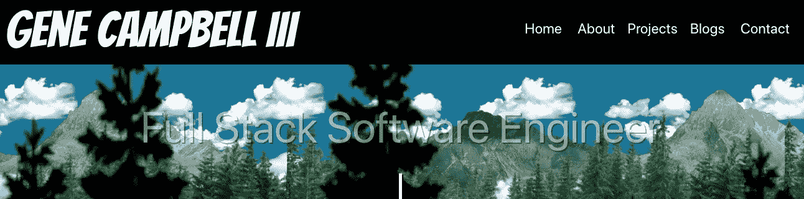
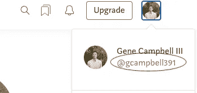
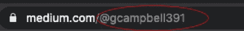
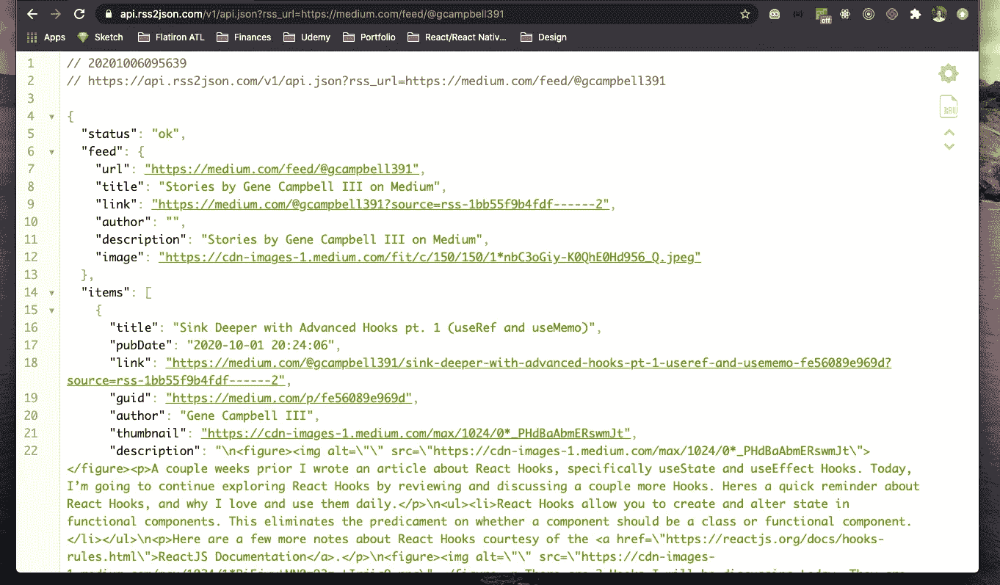
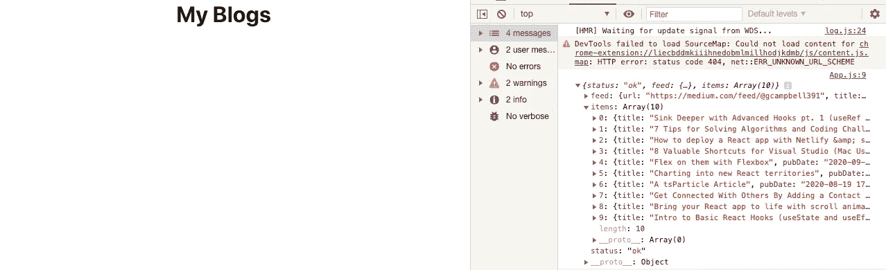
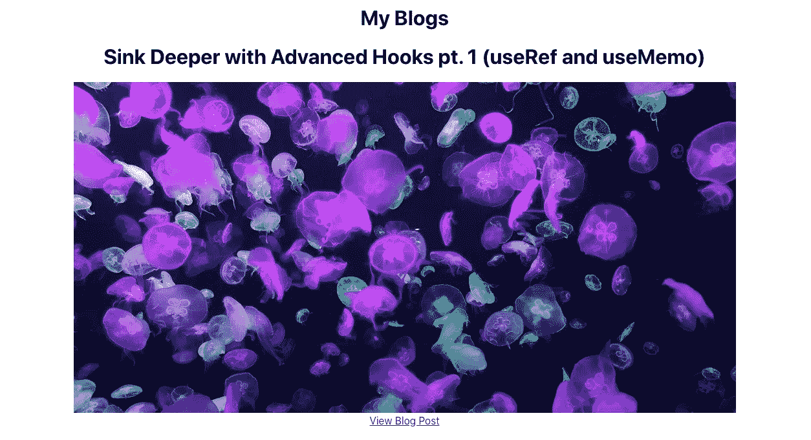

# 如何在你的作品集网站上动态呈现你的中型博客文章

> 原文：<https://levelup.gitconnected.com/how-to-dynamically-render-your-medium-blog-posts-on-your-portfolio-site-6b008580bd34>

如果你没有读过我以前的文章或帖子，我是一名软件开发人员，目前正在寻找他的第一份全职工作。与此同时，我每周写博客，从事个人编码项目。我从 Flatiron 毕业后创建的第一个项目是我的[作品集网站](http://www.genecampbell3.net/)。一个作品集网站对于一个开发者来说是理想的**展示他们的技能和项目的地方，它也应该为其他人联系你提供一个方便的方式。**

我的作品集网站分为几个不同的页面:主页/欢迎、关于我、项目、博客和联系人。直到最近，每当我写一个新的博客，我都必须手动添加一个新的“博客卡”到我的博客页面。这并不难，但是很乏味，我知道必须有一种更有效的方法来在我的作品集网站上呈现我的博客文章。我决定做一些谷歌搜索！

发现了一篇栈溢出文章(现在找不到了，不然我会提供作为出处！)提供了一个 URL 来访问您最近发表的 10 篇中型博客文章。网址在下面！

**https://api.rss2json.com/v1/api.json?RSS _ URL = https://medium . com/feed/@ { your _ medium _ tag _ name }**

我将向您展示我是如何在 Medium 上找到我的 URL 的，以及完成后的 URL 是什么样子的。然后我将展示如何在一个 **React** 项目中访问这个 API，并展示一些关于博客的东西。

## 1.找到您的中号标签名称

如果您导航到您的中型帐户，您可以通过单击右上角的图标找到您的标签名称。您的标签名称显示在您实际姓名的下方。您也可以在浏览器的地址栏中找到它。

## 2.练习在浏览器中访问完整的 URL

现在您有了自己的标签名，用您的**标签名**替换 **{your_medium_tag_name}** 。我的看起来像下面的例子。

**https://api.rss2json.com/v1/api.json?RSS _ URL = https://medium . com/feed/@ gcampbell 391**

接下来，将完成的 URL 复制并粘贴到新浏览器窗口的**地址栏**中。你应该看到像普通 API 一样的 JSON 格式的数据。下面是我的窗口和我的网址的截图。

现在，您已经拥有了从 React 项目访问 API 所需的一切。

**3。在 React 项目中通过简单的获取访问您的 API**

我们知道我们有一个**成功地**工作的 URL 端点从现在开始获取数据。我将编写一个简单的**获取**来从 URL 中检索数据，并将其显示在控制台中。一旦我们可以看到数据成功返回，我们将在页面上呈现一些信息！我将在 **App.js** 中编写我的所有代码，并在这次演示中尽可能保持简单。我将实现一些**钩子**比如 useState 和 useEffect 来管理**状态，在我的数据返回到控制台后。下面是我目前的代码。**

当我运行我的服务器时，我的屏幕看起来像下面的截图。

您可以在**右侧**的控制台中看到 10 个项目作为“项目”返回，我可以通过调用“ **data.items** ”来访问这些项目。我现在将实现钩子来管理所有博客的状态，并在页面呈现时获取博客。

## 4.实现 useState 和 useEffect 来管理博客的状态

确保将{useState，useEffect}添加到文件顶部**的 React 导入中。**

接下来，为所有博客创建 state 变量，并实现 useEffect 以在浏览器中呈现页面时设置博客的状态。fetch 将被**移动**到 useEffect 钩子中。useState 默认变量将是一个空的数组，因为我们希望将一组数据设置到我们的状态变量中。useEffect 参数中的第二个参数需要是一个**空数组**，所以我们的获取只运行一次。

您还应该注意到控制台日志的第 17 行。我这样做是为了确保博客的状态被正确更新。**现在一切**都设置好了，可以在页面上呈现博客了！

## 5.动态渲染博客

我将使用 map 来渲染每个单独的博客，包括它的图片、标题和链接。我将在每个博客属性的标签后使用**:**

— h1 —博客标题的标题

— img —显示博客缩略图的图像

—锚记，允许访问博客链接

更新文件后，浏览器现在**显示**所有的博客。造型**不**正确或理想，但这不是本文的**重点**。首要任务是返回每个博客的标题、图片和链接。下面是我在浏览器中显示的更新代码的截图。

您可以看到标题、图像和博客链接。我们已经**成功地**为我们期望的媒体渠道端点呈现了十篇最新的博客文章。如前所述，这些图像可能大小不同，因为**没有**样式被应用于代码库。正如你可能注意到的，还有一些**更多的**端点可以通过 API 访问，你可以随意地**创造性地**在**你的**作品集网站上呈现你的博客文章！

**有时候**你可能要等上 **24** 个小时才能让 medium API**更新**！我希望你发现这篇文章**是有益的**。如果你有任何问题或者只是想聊天，请随时通过 LinkedIn 或我的作品集网站 T21 联系我。你也可以看到我是如何在我的[作品集网站](http://www.genecampbell3.net/)上呈现我的博文的！感谢您的阅读，祝您度过美好的一天！