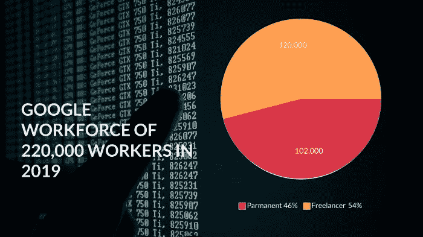

# 作为开发者如何更自由地赚更多的钱

> 原文：<https://levelup.gitconnected.com/how-to-earn-more-money-with-more-freedom-as-a-developer-1b252497d55a>

## 能黑兼职的开发者再也不想回去了。

来自[佩克斯](https://www.pexels.com/photo/woman-sitting-on-poolside-using-laptop-7903142/?utm_content=attributionCopyText&utm_medium=referral&utm_source=pexels)的[弗拉达·卡尔波维奇](https://www.pexels.com/@vlada-karpovich?utm_content=attributionCopyText&utm_medium=referral&utm_source=pexels)的照片

如果全职工作是 40 小时/周，那么 20 小时/周应该被称为兼职工作。每周工作 20 小时不仅会让你的生活变得精彩，还会极大地促进你的事业。

你认为兼职开发人员做兼职是因为他们没有得到全职工作吗？我不相信大部分开发者是这样的。

尽管根据 [StackOverflow 的开发人员调查](https://insights.stackoverflow.com/survey/2021)，超过 80%的专业开发人员从事全职工作。为什么那么多开发者都在做全职？

让我们看看。

# 为什么每个人都想要全职工作？

在我们进一步讨论为什么兼职工作比全职工作更好之前，我们需要讨论为什么每个人都想要一份全职工作。

1.  更多的钱
2.  金融安全

但是发展是不同于其他工作的工作。让我们来看看作为一名开发人员，你如何通过兼职来消除这两个因素。

# 20 小时/周

首先，就时薪而言，大部分兼职都比全职好。足够支付你的账单和其他费用了。所以，当你每周只工作 20 个小时，你会有很多时间做其他事情。

但是钱呢，对吧？每个人都想要更多的钱。我们将在下一节讨论如何明智地利用额外的时间赚更多的钱。

# 如何处理额外的时间

让我们来谈谈你应该如何投资你的额外时间。然后你就会明白为什么 20 小时/周是一个极好的策略。同样的方法帮助我的一位天使投资人和我的朋友提升了他们的事业。让我们深入了解事实。

# 人的能力发展

> 我创业公司的一个投资者在英国仅从发展咨询公司一天就赚 2000 英镑。他一个月只工作 7 天。有一次在一次谈话中，我们谈到了开发人员的工资、职业发展和其他一些问题。

他告诉我，“亚伯拉罕！当我开始工作时，我是公司里工资最低的开发人员之一。我努力工作，但是我的工资没有像预期的那样增长。我意识到在办公室工作了 8 个小时后，我没有精力学习任何东西。

> *然后我开始潇洒地工作。我告诉我的老板，我将每天少工作两个小时，工资也会降低。*
> 
> 我的老板问我为什么想要额外的时间。我告诉他，我想在这段时间里学习一些新的东西。他接受得很好，给了我两个月的带薪机会，每天学习两个小时。
> 
> *这只是开始。我的职业生涯像我认识的所有人一样从我开始。现在一个月工作 7 天，每天工作 4 小时。他们不给我打代码的钱。他们付钱给我关于复杂建筑和其他东西的知识。*

换句话说，他总是努力学习，这很难学，但对公司来说非常有价值。

> *投入 50%的额外时间去学习一些新东西*

没有什么比个人发展更重要的了。你学到的知识越多，你爬梯子的速度就越快，你得到的报酬就越多。

# 赚更多的钱

现在来看主要部分。做兼职实际上是通过自由职业和做独立开发者来赚更多钱的绝佳之举。

自由职业者正在增加，公司也在逐年雇佣更多的自由职业者。很多开发者认为，如果你是自由职业者，就不能在大公司工作。那也不是真的。

根据这个消息来源，在谷歌的 22 万员工中，有 12 万是自由职业者。这占总劳动力的 54%。

图:作者，数据:[彭博](https://flexiple.com/freelance/freelance-statistics-and-trends-2020/)

> 我的朋友在做这件事之前先和我讨论了这个话题。他有时会接到自由职业项目的邀请，但由于他的全职工作，他无法安排时间。但他也不能离开这份工作，因为这将是一个巨大的风险。
> 
> 所以他一有机会就去做兼职。他必须每周工作 20 小时(实际上甚至更少，因为这项工作很遥远，他可以在 10-15 小时内完成任务，而不是 20 小时)。然后他尝试了包括 toptal 在内的几个自由职业平台。

> *他现在只从 Toptal 赚到$ 5k-$ 10k*

这里重要的不仅仅是钱。你可以用很多方法赚钱。但是你能赚到的最好的钱来自于自由。

# 我的最爱——成为创业公司的一员。

只有金钱永远不能满足我。我是一种创造者。如果你是一个敢于冒险的人，并且相信更大的愿景，你可以成为初创企业的一员。

但在成为创业公司的合伙人/股东之前，要了解市场、市场规模、竞争对手。有一个合适的商业计划和战略，交一些好的合作伙伴。没有好的合作伙伴，创业肯定会失败。

你为什么要尝试这个？

> *因为启动是一个资产类别*

我觉得这是个好策略。一方面，你通过兼职赚钱，支付账单。另一方面，你通过创业和创造影响力为自己和社会积累资产。

很好地利用了你的兼职。

# 还有更多…

当你为了工作一周只工作 20 个小时时，有许多其他好的方法来利用你的宝贵时间。

可以多给家人朋友和自己一些时间。也必不可少。我的观点是，如果你遵循这个策略，你可以更有效率，或者赚更多的钱，或者更好地享受你的滑行。

但是有一点我应该提一下。如果你想试试，除非你有足够的钱支付账单，否则在确定兼职之前，千万不要辞职。

但对我来说，更快乐、更自由、找到更多属于自己的时间才是最重要的。

请分享你对这个话题的想法。这样其他人也能受益。