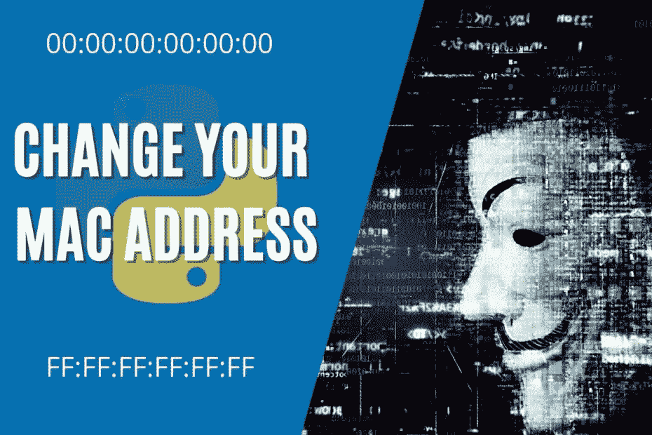

# 如何在 Python 中轻松更改您的 Windows Mac 地址— StackZero

> 原文：<https://levelup.gitconnected.com/how-to-easily-change-your-windows-mac-address-in-python-stackzero-d471aa801f5e>



# 介绍

在本文中，我们将编写一个 python 脚本，教你如何在 Windows 7 Ultimate x64 系统上将 Python 中的 Windows Mac 地址轻松更改为随机值。
根据操作系统的不同，方法可能会有细微的差异。

# 攻击计划

然而，我们感兴趣的是能够用脚本操纵注册表，所以一旦我们成功了，我们应该能够:

使用 python 更改 Windows MAC 地址有多种方法，我们感兴趣的方法包括以下步骤:

*   打开注册表(只需在“开始”菜单的搜索中键入“regedit.exe ”)
*   查找关键字“**HKEY _ LOCAL _ MACHINE \ SYSTEM \ current Control set \ Control \ Class { 4d 36 e 972-E325–11CE-BF C1–08002 be 10318 }**”。
*   插入一个名为“*网络地址*”的“ **REG_SZ** ”值(这是一个字符串)和一个包含 MAC 地址的字符串，不要将它分开。
*   重新启动网络接口。

该脚本的唯一目的只是说明性的，以后可以修改，但代码的结构是基本的。他说我们没有任何输入控制，因为这只是一种半自动化。

# 获取子项

但是现在让我们先接触一下代码，看看我们使用的支持方法。
前三个是不言自明的，是一种用于 [winreg](https://docs.python.org/3/library/winreg.html) 库的包装方法:

*   在寄存器中插入一个值
*   删除值
*   生成 MAC 地址

```
import winreg
from contextlib import suppress
import itertools
import random
import subprocessdef restore_old_mac(key):
    winreg.DeleteValue(key, 'NetworkAddress')def set_new_mac(key, mac):
    winreg.SetValueEx(key, 'NetworkAddress', 0, winreg.REG_SZ, mac)def generate_random_mac():
    chars = '1234567890ABCDEF'
    return ''.join(random.choices(chars, k=12))
```

在这一点上，我们需要一个方法来列出子项，让我们在注释之前看看代码。

```
reg_path = \
    "SYSTEM\CurrentControlSet\Control\Class\{4D36E972-E325-11CE-BFC1-08002BE10318}"def get_subkeys(reg_path):
    root = winreg.ConnectRegistry(None, winreg.HKEY_LOCAL_MACHINE)
    subkeys = []
    with suppress(WindowsError):
        with winreg.OpenKey(root, reg_path) as n_key:
            for i in itertools.count():
                subkeys.append(winreg.OpenKey(n_key,
                               winreg.EnumKey(n_key, i),
                               access=winreg.KEY_ALL_ACCESS))
    return subkeys
```

该方法执行以下步骤:

*   定义包含我们将连接到的所有潜在网络接口的键的路径。
*   初始化包含子项的空列表
*   通过将每个子项添加到列表中，循环访问列表，直到生成指示子项结束的 WindowsError
*   返回子项列表

# 获得正确接口的解决方案

现在出现了一个问题，很难知道哪个接口是感兴趣的，为了避免使我们的生活变得复杂，我们将使选择“更手动”，但要做到这一点，我们需要一个方法来寻找描述(在每个键的 DriverDesc 值中找到)并向我们显示它，以便我们可以选择正确的接口索引来工作，所以让我们看看这个方法！

```
def print_driver_desc(subkeys): for k, i in zip(subkeys, range(len(subkeys))):
        with suppress(WindowsError):
            for j in itertools.count():
                val = winreg.EnumValue(k, j)
                if val[0] == "DriverDesc":
                    print(f"[{i}]", val[1])
```

该方法遍历子项列表，并在嵌套循环中为每个子项搜索值“DriverDesc”。一旦找到它，它就打印出相应子项的值和索引。与子项搜索一样，搜索值，直到在列表末尾生成 WindowsError。

# 如何更改您的 Windows Mac 地址

现在，我们可以将这些片段放在一起，编写我们的 main，它是:

*   获取表示接口的所有子项
*   在屏幕上打印描述及其索引
*   要求您输入接口的索引
*   要求您选择是生成随机 MAC 还是恢复原始 MAC。

记住，如果值“NetworkAddress”在键中不存在，该值将保持原来的值，
,但是让我们看看代码

```
if __name__ == '__main__':
    subkeys = get_subkeys(reg_path)print_driver_desc(subkeys)print '''Choose your Network interface...
'''interface_index = int(input())print '''
Choose your option
[0] I want to restore my original MAC address
[1] I want to generate random MAC address
'''option = input()if option == '0':
        with suppress(FileNotFoundError):
            restore_old_mac(subkeys[interface_index])
    elif option == '1':random_mac = generate_random_mac()
        set_new_mac(subkeys[interface_index], random_mac)
        print ('Value set at: ', random_mac)
    else:print '[-] Wrong Choice Try again!'
```

# 如何激活您的 MAC 地址更改？

如果我们尝试运行它，我们会注意到更改并不活跃，这是因为我们需要重新启动界面，使用 [netsh](https://docs.microsoft.com/it-it/windows-server/networking/technologies/netsh/netsh-contexts) 工具直接从我们的脚本中这样做可能会很有趣。所以我们感兴趣的命令是:

```
netsh interface show interfacenetsh interface set interface "<INTERFACE_NAME>" enable 
netsh interface set interface "<INTERFACE_NAME>" disable
```

让我们看看如何通过子流程模块使用这些命令，由于选择正确的界面变得复杂，我们将再次确保
用户可以通过输入来输入:

```
result = subprocess.check_output(
    ["netsh", "interface", "show", "interface"], shell=True
)
print(result.decode())
iface_name = input("\nPlease write the name of your interface:\n")
subprocess.call(f'netsh interface set interface "{iface_name}" disable')
subprocess.call(f'netsh interface set interface "{iface_name}" enable')
```

# 结论

现在让我们看看完整的代码:

```
import winreg
from contextlib import suppress
import itertools
import random
import subprocessreg_path = (
    "SYSTEM\CurrentControlSet\Control\Class\{4D36E972-E325-11CE-BFC1-08002BE10318}"
)def restore_old_mac(key):
    winreg.DeleteValue(key, "NetworkAddress")def set_new_mac(key, mac):
    winreg.SetValueEx(key, "NetworkAddress", 0, winreg.REG_SZ, mac)def get_subkeys(reg_path):
    root = winreg.ConnectRegistry(None, winreg.HKEY_LOCAL_MACHINE)
    subkeys = []
    with suppress(WindowsError), winreg.OpenKey(root, reg_path) as n_key:
        for i in itertools.count():
            subkeys.append(
                winreg.OpenKey(
                    n_key, winreg.EnumKey(n_key, i), access=winreg.KEY_ALL_ACCESS
                )
            )
    return subkeysdef print_driver_desc(subkeys):for k, i in zip(subkeys, range(len(subkeys))):
        with suppress(WindowsError):
            for j in itertools.count():
                val = winreg.EnumValue(k, j)
                if val[0] == "DriverDesc":
                    print(f"[{i}]", val[1])def generate_random_mac():
    chars = "1234567890ABCDEF"
    return "".join(random.choices(chars, k=12))if __name__ == "__main__":
    subkeys = get_subkeys(reg_path)print_driver_desc(subkeys)print("\n\nChoose your Network interface...\n")interface_index = int(input())print(
        "\nChoose your option\n[0] I want to restore my original MAC address\n[1] I want to generate random MAC address\n"
    )option = input()if option == "0":
        with suppress(FileNotFoundError):
            restore_old_mac(subkeys[interface_index])elif option == "1":random_mac = generate_random_mac()
        set_new_mac(subkeys[interface_index], random_mac)
        print("Value set at: ", random_mac)else:
        print("[-] Wrong Choice Try again!")result = subprocess.check_output(
        ["netsh", "interface", "show", "interface"], shell=True
    )
    print(result.decode())
    iface_name = input("\nPlease write the name of your interface:\n")
    subprocess.call(f'netsh interface set interface "{iface_name}" disable')
    subprocess.call(f'netsh interface set interface "{iface_name}" enable')
```

要执行，将文件保存为“main.py ”,在脚本所在的目录中以管理员身份启动终端，然后键入:

```
python main.py
```

# 进一步阅读

如果你觉得读起来有趣，我推荐以下文章:

*   [如何用 Python 只用几行代码创建一个网络扫描仪！](https://medium.com/@stackzero/how-to-create-network-scanner-tool-in-few-lines-of-code-stackzero-d1984b60fad6)
*   [使用 Python，轻松实现域名扫描！](https://medium.com/@stackzero/subdomain-scanner-made-easy-with-python-stackzero-8b9dd1a30459)

*原载于 2021 年 10 月 2 日 https://www.stackzero.net**的* [*。*](https://www.stackzero.net/change-your-windows-mac-address-python/)