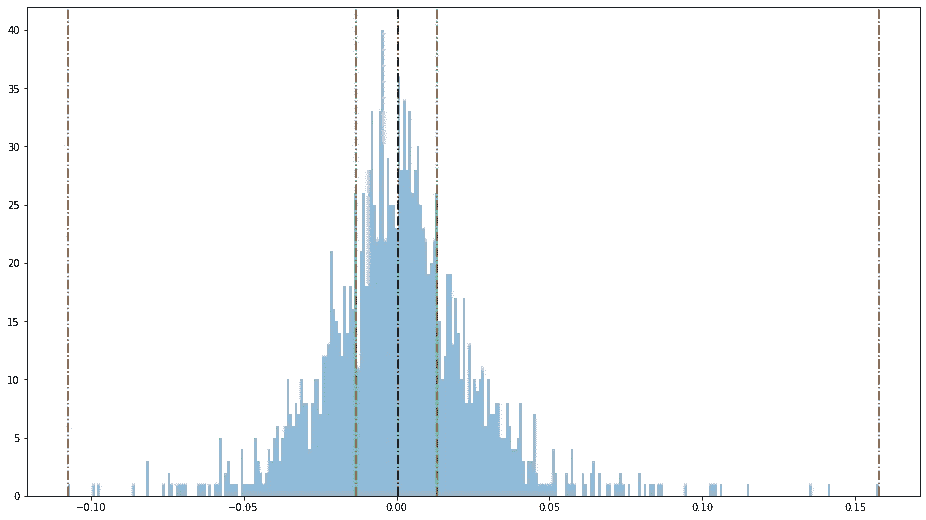
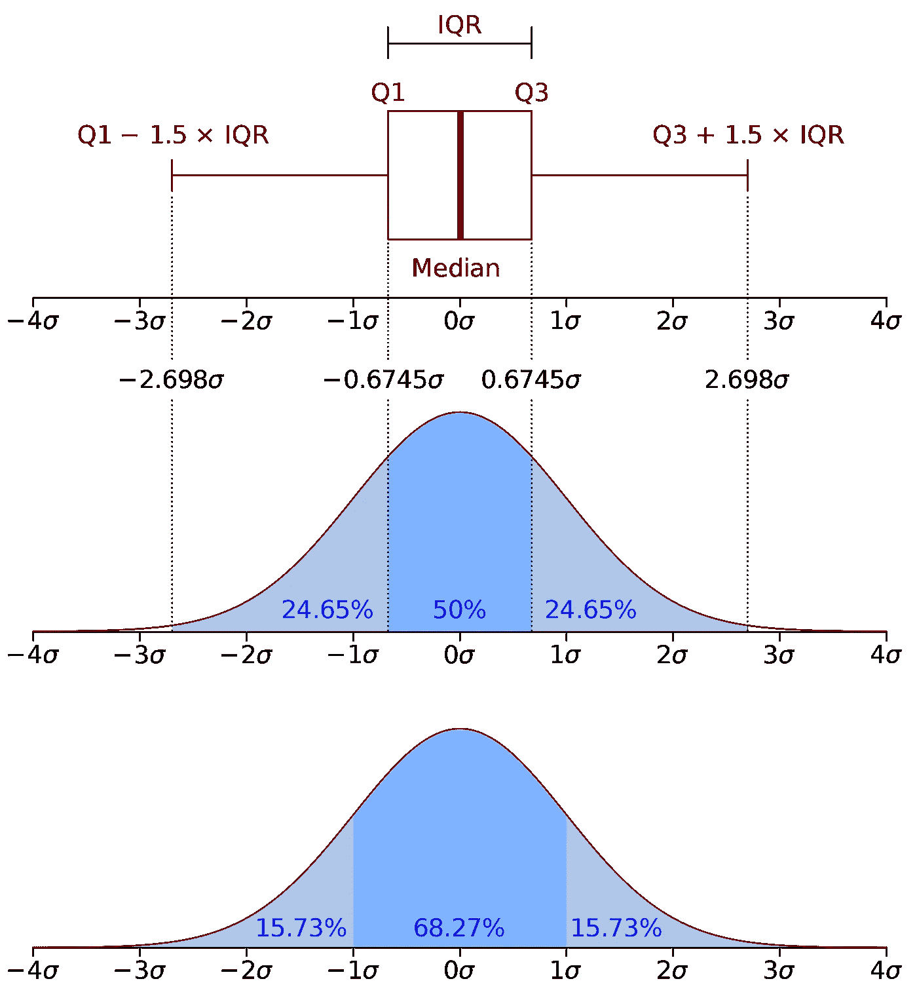
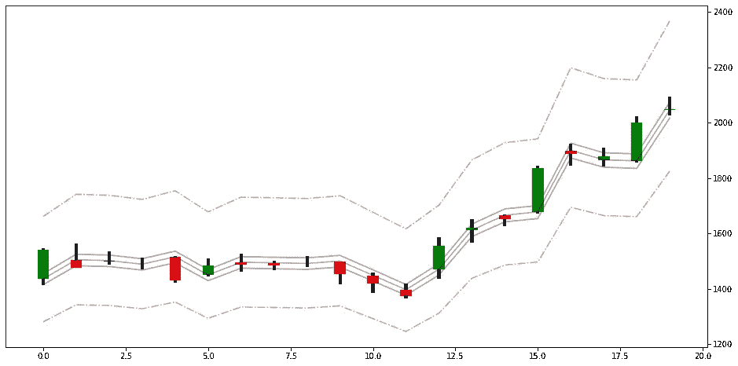

# 如何使用 Python 中的 IQR(四分位间距)轻松预测股票价格概率(时间序列)

> 原文：<https://levelup.gitconnected.com/how-to-easily-forecast-the-stock-price-probabilities-time-series-using-iqr-interquartile-range-9d97dafd5a32>

我知道你在想什么“又一个预测帖”。然而，这不是真的。我们开始吧。



**TSLA** IQR 直方图

**IQR(四分位数间距)**

我不打算深究细节。你可以在网上读到很多关于 IQR 的信息。想从[维基](https://en.wikipedia.org/wiki/Interquartile_range)开始(**但不需要**)。基本上，IQR 在第一和第三个四分位数之间。



图片来自[维基百科](https://en.wikipedia.org/wiki/Interquartile_range)

> 50%的数据将落在四分位数范围内(IQR)

统计表明，50%的数据将落在第 1 和第 3 个四分位数内，这被称为 **IQR(四分位数间距)**。

多亏了统计学，我们可以很容易地计算出未来价格的概率。**我们不会试图预测收盘价**。不可能(抱歉伙计们)。但是我们可以找到范围的**概率，这当然会帮助我们管理风险。**

> 代码，代码，代码..！

让我们快速开始编码，我也将分享完整的源代码。

我真的想让这篇文章尽可能的短。这就是为什么，我不打算在这里显示所有代码(加载数据，绘图等。).但是我将展示并解释我编写的重要函数。

我将使用 **TSLA** 每日历史价格。我们的第一个函数是 **add_data**

```
def add_data(df, sample_size, shf=False):
    col = df["Close"].shift(1)
    col = df["Open"]
    df["OC"] = (df["Close"] - col) / col
    # we are shifting to not to have lookahead bias in the data
    df["Q0"] = (col * (1 + df["OC"].shift(1).rolling(sample_size).quantile(0.0)))
    df["Q1"] = (col * (1 + df["OC"].shift(1).rolling(sample_size).quantile(0.25)))
    df["Q2"] = (col * (1 + df["OC"].shift(1).rolling(sample_size).quantile(0.5)))
    df["Q3"] = (col * (1 + df["OC"].shift(1).rolling(sample_size).quantile(0.75)))
    df["Q4"] = (col * (1 + df["OC"].shift(1).rolling(sample_size).quantile(1.0)))
    if shf:
        df["Diff"] = col - df["Q2"]
        df["Q0"] = df["Q0"] + df["Diff"]
        df["Q1"] = df["Q1"] + df["Diff"]
        df["Q2"] = df["Q2"] + df["Diff"]
        df["Q3"] = df["Q3"] + df["Diff"]
        df["Q4"] = df["Q4"] + df["Diff"]
    return df.dropna().reset_index(drop=True)sample_size = 1000
df = add_data(df, sample_size)
```

我们在这里所做的基本上是计算在选定的时间范围内从开盘到收盘的回报。我们也可以使用前一根棒线的收盘价。

这一功能将在任何时间框架。你想改变四分位数。所以我们在代码中不会有前瞻偏差。在这种情况下，我使用最后 1000 根棒线作为**样本大小**，以获得显著的结果。

请注意，中位数不等于开盘价。如果您选择了移位，您必须将 shf 设置为 True。请记住，所有其他四分之一将被转移。

让我们绘制直方图，看看数据告诉我们什么。

```
def hist(df):
    plt.figure(figsize=(16, 9))
    plt.hist(df["OC"], bins=300, alpha=0.5)
    plt.axvline(df["OC"].quantile(0.0), ls="-.", color="r")
    plt.axvline(df["OC"].quantile(0.25), ls="-.", color="g")
    plt.axvline(df["OC"].quantile(0.75), ls="-.", color="g")
    plt.axvline(df["OC"].quantile(1.0), ls="-.", color="r")
    plt.axvline(df["OC"].quantile(0.5), ls="-.", color="#000000")
    plt.show()
    print("Median (Q2):", df["OC"].median())
    print("Q3 - Q4:", df["OC"].quantile(1.0) - df["OC"].quantile(0.75))
    print("Q0 - Q1:", df["OC"].quantile(0.25) - df["OC"].quantile(0.0))hist(df)
```


**TSLA** 每日四分位距(IQR) —直方图

```
Median (Q2): 0.0003634114311573365
Q3 - Q4: 0.14448731927170932
Q0 - Q1: 0.09440655740813506
```

绿色区域是 IQR。我们可以很容易地说，有 50%的可能性 **TSLA** 会在这个范围内收盘。左边的绿色竖线是 Q1，右边的是 Q3。中间黑色的是中间值或 Q2。最左边的红色是 Q0，最右边的是 Q4。

> 给我看看证据！

现在让我们绘制蜡烛图，看看我们的价格水平在价格图中是什么样子。我将绘制最后 20 个小节来查看细节。



**TSLA** 每日四分位距(IQR) — OHLC 图表

蓝线也是中间值。绿色区域是 IQR。有 50%的可能性 **TSLA** 收盘价会落在这个区间内。哦等等。我需要给你看证据。让我们得到回溯测试结果:)

> 请进行回溯测试…

```
def iqr_stats(df, c1="Q1", c2="Q3"):
    col1 = df[c1]
    col2 = df[c2]
    db = df[(df["Close"] >= col1) & (df["Close"] <= col2)]
    r = len(db) / len(df) * 100
    print("{} - {}: {:.2f}%".format(c1, c2, r))iqr_stats(df, c1="Q1", c2="Q3")Q1 - Q3: 51.16%
```

**现在你相信我了吧？**

我也想给你更多的信息。让我们快速计算一下其他的可能性。

```
iqr_stats(df, c1="Q0", c2="Q1")
Q0 - Q1: 24.29%iqr_stats(df, c1="Q1", c2="Q2")
Q1 - Q2: 24.36%iqr_stats(df, c1="Q2", c2="Q3")
Q2-Q3: 26.80%iqr_stats(df, c1="Q3", c2="Q4")
Q3-Q4: 24.29%iqr_stats(df, c1="Q0", c2="Q2")
Q0-Q2: 48.65%iqr_stats(df, c1="Q2", c2="Q4")
Q2-Q4: 51.09%iqr_stats(df, c1="Q0", c2="Q4")
Q0-Q4: 99.74%
```

随意玩弄价值观。你会发现一些有趣的结果。

**重要的**

你需要等到开放的那一天才能使用这个代码，获得最近未完成的条形数据。至少是公开的价格。但是，如果你有历史数据，但没有实时的日内数据/蜡烛线。使用 forecast()函数给出 open_price

```
def forecast(df, open_price, sample_size):
    # don't shift if you are forecasting and if the last data is not the live data
    q1 = (open_price * (1 + df["OC"].rolling(sample_size).quantile(0.25))).iloc[-1]
    q3 = (open_price * (1 + df["OC"].rolling(sample_size).quantile(0.75))).iloc[-1]
    iqr = q3 - q1
    iqr_range = iqr / open_price * 100

    iqr_out = "IQR: {:.2f} - {:.2f}, Points: {:.2f}, Range: {:.2f}%".format(q1, q3, iqr, iqr_range)
    print(iqr_out)"""
Make sure that you have yesterday's data only.
Do not add live data to use forecast() function.
provide the open_price and get the IQR
"""
open_price = 2050
forecast(df, open_price, sample_size)Output:
IQR: 2021.68 - 2079.12, Points: 57.44, Range: 2.80%
```

# 下一步做什么？

在这个例子中，我使用了**TSLA**OHLC 每日历史数据。实际上，这将适用于任何市场和任何时间范围内的任何数据。如果你愿意，你可以将这个代码应用于**外汇、期货和加密货币**市场。

你也想在每周和每月的时间框架内尝试一下。但是，请确保您有足够的数据。我想至少 1000 个数据点就可以了。

我知道你在想什么。如果这有用，为什么我要和你分享这个？你百分之百正确。首先:**这个作品**。但是；如果我会用这个代码赚钱，我不会和你分享。换句话说，我没有用这段代码赚钱。然而，也许你可以找到一种方法，并与我分享？！你会吗？真的吗？还是我太乐观了？**我选择相信你！！！**

# 结论

我相信你已经阅读了大量的预测文章和研究；在线看了上百个 AI / ML 视频。寻找圣杯。当然，它们读起来和看起来都很有趣。但是，如果他们已经找到了一个可行的算法，为什么还会有人和你分享呢？想想吧。

> 市场不过是一根大蜡烛！阿蒂拉·尤尔特塞文

市场不过是一根大蜡烛。几个世纪前，它曾开盘一次，后来变低变高，永远不会有收盘价(很有可能)。

> 跳出框框想问题

这篇文章不是预测明天的价格。它借助统计学来预测范围。没有帮助吗？当然了。但这取决于你所说的“帮助”是什么意思。我劝你不要试图预测明天的收盘价，开始跳出思维定势。

***免责声明***

我不是专业的财务顾问。这篇文章和代码，分享仅用于教育目的，而不是财务建议。你要对自己的输赢负责。

*这篇文章的全部代码可以在这个仓库中找到:*

[](https://github.com/atillayurtseven/Forecast-the-Stock-Price-Probabilities/blob/master/Forecast%20the%20Stock%20Price%20Probabilities%20Using%20IQR.ipynb) [## atillayrinteven/预测股价概率

### permalink dissolve GitHub 是超过 5000 万开发人员的家园，他们一起工作来托管和审查代码，管理…

github.com](https://github.com/atillayurtseven/Forecast-the-Stock-Price-Probabilities/blob/master/Forecast%20the%20Stock%20Price%20Probabilities%20Using%20IQR.ipynb) 

**啊也；记得在以下社交渠道关注我:**

[中等](https://medium.com/@atillayurtseven)
推特
[trading view](https://www.tradingview.com/u/AtillaYurtseven/)
[YouTube！](https://youtube.com/AtillaYurtseven)

**如果你喜欢这篇文章，我建议你看看我以前的文章**

[](https://towardsdatascience.com/bollinger-bands-statistics-in-trading-dcc8783a8f88) [## 交易中的布林线统计

### 有很多交易者使用布林线。我也喜欢布林线。它使用并将统计数据带入…

towardsdatascience.com](https://towardsdatascience.com/bollinger-bands-statistics-in-trading-dcc8783a8f88) [](https://towardsdatascience.com/how-to-simulate-trades-in-python-7e613c83fd5a) [## 如何用 Python 模拟交易

### 我们总是看到，所谓的交易者声称他们有超过 70%胜率的策略和他的风险回报…

towardsdatascience.com](https://towardsdatascience.com/how-to-simulate-trades-in-python-7e613c83fd5a) [](https://medium.com/swlh/trading-with-momentum-channels-in-python-f58a0f3ebd37) [## Python 中的动量通道交易

### 大多数交易者使用布林线。然而，价格不是正态分布的。这就是为什么，只有 42%的价格会关闭…

medium.com](https://medium.com/swlh/trading-with-momentum-channels-in-python-f58a0f3ebd37) 

直到下次；保持安全，交易安全！！！

> PS:对不起，我的 Tarzanish..！

阿蒂拉·尤尔特塞文