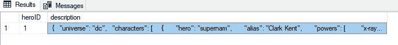
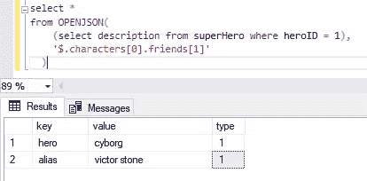

# 如何在 SQL Server 中轻松解析和转换 JSON

> 原文：<https://levelup.gitconnected.com/how-to-easily-parse-and-transform-json-in-sql-server-c0b091a964de>

## 在 SQL 中使用和应用 OPENJSON 的介绍


克里斯蒂娜@ wocintechchat.com 在 [Unsplash](https://unsplash.com?utm_source=medium&utm_medium=referral) 上的照片

# JSON 无处不在！

理解如何使用 JSON 是一项重要的技能。 **JSON，**简称 *JavaScript 对象符号* **，**是最流行的数据交换格式之一。由于 JavaScript 是当今使用最广泛的语言，与 JSON 相关的问题在堆栈溢出方面已经超过了 XML 和其他流行的格式。只要 JavaScript 继续被广泛使用，这种趋势很可能会继续。


深入了解 JSON 与 XML，第 1 部分:每个标准的历史[https://www.toptal.com/web/json-vs-xml-part-1](https://www.toptal.com/web/json-vs-xml-part-1)

举一个真实的例子，我的团队开发的一个软件工具将 JSON 保存到 SQL Server 的一个表中。我们有一些用户询问探索 JSON 的有效方法。本文涵盖了在 Microsoft SQL Server 中使用 JSON 的一些基础知识。

有关更多示例，请查看微软官方文档:

[](https://docs.microsoft.com/en-us/sql/relational-databases/json/json-data-sql-server?view=sql-server-ver15) [## 使用 JSON 数据- SQL Server

### SQL Server 中的 JSON 数据

docs.microsoft.com](https://docs.microsoft.com/en-us/sql/relational-databases/json/json-data-sql-server?view=sql-server-ver15) 

注意这些示例使用的功能适用于:

*   SQL Server 2016 及更高版本
*   Azure SQL 数据库
*   Azure Synapse 分析

# 了解 JSON

JSON 格式利用对象和数组支持分层数据结构。对象是一个键/值对。例如:

{"key1 ":"值 1 "，" key2 ":"值 2"}

数组是值的列表。例如:

["值 1 "，"值 2 "，"值 3"]

在 JSON 中，对象和数组可以包含其他对象或数组，给数据一个类似于*树的*结构。例如:

{"key1" : [{ "values1" : ["1 "，" 2"]，" values2" : ["3 "，" 4"] }] }

注意 **Key1** 是如何与包含对象的数组配对的。每个都有自己的阵列。这些被称为*嵌套分层 JSON 子数组。*

格式化 JSON 使得理解对象层次更容易。我喜欢使用免费的在线格式化工具:

[](https://jsonformatter.org/json-pretty-print) [## 最佳 JSON 漂亮打印在线

### 最佳 JSON Pretty 打印工具，使 Pretty JSON 和 JSON 彩色打印，并保存和在线共享。

jsonformatter.org](https://jsonformatter.org/json-pretty-print) 

```
{
  "key1": [
    {
      "values1": [
        "1",
        "2"
      ],
      "values2": [
        "3",
        "4"
      ]
    }
  ]
}
```

# 在 SQL Server 中使用 OPENJSON 转换 JSON

要开始探索 SQL Server 中的 JSON，我推荐使用 [**OPENJSON** 函数](https://docs.microsoft.com/en-us/sql/relational-databases/json/json-data-sql-server?view=sql-server-ver15)。如果您需要一些 JSON 来玩，下面的脚本将创建桌子超级英雄。它有一个主键和一个描述列。一旦表被创建，一个 JSON 字符串将被插入超级英雄表中。

```
CREATE TABLE superHero(
 [heroID] [int] PRIMARY KEY CLUSTERED IDENTITY(1,1) NOT NULL,
 [description] nvarchar(MAX) NOT NULL,
) ON [PRIMARY]insert into superhero([description])
select '{
  "universe": "dc",
  "characters": [
    {
      "hero": "superman",
      "alias": "clark kent",
      "powers": [
        "x-ray vision",
        "super strength",
        "super speed",
        "laser eyes",
        "bullet proof"
      ],
      "friends": [
        {
          "hero": "batman",
          "alias": "bruce wayne"
        },
        {
          "hero": "cyborg",
          "alias": "victor stone"
        }
      ]
    }
  ]
}'
```

请注意，示例 JSON 深入了几个层次。在层次结构中，注意 ***内的好友*** 是 ***内的人物*** 和 ***内的人物*** 是 ***内的根*** *对象*。这意味着我需要查询嵌套的分层 JSON 子数组来将所有 JSON 数据整理成表格格式*。这听起来比实际情况更复杂！*

要查看表格，只需选择*。

```
select * from superHero
```



超级英雄表格结果

要打开描述列中的 JSON，使用 **OPENJSON** 函数:

```
select * 
from OPENJSON((select description from superHero where heroID = 1))
```


OPENJSON 结果

因为 JSON 存储在**描述**列中，所以我向 OPENJSON 函数传递了一个查询，该查询返回 heroID 1 的描述。查看结果时，请注意它们被放入 ***键*** 和 ***值*** 列，以及一个 ***类型*** 列。类型是指 ***值*** 列中的数据类型。

注意键 ***字符*** 与一个看起来仍然是 JSON 的值成对出现。那是因为 **OPENJSON** 一次只打开*一个*级别。它只开放了包含宇宙和角色的根层。

## 使用 JSON 路径

要直接查询 ***字符*** 值，可以将一个 ***JSON 路径*** 传入 **OPENJSON** 函数。路径总是以 **$** 开头。

记住，JSON 数组使用[从零开始的数组索引](https://en.wikipedia.org/wiki/Zero-based_numbering)。这意味着它们从 0 开始，而不是从 1 开始。因此，如果我想看到*字符对象*中的键值对，我需要将位置传递到路径中。既然要看第一个位置，我的路径就是 **'$。字符[0]'**

```
select * 
from OPENJSON(
    (select description from superHero where heroID = 1),
    '**$.characters[0]**'
  )
```


**$。字符[0]结果**

使用相同的路径模式，如果我想探索第一个*角色的第二个*朋友，路径将是 **'$。字符[0]。朋友[1]'**



**$。字符[0]。朋友[1]结果**

# 查询嵌套的分层 JSON 子数组

为 OPENJSON 提供一个路径对于挖掘单个 JSON 级别很有用，但是对于一次返回多个嵌套层次结构并不理想。在 SQL Server 中，**交叉应用**和**外部应用**可以用来展平嵌套的 JSON。虽然乍一看可能会令人困惑，但 SQL Server 使得打开 JSON 层次结构变得相当直观。

要展平超级英雄 JSON，首先从超级英雄表中选择。然后在描述字段交叉应用 OPENJSON。

```
select *
from superHero s
CROSS APPLY OPENJSON(s.description)
```


交叉应用结果

交叉应用将每个键值对连接到超级英雄中的行上。由于 OPENJSON 是打开根对象，所以这两个键是 ***宇宙*** 和 ***字符*** 。

在 SQL 查询中使用带有关键字的**，键值对可以透视到一列而不是一行:**

```
select *
from superHero s
CROSS APPLY OPENJSON(s.description)
WITH (universe varchar(10))
```


有结果

注意只有一行返回，现在有一个 **universe** 列，而不是一个键列和值列。

要打开嵌套的 ***字符*** 级别，在 WITH 语句中，将 ***字符*** 转换为 JSON。然后在查询中添加另一个交叉应用 OPENJSON，打开 JSON。

```
select *
from superHero s
CROSS APPLY OPENJSON(s.description)
WITH (universe varchar(10), characters nvarchar(max) as JSON) c
 CROSS apply OPENJSON(c.characters)
```

若要拼合字符，请使用 WITH 并将键包含在字符中。对朋友对象做同样的事情。

```
select heroID
, universe
, f.hero
, f.alias
, powers
, g.hero as friendHero
, g.alias as friendAlias
from superHero s
CROSS APPLY OPENJSON(s.description)
WITH (universe varchar(10), characters nvarchar(max) as JSON) c
 CROSS apply OPENJSON(c.characters) 
 WITH (hero varchar(20), alias varchar(20),powers nvarchar(max)as JSON, friends nvarchar(max)as JSON) f
  OUTER APPLY OPENJSON(f.friends)
  WITH(hero varchar(20), alias varchar(20)) g
```

该查询从超级英雄表中选择字段，并将它们与根对象交叉连接。使用 WITH 运算符，查询知道从提供的键中选择值。在查询中，我从根对象上的 OPENJSON 调用中选择了 ***universe*** 。将 ***字符*** 值转换为 JSON 允许它被传递到另一个 OPENJSON。通过使用 CROSS APPLY 和 OUTER APPLY 将 OPENJSON 链接在一起，该查询解析每个嵌套层次结构，并以表格格式返回扁平数据。


查询嵌套的 JSON 子数组

恭喜你！您刚刚将嵌套的 JSON 转换成了扁平的结果集！

# **最终想法**

由于 JavaScript 的流行，JSON 的使用越来越多，了解如何使用它是一项了不起的技能。尽管看起来有些吓人，但由于 OPENJSON 函数的存在，在 SQL Server 中使用 JSON 变得相当简单。在几行 SQL 中，您可以将 JSON 转换成列和行。要了解更多关于 OPENJSON 的信息，我建议查看微软官方文档。

# 谢谢大家！

*   *如果你喜欢我的作品，* [*关注我的中*](https://medium.com/@erickleppen) *了解更多！*
*   [*通过订阅*](https://erickleppen.medium.com/membership) 获得完全访问权限并帮助支持我的内容！
*   *我们来连线一下*[*LinkedIn*](https://www.linkedin.com/in/erickleppen01/)
*   *用 Python 分析数据？查看我的* [*网站*](https://pythondashboards.com/) ！

[**—埃里克·克莱本**](http://pythondashboards.com/)

[](https://erickleppen.medium.com/the-ultimate-guide-to-erics-articles-d32df8241353) [## 埃里克文章的终极指南

### 我的所有内容按主题组织…

erickleppen.medium.com](https://erickleppen.medium.com/the-ultimate-guide-to-erics-articles-d32df8241353)