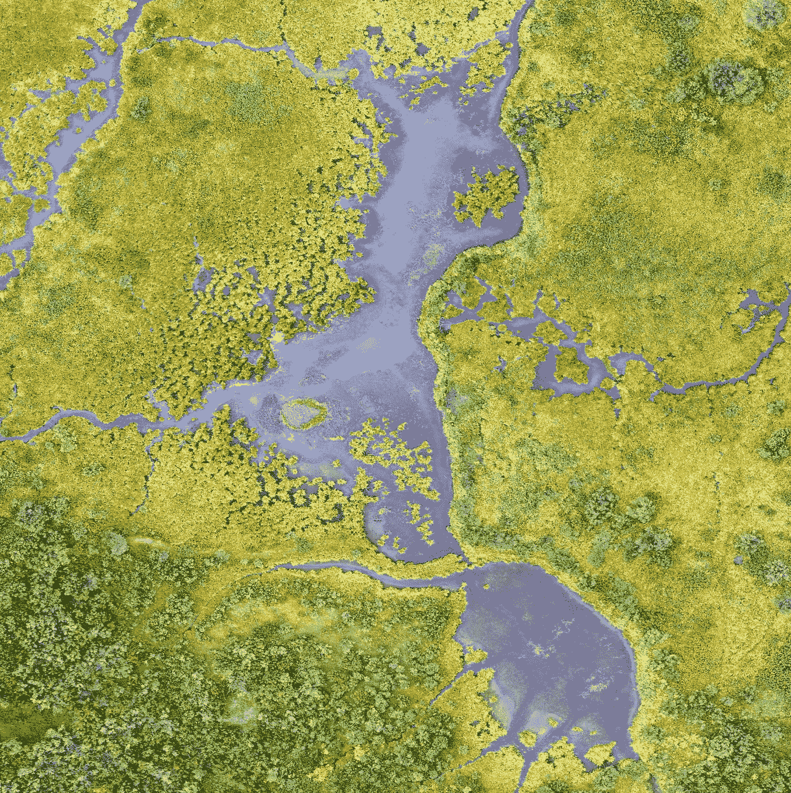

# 如何用 SharpJS 轻松处理图像

> 原文：<https://levelup.gitconnected.com/how-to-easily-process-images-with-sharpjs-2af2408ad813>



[美国地质勘探局](https://unsplash.com/@usgs?utm_source=medium&utm_medium=referral)在 [Unsplash](https://unsplash.com?utm_source=medium&utm_medium=referral) 拍摄的照片

如你所知，图像是任何现代用户友好应用程序的重要组成部分。让我们以任何社交媒体平台，或电子商务网站，或几乎任何其他网站为例，它们都以某种方式利用图像。在一些平台上，用户想要裁剪、更新他们的图片，或者将滤镜应用到他们的图片上，而在其他平台上，例如电子商务平台，商家想要增强他们产品的图像，以便他们卖得更多。最棘手的部分是处理大图像。更令人沮丧的是将这些沉重的图像存储到数据库中，在糟糕的互联网连接下，它们可能要花很长时间才能加载。

有一种方法可以让我们的图像加载更快，甚至更高的质量，同时也使它们更加用户友好。现在您可能已经猜到了，解决方案是用于 Node.js 应用程序的 SharpJS 库。

> 这种高速 Node.js 模块的典型用例是将常见格式的大图像转换为较小的、网页友好的不同尺寸的 JPEG、PNG 和 WebP 图像。
> 
> —根据 SharpJS 的官方文件

# 1)先决条件

在我们开始使用这个库之前，我们需要满足一个要求，你应该有 **NodeJs v10** 或者更新的版本。就是这样！

# 2)安装和导入

*   要使用 npm 进行安装:

```
npm install sharp
```

*   使用纱线安装:

```
yarn add sharp
```

# 3)使用 SharpJS

在开始使用这个库之前，我们需要用到它，就像其他 Javascript 库一样。

```
const sharp = require("sharp");
```

# 4)示例

接下来，让我们看一些如何使用这个库的例子。

## 示例 1:调整图像大小/裁剪图像

```
sharp("Input_Image.jpg")
  .resize({ width: 250, height: 350 })
  .toFile("Output.jpg");
```

toFile()方法将输出图像数据写入文件。在这种情况下，调整后的图像将保存在一个名为“输出”的 JPG 类型的输出文件中。

## 示例 2:获取图像灰度

```
sharp("Input_Image.jpg")
  .greyscale()  //.grayscale()
  .toFile("Output.jpg");
```

灰度( )方法*(替代拼写，* `*grayscale*` *)。都可以用)。*将输入图像转换为 8 位灰度；256 种灰度。

## 示例 3:获取图像底片

```
sharp("Input_Image.jpg")
  .negate()
  .toFile("Output.jpg");
```

这就产生了图像的“负片”。

## 示例 4:模糊图像

```
sharp("Input_Image.jpg")
  .blur()
  .toFile("Output.jpg");
```

当在没有参数的情况下使用 blur()方法时，它对输出图像执行快速、*温和* *模糊*。然而，你也可以为它提供一个**西格玛**值来执行一个更慢、*更精确的高斯模糊*。适马值的范围可以在 **0.3 到 1000 之间。**

## 示例 5:旋转图像

```
sharp("Input_Image.jpg")
  .rotate(180)
  .toFile("Output.jpg");
```

将图像旋转正 180 度。

## 示例 6:翻转图像

```
sharp("Input_Image.jpg")
  .flip()
  .toFile("Output.jpg");
```

围绕垂直 Y 轴翻转图像。

## 示例 7:翻转图像

```
sharp("Input_Image.jpg")
  .flop()
  .toFile("Output.jpg");
```

围绕水平 X 轴翻转图像。

## 示例 8:更改图像格式

```
sharp("Input_Image.jpg") 
  .toFormat("png")
  .toFile("Output.png");
```

将输入图像转换为新的格式，作为 toFormat()方法的参数提供。

## 示例 9:增强图像质量

```
sharp("Input_Image.jpg")
  .toFormat("png")
  .png({ quality: 100 })
  .toFile("Output.png");
```

图像质量可以设置为 1 到 100 之间的任何值。不用说，价值越高，质量越好。

## 示例 10:将图像存储到数据库中

```
sharp("Input_Image.jpg")
  .resize({ width: 500, height: 450 })
  .toFormat("png")
  .png({ quality: 100 })
  .toFile("Output.png")
  .then(() => {
    //Here, you can either store the image to the database or     
//send it to the frontend client(React, Vue, Angular, etc.)

  console.log('Please Like Comment and Subscribe!!');

  })
  .catch((err) => console.warn(err)); // print error(if any) on the console
```

现在，在这里，我们要调整图像的大小，给它 500 像素的宽度和 450 像素的高度，然后，我们要将其转换为 PNG 格式，接下来，我们将输出图像的质量设置为 100，输出图像保存为“Output.png”。在前面的所有滤镜都应用到图像后。然后( )块将被执行，它采用一个回调函数，在这里您可以对输出图像执行任何操作。

> 除了承诺，SharpJS 还支持回调和异步等待。

## 示例 11:使用 gif

```
sharp('inputGIF.gif', { animated: true })
  .toFile('Output.webp');
```

将 gif 转换成 WEBP 格式，同时仍然保留动画。

这就是这个有用的 Javascript 库的全部内容。我希望本文提供的信息对您有价值，并帮助您简化和优化 web 应用程序上的未来图像处理任务。

有用的资源:

*   [sharp . js 的官方文档](https://sharp.pixelplumbing.com/)
*   [我的 Sharp.js 例子的要点](https://gist.github.com/KritikaSharmaKS/b1073302961a169e9ef4674dca086a13)

【https://www.theimmigrantprogrammers.com】最初发表于[](https://www.theimmigrantprogrammers.com/p/process-images-the-right-way-sharpjs)**。**