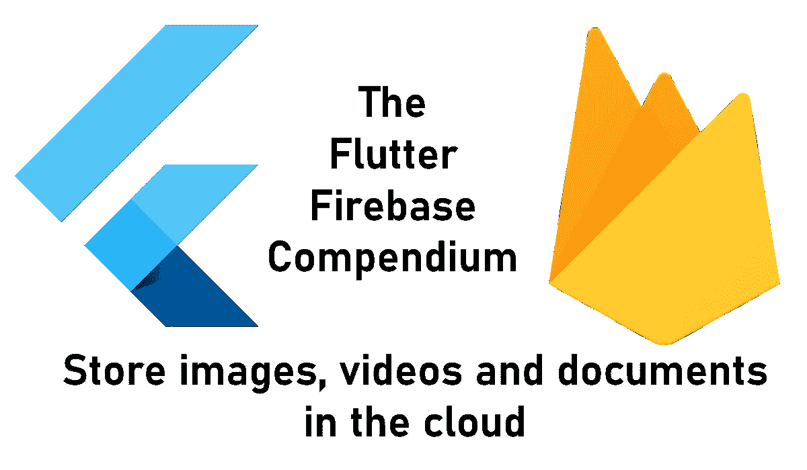
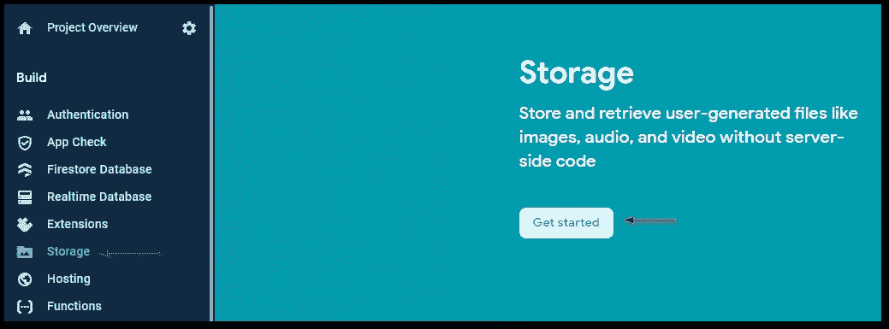
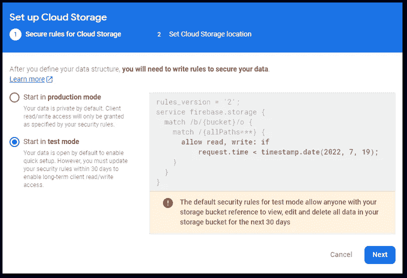
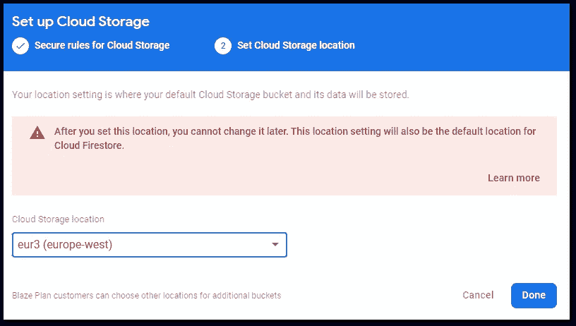
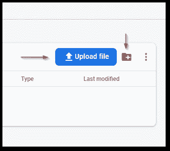
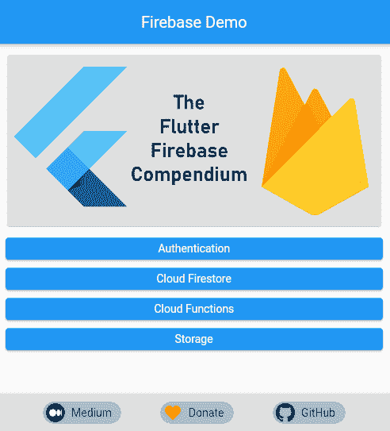

# 如何从您的 Flutter 应用程序轻松地将对象存储在 Firebase 存储中

> 原文：<https://levelup.gitconnected.com/how-to-easily-store-objects-in-firebase-storage-from-your-flutter-app-deabc475d407>

## 我的东西都在哪里？

## 在本文中，我将向您展示如何设置和使用 Firebase 存储从 Flutter 应用程序中读取和写入数据。



Firebase Storage 是云中存储和服务数据的对象存储提供商。可能的情况包括用户的个人资料图片或在注册过程中上传的 PDF 文件等文档。在本文中，我将向您展示如何设置它，读取和写入数据，以及实现基本的访问控制规则。以下是主题列表:

🔹设置 Firebase 存储
🔹写数据
🔹读取数据
🔹删除数据
🔹监控空间消耗
🔹访问控制
🔹Firestore vs Storage
🔹web 的 CORS 修复

```
👉 Do you want all the details? Check out [**my ebook**](https://xeladu.gumroad.com/l/ffc) with in-depth guides about building Flutter apps with Firebase! Buy it on [**Gumroad**](https://xeladu.gumroad.com) now!
```

您将需要自己建立一个 Firebase 项目来使用这里的代码示例或我的 [GitHub](https://github.com/xeladu/flutter_firebase) 页面中的代码示例。如果你还没有这样做，这里有一篇文章可以指导你完成必要的步骤。

[](/how-to-create-a-firebase-project-and-link-it-with-your-flutter-app-acd826be8356) [## 如何创建一个 Firebase 项目并将其与您的 Flutter 应用程序链接

### 在本文中，我将向您展示如何创建一个 Firebase 项目，以及如何将它与您的 Flutter 应用程序链接起来。

levelup.gitconnected.com](/how-to-create-a-firebase-project-and-link-it-with-your-flutter-app-acd826be8356) 

## 设置 Firebase 存储

第一步是安装软件包 [firebase_storage](https://pub.dev/packages/firebase_storage) 。之后，您需要设置一个存储数据的存储桶。将 bucket 想象成文件系统中的根文件夹。这可以通过 Firebase 控制台仪表板来完成。

转到**存储** → **开始使用**



作者的 Firebase 存储设置屏幕截图

在测试模式下选择**开始**并点击**下一个**(我们稍后将回到访问控制)



作者设置的 Firebase 存储访问控制屏幕截图

选择您想要的位置，并在**完成**后确认。要了解位置及其优势，请点击[此处](https://firebase.google.com/docs/projects/locations#types)。如果可能的话，我建议选择你的目标用户群的位置。



作者设置的 Firebase 存储位置的屏幕截图

将创建一个默认存储桶，您可以在其中存储数据。还可以添加更多的桶。

设置完成，让我们玩一些数据🎉

## 存储引用

第一步是获取一个 StorageReference 对象，该对象指向我们的 bucket 中的一个文件(条目)或目录(前缀)。您可以使用`child()`方法以及`root`和`parent`属性在引用树中导航。创建引用时，Google 云存储 URIs 和 HTTPS URL 也受支持。

## 读出数据

假设我们在根级别的 bucket 中存储了一堆文件，我们想要下载它们。以下代码获取在存储引用中找到的 5 个项目，下载内容，并读取元数据对象。

要控制获取多少结果，可以使用`ListOptions`对象。有一个`maxResults`和一个`pageToken`房产。`getData()`以字节数组的形式获取内容，`getMetadata()`获取增强的文件信息，`getDownloadURL()`返回指向文件(或文件夹)的字符串。如果要处理文件夹，用`files.prefixes`代替`files.items`。

## 写入数据

但是，我们如何将数据放入存储桶呢？第一种方法是使用仪表板。有上传文件和创建文件夹的按钮。



作者提供的 Firebase 存储控制面板的屏幕截图

然而，作为程序员，我们喜欢用代码做事。这里有一个如何上传文件的快速示例。

我们使用一个`Reference`和`putFile()`方法来上传一个`File`对象。`targetName`也可以是一个带有文件名的路径，它将被创建在相应的子文件夹位置。文件选择器最常用于获取文件，但是您也可以自己创建和编写文件。

`putFile()`方法返回一个`UploadTask`对象，允许我们监视和控制上传过程。

此示例在任务进行过程中侦听事件流并更新进度标签。`UploadTask`对象也有暂停、恢复或取消动作的方法。对于长时间运行的操作，您有足够的工具来通知用户正在发生什么👍

## 删除数据

删除很简单。获取对项目(文件)或前缀(文件夹)的引用，并调用 delete()方法。很简单，是吧？😎

## 监控空间消耗

要监控您当前的空间消耗，请查看您的 Firebase 存储使用仪表板。数据每天更新，在产生任何成本之前，您可以获得一个免费层。


按作者划分的 Firebase 存储使用情况控制面板的屏幕截图

您可能想知道为什么已经有这么多的空间被占用，尽管您还没有对数据库做任何事情。一个可能的答案是您部署了一个或多个云功能。你在 Firebase 中看不到这些桶，只有使用谷歌云控制台才能看到。不要删除这些桶，如果你有活跃的云功能！

点击[此处](https://www.reddit.com/r/Firebase/comments/lj3tsy/why_am_i_being_charged_for_cloud_storage_when_it/)了解更多关于为什么你会被收取一些费用的细节，尽管一切似乎都在 Firebase 的免费限额之内。

## 访问控制

我已经在我的文章中写了关于云商店的内容。这里有一个小回顾，因为模式是相同的。

访问控制确保只对应该发生的数据进行那些操作。有各种选项来配置规则，但我将只给出一个简单的介绍。有关更多详细信息，请参考 [Firebase 文档](https://firebase.google.com/docs/storage/security/core-syntax)或以下两篇文章。

[](https://khreniak.medium.com/cloud-firestore-security-rules-basics-fac6b6bea18e) [## 使用云 Firestore 安全规则的基本示例

### 云 Firestore 安全规则是定义 Firestore 访问控制的工具。定义匹配并创建…

khreniak.medium.com](https://khreniak.medium.com/cloud-firestore-security-rules-basics-fac6b6bea18e) [](https://khreniak.medium.com/advanced-examples-of-using-cloud-firestore-security-rules-9e641d023c7e) [## 使用云 Firestore 安全规则的高级示例

### 在本文中，我将向您展示使用云 Firestore 安全规则的高级示例。一些知识和更多…

khreniak.medium.com](https://khreniak.medium.com/advanced-examples-of-using-cloud-firestore-security-rules-9e641d023c7e) 

您当前的规则将如下所示:

```
rules_version = '2';
service firebase.storage {
  match /b/{bucket}/o {
    match /{allPaths=**} {
      allow read, write: if false;
    }
  }
}
```

第一行标识所使用的服务，因为规则也可以应用于[云 Firestore](https://firebase.google.com/docs/firestore?authuser=0) 和[实时数据库](https://firebase.google.com/docs/database/?authuser=0)。以下`match`语句确定了应该对哪条路径实施规则。您可以嵌套多个匹配语句，也可以只使用一个。`allow`语句告诉我们在什么条件下允许访问。在`allow`关键字之后，可以添加多个类似`read`和`write`的方法。以下是可用的方法:

🔹获取—读取单个文档
🔹列表—读取查询
🔹创建—编写新文档
🔹更新——编写现有文件
🔹删除—删除数据
🔸阅读—获取+列表
🔸写入—创建+更新

`match`语句经常使用**通配符**。像`{bucket}`这样的花括号中的文本是一个单段通配符，例如可以在条件中使用。为了使通配符递归，添加两个星号字符`{allPaths=**}`。

上述规则拒绝对所有存储桶中所有路径的所有读写访问。

以下是一些您可以使用的常见规则条件:

```
allow read, write: if false; // no accessallow read, write: if request.auth != null; // access when authenticatedmatch ... {
  allow read: if true; // read access for everyone
  allow write: if request.auth != null; // write access when authenticated
}
```

**一个好的开始规则应该是检查认证**。这样，你就可以防止除了你的应用程序之外的任何其他人访问这些数据。如果您的应用程序变得更大，规则也会变得更复杂。

[](/how-to-use-firebase-authentication-with-your-flutter-app-4603c1b78156) [## 如何在你的 Flutter 应用中使用 Firebase 认证

### 在本文中，我们将了解 Firebase 认证机制，以及如何将它集成到您的…

levelup.gitconnected.com](/how-to-use-firebase-authentication-with-your-flutter-app-4603c1b78156) 

## Firestore 与存储

**什么时候用什么？**

Firebase Cloud Firestore 是一个 NoSQL 数据库，用于存储字符串、数字、布尔值或复杂的 JSON 对象等数据。Firebase 存储旨在存储更大的数据块，如图像、PDF 文件、视频或用户生成的内容。

要在 Firestore 中存储图像，您可能会尝试将其转换为 Base64 字符串，然后将其插入数据库。但是 Firestore 有[限制](https://firebase.google.com/docs/firestore/quotas?authuser=0#collections_documents_and_fields)阻止这些方法。所以不要费事去尝试，直接用储物。

## web 的 CORS 修复

如果你在网络平台上，由于一个 [CORS 错误](https://github.com/firebase/flutterfire/issues/6172)，下载将无法进行。要解决这个问题，你需要安装 [Google Cloud CLI](https://cloud.google.com/storage/docs/gsutil_install) 并为你的 bucket 设置一个 CORS 规则。创建一个文件 cors.json，并用以下内容填充它:

```
[
  {
    "origin": ["*"],
    "method": ["GET"],
    "maxAgeSeconds": 3600
  }
]
```

要进行部署，请使用以下命令:

`gsutil cors set cors.json gs://<your-cloud-storage-bucket>`

之后，这个错误就不会再发生了。更多详情，请阅读[文档](https://firebase.google.com/docs/storage/web/download-files#cors_configuration)。

## 结论

Firebase 存储是一种快速、方便、简单的方式，允许您的用户存储他们的内容。通过这篇文章，您应该能够完成所需的设置步骤，并且能够读写数据。这里有一个简短的源代码演示视频。



作者的 Firebase 云存储演示

您可以在我的 GitHub 页面上找到完整的示例源代码。

[](https://github.com/xeladu/flutter_firebase) [## GitHub - xeladu/flutter_firebase:一个用于与各种 firebase 服务交互的 flutter 演示应用程序

### 这是附带代码示例的 Flutter Firebase 概要的配套应用程序。颤振燃烧基地纲要是一个…

github.com](https://github.com/xeladu/flutter_firebase) 

这篇文章是 Flutter Firebase 纲要的一部分，其中有许多教程和操作指南，介绍了 Firebase 与 Flutter 应用程序相结合的可能性。


[赛拉杜](https://xeladu.medium.com/?source=post_page-----deabc475d407--------------------------------)

## 了解 Flutter 和 Firebase 的威力

[View list](https://xeladu.medium.com/list/learn-about-the-power-of-flutter-and-firebase-2ec07e25baba?source=post_page-----deabc475d407--------------------------------)13 stories

用我的电子书为 Flutter 开发者充分利用 Firebase。

[](https://xeladu.gumroad.com/l/ffc) [## 颤振燃烧基础概要

### 这本电子书着重于让你能够在你的应用中集成 Firebase 云服务。当你想要的时候，它是一个跳跃的开始…

xeladu.gumroad.com](https://xeladu.gumroad.com/l/ffc) 

[***通过我的推荐链接加入成千上万的媒体会员，每月只需 5 美元就能阅读你想阅读的文章！***](https://medium.com/@xeladu/membership)

[](https://medium.com/@xeladu/membership) [## 通过我的推荐链接加入 Medium-xela du

### 只需点击一下，就可以通过会员资格访问数千篇文章！您的会员资格只需 5 美元一张…

medium.com](https://medium.com/@xeladu/membership) 

点击 [**此处**](https://xeladu.medium.com/subscribe) 将我所有的新文章发送到你的邮箱🔔浏览[我的 Gumroad 商店](https://xeladu.gumroad.com/)寻找有趣的编程素材🏬


[赛拉杜](https://xeladu.medium.com/?source=post_page-----deabc475d407--------------------------------)

## 适合初学者的颤振文章

[View list](https://xeladu.medium.com/list/flutter-articles-for-beginners-a040ea777956?source=post_page-----deabc475d407--------------------------------)24 stories

xeladu

## 软件工程师的高级颤振文章

[View list](https://xeladu.medium.com/list/advanced-flutter-articles-for-software-engineers-f074879fdef3?source=post_page-----deabc475d407--------------------------------)9 stories