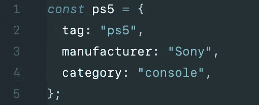
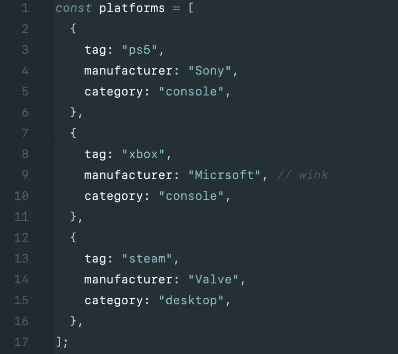
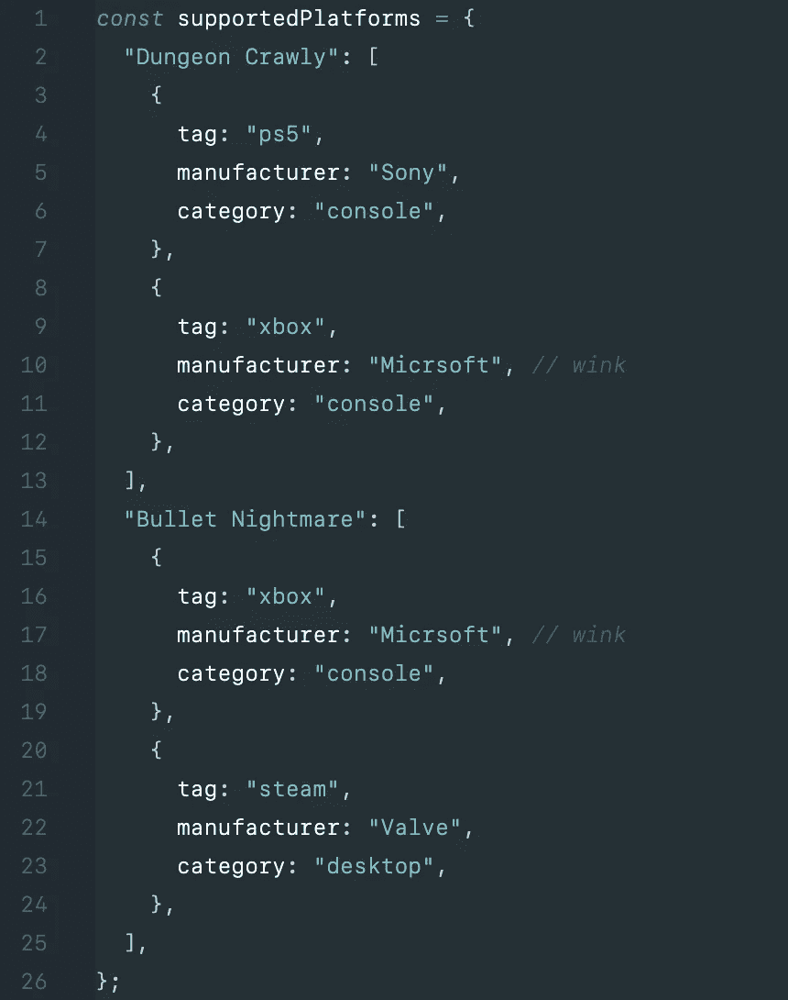
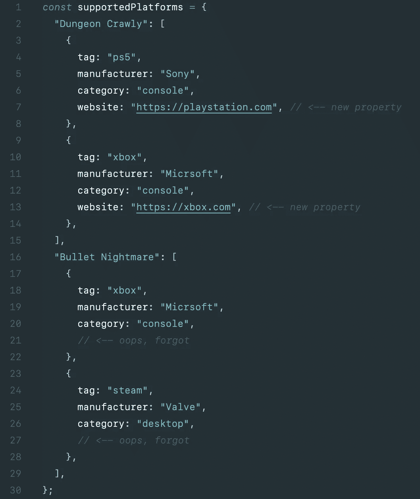
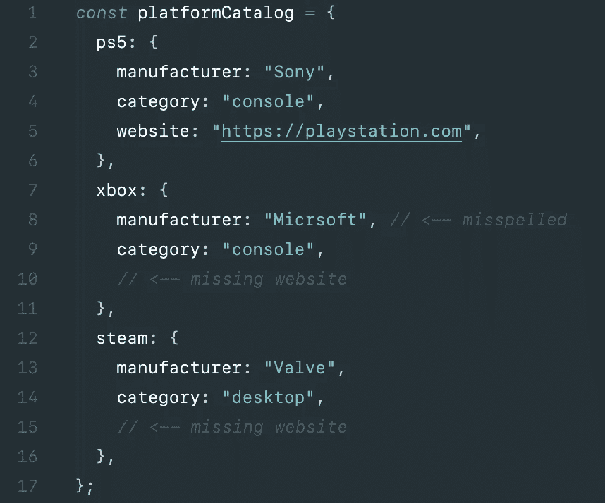
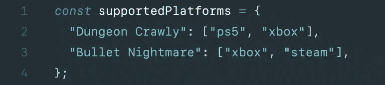
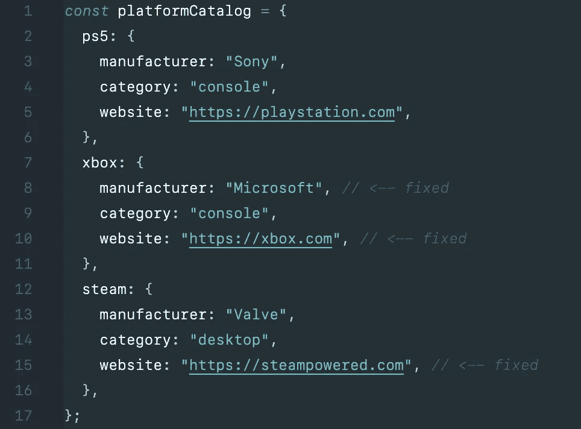
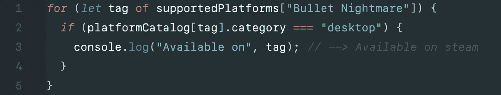

# 如何用对象目录消除 JavaScript 中的代码膨胀

> 原文：<https://levelup.gitconnected.com/how-to-eliminate-code-bloat-in-javascript-with-object-catalogs-983c436c59f9>

## 一个常见问题的简单解决方案


[陈嘉里](https://unsplash.com/@gary_at_unsplash?utm_source=medium&utm_medium=referral)在 [Unsplash](https://unsplash.com?utm_source=medium&utm_medium=referral) 上的照片

# 它是如何发生的

用 JavaScript 创建对象文字很容易。



也许太容易了。我们可以复制并粘贴一个对象文字来快速创建一系列游戏平台。



只要我们的手指还在`Cmd/Ctrl-V`键上，就让我们继续走下去，为我们的游戏《地牢 Crawly》和《子弹噩梦》创建一个平台支持地图。



很简单，柠檬榨汁机。

需要添加一个属性？JavaScript 说:“是的！”



这又快又简单。JavaScript 使许多事情变得快速而简单，这也是它成为如此流行的编程语言的部分原因。

但是现在我们有一些问题。我们复制了代码。重复的代码是不好的*。XBox 的对象文字完整地出现在两个游戏中(第 10 行和第 18 行)。

```
*There are exceptions. See [When is it okay to duplicate code](https://medium.com/@sethltx/when-is-it-okay-to-duplicate-code-2921421d8340)?
```

首先，我们的代码现在不必要地被两个 XBox 定义所膨胀。我们只需要一个。第二，我们现在有两个 XBox 的事实来源，所以我们必须确保在做出改变时更新它们。这造成了维护的噩梦:

1.  我们现在需要纠正两处`Micrsoft`的拼写。
2.  我们在第一个 XBox 定义中添加了`website`属性，但是我们漏掉了第二个。

这个代码片段很容易创建，但最终的结果是臃肿和难以维护。

# 怎么修

我们可以通过一个支持平台的目录来解决代码重复和膨胀的问题。这是平台的唯一真实来源。



我简单地称之为“对象目录”。

```
There are many ways to implement object catalogs. Here we’re using a map indexed by the platform "tag" property.You might need look up objects in the catalog using different properties in different situations, .e.g., looking up platforms by the "manufacturer" or "category" properties. In this case, an array of objects might work better than a map.
```

我们在平台支持图中简洁地引用了该目录。



如果我们需要对平台进行更新，我们只需要在一个地方进行:目录。让我们修复拼写错误和那些丢失的`website`属性。



我们不再有任何代码重复，我们的平台支持图仍然功能齐全。假设我们想知道“子弹噩梦”在桌面平台上是否可用。



我们的平台目录可能会随着应用的增长而增长，但它仍然是一个强大的、单一的事实来源。

当您看到对象文字集合时，寻找机会创建对象目录。重复的对象文字是您需要一个对象目录的明确标志。