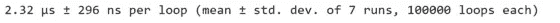
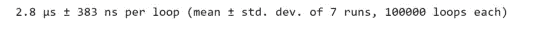
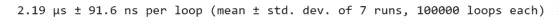
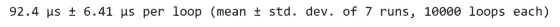
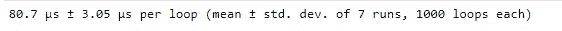
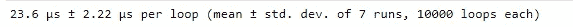
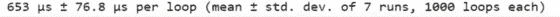
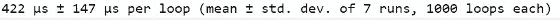
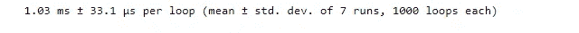
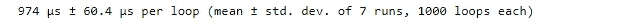

# 如何消除 Python 代码中的循环

> 原文：<https://levelup.gitconnected.com/how-to-eliminate-loops-from-your-python-code-6dfb7c3578fa>

虽然在编写 Python 代码时使用循环并不一定是一个糟糕的设计模式，但是使用额外的循环可能是低效和昂贵的。让我们探索一些工具，它们可以帮助我们消除在代码中使用循环的需要。Python 提供了一些循环模式，当我们想要迭代一个对象的内容时，可以使用这些模式:

*   For 循环逐段迭代序列中的元素。
*   只要满足某个布尔条件，While 循环就会重复执行一个循环。
*   嵌套循环在彼此内部使用多个循环。

尽管 Python 支持所有这些循环模式，但我们在使用它们时应该小心。**因为大多数循环都是以一段一段的方式评估的，所以它们通常是低效的解决方案。**

在编写高效的代码时，我们应该尽量避免循环。消除循环通常会减少更容易解释的代码行。pythonic 代码的一个成语是“**平不如嵌套**”努力消除代码中的循环将有助于我们遵循这个习语。在本文中，我们将讨论和探索一些简单的技术来消除循环，或者至少以更好、更有效的方式编写它。

照片由[普里西拉·杜·普里兹](https://unsplash.com/@priscilladupreez?utm_source=medium&utm_medium=referral)在 [Unsplash](https://unsplash.com?utm_source=medium&utm_medium=referral) 上拍摄

# 目录:

1.  **摆脱循环。用列表理解、映射函数、& itertools
    1.2 消除循环。用 NumPy 消除循环**
2.  **编写更好的循环
    2.1。在循环上移动计算
    2.2。整体转换**

您可以在 GitHub 知识库中找到本文中使用的数据和代码:

 [## GitHub-youssefHosni/高级-Python-编程-教程-

### 此时您不能执行该操作。您已使用另一个标签页或窗口登录。您已在另一个选项卡中注销，或者…

github.com](https://github.com/youssefHosni/Advanced-Python-Programming-Tutorials-) 

**如果你想免费学习数据科学和机器学习，看看这些资源:**

*   免费互动路线图，自学数据科学和机器学习。从这里开始:[https://aigents.co/learn/roadmaps/intro](https://aigents.co/learn/roadmaps/intro)
*   数据科学学习资源搜索引擎(免费)。将你最喜欢的资源加入书签，将文章标记为完整，并添加学习笔记。[https://aigents.co/learn](https://aigents.co/learn)
*   想要在导师和学习社区的支持下从头开始学习数据科学吗？免费加入这个学习圈:[https://community.aigents.co/spaces/9010170/](https://community.aigents.co/spaces/9010170/)

**如果你想在数据科学& AI 领域开始职业生涯，但你不知道如何开始。我提供数据科学指导课程和长期职业指导:**

*   长期师徒:【https://lnkd.in/dtdUYBrM】T4
*   辅导课程:[https://lnkd.in/dXeg3KPW](https://lnkd.in/dXeg3KPW)

***加入*** [***中等会员***](https://youssefraafat57.medium.com/membership) ***计划，只需 5 美元，继续学习，没有限制。如果你使用下面的链接，我会收到一小部分会员费，不需要你额外付费。***

# 1.摆脱这些循环

## 1.1.利用列表理解、映射功能和 itertools 消除循环

假设我们有一个名为 poke_stats 的列表列表，其中包含每个神奇宝贝的统计值。每行对应一个神奇宝贝，每列对应一个神奇宝贝的具体统计值。在这里，列代表一个神奇宝贝的生命点，攻击，防御和速度。我们希望对这些行进行简单的求和，以便收集每个神奇宝贝的总统计数据。如果我们要使用一个循环来计算行总和，我们就必须遍历每一行，并将该行的总和追加到总计列表中。我们可以用更少的代码，通过列表理解来完成同样的任务。或者，我们可以使用内置的 map 函数，我们在之前的文章 [**中讨论过，为数据科学家编写高效的 Python 代码:定义&测量代码效率**](https://medium.com/geekculture/write-efficient-python-code-defining-measuring-code-efficiency-e33a5bd9f7ca) **。**

首先，我们将定义 stats 数组:

现在，我们将使用 for 循环遍历该数组的元素，并打印时间:

我们将做同样的事情，但是使用列表理解:

最后，我们将使用 **map** 函数遍历元素:

这些方法都将返回相同的列表，但是使用列表理解或 map 函数只需要一行代码，运行时间更快。

在前一篇文章中，我们还介绍了一些内置模块，它们可以帮助我们消除循环。除了使用嵌套的 for 循环，我们可以使用 itertools 模块中的组合来获得更简洁、更高效的解决方案。

## 1.2.使用 NumPy 消除循环

另一个消除循环的强大技术是使用 NumPy 包。假设我们有与上一个例子相同的统计数据集合，但是存储在一个 NumPy 数组中，而不是一个 list 列表。

我们希望收集数组中每个神奇宝贝(或行)的平均统计值。我们可以使用一个循环来迭代数组并收集行平均值。

但是，NumPy 数组允许我们一次对整个数组进行计算。这里，我们使用**。mean** 方法，并指定一个等于 1 的轴来计算每行的平均值(意味着我们计算列值的平均值)。这消除了对循环的需要，并且效率更高。

我们可以用下面的代码来比较这两种方法的计时:

当比较运行时，我们看到使用**。mean** 方法并指定一个轴比使用循环要快得多。

# 2.编写更好的循环

我们已经讨论了循环是如何变得昂贵和低效的。但是，有时你不能消除一个循环。在这一节中，我们将探讨当循环不可避免时，如何使循环更有效。在深入讨论之前，我们将讨论的一些循环可以使用前面课程中介绍的技术来消除。出于演示的目的，我们假设这里显示的用例是循环不可避免的情况。

提高循环效率的最好方法是分析循环中正在做的事情。我们希望确保我们在每次迭代中不做不必要的工作。如果对循环的每次迭代都执行计算，但其值不随每次迭代而改变，那么最好将该计算移到循环之外(或之上)。如果一个循环在每次迭代中转换数据类型，那么这种转换可以在循环之外(或之下)使用 map 函数来完成。任何可以一次完成的事情都应该移到循环之外。让我们探讨几个例子。

## **2.1*。将计算移动到循环之上***

我们有一个神奇宝贝名字的列表和一个每个神奇宝贝对应攻击值的数组。我们希望打印出每个攻击值大于所有攻击值平均值的神奇宝贝的名字。为此，我们将使用一个循环来迭代每个神奇宝贝及其攻击值。对于每次迭代，通过找到所有攻击的平均值来计算总攻击平均值。然后，评估每个神奇宝贝的攻击值，看是否超过总平均值。

这个循环的低效之处在于，每次循环迭代都会创建 total_attack_avg 变量。但是，这个计算在迭代之间不会改变，因为它是一个整体平均值。我们只需要计算这个值一次。通过将这种计算移到循环之外(或之上),我们只计算一次总攻击平均值。我们得到相同的输出，但这是一个更有效的方法。

让我们比较一下这两种方法的运行时间:

我们看到，将 total_attack_avg 计算保持在循环中需要 120 多微秒。

## ***2.2。整体转换***

另一种提高循环效率的方法是在循环之外(或之下)使用**整体转换**。在下面的例子中，我们有来自 720 个神奇宝贝数据集的三个列表:每个神奇宝贝的名字列表，一个与神奇宝贝是否具有传奇地位相对应的列表，以及每个神奇宝贝的世代列表。

我们希望组合这些对象，以便每个名称、状态和层代都存储在一个单独的列表中。为此，我们将使用一个循环来迭代 zip 函数的输出。记住，zip 返回元组的集合，所以我们需要将每个元组转换成一个列表，因为我们想要创建一个列表的列表作为我们的输出。然后，我们将每个单独的 poke_list 附加到 poke_data 输出变量中。通过打印结果，我们可以看到我们想要的列表。

让我们首先定义我们将使用的数据:

现在让我们运行循环，转换循环中的元组，并查看时间:

然而，在循环内将每个元组转换成一个列表并不是非常高效。相反，我们应该收集所有的 poke _ tuples，并使用 map 函数将每个 tuple 转换成一个列表。循环不再在每次迭代中将元组转换为列表。相反，我们将这个元组移动到循环之外(或之下)的列表转换。这样，我们一次转换所有的数据类型(或整体地)，而不是在每次迭代中转换。

运行时显示，在循环之外将每个元组转换为一个列表更有效。

*喜欢这篇文章吗？成为* [***中等会员***](https://youssefraafat57.medium.com/membership) *继续无限制学习。如果你使用下面的链接，我会收到一小部分会员费，不需要你额外付费。*

 [## 加入我的介绍链接媒体-优素福胡斯尼

### 阅读 Youssef Hosni(以及媒体上成千上万的其他作家)的每一个故事。您的会员费直接支持…

youssefraafat57.medium.com](https://youssefraafat57.medium.com/membership) 

*感谢阅读！如果你喜欢这篇文章，一定要鼓掌(高达 50！)并在*[*LinkedIn*](https://www.linkedin.com/in/youssef-hosni-b2960b135/)*上与我联系，并在*[*Medium*](https://youssefraafat57.medium.com/)*上关注我的新文章*