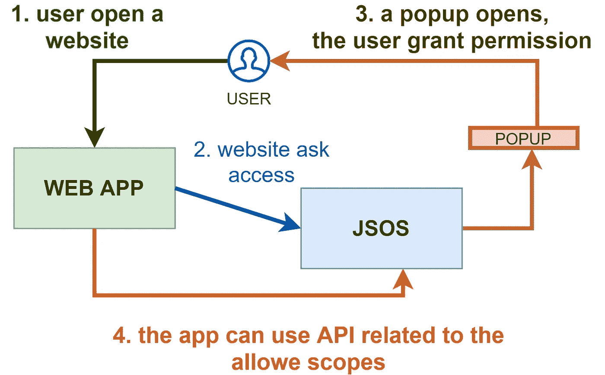
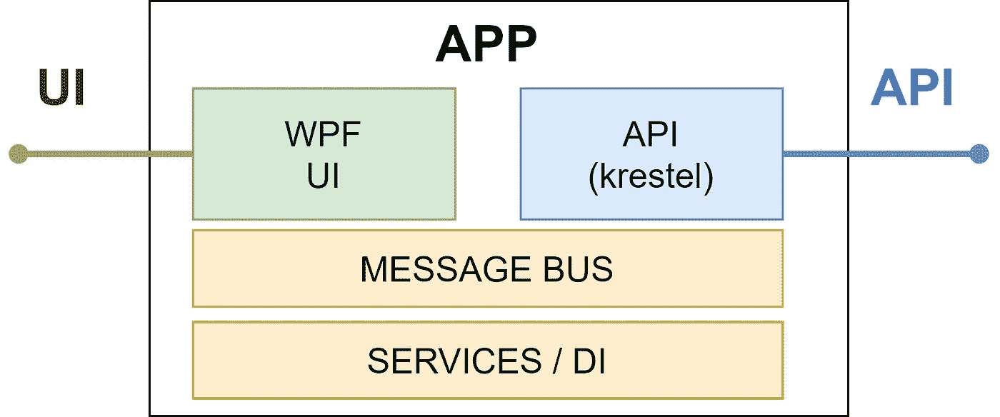
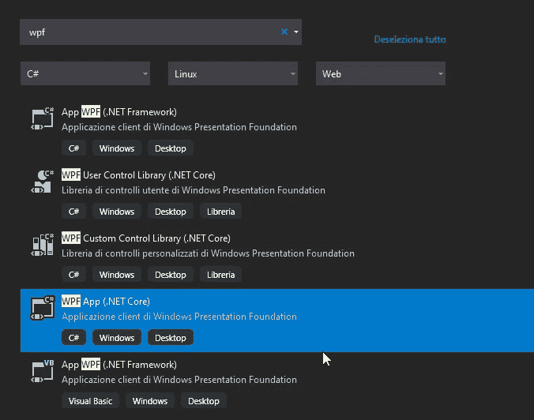
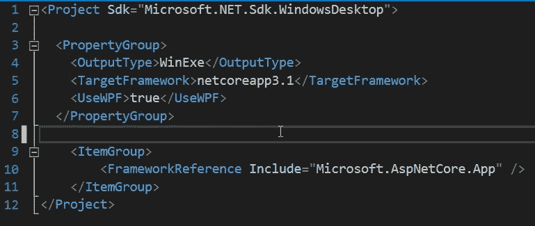
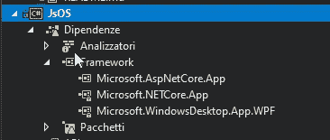
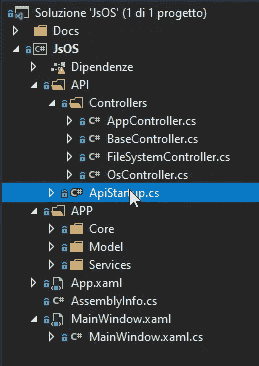

# 如何在桌面应用程序中嵌入 web 服务器

> 原文：<https://levelup.gitconnected.com/how-to-embed-a-web-server-inside-desktop-applications-643ce3cb51bf>

## 使用一个扩展 javascript 开发的应用程序的案例研究的逐步指南

在本文中，我们将了解如何在桌面应用程序中嵌入 web 服务器。这是使用 ASP.NET 核心和 WPF 应用程序完成的，但同样的体验可以移植到 Windows 窗体或控制台应用程序，没有任何大的区别。这是一个非常不寻常的场景，因为我们通常有一个客户端连接到 API，并且两者在不同的地方。无论如何，在某些情况下，将可视化 UI 与 web 服务器集成到客户端可能是有用的。我在考虑必须远程控制的嵌入式设备或想要共享数据的工作站，但我相信你比我更有想象力，你已经发现了更多有趣的用例😃

例如，我用这种情况创建了 [jSOS](https://github.com/zeppaman/jSOS) ，这是一个用于扩展 javascript 功能的通用 API 系统，例如添加直接打印或文件系统访问。结果托管在 Github 上，它是一个完全正常工作的应用程序。古玩？嗯，我将用这个项目作为一个用例来解释如何配置一个 WPF 应用程序作为一个 web 服务器！

福托迪[格尔德奥特曼](https://pixabay.com/it/users/geralt-9301/?utm_source=link-attribution&utm_medium=referral&utm_campaign=image&utm_content=3428644)达[皮克斯拜](https://pixabay.com/it/?utm_source=link-attribution&utm_medium=referral&utm_campaign=image&utm_content=3428644)

## **案例分析**

上面几行我提到的应用程序叫做 JSOS(JavaScript s . o . s .的缩写，无可奉告😅)并实现以下流程:

来自 https://github.com/zeppaman/jSOS[的 JSOS 模式](https://github.com/zeppaman/jSOS)

简而言之，我们需要的是:

*   可以加载 API 服务的 web 服务器(简单)
*   一个 API，当被调用时打开一个 UI 弹出窗口，这样用户可以允许一个网页访问某个范围(显然不容易)
*   一个 UI 应用程序(对于每个玩 XAML 的人来说都很简单，但是你也可以将同样的结果应用到一个 web 表单应用程序中)
*   API 和 UI 之间的交互系统，用于实时刷新

简单地说，我所做的正是我们在这篇文章中所说的:一个嵌入了 web API 服务器的简单桌面应用程序。

与❤️一起制作的图表

## 分步实施

第一点是创建一个 windows 应用程序。我选择了一个 WPF 应用程序，因为我对实现一个可以跨平台移植的丰富应用程序感兴趣(使用 Xamarin 或 [MAUI](https://github.com/dotnet/maui) 框架，我可以很容易地从 XAML 开始，或者差不多就是我想的那样)。我们将在下一篇文章“如何将 WPF 应用程序移植到毛伊岛”中看到更多相关内容，但考虑到毛伊岛路线图，可能要到明年。第一步是创建一个新项目，选择正确的应用程序类型。

选择 WPF 项目类型

**依赖设置**

我们需要一个同时是桌面应用程序和 web 服务器的可执行文件…那么，将这两个角色都添加到项目配置中怎么样？

项目文件配置

除非您这样做，否则即使您手动添加依赖项，您仍然会在编译`Startup.cs`文件时发现问题，因为该文件需要一些由项目 SDK 类型驱动的预处理。

完成这一步后，您将得到一个混合的应用程序，如下所示:

混合应用

下一步是将 API 的代码与应用程序的代码分开。我创建了两个主要的文件夹，充满幻想地叫做 APP 和 API，但是其他的解决方案也可以。

这是我的项目设置:

项目设置

在 API 文件夹中，我有 APIStartup.cs 和一个用于控制器的文件夹。对于扩展，你也可以有 wwwroot 或其他你需要的 ASP.NET 核心东西，只需正确配置启动文件(像在每个常规的。net 应用)。

**服务器服务**

首先，我们需要创建一个控制服务器的服务。很抱歉命名错误，但是按照惯例，提供服务器功能的服务必须被称为 ServerService😆

在这个服务中，我们有一个非常小的激活 Krestel 服务器实例的逻辑。唯一棘手的部分是，运行必须是异步的，以避免停止应用程序的主线程，我的意思是…异步启动它，没有等待。在我的例子中，非异步方法中的“Task.Run”运行良好。

**启动服务器**

对于启动服务器来说，任何点都是好的:你可以使用一个按钮或者让我们从头开始。我使用了启动时触发的 app.xml.cs，所以我的主窗口打开时服务器已经打开。

**消息总线**

因为我们有两个位于不同范围的模块，所以我们需要一些工具来让它们进行通信。受 WPF 消息服务和伟大的 MVVMLight 实现的启发，我为此创建了一个服务。该服务只有两种方法，一种用于注册事件，一种用于触发事件。基于这个简单的用例，我使用一个对象作为参数，委托实时注册向下转换。更好的实现可能是使用泛型方法和强类型输入进行注册\发射。

**关于依赖注入的说明**

而 ASP.NET 核心战舰的依附性注入，为什么不用它也注入 WPF 部分呢？Asp.net 核心的容器是在托管环境启动期间构建的，这发生在 WPF 启动之后，进入另一个线程。我在我的例子中实现的解决方案很简单，我需要共享完全相同的实例。我只是将所有服务添加到一个静态服务提供者，然后获取所有注册的实例，并将它们添加到 ASP.NET 核心容器中。这让应用程序的每个模块照常工作，但是共享类实例。

下面的代码片段做了我们需要的事情:

**带什么回家**

让 ASP.NET 和 WPF 一起工作是非常容易的，并且会出现一些非常不寻常但非常强大的场景，比如有人调用等待用户响应的 API，比如我向用户显示的用于授权许可请求的弹出窗口。此外，我们可以发布一个自容器 web 应用程序，用一个 UI 来启动和停止服务。我在这篇文章的开头让你尝试一下，想象一下你可以用这个解决方案做些什么……我希望读完这篇文章后，你对 Aspe.net 和 WPF 的混合选项有一个更好的了解，所以我在等待你的建议！

*喜欢这篇文章吗？成为* [*中等会员*](https://daniele-fontani.medium.com/membership) *继续无限制学习。如果你使用下面的链接，我会收到你的一部分会员费，不需要你额外付费。*

**参考文献**

*   [https://github.com/zeppaman/jSOS](https://github.com/zeppaman/jSOS)样板工程