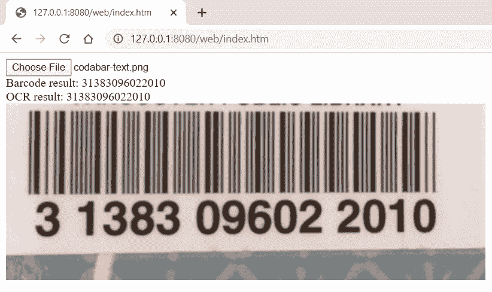

# 如何用 Tesseract.js OCR 构建 JavaScript 条形码扫描仪

> 原文：<https://levelup.gitconnected.com/how-to-empower-javascript-barcode-scan-with-tesseract-js-ocr-173b2c2fc54a>

之前，我分享了一篇文章，演示了如何使用 Tesseract Python OCR 来[识别 1D 条形码的随附文本](https://www.codepool.biz/tesseract-ocr-python-barcode.html)。在本文中，我将把编程语言改为 JavaScript，创建一个与 Tesseract JavaScript OCR 集成的 JavaScript 条形码扫描应用程序。

# 如何使用 JavaScript OCR 识别 1D 条形码文本

当我们在谷歌中搜索“JavaScript OCR”时，返回的第一个结果是 [Tesseract.js](https://github.com/naptha/tesseract.js) ，这是一个 js 包装器，用 [Emscripten](https://github.com/emscripten-core/emscripten) (一个将 C/C++编译成 WebAssembly 的工具)构建，用于 [Tesseract OCR 引擎](https://github.com/tesseract-ocr/tesseract)。

安装 Tesseract.js:

```
npm install tesseract.js
```

要开始使用 Tesseract.js，我们可以学习例子[https://github.com/naptha/tesseract.js/tree/master/examples](https://github.com/naptha/tesseract.js/tree/master/examples)。

但是，您可能会发现所有示例在第一次运行时都需要很长时间。原因是如果没有语言训练数据存在，它将触发下载。根据 [tesseract.js-offline](https://github.com/jeromewu/tesseract.js-offline) 我们可以手动下载数据文件，定义本地数据路径，让 app 离线工作。

节点:

网络浏览器:

我得到了一张测试图像:


结果如下:

```
(IMTANMUEARRMAD 
3 1383 09602 2010
```

因为我使用的是 1D 条形码的 OCR，所以预期的结果应该只包含数字。我们可以通过设置一个[字符白名单](https://github.com/naptha/tesseract.js/blob/master/docs/api.md#worker-set-parameters)来过滤返回的字符:

```
await worker.setParameters({ tessedit_char_whitelist: '0123456789',});
```

重新运行应用程序:

```
101011191 1 1 1111 111 11 1 41 111 1 11 11 111 11 1 11 31383096022010
```

虽然结果只包含数字，但还是不理想。也许我们可以改变训练数据来改善结果。访问 [tessdata](https://github.com/naptha/tessdata) 以获得更高 OCR 准确度的数据。替换**eng.traineddata.gz**文件后，我得到了预期的结果:

```
31383096022010
```

# 如何实现一个 JavaScript 条形码阅读器

Dynamsoft 将 C/C++条码库编译成 WebAssembly 模块，方便开发 Node.js 和 web 浏览器的高性能 JavaScript 条码 app。现在，让我们创建 JavaScript 条形码阅读器应用程序，并使用 JavaScript OCR 来验证条形码结果。

# 结节

安装软件包:

```
npm install dynamsoft-node-barcode
```

解码 Node.js 中的条形码:

在命令行工具中运行应用程序:

```
node index.js
```


# 网

安装软件包:

```
npm install dynamsoft-javascript-barcode
```

在 web 应用程序中读取条形码:

运行 web 应用程序:

```
npx http-server .
```



很高兴看到 JavaScript OCR 结果与条形码结果相匹配。如果您的条形码 SDK 有时无法读取 1D 条形码，请尝试 OCR 来识别附带的文本。

# 源代码

[https://github.com/yushulx/javascript-barcode-ocr](https://github.com/yushulx/javascript-barcode-ocr)

*原载于 2020 年 2 月 19 日*[*https://www . code pool . biz*](https://www.codepool.biz/javascript-barcode-scan-ocr-text.html)*。*