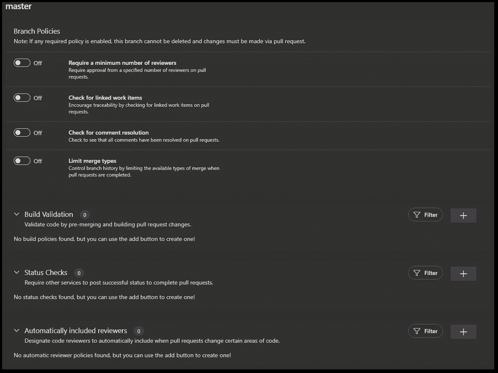
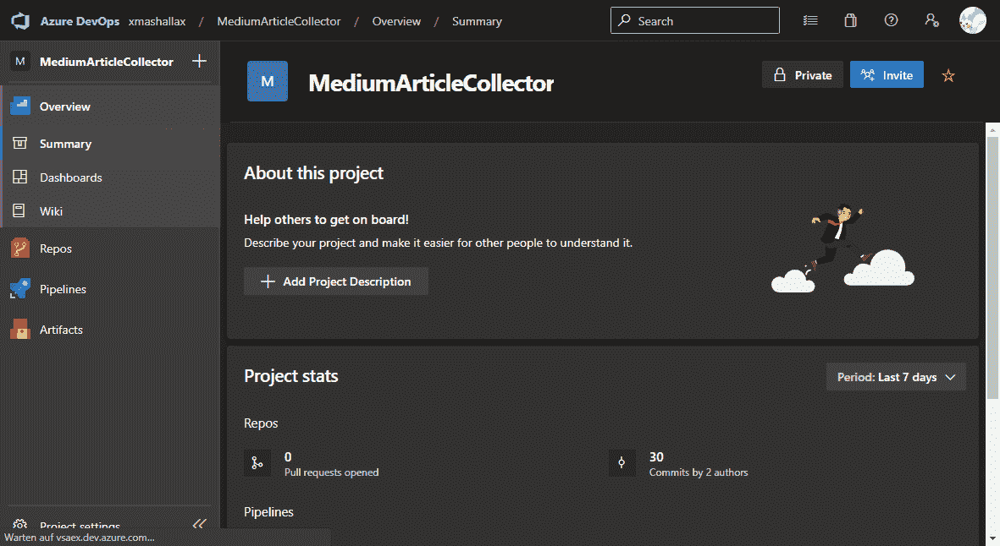
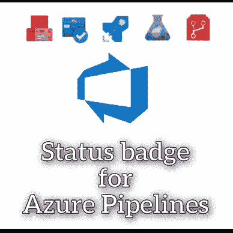
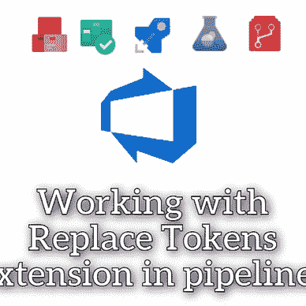
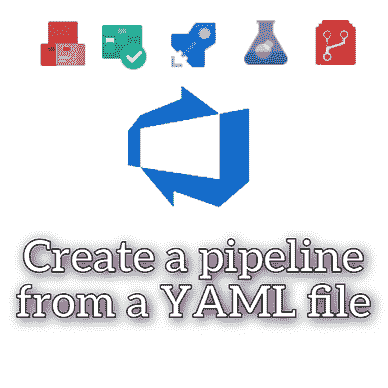

# 如何在 Azure DevOps 中启用拉请求工作流

> 原文：<https://levelup.gitconnected.com/how-to-enable-a-pull-request-workflow-in-azure-devops-fbd742ca2e97>

## Azure DevOps 手册

## 处理拉式请求是软件开发领域团队的常见模式。以下是如何在 Azure DevOps 中实施工作流。

用[像素化](https://www.pixelied.com)制作

软件项目中最常见的工作流是拉请求工作流。首先，开发人员在一个单独的分支上开发新的功能或错误修复。当工作完成时，会创建一个 pull 请求，将变更集成到另一个分支中(通常是`main`或`master`分支，但这取决于具体的工作流)。其他团队成员审阅更改并批准或拒绝请求。

如果处理得当，这是一个行之有效的策略，可以最大限度地减少错误，获得有价值的变更反馈，并保持一致的代码库。

默认情况下，Azure DevOps 允许直接推送到主分支，而不需要拉请求。在这个简短的演示中，我将向您展示如何更改设置。

作者在 Azure DevOps 中的分支策略截图

转到 **Repos** → **Branches** 并点击您想要执行拉动请求的分支右侧的三个点。接下来，点击**分支策略**并选择**至少一个提供的策略**。这将阻止对所选分支的推送，并需要一个拉取请求。树枝上会有一个蓝色的奖牌符号作为提示。

这是一个快速演示视频:

关于如何在 Azure DevOps 中强制执行拉请求的演示视频

以下是可用的选项

**要求最少数量的审阅者**
要求指定数量的审阅者对拉取请求进行批准。

检查链接的工作项目
通过检查拉取请求上的链接工作项目来鼓励可追溯性。

检查注释解析
检查是否所有注释都已在拉取请求中得到解析。

**限制合并类型**
通过在拉请求完成时限制可用的合并类型来控制分支历史。

**构建验证**
通过预合并和构建拉取请求变更来验证代码。要使用此选项，您需要引用一个工作管道。

状态检查
要求其他服务发布成功状态以完成拉取请求。一个常见的检查是例如 [SonarCube](https://www.sonarqube.org/) 的代码质量度量。

自动包含的评审者
指定当拉请求改变代码的某些区域时自动包含的代码评审者。如果您有需要批准变更的首席开发人员或架构师，这将非常有用。

**在这里找到更多关于 Azure DevOps 的提示:**

[赛拉杜](https://xeladu.medium.com/?source=post_page-----fbd742ca2e97--------------------------------)

## Azure DevOps 手册

[View list](https://xeladu.medium.com/list/the-azure-devops-handbook-2d6bf33f9f5b?source=post_page-----fbd742ca2e97--------------------------------)7 stories

通过我的推荐链接加入成千上万的媒体会员，每月只需 5 美元就可以阅读你想阅读的文章。

 [## 通过我的推荐链接加入 Medium-xela du

### 只需点击一下，就可以通过会员资格访问数千篇文章！您的会员资格只需 5 美元一张…

medium.com](https://medium.com/@xeladu/membership) 

点击 [**此处**](http://bit.ly/xeladu-medium) 每月获取一次我的所有中型文章的摘要🔔浏览[我的 Gumroad 商店](https://xeladu.gumroad.com/)寻找有趣的编程素材🏬