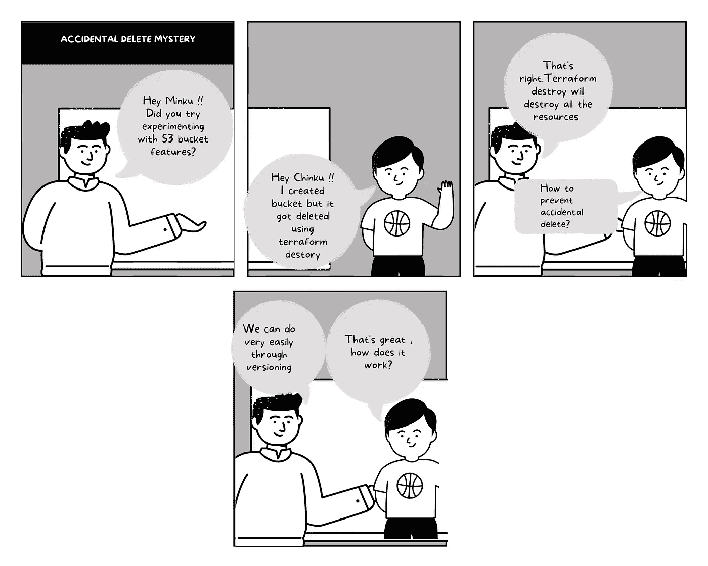
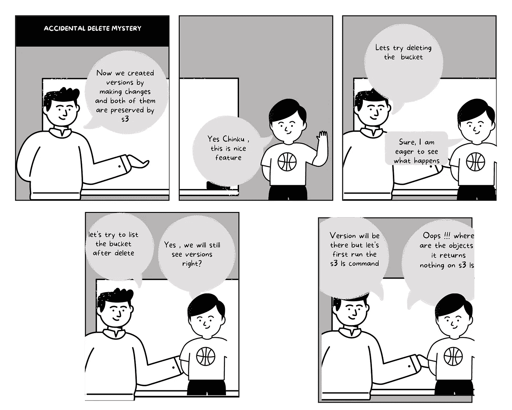
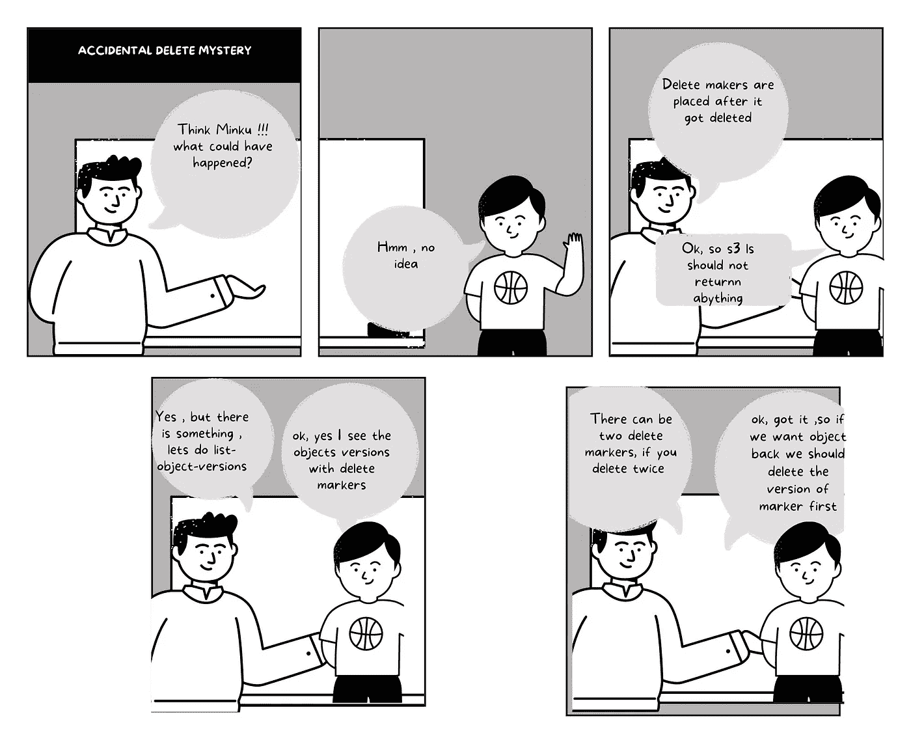

# 如何使用 Terraform 和 LocalStack 在 S3 启用版本控制

> 原文：<https://levelup.gitconnected.com/how-to-enable-versioning-in-s3-using-terraform-and-localstack-b387a4ab453b>

保护 S3 存储桶不被意外删除



作者图片

AWS S3 允许对象的版本控制从意外删除和应用程序故障中恢复。默认情况下，任何 S3 时段都禁用版本控制。

我们可以从任何意外删除中恢复，这是通过 S3 启用的特殊标记完成的，我们将在本文后面讨论。

让我们首先遵循一些初始步骤来开始版本化工作。
请参考我之前关于使用 terraform 和本地堆栈创建 S3 存储桶的文章，我将使用相同的示例来创建一个具有版本控制的存储桶

[](/how-to-test-s3-with-terraform-using-localstack-585d2366fa13) [## 如何使用 LocalStack 用 Terraform 测试 S3

### LocalStack 简化了 AWS 服务的测试

levelup.gitconnected.com](/how-to-test-s3-with-terraform-using-localstack-585d2366fa13) 

## 步骤#1 在 S3 启用版本控制

`versioning_configuration`添加`status`属性为`enabled`的版本信息

## 第二步运行地形计划

```
terraform init
terraform planOutput :**# aws_iam_role.invocation_role** will be created+ resource "aws_iam_role" "invocation_role" {+ arn                   = (known after apply)+ assume_role_policy    = jsonencode({+ Statement = {+ Action   = "s3:ListBucket"+ Effect   = "Allow"+ Resource = "arn:aws:s3:::test-bucket"}+ Version   = "2012-10-17"})+ create_date           = (known after apply)+ force_detach_policies = false+ id                    = (known after apply)+ managed_policy_arns   = (known after apply)+ max_session_duration  = 3600+ name                  = "s3_api_gateway_auth_invocation"+ name_prefix           = (known after apply)+ path                  = "/"+ tags_all              = (known after apply)+ unique_id             = (known after apply)+ inline_policy {+ name   = (known after apply)+ policy = (known after apply)}}**# aws_s3_bucket.test-bucket** will be created+ resource "aws_s3_bucket" "test-bucket" {+ acceleration_status                  = (known after apply)+ acl                                  = (known after apply)+ arn                                  = (known after apply)+ bucket                               = "my-bucket"+ bucket_domain_name                   = (known after apply)+ bucket_regional_domain_name          = (known after apply)+ cors_rule                            = (known after apply)+ force_destroy                        = false+ grant                                = (known after apply)+ hosted_zone_id                       = (known after apply)+ id                                   = (known after apply)+ lifecycle_rule                       = (known after apply)+ logging                              = (known after apply)+ object_lock_enabled                  = (known after apply)+ policy                               = (known after apply)+ region                               = (known after apply)+ replication_configuration            = (known after apply)+ request_payer                        = (known after apply)+ server_side_encryption_configuration = (known after apply)+ tags_all                             = (known after apply)+ versioning                           = (known after apply)+ website                              = (known after apply)+ website_domain                       = (known after apply)+ website_endpoint                     = (known after apply)+ object_lock_configuration {+ object_lock_enabled = (known after apply)+ rule                = (known after apply)}}**# aws_s3_bucket_versioning.versioning_example** will be created+ resource "aws_s3_bucket_versioning" "versioning_example" {+ bucket = (known after apply)+ id     = (known after apply)+ versioning_configuration {+ mfa_delete = (known after apply)+ status     = "Enabled"}}**Plan:** 3 to add, 0 to change, 0 to destroy.**Do you want to perform these actions?**Terraform will perform the actions described above.Only 'yes' will be accepted to approve.**Enter a value:** yes**aws_iam_role.invocation_role: Creating...****aws_s3_bucket.test-bucket: Creating...****aws_s3_bucket.test-bucket: Creation complete after 1s [id=my-bucket]****aws_s3_bucket_versioning.versioning_example: Creating...****aws_iam_role.invocation_role: Creation complete after 1s [id=s3_api_gateway_auth_invocation]****aws_s3_bucket_versioning.versioning_example: Creation complete after 1s [id=my-bucket]****Apply complete! Resources: 3 added, 0 changed, 0 destroyed.**
```

我们现在看到我们有三个变更*，因为我们从一开始就在创建存储桶。如果我只添加版本控制部分，那么将只添加一个资源*。**

```
**terraform apply**
```

## *****步骤#3 验证桶并添加一个文件*****

**让我们先添加一个带有简单文本的文件**

**让我们创建一个别名，并将其添加到我们的`.zshrc`**

```
**alias awss3api="aws --endpoint-url=http://localhost:4566 s3api"
alias awss3="aws --endpoint-url=http://localhost:4566 s3"** 
```

**找到`.zshrc`并验证桶中的内容**

```
**source ~/.zshrcawss3 cp test.txt s3://my-bucketawss3 ls s3://my-bucket**Output:**
2022-04-10 15:17:39         65 test.txt**
```

**让我们试着看看文件的版本是否被创建**

```
**awss3api list-object-versions --bucket my-bucket --key test.txt**Output:**
{"IsTruncated": false,"KeyMarker": "test.txt","Versions": [{"ETag": "\"44100b5ed6d5128ca6b705a29c489c29\"","Size": 22,"StorageClass": "STANDARD","Key": "test.txt","VersionId": "f43ce36e-baaa-46ea-b44f-437b6e61758b","IsLatest": true,"LastModified": "2022-04-10T10:03:04+00:00","Owner": {"DisplayName": "webfile","ID": "75aa57f09aa0c8caeab4f8c24e99d10f8e7faeebf76c078efc7c6caea54ba06a"}}],"Name": "my-bucket","Prefix": "","Delimiter": "","MaxKeys": 1000}**
```

**创建版本**f 43 ce 36 e-baaa-46ea-b44f-437 B6 e 61758 b**并用键`test.txt`将`isLatest`设置为`true`**

## *****步骤#4 添加与修改*** 相同的文件**

```
**awss3 cp test.txt s3://my-bucketawss3api list-object-versions --bucket my-bucket --key test.txtOutput :
{"IsTruncated": false,"KeyMarker": "test.txt","Versions": [{"ETag": "\"6a26de2e122c69d94ff12e03b9b7498f\"","Size": 65,"StorageClass": "STANDARD","Key": "test.txt","VersionId": "7548306c-dfd3-4d3a-a994-28e790c479a6","IsLatest": true,"LastModified": "2022-04-10T10:08:28+00:00","Owner": {"DisplayName": "webfile","ID": "75aa57f09aa0c8caeab4f8c24e99d10f8e7faeebf76c078efc7c6caea54ba06a"}},{"ETag": "\"44100b5ed6d5128ca6b705a29c489c29\"","Size": 22,"StorageClass": "STANDARD","Key": "test.txt","VersionId": "f43ce36e-baaa-46ea-b44f-437b6e61758b","IsLatest": false,"LastModified": "2022-04-10T10:03:04+00:00","Owner": {"DisplayName": "webfile","ID": "75aa57f09aa0c8caeab4f8c24e99d10f8e7faeebf76c078efc7c6caea54ba06a"}}],"Name": "my-bucket","Prefix": "","Delimiter": "","MaxKeys": 1000}**
```

**创建版本**7548306 c-DFD 3–4d3a-a994–28e 790 c 479 a6**并用键`test.txt`将`isLatest`设置为`true`，同时将**f 43 ce 36 e-baaa-46ea-b44f-437 B6 e 61758 b**设置为`false`。**

*****版本维护，可以认为是堆栈后进先出。*****

****

**由[霍利·斯特拉顿](https://unsplash.com/@holly_buildalifeyoulove?utm_source=unsplash&utm_medium=referral&utm_content=creditCopyText)在 [Unsplash](https://unsplash.com/s/photos/stack?utm_source=unsplash&utm_medium=referral&utm_content=creditCopyText) 上拍摄的照片**

**我们可以使用`get-object`获得最新版本的内容**

```
**awss3api get-object --bucket my-bucket --key test.txt --range bytes=0-10000 /dev/stdout**Ouptput:**
Hello I am s3 bucket.The versioning is enabled for this bucket.{"AcceptRanges": "bytes","LastModified": "2022-04-10T13:17:39+00:00","ContentLength": 65,"ETag": "\"6a26de2e122c69d94ff12e03b9b7498f\"","VersionId": "8832c9db-0cd3-42bb-b88c-082c7e4ebb49","ContentLanguage": "en-US","ContentRange": "bytes 0-64/65","ContentType": "text/plain","Metadata": {}}**
```

## ****步骤#5 在存储桶上执行删除****

```
**awss3api delete-object --bucket my-bucket --key test.txt**Output:**awss3 delete-object --bucket my-bucket --key test.txt{"VersionId": "a1098f60-95e4-4007-8c15-b66e5dcf53f9"}**
```

****运行以下命令将不会返回任何内容****

```
**awss3 ls s3://my-bucket**
```

**让我们试着找出原因**

****

**作者图片**

# **删除标记**

*   **当删除存储桶内的对象时，会添加它**
*   **它带有一个密钥和版本 Id**
*   **这是对象的最新版本，即它们位于版本堆栈的顶部。**

**我们看到在`DeleteMarkers`部分创建了一个新版本**

****

**作者图片**

```
**awss3api list-object-versions — bucket my-bucket — key test.txtOuput:
{"IsTruncated": false,"KeyMarker": "test.txt","Versions": [{"ETag": "\"6a26de2e122c69d94ff12e03b9b7498f\"","Size": 65,"StorageClass": "STANDARD","Key": "test.txt","VersionId": "7548306c-dfd3-4d3a-a994-28e790c479a6","IsLatest": false,"LastModified": "2022-04-10T10:08:28+00:00","Owner": {"DisplayName": "webfile","ID": "75aa57f09aa0c8caeab4f8c24e99d10f8e7faeebf76c078efc7c6caea54ba06a"}},{"ETag": "\"44100b5ed6d5128ca6b705a29c489c29\"","Size": 22,"StorageClass": "STANDARD","Key": "test.txt","VersionId": "f43ce36e-baaa-46ea-b44f-437b6e61758b","IsLatest": false,"LastModified": "2022-04-10T10:03:04+00:00","Owner": {"DisplayName": "webfile","ID": "75aa57f09aa0c8caeab4f8c24e99d10f8e7faeebf76c078efc7c6caea54ba06a"}}],"**DeleteMarkers**": [{"Owner": {"DisplayName": "webfile","ID": "75aa57f09aa0c8caeab4f8c24e99d10f8e7faeebf76c078efc7c6caea54ba06a"},"Key": "test.txt","VersionId": "a1098f60-95e4-4007-8c15-b66e5dcf53f9","IsLatest": true,"LastModified": "2022-04-10T13:09:56+00:00"}],"Name": "my-bucket","Prefix": "","Delimiter": "","MaxKeys": 1000}**
```

## **步骤#6 执行第二次删除**

**执行另一个删除将添加另一个删除标记，让我们尝试运行一个命令**

```
**awss3api delete-object --bucket my-bucket --key test.txt**Output:**
{"VersionId": "60a67a37-15cd-453c-a0cb-a3d387b64d24"}**
```

****我们看到现在有两个删除标记****

```
**awss3api list-object-versions --bucket my-bucket --key test.txt**Output:**
............"DeleteMarkers": [{"Owner": {"DisplayName": "webfile","ID": "75aa57f09aa0c8caeab4f8c24e99d10f8e7faeebf76c078efc7c6caea54ba06a"},"Key": "test.txt","VersionId": "60a67a37-15cd-453c-a0cb-a3d387b64d24","IsLatest": true,"LastModified": "2022-04-10T13:10:29+00:00"},{"Owner": {"DisplayName": "webfile","ID": "75aa57f09aa0c8caeab4f8c24e99d10f8e7faeebf76c078efc7c6caea54ba06a"},"Key": "test.txt","VersionId": "a1098f60-95e4-4007-8c15-b66e5dcf53f9","IsLatest": false,"LastModified": "2022-04-10T13:09:56+00:00"}],"Name": "my-bucket","Prefix": "","Delimiter": "","MaxKeys": 1000}**
```

## **步骤 7:移除删除标记**

*****先说第一个。*****

```
**awss3api delete-object --bucket my-bucket --key test.txt --version-id 60a67a37-15cd-453c-a0cb-a3d387b64d24Output:
{"DeleteMarker": true}** 
```

*****第二个*****

```
**awss3api delete-object --bucket my-bucket --key test.txt --version-id a1098f60-95e4-4007-8c15-b66e5dcf53f9Output:
{"DeleteMarker": true}**
```

**再次列出桶中的对象，您应该能够看到文件`test.txt`并使用`list-object-versions`列出版本**

```
**awss3 ls s3://my-bucket
awss3api list-object-versions --bucket my-bucket --key test.txt**
```

**请参考我的 [Github repo](https://github.com/pgolani28/terraform_localstack_demo) 获取代码，也请参考我的博客来创建你自己的公共库**

**[](https://faun.pub/how-to-create-your-first-git-hub-repo-mac-f3df63398c94) [## 如何创建你的第一个 Git Hub Repo — Mac

### 通往 Git Hub 仓库的 5 个简单步骤

faun.pub](https://faun.pub/how-to-create-your-first-git-hub-repo-mac-f3df63398c94) 

# **结论**

感谢您阅读这篇文章，它对理解 S3 版本控制特性非常有用。

***走之前***……*如果你喜欢我的故事，想支持我的写作，* [***就在这里***](https://medium.com/@prernagolani21/membership) *成为中等会员。一个月 5 美元，你就可以获得无限的故事，我会赚一点佣金，不需要你额外付费。谢谢你看我的故事，支持我对写作的热爱。*

请**关注我**/[/**订阅电子邮件**](https://medium.com/subscribe/@prernagolani21) ，这样我的下一篇文章一出来你就会知道。

# **参考文献**

[https://docs . AWS . Amazon . com/Amazon S3/latest/user guide/versioning-workflows . html](https://docs.aws.amazon.com/AmazonS3/latest/userguide/versioning-workflows.html)
[https://registry . terraform . io/providers/hashi corp/AWS/latest/docs/resources/S3 _ bucket](https://registry.terraform.io/providers/hashicorp/aws/latest/docs/resources/s3_bucket)**