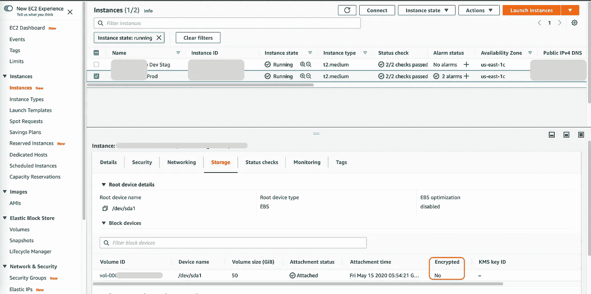
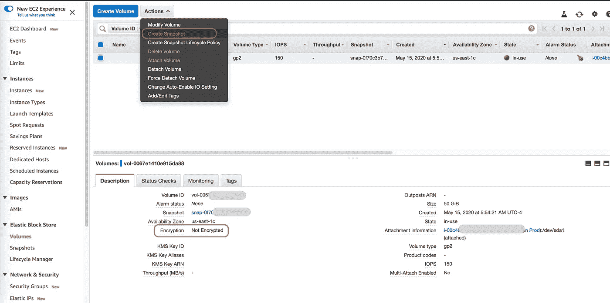
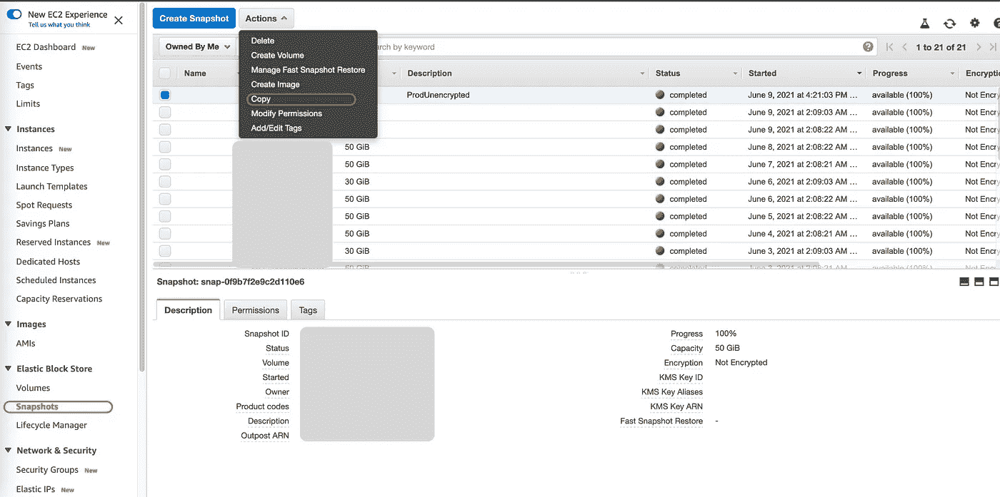
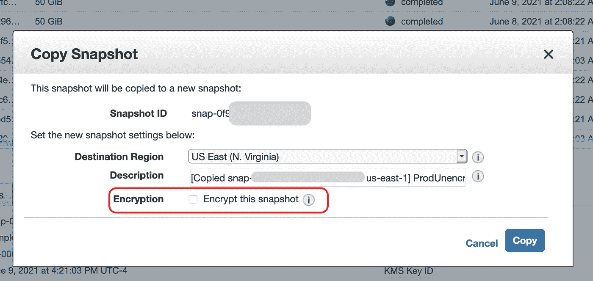
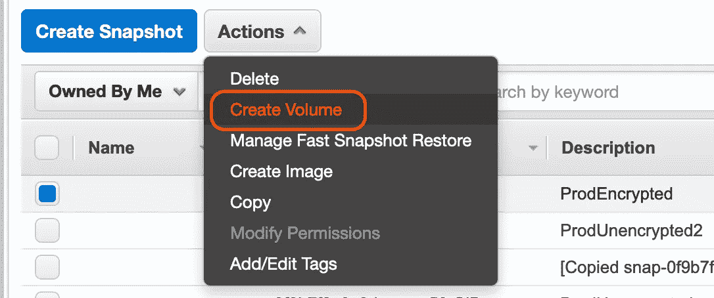
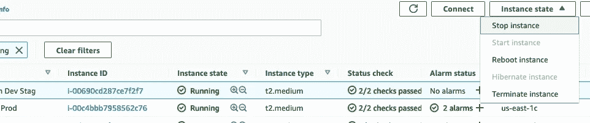
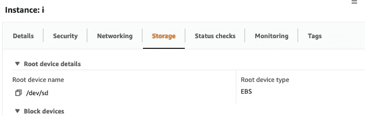
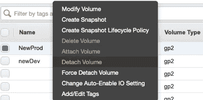
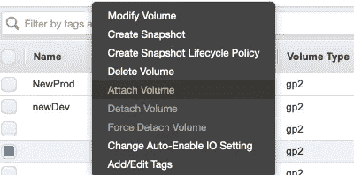

# 如何加密现有的(未加密的)EC2 EBS 卷

> 原文：<https://levelup.gitconnected.com/how-to-encrypt-an-existing-unencrypted-ec2-ebs-volume-a2f0f5fca735>

丹·尼尔森在 [Unsplash](https://unsplash.com?utm_source=medium&utm_medium=referral) 上拍摄的照片

# **简介**:

如果您发现自己需要将正在运行的未加密实例转换为加密实例，则必须采取谨慎、明确的步骤来满足安全标准并防止数据丢失或损坏。

本文概述然后**描述保护您的存储卷**的每个步骤。严格遵循本指南，整个过程可以在 15 分钟内完成。

如果您需要确认您已经准备好，请进入最后一部分， ***附加注意事项*** 以清点您的配置。

## 程序概述:

*   找到 EC2 和 EBS 实例
*   创建 EBS 卷的快照
*   将快照(未加密)拷贝到加密拷贝
*   从加密的快照创建 EBS 卷
*   停止 EC2 实例
*   分离现有卷
*   附加新卷
*   重新启动 EC2 实例
*   其他注意事项

# 程序:

## **定位 EC2 和 EBS 实例:**

弹性块存储(EBS)卷通过 EC2 仪表板连接到 EC2 实例。您可以通过选择实例并单击 storage 选项卡来找到 EBS 卷信息。

如下图所示，该生产实例当前有一个未加密的卷。最后，我们将拥有一个加密设置为“Yes”的新卷。

EC2 实例仪表板(可识别的实例信息已删除)

## 创建快照:

快照创建 EBS 数据的副本。

单击 EC2 仪表板“存储”面板中的卷 ID，导航至 EBS 仪表板。选择 EBS 卷并创建快照，如下所示。

我们生产实例的 EBS 仪表板

这将使您有机会创建带有标签的可识别描述(可选)。快照在创建后会移动到快照面板。

## 将快照(未加密)拷贝到加密拷贝:

将卷复制到新快照时，会执行第一个加密事件。

快照面板(如果不自动备份，快照可能会更少)

选择要复制的操作。这将返回一个带有选项的弹出模式。单击要加密的选项。您可以使用默认密钥或自己选择的密钥(在 KMS 中创建后)。

选中加密框！

## 从加密的快照创建 EBS 卷:

现在是创建加密卷的时候了。由于这是从我们的加密快照创建的，因此它将包含原始 EBS 卷中的所有数据。

现在是分配更多存储或 IOPS 速度的最佳时机

默认情况下，加密将处于活动状态。监控的主要选项是“可用性区域”,必须设置为与 EC2 完全相同的**和**。例如，如果您的 EC2 在“us-east-2”中，那么也必须在这里创建卷。

## 停止 EC2 实例:

当您的用户基数最低时或在计划维护期间，分配以下步骤。我们需要暂停 EC2 进程来分离/连接新的块存储卷。

现在开始计时！

## **分离现有卷:**

确保 EC2 上的实例已停止。首先，记下 EC2 面板中的根设备名称。这将有助于以下步骤:

单击左边的图标复制到剪贴板

现在，转到左侧导航栏上的弹性块存储卷。分离现有的 EBS 卷。EC2 现在准备好接受快照中新创建的卷。

该卷仍将作为当前时间的备份快照存在

## 附加新卷:

将新卷附加到最近可用的实例。

在此安装向导中，将根设备名称设置为上一步中复制的名称。

## 重新启动 EC2 实例:

现在，所有具有挑战性的步骤都完成了。是时候重启 EC2 了。选择已停止的计算机，然后在我们之前用来停止它的同一个“实例状态”下拉菜单上单击“启动实例”。你可以期待几分钟的处理时间，然后一切都完全恢复正常。

这完成了用加密的(并且可能更大的)新卷替换未加密的 EC2 存储卷。所有艰苦的工作都完成了。但是，请参考其他注意事项，并仔细测试以确保没有任何损失。

## 其他注意事项:

记录可能受系统重启影响的进程是很重要的。

例如，EC2 实例的重新启动将中断大多数节点服务器，并需要重新启动(Node server.js)或(pm2 复活)。大多数服务会自动返回。但是，请通过收听端口(*sudo lsof-I-P-n | grep LISTEN*)、参考文档或与团队领导交谈来做笔记。

如果在创建/附加新宗卷的过程中出现任何问题，您可以随时恢复到以前的储存宗卷，并在准备就绪时重试。

您完成了，现在互联网是一个更安全的地方。干得好！