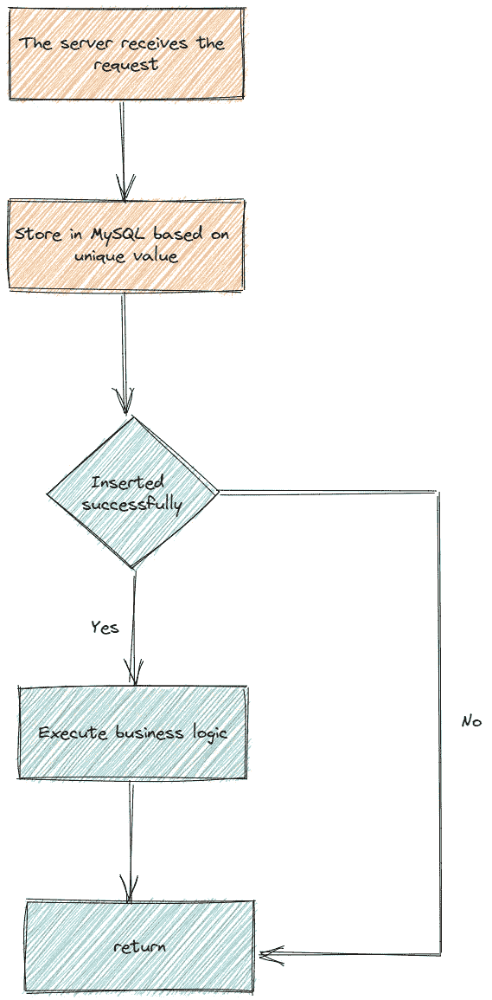
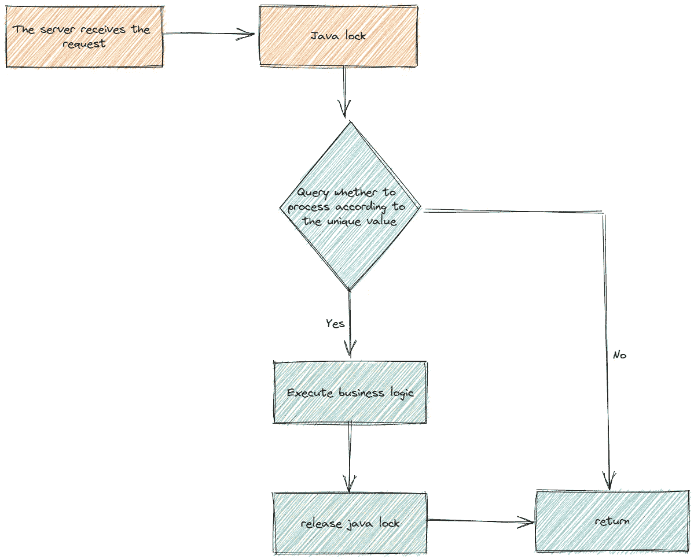
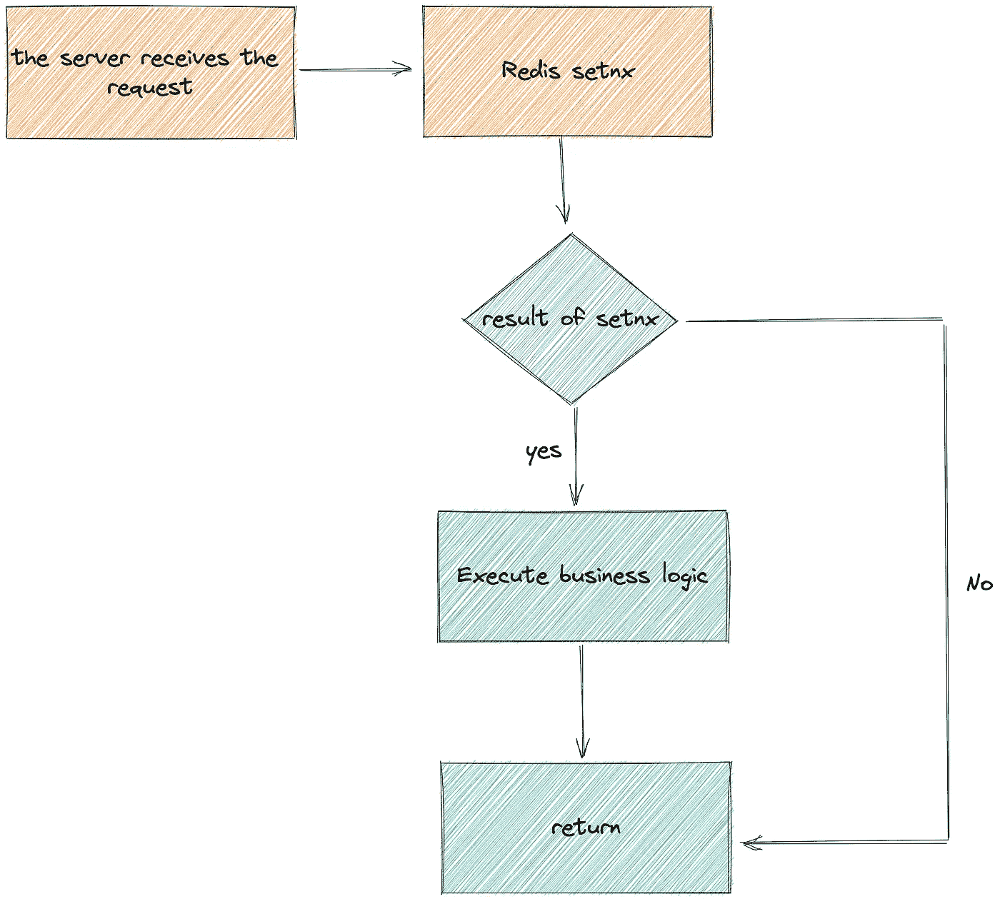
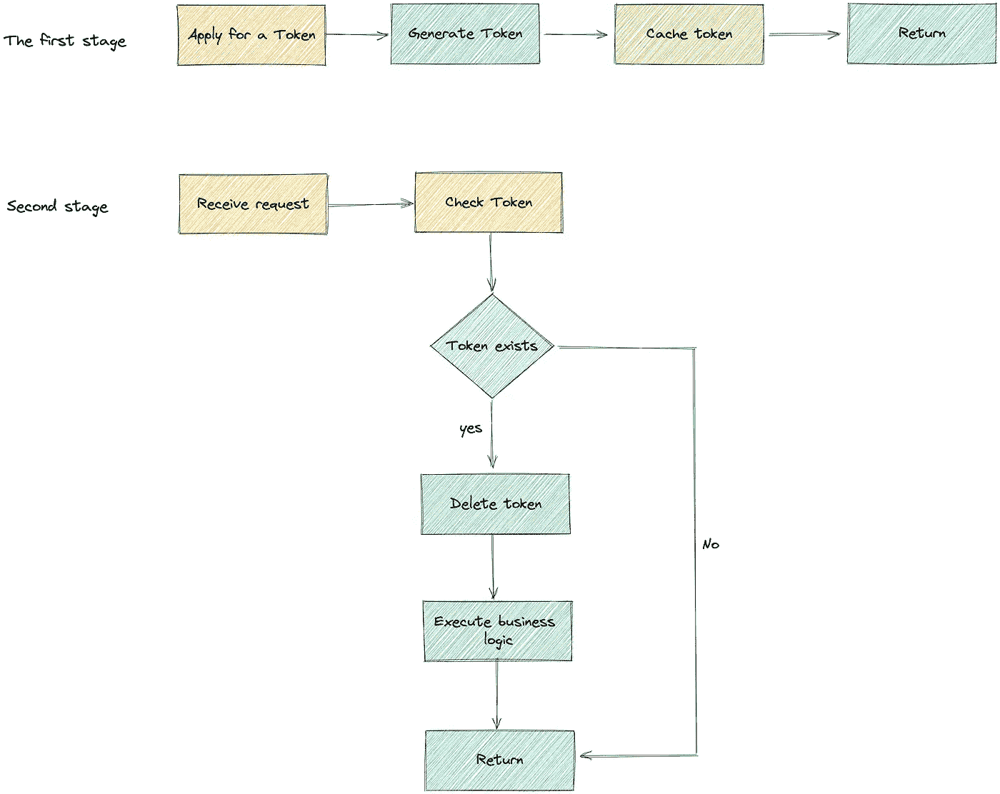

# 如何保证幂等性

> 原文：<https://levelup.gitconnected.com/how-to-ensure-idempotence-f436a42bf67d>


西蒙·威尔克斯在 [Unsplash](https://unsplash.com/s/photos/tree?utm_source=unsplash&utm_medium=referral&utm_content=creditCopyText) 上的照片

**幂等的定义。**

幂等的概念来自数学，意思是数据源上 N 次变换和 1 次变换的结果是一样的。

在项目中，幂等性用于表示用户对同一操作发起的一个请求或多个请求的结果是一致的，不会因为多次点击而产生副作用。

*   等幂包括第一次请求时对资源的副作用，但后续请求将不再对资源产生副作用。
*   幂等性关注的是后续的多个请求是否对资源有副作用，而不是结果。
*   网络超时等问题不在等幂范畴。
*   等幂是系统服务对外界的一种承诺，而不是实现。它承诺只要调用接口成功，多次外部调用对系统的影响是一致的。
*   声明为幂等的服务将假设外部调用失败是正常的，失败后必须重试。

**要使用的场景。**

在业务开发过程中，你可能会遇到这样的情况，由于网络动荡导致请求无法接收，触发重试机制，或者前端抖动导致表单重复提交。

例如，在交易系统中，用户提交的购物请求已经被服务器正确处理，但是由于网络等原因，服务器的返回结果丢失，因此客户端无法知道处理结果。

如果是在网页上，一些不恰当的设计可能会让用户认为上一次操作失败，然后刷新页面，导致扣费被调用两次，账户也被再次扣款。

此时，需要引入一个幂等接口。

我们以 MySQL 为例。只有第三种情况要求开发人员使用其他策略来确保幂等性。

```
-- No matter how many times it is executed, it will not change the state, so it is naturally idempotent.
SELECT col1 FROM tab1 WHER col2=2;

-- No matter how many times the execution is successful, the state is consistent, so it is also an idempotent operation.
UPDATE tab1 SET col1=1 WHERE col2=2;

-- The result of each execution will change, which is not idempotent.
UPDATE tab1 SET col1=col1+1 WHERE col2=2;
```

提示:重复提交和等幂的区别。

*   重复提交是指在第一次请求已经成功的情况下，人为地执行多次操作，导致不满足幂等性要求的服务多次改变状态。
*   幂等多用于第一个请求不知道结果(比如超时)或者异常失败，发起多个请求的情况。目的是多次确认第一个请求的成功，但它不会由于多个请求有多个状态变化而失败。

**关于幂等性的一些思考。**

幂等性的引入会使服务器的逻辑更加复杂，满足幂等性的服务需要在逻辑中包含至少两点。

*   首先，查询最后一次执行状态，如果不是，则认为是第一次请求。
*   在改变服务状态的业务逻辑之前，确保防重复提交的逻辑。

幂等性可以简化客户端的逻辑处理，但是增加了服务提供者的逻辑和成本。所以要不要用，需要根据具体的场景来分析。所以，除了特殊的业务需求，尽量不要提供幂等接口。

*   添加了用于控制幂等性的额外业务逻辑，这使得业务功能变得复杂。
*   将并行执行的功能改为串行执行，降低了执行效率。

**幂等性的实现。**

***# 1。前端设置。***

最典型的操作就是用户点击提交按钮后，我们可以设置按钮不可用或者隐藏。

前端限制比较简单，但是有一个致命的错误。如果一个有知识的用户通过模拟网页请求来重复提交请求，那么就绕过了前端限制。

***# 2。唯一索引。***

防止多次插入订单的最简单、最直接的方法是创建一个唯一的索引，然后在插入时语句可能会略有不同。

但目的是确保数据库中只有一个相同的记录。

*   解决方案一:给数据库添加一个唯一索引，如果执行过程中`DuplicateKeyException`被抓到，你就明白是重复插入造成的，可以继续执行业务。
*   方案二:利用 MySQL 内置的关键字`ON DUPLICATE KEY UPDATE`实现不存在就插入，存在就更新的操作。该关键字不会删除原始记录。
*   解决方案 3:使用`replace into`关键字。`replace into`的底层是删除后再插入数据，会破坏索引，重新维护索引。需要注意的是，必须有主键或者唯一索引才有效，否则 `replace into`只会添加

***# 3。创建重复记录。***

这种机制也是根据 MySQL 的独特索引的特点实现的，一般流程是:

*   客户端首先请求服务器，服务器首先将请求信息存储在 MySQL 重复数据删除表中。该表需要基于该请求的特殊字段建立唯一索引或主键索引。
*   确定插入是否成功，如果插入成功，继续进行后续的业务请求。如果插入失败，则意味着当前请求已经被执行。



作者图片

***# 4。悲观锁。***

您可以使用 Java 自带的 syn 或 lock 来实现幂等性。

核心点是将重要的执行部件从并行切换到串行。

缺点是这个锁不能用于分布式场景，因为它是跨 JVM 的！这时候就需要引入分布式锁了。



作者图片

另一种实现是依靠 MySQL 内置的`for update`来操作数据库，实现序列化。这里的重点是`for update`。

*   当线程 A 执行`for update`时，数据将被锁定在当前记录上。当其他线程执行这行代码时，它们会等待线程 A 释放锁，然后再获取锁并继续后续操作。
*   提交交易时，`for update`获取的锁会自动解除。

这种模式的缺点是，如果业务处理耗时且并发，后续线程会长时间处于等待状态，占用大量线程，使这些线程处于无效等待状态。

然而，web 服务中的线程数量通常是有限的。如果大量线程因获取更新锁而处于等待状态，则不利于系统的并发操作。

***# 5。乐观锁定。***

您可以使用 MySQL 提供的当前读取和更新操作，为每一行数据添加一个`version`字段。

更新数据时，先查询获取对应的版本号，然后尝试`update`操作，根据返回值是否为`0`检查是否为重复提交。

```
// Suppose version = 100
select version from user where id = 123;

update user set account = account + 1, version = version + 1 
where id = 123 and version = 100;
```

***# 6。分布式锁。***

可以使用 Redis 中的`setnx`操作来设置分布式锁中的幂等性保证屏障。

如果`setnx`成功，说明这是第一次插入数据，继续执行 SQL 语句即可。

如果`setnx`失败，则已经执行。



作者图片

***# 7。使用令牌。***

这种方法分为申请代币和消费代币两个阶段。

第一阶段:用户提出请求前，需要根据用户信息向系统发起令牌请求，系统将令牌保存在 Redis 缓存中，供第二阶段消费。

第二阶段:取申请的令牌发起请求，系统会检查 Redis 中是否存在该令牌，如果存在，说明是第一次发起请求，删除缓存中的令牌并开始业务逻辑处理，如果缓存中不存在，说明重复请求。

其实这里的令牌可以看作是一个令牌，系统根据令牌来确认插入的唯一性。

令牌模式的缺点是需要两次系统间的交互，过程比上述方法更复杂。



作者图片

如果你喜欢这样的故事，想支持我，请给我鼓掌。

你的支持对我很重要，谢谢。