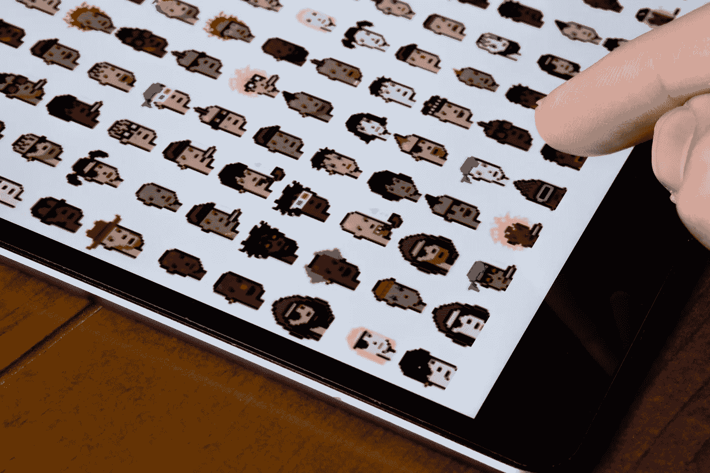
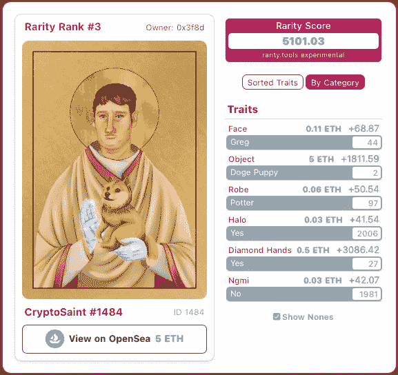

# 如何评估商业 NFT 项目和铸造你的第一个令牌

> 原文：<https://levelup.gitconnected.com/how-to-evaluate-commercial-nft-projects-and-mint-your-first-token-53ee4d14ee9d>

## “99%的非金融资产不会是好的投资”——加里·维纳查克

图片来自 [Shutterstock](https://www.shutterstock.com/image-photo/cryptopunks-characters-seen-on-screen-tablet-1972682810)

我对不可替代代币(NFT)的迷恋始于我读到一位名叫毕普的艺术家以 6900 万美元的价格卖出了一幅 [NFT 的作品。](/what-makes-a-digital-image-file-worth-69-million-4d49a9eabcb7)

当我可以在网上找到同样的照片并免费欣赏时，我不明白一张数码照片怎么能卖这么高的价钱。我沉浸在 NFTs、区块链和艺术进化的世界中，试图理解它。

*于是开始了一次发现之旅。*

从那以后，我了解到了非功能性数字技术的潜力——它是一种确保和加强数字作品所有权和独特性的手段，否则这些作品可能会被复制和转售。

对严肃的艺术品收藏家来说，真正重要的是拥有原作的身份。这同样适用于数字艺术和传统艺术创作——绘画、雕塑、珍本书籍等等。

*   我们可以通过欣赏一幅画的印刷品来欣赏它的艺术价值，但是地位是随着对原始画布的所有权而来的。《蒙娜丽莎》的原作是无价的，但它的海报可以在网上花 10 美元买到。
*   我们可以通过参观佛罗伦萨的学院美术馆来欣赏米开朗基罗的大卫像。我们可以买一个它的微型复制品，在家里欣赏它的艺术性。但是毫无疑问，原作是佛罗伦萨的支柱，也是其经济价值(以及艺术文化)的证明——复制品是真货的拙劣替代品。
*   我们可以花几美元买一本平装本，欣赏乔治·奥威尔的反乌托邦小说《1984》。收藏家们愿意为初版原作支付数千美元。拥有原创文章是有地位的。

在原始创作可以被容易地复制和分发的情况下，对应于原始项目的 NFT 允许其所有者无可辩驳地证明他们的所有权和项目的出处。正是这一点使得一些数字作品尽管易于复制，却能卖出高价。

# “99%的非金融资产不是好的投资”

NFTs 在 2021 年的迅速崛起反映了公众对这一技术概念的意识日益增强。同样显而易见的是，由于对 NFT 热门项目的及时投资，许多人很快就赚了很多钱。名人和业余爱好者都在投资高知名度的项目，成为网络上的 NFTs 倡导者，并在此过程中赚取巨额利润。

说唱歌手 Snoop Dog 已经成为 NFT 的最大倡导者和最知名的收藏家之一。在推特笔名' [Cozomo De'Medici](https://twitter.com/CozomoMedici) 的伪装下，他已经暴露了自己在 CryptoPunks 等知名项目上的投资。

NBA 球星斯蒂芬·库里(Steph Curry)最近买下了 NFT 最著名的项目之一“无聊猿游艇俱乐部”(Bored Ape Yacht Club)，[以相当于 15.5 万美元](https://hypebeast.com/2021/8/stephen-curry-bored-ape-yacht-club-nft-55-ethereum-purchase)的价格买下了一艘 NFT，其前所有者的价格约为 2000 美元。该系列中的其他非艺术作品现在的价格都超过了 100 万美元。

在他们的大肆宣传中，像加里·维纳查克这样的企业家已经迅速跳上了 NFT 的肥缺。在撰写本文时，他的 [*Veefriends* NFT 项目](https://rarity.tools/veefriends) t 的交易额接近 1 亿美元。尽管取得了这样的成功，加里·维还是对那些希望投资非功能性金融服务的人提出了警告:

来源:[推特](https://twitter.com/garyvee/status/1365883296064954370?s=20)

他暗示的“空前回报”正在推动许多投机性投资——改变生活的利润的诱惑是引人注目的，即使它们需要十年才能显现。但这种潜力必须与被欺骗的恐惧、选择一个失败或完全消失的项目或平台的恐惧，或者只是选择一个无用的东西的恐惧相抗衡。

这是一个我自己已经争论了几个星期的问题——是冒错过的风险，还是冒被卷入的风险。

最近，我向 FOMO 屈服了，并决定尽管有失败和经济损失的风险，但对 NFT 的一个项目进行首次投资的时机已经成熟。这似乎是我继续接受 NFTs 教育和实验的合乎逻辑的下一步。

如果你想做同样的事情，这里有一些事情需要考虑。

# 挑选一个赢家(或者至少不是一个废物)

现在有三种方法可以让你成为 NFT 车主:

1.  **创造你自己的**——你完全有可能拿一件你自己的作品，无论是照片、图画、视频还是一篇文章，来打造一个与之相对应的 NFT。[我自己也做过这个](/the-exact-process-i-used-to-create-and-sell-my-own-nft-art-on-the-ethereum-blockchain-698d9c59a2fe)。除非你的创作是别人想要的，否则不能保证让你赚很多(或任何)钱，但这是[不是一个复杂的过程](/the-exact-process-i-used-to-create-and-sell-my-own-nft-art-on-the-ethereum-blockchain-698d9c59a2fe)。
2.  从市场上买一件——这类似于从经销商、拍卖行或易贝购买艺术品。NFT 在诸如 OpenSea 这样的交易所上市，在那里可以阅读和购买全部的 NFT 收藏。
3.  **作为项目的一部分铸造一个—**—这意味着从项目一开始就拥有一辆新 NFT 的最佳机会，如果你选择明智，也代表着获得潜在利润的最佳机会。这类似于从艺术家的限量版中购买一幅独特的画，但让他们按需为你绘制。

从一个新项目中铸造一个 NFT 是最好的方式，可以让你的投资增值。面临的挑战是试图确定有前景的项目，这些项目将持续存在并升值。

# 是什么让 NFT 项目令人向往？

在这种情况下，非艺术作品首先是关于艺术作品的。那么第一个标准应该是在一个项目中制作的 NFTs 是否在美学上让你满意。

## 情人眼里出西施

考虑一下 crypto punk——也许是最著名的 NFT 系列。这是一万个 24x24 像素的独特“朋克”的限量版集合，每个朋克都是在区块链产生的。每一个都是独一无二的，都有一系列的特征和特性，这些特征和特性是在它们被创造出来的时候，由计算机算法分配给它的。

不是每个人都会欣赏这种简单化的设计，甚至认为它们配得上“艺术”的标签——但是 CryptoPunks 显然受到了很多人的喜爱，这些设计已经成为了 NFTs 概念的代名词。在纽约和伦敦，密码朋克已经在广告牌和公共汽车站公开展示。

## 项目的稀有性和可取性

如果你喜欢它们的外观，下一个因素是确定该项目是否只是另一个机会主义创作者批量生产一系列被扔在一起的 JPEGs，或者单个 NFT 是否具有使它们稀有和令人想要的特性和特征。

在传统环境下，这种稀有性可能是通过艺术家发行限量版、[编号系列的印刷品](/how-to-use-nft-technology-to-issue-a-limited-edition-run-of-digital-prints-d06575d1fc23)或出售有限系列的原创艺术品来实现的。

发布一系列 NFT 的项目通常会为项目设置一个限制(例如有 10，000 个 CryptoPunks)。该系列中的每个 NFT 都是独一无二的，并且是在铸造时由程序生成的，以包含一系列表示独特性的特征和特性。一些特征会非常罕见，导致具有这些特征的 NFT 更受欢迎，因此更有价值。

使用像 [Rarity.tools](https://rarity.tools) 这样的网站可以更好地理解这一点，这是一个当前和未来 NFT 项目的在线目录，其中包含一些最著名的 NFT 收藏。

通过稀有工具，可以仔细检查项目，并检查项目中的示例 NFT，以了解表示系列中的合意性和价值的特征。

为了说明这一点，这里是我投资的一个 NFT 项目的稀有工具页面——[隐圣](https://rarity.tools/the-crypto-saints):

作者截图来自[稀有。工具](https://rarity.tools/the-crypto-saints)

从这个项目中挑选出几个数据点，有助于评估其未来潜力:

*   它限量发行了 7，777 只 NFT——迄今为止已经铸造和发行了 2，024 只——这不仅表明该项目的发行规模相对较小(一旦全部分配完毕),还表明一些投资者已经在该项目中持有股份(已经铸造了不到三分之一的 NFT)。
*   到目前为止，CryptoSaints 拥有 610 名投资者，这是一个相当强大的投资者群体——这意味着许多投资者似乎都购买了不止一个 NFT。
*   总交易量很大——按照目前的价格，53 ETH 的交易量相当于迄今为止与 CryptoSaints 相关的近 20 万美元的流动性。与 CryptoPunks 相比，这并不算大，但这表明资金正在流入该项目，这将有助于长期维持该项目。
*   该项目中的非专利技术已经按照稀有程度进行了排名，表明一些技术的内在价值远远高于铸造它们的价值——通过仔细检查稀有程度上的非专利技术的单个例子。工具我们可以看到不同 NFT 之间的不同属性。这些特质的稀有性使得一个 NFT 比下一个更有价值。

## 是什么让系列中的一些 NFT 更令人向往？

通过点击单个 NFT，我们可以更深入地了解这些特征(注意，每个 NFT 项目都将在系列中定义和排列自己与非功能性测试相关的特征)。

看看这个系列中第三稀有的 NFT(在写作的时候):

作者截图来自 [Rarity.tools](https://rarity.tools/the-crypto-saints/view/1484)

这个 NFT 在隐圣徒项目中显得相对罕见——不是因为它的视觉吸引力(至少在我看来是这样！)，而是因为它拥有的特征大多非常罕见。问题中的 NFT 目前在 2024 年排名第三，因为它具有以下特征:

*   Face = Greg(我们可以看到，到目前为止，该系列中制造的 2024 个 NFT 中只有 44 个有这张脸)
*   Object = Doge Puppy(到目前为止制造的 2024 个 NFT 中只有 2 个拥有这个对象)
*   长袍=波特(2024 人中有 97 人有这个)
*   钻石手=是(2024 人中有 27 人有这个)

NFT 的其他两个特征相对常见(2024 年中的 2006 年有光环，2024 年中的 1981 年有 NGMI = No)。

这种特征组合导致 NFT 被列为非常罕见——但这也表明还有更罕见的组合有待铸造，这意味着潜在的买家仍然可以铸造一个更令人满意(也更有价值)的组合。

仍然有潜力铸造一个罕见的！

# 仔细检查项目

稀有性。工具会给你一个关于项目的像样的信息基础。但是在冒险为自己创造一个他们的 NFT 之前，建议把你的研究范围扩大一点。

Rarity.tools 上的项目页面将标识项目的网站、Twitter 账户，如果有的话，还有一个 Discord 频道，项目的收藏者和创建者可以在这里互动。

## 浏览项目网站

这是项目创建者的销售页面，网站应该提供关于铸造价格、项目路线图和创始人传记的更多信息。

这可能表明，所有那些在未来某个时间点投资该项目的人计划的非功能性测试将进一步下降。它可能会描述虚拟画廊的发展或为 NFT 持有者开发的游戏。它可能描述了创建者已经启动的其他项目。

把它当作一种销售和营销工具，可能会倾向于吸引投资者。收集你能从中得到的任何信息。

## 他们在 Twitter 和 Discord 上的活跃程度如何？

营销和推广项目符合创作者和投资者的利益。Twitter 在 NFT 社区中被广泛使用，以引起人们对该项目的关注和兴趣。

项目的官方账号在 Twitter 上是否活跃，对社区是否有响应？你能找到证据证明投资者群体是积极的，并把这个项目作为一个长期投资，而不是“抽水和倾倒”吗？你能通过 Twitter 找到这个项目的知名投资者吗？

社交媒体的热度不能代替好的项目基础，但它是项目长期成功的重要组成部分，因此值得从一开始就进行评估。

项目的 Discord 频道中的聊天也是如此。人们对参与其中感到兴奋吗？创始人对分享未来计划是否透明和热情？你在收藏家中获得了一种团体感吗？或者说，该项目的所有者是受短期利润的驱使吗？

# 投资时机？

做了自己的研究(没有保证成功的最低或最高金额)，你准备投资的时候可能会到来。

这是一个大胆的举措，但在我最近几周研究的许多非功能性货币中，每个 NFT 的初始铸造成本(至少在区块链以太坊上)不到 0.1 ETH。加上以太坊的汽油费，这使得 NFT 的总成本低于 300 美元，这不是一个荒谬的风险金额(取决于你的风险偏好和手段)。

最终的选择是你的，但是考虑到我们仍然处于 NFTs 出现的极早期的共识，现在似乎是行动的时候了，特别是当进入该领域的成本仍然相对较低的时候。

# 接下来呢？

我上面概述的过程可能看起来过于艰难，或者看起来肤浅和简单，这取决于你的观点。

如果你有足够的兴趣，想了解更多细节，我写了一个详细的分步指南，描述了我在 NFT 投资商业项目的具体过程。

如果你已经决定从一个商业项目中铸造一个 NFT，[指南](http://tzh.gumroad.com/l/jqcUd)不仅解决了评估和研究项目的所有必要步骤，而且还提供了一个从选择到购买和铸造的实例。它解决了向区块链提交交易请求、汽油费(以及如何最小化这些费用)等问题。

如果你对自己的第一笔投资感到好奇，我希望你能[读一读](http://tzh.gumroad.com/l/jqcUd)！如果你想要一个更全面的关于 NFTs 基础的指南，[我也写了一本](http://tzh.gumroad.com/l/xsINJ)。

注:*本文仅供参考。不应将其视为财务或法律建议。在做任何重大财务决定之前，先咨询财务专家。*

如果你喜欢阅读这样的故事，并且愿意支持我和 Medium 上的其他作者，考虑注册成为 Medium 会员。一个月 5 美元，给你无限的故事。如果你注册使用我的链接，我会赚一小笔佣金。故事中的其他各种链接也是如此。

 [## 通过我的推荐链接加入灵媒——托比·黑兹伍德

### 作为一个媒体会员，你的会员费的一部分会给你阅读的作家，你可以完全接触到每一个故事…

tobyhazlewood.medium.com](https://tobyhazlewood.medium.com/membership) 

## 如果你喜欢这篇文章，我希望你能加入我的电子邮件列表。