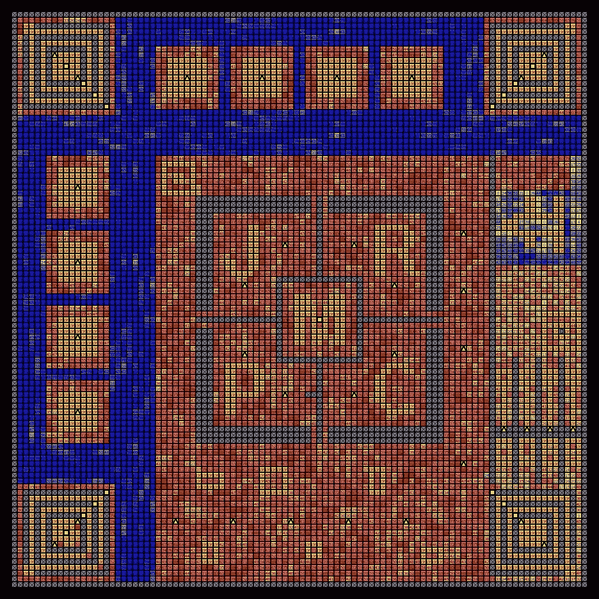

# 如何传播一门编程语言

> 原文：<https://levelup.gitconnected.com/how-to-evangelize-a-programming-language-a81dffbc842b>

在今天的 IT 世界里，有大量的编程语言在争夺市场份额。当然还有像 Python，JavaScript，Java，C#，C++这样的中流砥柱。但紧随其后的是编程语言饥饿游戏中的许多新条目，如 Clojure、Crystal、Dart、Elixir、F#、Haxe、Julia、Kotlin、Nim、Pharo、Rust、TypeScript 等。甚至还有一些不太新的语言，如 Haskell (1990)、Lua (1993)、OCaml (1996)和 rack(1994)。他们都想抓住你的注意力，让你相信他们是通往编程幸福之路。

这些语言试图通过博客、视频、播客、GitHub repos、研讨会、教程和研讨会赢得你的芳心。他们的策略取得了不同程度的成功，但老实说，这些语言中的大多数都没有取得多大进展。大多数仍然相当模糊。

我是 Smalltalk 的传播者，Pharo 就是这些语言中的一种。Pharo 是 Smalltalk 的现代衍生产品，创建于 2008 年。它也发布了许多博客、视频、回复、教程等。Pharo 是一种出色的语言，它提供了几个巨大的好处:

1.  极其简单和优雅——你可以在 15 分钟内学会全部语法！Pharo 代码非常简洁易读。因此，这种语言实际上没有认知负荷。
2.  面向对象的纯粹性——作为一个小话题，Pharo 是所有面向对象语言中最简单最纯粹的。因此，这是学习 OOP 的理想方式。
3.  极高的生产力——编写一个 Smalltalk 应用程序所需的时间通常只是大多数其他语言(包括 Python、JavaScript、Java、C#、Ruby、PHP、Scala、Golang 等)所需时间的一小部分。这归功于 Smalltalk 的*现场编码*能力和易用性。
4.  巨大的灵活性和多功能性——Pharo 几乎应用于你能想到的每一个领域，包括[后端 web](http://www.seaside.st/) 、[前端 web](https://pharojs.github.io/) 、[数据科学](https://youtu.be/R2rLr7Z1b8Y)、[机器学习](https://github.com/PolyMathOrg/libtensorflow-pharo-bindings)、[机器人技术](http://car.imt-lille-douai.fr/)、[虚拟现实](https://www.youtube.com/watch?v=b4nNtN7XBi8)、企业商业计算等等。
5.  可伸缩性和可维护性——基于 Alan Kay 的绝妙构想，Smalltalk 以其可伸缩性而闻名。Smalltalk 就像一个软件互联网。

> “互联网做得如此之好，以至于大多数人认为它是像太平洋一样的自然资源，而不是人造的东西。上一次如此大规模的技术如此准确无误是什么时候？”
> **~艾伦凯**

艾伦·凯将他的面向对象哲学比作互联网是如何建立的，或者由数十亿个细胞组成的生物有机体是如何建立的。Smalltalk 非常适合真正可扩展的解决方案。

那么为什么 Pharo 还比较默默无闻呢？为了给这门语言带来光明，我创建了一个奖金丰厚的高中编程竞赛。我把这个比赛作为创造公关价值的一种手段。

这个竞赛叫做 JRMPC，或者詹姆斯·罗伯逊纪念编程竞赛，这个月刚刚结束。

这个实验会成功吗？时间会证明一切。但它有从未尝试过的优势。