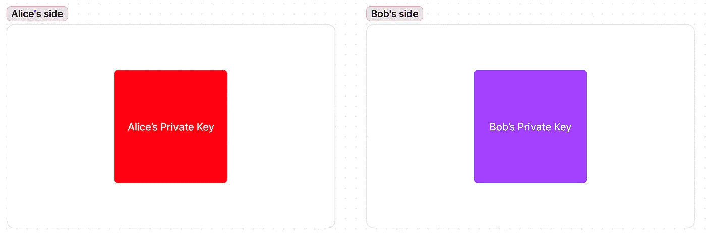
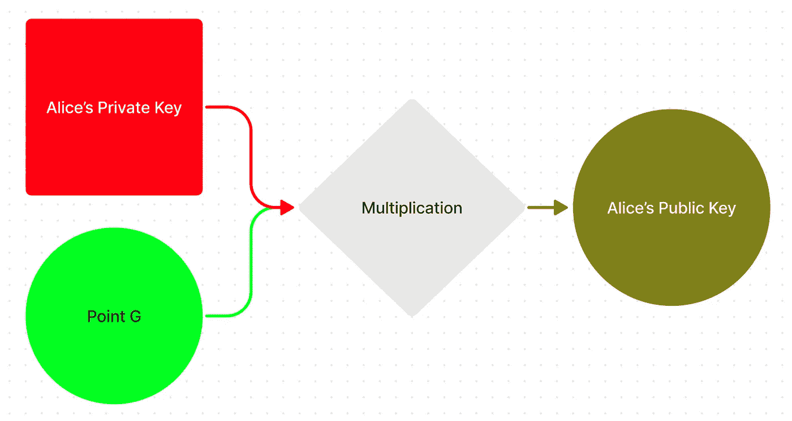
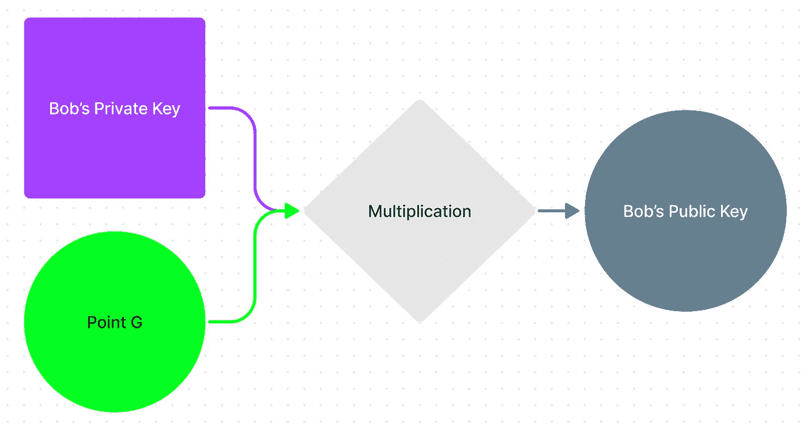
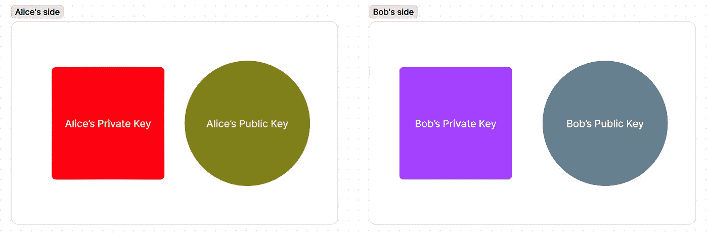
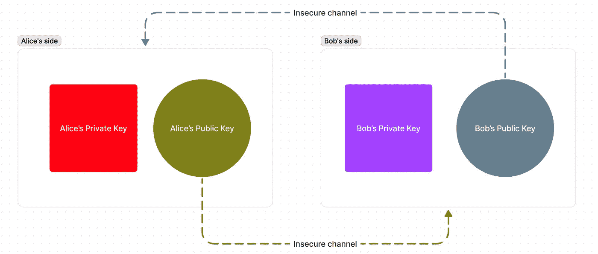
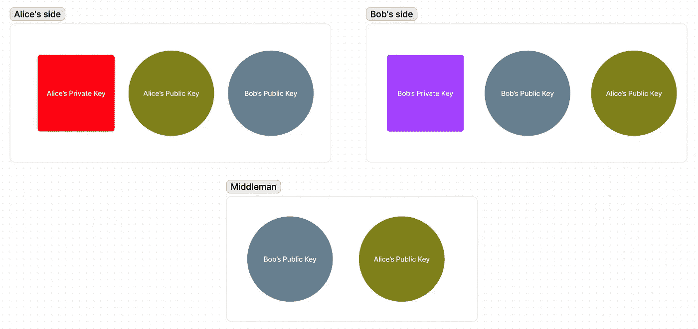
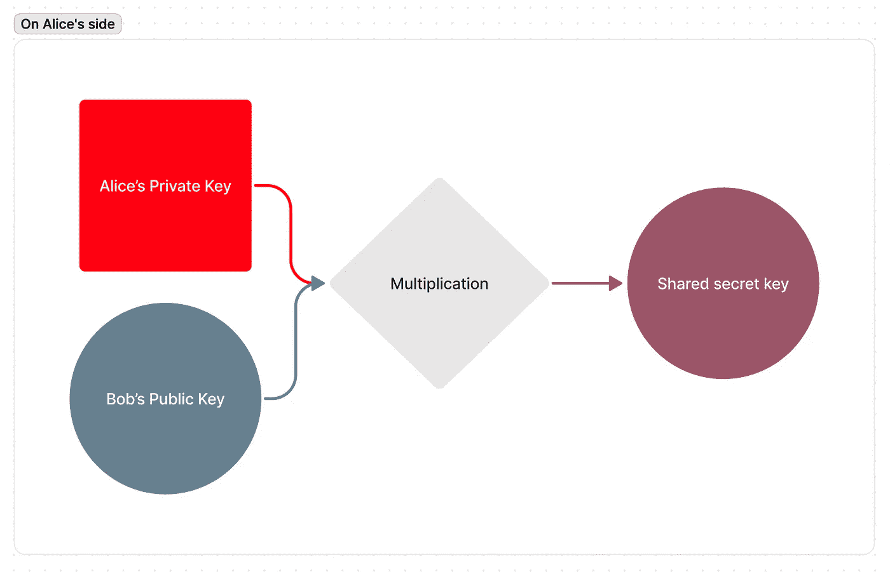
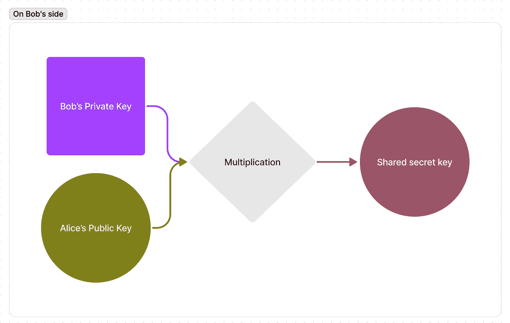
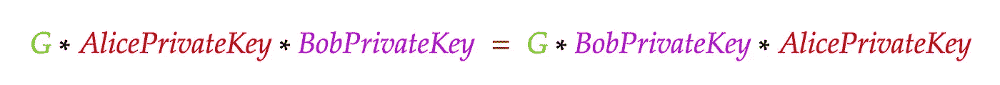
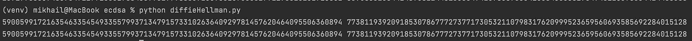

# 如何在不安全的网络上交换密钥(EC-Diffie-Hellman 算法)

> 原文：<https://levelup.gitconnected.com/how-to-exchange-a-secret-key-over-an-insecure-network-ec-diffie-hellman-algorithm-284d245cad97>

如果您还不知道椭圆曲线加密是如何工作的，我强烈推荐您阅读我关于这个主题的文章:

[](/elliptic-curves-and-ecdsa-from-understanding-the-concept-to-signing-a-transaction-in-bitcoin-dd07851fe0a8) [## 椭圆曲线和 ECDSA:从头开始用比特币签署交易的所有知识

### 这里是比特币和其他区块链中使用的加密技术的完整速成课程。通过代码示例和一个…

levelup.gitconnected.com](/elliptic-curves-and-ecdsa-from-understanding-the-concept-to-signing-a-transaction-in-bitcoin-dd07851fe0a8) 

## 介绍

假设你想给你的朋友发送一条加密的消息，以避免被第三方截取和阅读。你只需生成一个随机的密钥并用它来加密信息。假设你使用 [AES](https://en.wikipedia.org/wiki/Advanced_Encryption_Standard) 。但是如何让你的朋友知道解密它的密钥呢？

你可以离线把钥匙给你的朋友。写在纸上给他/她就行了。但是如果这不是一个选择呢？

如果你只能使用一个**不安全的**数据通信通道，并有一个中间人拦截消息，那会怎么样？


来源:[https://www . treinaweb . com . br/blog/termos-comuns-de-seguranca-man-in-the-middle](https://www.treinaweb.com.br/blog/termos-comuns-de-seguranca-man-in-the-middle)

即使有第三方在场，也有一种安全交换密钥的方法！你刚刚和你的朋友交换了一些信息，然后你们俩都拿出了同一个钥匙。中间人也会看到你们交换的信息。但是他永远也猜不到这个秘密密钥。听起来刺激吗？让我们看看这怎么可能。

# 迪菲-赫尔曼算法

该算法基于一个我们都很熟悉的极其简单的代数特征。
乘法的**交换性**。换句话说:

A * B * C = B * A * C = C * A * B，…

我知道，这似乎还没有任何关系。

## 一个非常粗糙(和不完整)的例子

*   让我们**想象一下**，这个**分部**操作**不存在**。
*   你和你的朋友**都知道**一些数字，比如说， **12345** 。
*   你生成一些随机的私人密钥，比如说， **23456**
*   你的朋友也生成了一个随机私钥，比如说 **34567**
*   您将您的私钥 **23456** 乘以 **12345 = 289564320(公钥)**
*   你的朋友将他/她的私钥 **34567 乘以 12345 = 426729615(公钥)**
*   *！！！在这一点上，我们只是想象除法运算不存在！！！*
*   你和你的朋友互相发送乘法的结果(公钥)( **289564320** 和 **426729615** )
*   你的朋友将你的公钥 **289564320** 乘以他的私钥 **34567 = 10009369849440**
*   你把你朋友的**公钥** **426729615** 乘以你的私钥 **23456 = 10009369849440，这就是共享密钥**
*   *盈利！你得出了相同的值！*

但是…唯一的问题是除法运算实际上是存在的，所以从公钥中提取私钥是极其容易的。

中间人只需将公钥除以 **12345，**并提取私钥 **: 289564320/12345 = 23456，426729615/12345 = 34567** ，然后将私钥乘以共享数:**23456 * 34567 * 12345 = 1000936984944**

这是 Diffie Hellman 的一般想法，现在让我们关注一个实际的形式。

让我们将 Diffie-Hellman 的想法与**椭圆曲线加密**结合起来，因为它是当今最常用的实现方式。

> 为了充分理解这个话题，我强烈推荐阅读我关于椭圆曲线加密的文章。它只需要中学数学。

# 非常短:椭圆曲线密码的本质

我认为不可能简单地解释椭圆曲线在密码学中的应用。但以下是最重要的属性:

*   我们可以将曲线上的任何一点乘以一个标量值
*   没有可行的方法将标量值提取回来(将一个点除以一个标量值或除以另一个点)
*   椭圆曲线加密中的私钥只是一个保密的随机值
*   相应的公钥只是某个点 **G** 乘以私钥(PublicKey = PrivateKey * G)的结果
*   **G** 点是标准化的，大家都用

# 如何通过公共网络安全地交换密钥？

让我们假设我们有两个当事人:爱丽丝和鲍勃([为什么又是这些名字？](http://cryptocouple.com/))。

> *这里有一个* ***【道太】华美*** *对 Diffie-Hellman 密钥交换机制的解释。它可能看起来不太漂亮，但作为乘法结果出现的颜色实际上是原始颜色的混合。* ***正方形*** *表示* ***标量*** *值，而* ***圆圈*** *表示椭圆曲线上的* ***点*** *。*

爱丽丝和鲍勃都生成**大随机数**，我们称这些数字为**私钥**:



然后爱丽丝**将**她的**私钥**乘以众所周知的 **G 点**以得到她的**公钥**:



Bob 将他的**私钥**乘以相同的**点 g 点**得到他的**公钥**:



现在他们都有了自己的私钥-公钥对:



下一步是交换公钥。

爱丽丝**将她的**公共**密钥发送给鲍勃**。鲍勃**将他的**公共**密钥发送给爱丽丝:**



之后，爱丽丝和鲍勃拥有彼此的**公共**密钥，但是中间人**也**可能知道他们的公共密钥:



如果你还记得的话，**私有**密钥**是无法从**公共**密钥中提取**回来的。所以知道了**公钥**对中间人来说**是没有用的**。

# 然后奇迹发生了。

**爱丽丝**取得**鲍勃的公钥**(椭圆曲线上的一点)**将其乘以**成为**她的私钥**。



鲍勃也是这样做的。他**取得** **爱丽丝的公钥**并**将其乘以**成为**他自己的**私钥:****



# 他们最终得到相同的秘密密钥，而没有明确地交换它

实际上，这是一个非常简单的数学技巧。
让我们来看看他们的公钥是如何计算的:


让我们看看双方是如何计算共享密钥的:


让我们通过比较它们的定义来看看 **BobSecretKey** = **是否等同于 SecretKey** :


让我们用它们的定义来代替 **AlicePublicKey** 和 **BobPublicKey** :



**表情都一样。**

> *如果你还不明白我们为什么以及如何能够像数字一样将椭圆曲线上的点相乘，我推荐你阅读文章* *。*

爱丽丝和鲍勃现在都有了相同的秘密密钥(曲线上的点)，他们没有向中间人透露。

并且中间人对他们的**公钥**无能为力，因为他可能已经截获了这些公钥。

# 让我们用 Python 来实现它

在我关于椭圆曲线的[文章](/elliptic-curves-and-ecdsa-from-understanding-the-concept-to-signing-a-transaction-in-bitcoin-dd07851fe0a8)中，我有一个使用 secp256k1 椭圆曲线的代码片段，是用 Python 写的。关于它如何工作的更多细节，请查看文章的第五部分。

重要的是我们有了`g_point`实例，它有。将点乘以任何标量值的乘法方法。这个方法的返回值也是一个点。

让我们为 Alice 和 bob 随机挑选一个私钥:

```
alice_private_key = 4115217275797054326758545175592171983915694080873854598446270747 #any random number
bob_private_key = 4954095651507529369947464574074855803473979998363142920136936367 #any random number
```

然后让我们计算它们的公钥:

```
alice_public_key = g_point.multiply(alice_private_key)
bob_public_key = g_point.multiply(bob_private_key)
```

现在让我们想象他们已经互相发送了私钥。爱丽丝计算了她这边的密钥:

```
alice_secret_key = bob_public_key.multiply(alice_private_key)
```

Bob 计算了他这边的密钥:

```
bob_secret_key = alice_public_key.multiply(bob_private_key)
```

现在让我们打印密钥:

```
print(bob_secret_key.x, bob_secret_key.y)
print(alice_secret_key.x, alice_secret_key.y)
```

结果是:



有用！

# 这里是使用零依赖的完整 Python 代码，供您自己尝试

```
def find_inverse(number, modulus):
    return pow(number, -1, modulus)

class Point:
    def __init__(self, x, y, curve_config):
        a = curve_config['a']
        b = curve_config['b']
        p = curve_config['p']

        if (y ** 2) % p != (x ** 3 + a * x + b) % p:
            raise Exception("The point is not on the curve")

        self.x = x
        self.y = y
        self.curve_config = curve_config

    def is_equal_to(self, point):
        return self.x == point.x and self.y == point.y

    def add(self, point):
        p = self.curve_config['p']

        if self.is_equal_to(point):
            slope = (3 * point.x ** 2) * find_inverse(2 * point.y, p) % p
        else:
            slope = (point.y - self.y) * find_inverse(point.x - self.x, p) % p

        x = (slope ** 2 - point.x - self.x) % p
        y = (slope * (self.x - x) - self.y) % p
        return Point(x, y, self.curve_config)

    def multiply(self, times):
        current_point = self
        current_coefficient = 1

        pervious_points = []
        while current_coefficient < times:
            # store current point as a previous point
            pervious_points.append((current_coefficient, current_point))
            # if we can multiply our current point by 2, do it
            if 2 * current_coefficient <= times:
                current_point = current_point.add(current_point)
                current_coefficient = 2 * current_coefficient
            # if we can't multiply our current point by 2, let's find the biggest previous point to add to our point
            else:
                next_point = self
                next_coefficient = 1
                for (previous_coefficient, previous_point) in pervious_points:
                    if previous_coefficient + current_coefficient <= times:
                        if previous_point.x != current_point.x:
                            next_coefficient = previous_coefficient
                            next_point = previous_point
                current_point = current_point.add(next_point)
                current_coefficient = current_coefficient + next_coefficient

        return current_point

secp256k1_curve_config = {
    'a': 0,
    'b': 7,
    'p': 115792089237316195423570985008687907853269984665640564039457584007908834671663
}
x = 55066263022277343669578718895168534326250603453777594175500187360389116729240
y = 32670510020758816978083085130507043184471273380659243275938904335757337482424
n = 115792089237316195423570985008687907852837564279074904382605163141518161494337
g_point = Point(x, y, secp256k1_curve_config)

##############################

alice_private_key = 4115217275797054326758545175592171983915694080873854598446270747 #any random number
bob_private_key = 4954095651507529369947464574074855803473979998363142920136936367 #any random number

alice_public_key = g_point.multiply(alice_private_key)
bob_public_key = g_point.multiply(bob_private_key)

alice_secret_key = bob_public_key.multiply(alice_private_key)
bob_secret_key = alice_public_key.multiply(bob_private_key)

print(bob_secret_key.x, bob_secret_key.y)
print(alice_secret_key.x, alice_secret_key.y)
```

如果你可能需要，这里有一个[在线工具，可以在你的浏览器](https://www.programiz.com/python-programming/online-compiler/)中运行 Python 代码。

exemak@gmail.com

[t.me/exemak](https://t.me/exemak)

米哈伊尔·卡拉瓦耶夫