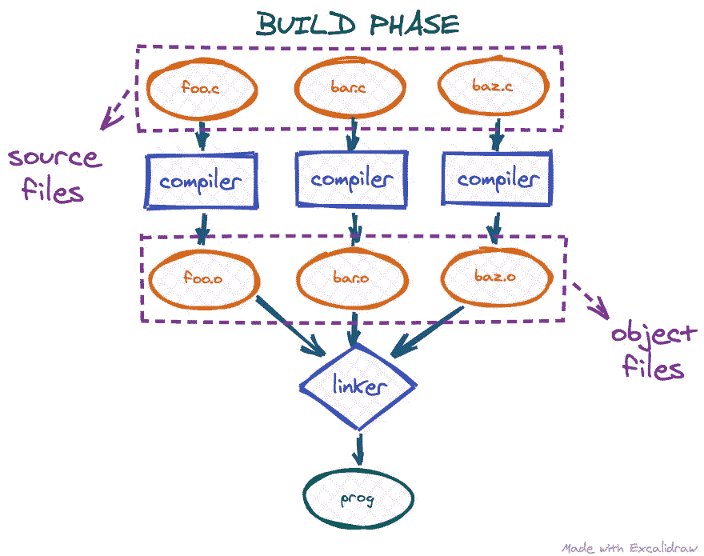
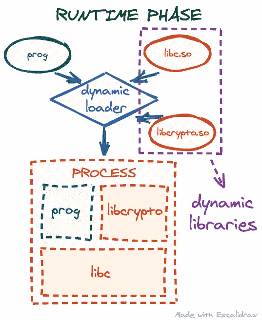
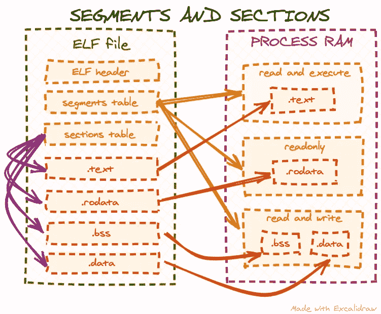

# 如何执行目标文件:第 1 部分

> 原文：<https://levelup.gitconnected.com/how-to-execute-an-object-file-part-1-2c92d962f276>

## 在没有链接的情况下调用简单函数

*这是我转贴自* [*Cloudflare 博客*](https://blog.cloudflare.com/how-to-execute-an-object-file-part-1/) 的帖子

当我们使用高级编译编程语言编写软件时，将源代码转换成最终的可执行二进制代码通常需要几个步骤:



首先，我们的源文件由一个*编译器*编译，该编译器将高级编程语言翻译成机器代码。编译器的输出是一些*对象*文件。如果项目包含多个源文件，我们通常会得到同样多的目标文件。下一步是*链接器*:由于不同目标文件中的代码可能会相互引用，链接器负责将所有这些目标文件组装成一个大程序，并将这些引用绑定在一起。链接器的输出通常是我们的目标可执行文件，所以只有一个文件。

然而，在这一点上，我们的可执行文件可能仍然是不完整的。如今，Linux 上的大多数可执行文件都是动态链接的:可执行文件本身并没有运行程序所需的所有代码。相反，它希望在运行时从[共享库](https://en.wikipedia.org/wiki/Library_(computing)#Shared_libraries)中“借用”部分代码来实现它的一些功能:



这个进程被称为*运行时链接*:当我们的可执行文件启动时，操作系统将调用*动态加载器*，它将找到所有需要的库，将它们的代码复制/映射到我们的目标进程地址空间，并解析我们的代码对它们的所有依赖。

关于这个整体过程需要注意的一个有趣的事情是，我们直接从步骤 1(编译源代码)获得可执行的机器代码，但是如果后面的任何步骤失败，我们仍然无法执行我们的程序。因此，在这一系列的博客文章中，我们将研究是否有可能跳过所有后面的步骤，直接从目标文件中执行机器码。

## 为什么我们要执行一个目标文件？

原因可能有很多。也许我们正在为一个专有的 Linux 驱动程序或应用程序编写一个开源的替代品，并且想要比较某些代码的行为是否相同。或者我们有一个罕见的，晦涩的程序的一部分，我们不能链接到它，因为它是用一个罕见的，晦涩的编译器编译的。也许我们有一个源文件，但由于缺少构建时间或运行时依赖，我们无法创建一个全功能的可执行文件。恶意软件分析、来自不同操作系统的代码等——所有这些场景都可能将我们置于一个位置，要么链接是不可能的，要么运行时环境是不合适的。

## 一个简单的玩具对象文件

出于本文的目的，让我们创建一个简单的玩具对象文件，这样我们就可以在实验中使用它:

*对象 c* :

```
int add5(int num)
{
    return num + 5;
}

int add10(int num)
{
    return num + 10;
}
```

我们的源文件只包含 2 个函数，`add5`和`add10`，这分别给唯一的输入参数增加了 5 或 10。这是一段很小但功能齐全的代码，我们可以很容易地将其编译成一个目标文件:

```
$ gcc -c obj.c 
$ ls
obj.c  obj.o
```

## 将目标文件加载到进程内存中

现在我们将尝试从目标文件中导入`add5`和`add10`函数并执行它们。当我们谈到执行一个目标文件时，我们的意思是将一个目标文件作为某种类型的库来使用。如上所述，当我们有一个利用外部共享库的可执行文件时，*动态加载器*会为我们将这些库加载到进程地址空间中。然而，对于目标文件，我们必须手动完成，因为最终我们不能执行不在操作系统 RAM 中的机器代码。因此，为了执行目标文件，我们仍然需要某种包装程序:

*loader.c* :

```
#include <stdio.h>
#include <stdint.h>
#include <stdlib.h>
#include <string.h>

static void load_obj(void)
{
    /* load obj.o into memory */
}

static void parse_obj(void)
{
    /* parse an object file and find add5 and add10 functions */
}

static void execute_funcs(void)
{
    /* execute add5 and add10 with some inputs */
}

int main(void)
{
    load_obj();
    parse_obj();
    execute_funcs();

    return 0;
}
```

上面是一个自包含的对象加载程序，有一些函数作为占位符。我们将在这篇文章中实现这些功能(并添加更多功能)。

首先，正如我们已经建立的，我们需要将我们的目标文件加载到进程地址空间中。我们可以将整个文件读入一个缓冲区，但这样效率不会很高。真实世界的对象文件可能很大，但是正如我们将在后面看到的，我们不需要对象的所有文件内容。因此，最好将文件改为`[mmap](https://man7.org/linux/man-pages/man2/mmap.2.html)`:这样操作系统将在我们需要的时候从文件中缓慢地读取我们需要的部分。让我们实现`load_obj`功能:

*loader.c* :

```
...
/* for open(2), fstat(2) */
#include <sys/types.h>
#include <sys/stat.h>
#include <fcntl.h>

/* for close(2), fstat(2) */
#include <unistd.h>

/* for mmap(2) */
#include <sys/mman.h>

/* parsing ELF files */
#include <elf.h>

/* for errno */
#include <errno.h>

typedef union {
    const Elf64_Ehdr *hdr;
    const uint8_t *base;
} objhdr;

/* obj.o memory address */
static objhdr obj;

static void load_obj(void)
{
    struct stat sb;

    int fd = open("obj.o", O_RDONLY);
    if (fd <= 0) {
        perror("Cannot open obj.o");
        exit(errno);
    }

    /* we need obj.o size for mmap(2) */
    if (fstat(fd, &sb)) {
        perror("Failed to get obj.o info");
        exit(errno);
    }

    /* mmap obj.o into memory */
    obj.base = mmap(NULL, sb.st_size, PROT_READ, MAP_PRIVATE, fd, 0);
    if (obj.base == MAP_FAILED) {
        perror("Maping obj.o failed");
        exit(errno);
    }
    close(fd);
}
...
```

如果我们没有遇到任何错误，在`load_obj`执行之后，我们应该得到内存地址，它指向`obj`全局变量中`obj.o`的开始。值得注意的是，我们已经为`obj`变量创建了一个特殊的联合类型:我们稍后将解析`obj.o`(提前查看对象文件实际上是 [ELF 文件](https://en.wikipedia.org/wiki/Executable_and_Linkable_Format))，因此将引用地址作为`Elf64_Ehdr`(C 语言中的 ELF 头结构)和一个字节指针(解析 ELF 文件涉及从文件开始计算字节偏移量)。

## 窥视目标文件内部

要使用目标文件中的一些代码，我们需要首先找到它。正如我在上面透露的，目标文件实际上是 [ELF 文件](https://en.wikipedia.org/wiki/Executable_and_Linkable_Format)(与 Linux 可执行文件和共享库的格式相同)，幸运的是，在标准`elf.h`头文件的帮助下，它们很容易在 Linux 上解析，该头文件包括许多与 ELF 文件结构相关的有用定义。但是我们实际上需要知道我们在寻找什么，所以需要对 ELF 文件有一个高层次的理解。

## ELF 段和部分

段(也称为程序头)和节可能是 ELF 文件的主要部分，通常是任何 ELF 教程的起点。然而，这两者之间经常有些混淆。不同的部分包含不同类型的 ELF 数据:可执行代码(这是我们在这篇文章中最感兴趣的)，常量数据，全局变量等。另一方面，段本身不包含任何数据——它们只是向操作系统描述如何正确地将段加载到 RAM 中，以使可执行文件正确工作。有些教程说“一个段可能包含 0 个或多个段”，这并不完全准确:段并不包含段，相反，它们只是向操作系统指示特定段应该加载到内存中的什么位置，以及该内存的访问模式是什么(读、写或执行):



此外，目标文件根本不包含任何段:目标文件并不意味着由操作系统直接加载。相反，假设它将与一些其他代码链接，所以 ELF 段通常由链接器生成，而不是编译器。我们可以通过使用 [readelf 命令](https://man7.org/linux/man-pages/man1/readelf.1.html)来检查这一点:

```
$ readelf --segments obj.o

There are no program headers in this file.
```

## 目标文件节

同一个 [readelf 命令](https://man7.org/linux/man-pages/man1/readelf.1.html)可以用来从我们的目标文件中获取所有的部分:

```
$ readelf --sections obj.o
There are 11 section headers, starting at offset 0x268:

Section Headers:
  [Nr] Name              Type             Address           Offset
       Size              EntSize          Flags  Link  Info  Align
  [ 0]                   NULL             0000000000000000  00000000
       0000000000000000  0000000000000000           0     0     0
  [ 1] .text             PROGBITS         0000000000000000  00000040
       000000000000001e  0000000000000000  AX       0     0     1
  [ 2] .data             PROGBITS         0000000000000000  0000005e
       0000000000000000  0000000000000000  WA       0     0     1
  [ 3] .bss              NOBITS           0000000000000000  0000005e
       0000000000000000  0000000000000000  WA       0     0     1
  [ 4] .comment          PROGBITS         0000000000000000  0000005e
       000000000000001d  0000000000000001  MS       0     0     1
  [ 5] .note.GNU-stack   PROGBITS         0000000000000000  0000007b
       0000000000000000  0000000000000000           0     0     1
  [ 6] .eh_frame         PROGBITS         0000000000000000  00000080
       0000000000000058  0000000000000000   A       0     0     8
  [ 7] .rela.eh_frame    RELA             0000000000000000  000001e0
       0000000000000030  0000000000000018   I       8     6     8
  [ 8] .symtab           SYMTAB           0000000000000000  000000d8
       00000000000000f0  0000000000000018           9     8     8
  [ 9] .strtab           STRTAB           0000000000000000  000001c8
       0000000000000012  0000000000000000           0     0     1
  [10] .shstrtab         STRTAB           0000000000000000  00000210
       0000000000000054  0000000000000000           0     0     1
Key to Flags:
  W (write), A (alloc), X (execute), M (merge), S (strings), I (info),
  L (link order), O (extra OS processing required), G (group), T (TLS),
  C (compressed), x (unknown), o (OS specific), E (exclude),
  l (large), p (processor specific)
```

网上有不同的教程详细描述了最流行的 ELF 部分。另一个很好的参考是 [Linux 联机帮助页项目](https://man7.org/linux/man-pages/man5/elf.5.html)。它很方便，因为它描述了这两个部分的用途以及来自`elf.h`的 C 结构定义，这使得它成为解析 ELF 文件的一站式商店。然而，为了完整起见，下面是对 ELF 文件中可能遇到的最常见部分的简短描述:

*   这个部分包含可执行代码(实际的机器代码，由编译器从我们的源代码中创建)。这一部分是这篇文章的主要关注点，因为它应该包含我们想要使用的`add5`和`add10`函数。
*   `.data`和`.bss`:这些部分包含全局和静态局部变量。不同的是:`.data`有带初始值的变量(定义像`int foo = 5;`)而`.bss`只是为没有初始值的变量预留空间(定义像`int bar;`)。
*   `.rodata`:这个部分包含常量数据(大部分是字符串或者字节数组)。例如，如果我们在代码中使用一个字符串文字(例如，对于`printf`或一些错误消息)，它将被存储在这里。注意，上面的输出中缺少了`.rodata`，因为我们在`obj.c`中没有使用任何字符串或常量字节数组。
*   `.symtab`:此部分包含目标文件中符号的信息:函数、全局变量、常量等。它还可能包含关于目标文件需要的外部符号的信息，比如外部库中需要的函数。
*   `.strtab`和`.shstrtab`:包含 ELF 文件的打包字符串。请注意，这些不是我们可以在源代码中定义的字符串(那些会转到`.rodata`部分)。这些是描述其他 ELF 结构名称的字符串，比如来自`.symtab`的符号，甚至是上表中的部分名称。ELF 二进制格式旨在使其结构紧凑并具有固定的大小，因此所有的字符串都存储在一个地方，并且各自的数据结构只是在`.shstrtab`或`.strtab`部分中引用它们作为偏移量，而不是在本地存储整个字符串。

## 第`.symtab`节

此时，我们知道我们想要导入和执行的代码位于`obj.o`的`.text`部分。但是我们有两个功能，`add5`和`add10`，记得吗？在这个层次上，`.text`部分只是一个字节块——我们怎么知道这些函数的位置呢？这就是`.symtab`(“符号表”)派上用场的地方。它非常重要，在 [readelf](https://man7.org/linux/man-pages/man1/readelf.1.html) 中有自己专用的参数:

```
$ readelf --symbols obj.o

Symbol table '.symtab' contains 10 entries:
   Num:    Value          Size Type    Bind   Vis      Ndx Name
     0: 0000000000000000     0 NOTYPE  LOCAL  DEFAULT  UND
     1: 0000000000000000     0 FILE    LOCAL  DEFAULT  ABS obj.c
     2: 0000000000000000     0 SECTION LOCAL  DEFAULT    1
     3: 0000000000000000     0 SECTION LOCAL  DEFAULT    2
     4: 0000000000000000     0 SECTION LOCAL  DEFAULT    3
     5: 0000000000000000     0 SECTION LOCAL  DEFAULT    5
     6: 0000000000000000     0 SECTION LOCAL  DEFAULT    6
     7: 0000000000000000     0 SECTION LOCAL  DEFAULT    4
     8: 0000000000000000    15 FUNC    GLOBAL DEFAULT    1 add5
     9: 000000000000000f    15 FUNC    GLOBAL DEFAULT    1 add10
```

现在让我们忽略其他条目，只关注最后两行，因为它们方便地用`add5`和`add10`作为它们的符号名。事实上，这是关于我们功能的信息。除了名称之外，符号表还为我们提供了一些额外的元数据:

*   `Ndx`列告诉我们符号所在部分的索引。我们可以将它与上面的部分表进行交叉检查，并确认这些功能确实位于`.text`(索引为`1`的部分)。
*   `Type`设置为`FUNC`确认这些确实是功能。
*   `Size`告诉我们每个函数的大小，但是这个信息在我们的上下文中不是很有用。对于`Bind`和`Vis`也是如此。
*   可能最有用的信息是`Value`。这个名称容易引起误解，因为在这个上下文中，它实际上是从包含部分开始的偏移。也就是说，`add5`功能仅从`.text`的开头开始，而`add10`从第 15 个字节开始。

所以现在我们有了如何解析 ELF 文件并找到我们需要的函数的所有部分。

## 从目标文件中查找并执行函数

根据我们目前所学的知识，让我们定义一个如何从目标文件导入和执行函数的计划:

1.  找到 ELF 区段表和`.shstrtab`区段(我们稍后需要`.shstrtab`通过名称在区段表中查找区段)。
2.  找到`.symtab`和`.strtab`部分(我们需要`.strtab`在`.symtab`中按名称查找符号)。
3.  找到`.text`段，用可执行权限复制到 RAM 中。
4.  从`.symtab`中找出`add5`和`add10`功能偏移量。
5.  执行`add5`和`add10`功能。

让我们从添加更多的全局变量和实现`parse_obj`函数开始:

*loader.c* :

```
...

/* sections table */
static const Elf64_Shdr *sections;
static const char *shstrtab = NULL;

/* symbols table */
static const Elf64_Sym *symbols;
/* number of entries in the symbols table */
static int num_symbols;
static const char *strtab = NULL;

...

static void parse_obj(void)
{
    /* the sections table offset is encoded in the ELF header */
    sections = (const Elf64_Shdr *)(obj.base + obj.hdr->e_shoff);
    /* the index of `.shstrtab` in the sections table is encoded in the ELF header
     * so we can find it without actually using a name lookup
     */
    shstrtab = (const char *)(obj.base + sections[obj.hdr->e_shstrndx].sh_offset);

...
}

...
```

现在我们已经引用了 sections 表和`.shstrtab`部分，我们可以通过它们的名称查找其他部分。让我们为此创建一个助手函数:

*loader.c* :

```
...

static const Elf64_Shdr *lookup_section(const char *name)
{
    size_t name_len = strlen(name);

    /* number of entries in the sections table is encoded in the ELF header */
    for (Elf64_Half i = 0; i < obj.hdr->e_shnum; i++) {
        /* sections table entry does not contain the string name of the section
         * instead, the `sh_name` parameter is an offset in the `.shstrtab`
         * section, which points to a string name
         */
        const char *section_name = shstrtab + sections[i].sh_name;
        size_t section_name_len = strlen(section_name);

        if (name_len == section_name_len && !strcmp(name, section_name)) {
            /* we ignore sections with 0 size */
            if (sections[i].sh_size)
                return sections + i;
        }
    }

    return NULL;
}

...
```

使用我们新的助手函数，我们现在可以找到`.symtab`和`.strtab`部分:

*loader.c* :

```
...

static void parse_obj(void)
{
...

    /* find the `.symtab` entry in the sections table */
    const Elf64_Shdr *symtab_hdr = lookup_section(".symtab");
    if (!symtab_hdr) {
        fputs("Failed to find .symtab\n", stderr);
        exit(ENOEXEC);
    }

    /* the symbols table */
    symbols = (const Elf64_Sym *)(obj.base + symtab_hdr->sh_offset);
    /* number of entries in the symbols table = table size / entry size */
    num_symbols = symtab_hdr->sh_size / symtab_hdr->sh_entsize;

    const Elf64_Shdr *strtab_hdr = lookup_section(".strtab");
    if (!strtab_hdr) {
        fputs("Failed to find .strtab\n", stderr);
        exit(ENOEXEC);
    }

    strtab = (const char *)(obj.base + strtab_hdr->sh_offset);

...
}

...
```

接下来，让我们来关注一下`.text`部分。我们在前面的计划中注意到，仅仅定位目标文件中的`.text`部分是不够的，就像我们对其他部分所做的那样。我们需要将它复制到 RAM 中具有可执行权限的不同位置。这有几个原因，但以下是主要原因:

*   许多 CPU 架构要么不允许执行机器码，机器码在内存(x86 系统为 4kb)中[未对齐，要么以性能损失为代价执行机器码。然而，ELF 文件中的`.text`部分并不保证位于页面对齐的偏移量处，因为 ELF 文件的磁盘版本旨在紧凑而非方便。](https://en.wikipedia.org/wiki/Page_(computer_memory))
*   我们可能需要修改`.text`部分中的一些字节来执行重定位(在这种情况下我们不需要这样做，但是在以后的文章中将会处理重定位)。例如，如果我们在映射 ELF 文件时忘记使用`MAP_PRIVATE`标志，我们的修改可能会传播到底层文件并破坏它。
*   最后，运行时需要的不同部分，如`.text`、`.data`、`.bss`和`.rodata`，需要不同的内存权限位:`.text`部分的内存需要既是可读的又是可执行的，但不能是可写的(让内存既可写又可执行被认为是一种糟糕的安全实践)。`.data`和`.bss`部分需要可读可写以支持全局变量，但不是可执行的。`.rodata`部分应该是只读的，因为它的目的是保存常量数据。为了支持这一点，必须在页面边界上分配每个部分，因为我们只能在整个页面上设置内存权限位，而不能在自定义范围内设置。因此，我们需要为这些部分创建新的、页面对齐的内存范围，并将数据复制到那里。

要创建`.text`部分的页面对齐副本，首先我们需要知道页面大小。许多程序通常只是将页面大小硬编码为 4096 (4 千字节)，但我们不应该依赖于此。虽然它对于大多数 x86 系统来说是准确的，但其他 CPU 架构，如 arm64，可能有不同的页面大小。所以硬编码一个页面大小可能会使我们的程序不可移植。让我们找出页面大小并将其存储在另一个全局变量中:

*loader.c* :

```
...

static uint64_t page_size;

static inline uint64_t page_align(uint64_t n)
{
    return (n + (page_size - 1)) & ~(page_size - 1);
}

...

static void parse_obj(void)
{
...

    /* get system page size */
    page_size = sysconf(_SC_PAGESIZE);

...
}

...
```

注意，我们还添加了一个方便的函数`page_align`，它将把传入的数字四舍五入到下一页对齐的边界。接下来，回到`.text`部分。作为提醒，我们需要:

1.  在节表中找到`.text`节元数据。
2.  分配一块内存来保存`.text`部分副本。
3.  实际上将`.text`段复制到新分配的内存中。
4.  使`.text`部分可执行，这样我们以后可以从它调用函数。

下面是上述步骤的实现:

*loader.c* :

```
...

/* runtime base address of the imported code */
static uint8_t *text_runtime_base;

...

static void parse_obj(void)
{
...

    /* find the `.text` entry in the sections table */
    const Elf64_Shdr *text_hdr = lookup_section(".text");
    if (!text_hdr) {
        fputs("Failed to find .text\n", stderr);
        exit(ENOEXEC);
    }

    /* allocate memory for `.text` copy rounding it up to whole pages */
    text_runtime_base = mmap(NULL, page_align(text_hdr->sh_size), PROT_READ | PROT_WRITE, MAP_PRIVATE | MAP_ANONYMOUS, -1, 0);
    if (text_runtime_base == MAP_FAILED) {
        perror("Failed to allocate memory for .text");
        exit(errno);
    }

    /* copy the contents of `.text` section from the ELF file */
    memcpy(text_runtime_base, obj.base + text_hdr->sh_offset, text_hdr->sh_size);

    /* make the `.text` copy readonly and executable */
    if (mprotect(text_runtime_base, page_align(text_hdr->sh_size), PROT_READ | PROT_EXEC)) {
        perror("Failed to make .text executable");
        exit(errno);
    }
}

...
```

现在我们已经有了定位一个函数的地址所需要的所有部分。让我们为它写一个助手:

*loader.c* :

```
...

static void *lookup_function(const char *name)
{
    size_t name_len = strlen(name);

    /* loop through all the symbols in the symbol table */
    for (int i = 0; i < num_symbols; i++) {
        /* consider only function symbols */
        if (ELF64_ST_TYPE(symbols[i].st_info) == STT_FUNC) {
            /* symbol table entry does not contain the string name of the symbol
             * instead, the `st_name` parameter is an offset in the `.strtab`
             * section, which points to a string name
             */
            const char *function_name = strtab + symbols[i].st_name;
            size_t function_name_len = strlen(function_name);

            if (name_len == function_name_len && !strcmp(name, function_name)) {
                /* st_value is an offset in bytes of the function from the
                 * beginning of the `.text` section
                 */
                return text_runtime_base + symbols[i].st_value;
            }
        }
    }

    return NULL;
}

...
```

最后，我们可以实现`execute_funcs`函数来导入和执行目标文件中的代码:

*loader.c* :

```
...

static void execute_funcs(void)
{
    /* pointers to imported add5 and add10 functions */
    int (*add5)(int);
    int (*add10)(int);

    add5 = lookup_function("add5");
    if (!add5) {
        fputs("Failed to find add5 function\n", stderr);
        exit(ENOENT);
    }

    puts("Executing add5...");
    printf("add5(%d) = %d\n", 42, add5(42));

    add10 = lookup_function("add10");
    if (!add10) {
        fputs("Failed to find add10 function\n", stderr);
        exit(ENOENT);
    }

    puts("Executing add10...");
    printf("add10(%d) = %d\n", 42, add10(42));
}

...
```

让我们编译我们的加载程序，并确保它按预期工作:

```
$ gcc -o loader loader.c 
$ ./loader 
Executing add5...
add5(42) = 47
Executing add10...
add10(42) = 52
```

瞧啊。我们已经成功地从`obj.o`导入代码并执行了它。当然，上面的例子是简化的:目标文件中的代码是自包含的，不引用任何全局变量或常量，也没有任何外部依赖。在未来的帖子中，我们将研究更复杂的代码以及如何处理这种情况。

## 安全考虑

处理外部输入，就像从上面的磁盘中解析 ELF 文件一样，应该小心处理。来自 *loader.c* 的代码在解析目标文件时省略了大量的边界检查和额外的 ELF 完整性检查。出于本文的目的，对代码进行了简化，但很可能还没有准备好投入生产，因为它可能会被特制的恶意输入所利用。仅用于教育目的！

这篇文章的完整源代码可以在[这里](https://github.com/cloudflare/cloudflare-blog/tree/master/2021-03-obj-file/1)找到。